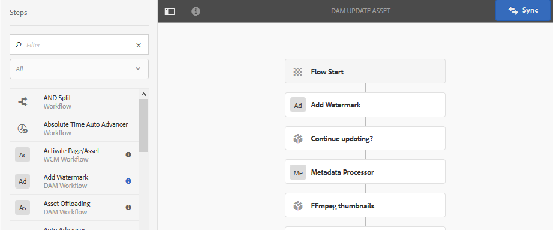

# 為您的數位資產加上浮水印 {#watermarking}

[!DNL Adobe Experience Manager Assets] 可讓您為資產加上數位浮水印，協助使用者驗證資產的真實性和版權所有權。[!DNL Experience Manager Assets] 支援在PNG和JPEG檔案上用作水印的文本。

Adobe Experience Manager Assets可讓您為影像加上數位浮水印，協助使用者驗證資產的真實性和版權所有權。 [!DNL Experience Manager] 資產支援在PNG和JPEG檔案上用作浮水印的文字。

若要對資產套用浮水印，請在[!UICONTROL DAM更新資產]工作流程中新增浮水印步驟。

1. 訪問[!DNL Experience Manager]用戶介面，然後轉至&#x200B;**[!UICONTROL Tools]** > **[!UICONTROL Workflow]** > **[!UICONTROL Models]**。
1. 從「工作流模型」頁中，選擇&#x200B;**[!UICONTROL DAM更新資產]**&#x200B;工作流，然後按一下&#x200B;**[!UICONTROL 編輯]**。

1. 從側面板，拖曳&#x200B;**[!UICONTROL 新增浮水印]**&#x200B;步驟，並將其新增至[!UICONTROL  DAM更新資產]工作流程。

   

   >[!NOTE]
   >
   >將[!UICONTROL 添加水印]步驟放在[!UICONTROL 處理縮圖]步驟之前的任意位置。

1. 開啟&#x200B;**[!UICONTROL 添加水印]**&#x200B;步驟以顯示其屬性。
1. 在&#x200B;**[!UICONTROL 參數]**&#x200B;頁簽中，在各種欄位中指定有效值，包括文本、字型類型、大小、顏色、位置、方向等。 要確認更改，請按一下&#x200B;**[!UICONTROL Done]**。

   

1. 使用浮水印 **[!UICONTROL 步驟儲存DAM更新資產]** (Dam Update Asset)工作流程。
1. 從[!DNL Experience Manager]使用者介面上傳範例資產。 浮水印會隨字型大小、顏色等一起出現在您在上述步驟中設定的位置。

若要以程式設計方式或使用動態資訊為PDF檔案加上浮水印，請考慮使用[[!DNL Experience Manager] Document Services](/help/forms/using/overview-aem-document-services.md)產品。

## 提示和限制 {#tips-limitations}

* 僅支援基於文本的水印。 即使在建立[!UICONTROL 添加水印過程]時可以上載影像，影像也不會用作水印。
* 僅支援對PNG和JPEG檔案加上水印。 其他資產格式不會加上浮水印。
