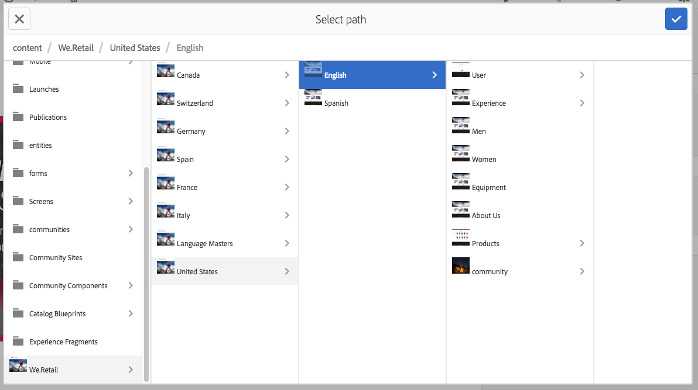

# 使用選取工具 {#working-with-selectors}

>[!CAUTION]
>
>AEM 6.4已結束延伸支援，本檔案不再更新。 如需詳細資訊，請參閱 [技術支援期](https://helpx.adobe.com//tw/support/programs/eol-matrix.html). 尋找支援的版本 [此處](https://experienceleague.adobe.com/docs/).

使用互動式影像、互動式視訊或轉盤橫幅時，您會選取資產，然後選取熱點和影像地圖的網站和產品以連結至。 使用影像集、回轉集和多媒體集時，您也可以使用資產選擇器選取資產。

本主題說明如何使用產品、網站和資產選取器，包括在選取器內瀏覽、篩選、排序的功能。

您在建立轉盤集、新增熱點和影像地圖、建立互動式視訊和影像時存取選取器。

例如，在此轉盤橫幅中，如果您要將熱點或影像地圖連結至快速檢視頁面，請使用產品選取器；如果要將熱點或影像映射連結到超連結，請使用站點選擇器；建立新投影片時，請使用「資產」選取器。

選擇熱點或影像映射的位置時（而不是手動輸入），使用的是選擇器。 「網站選取器」只有在您是AEM Sites客戶時才有效。 產品選擇器也需要AEM Commerce。

## 選擇產品 {#selecting-products}

當您想要熱點或影像地圖為產品目錄中的特定產品提供快速檢視時，請使用產品選取器來選擇產品。

1. 導覽至「轉盤集」、「互動式影像」或「互動式視訊」，然後點選「動作 **** 」標籤 (僅在您已定義熱點或影像地圖時可用)。

   產品選取器位於 **[!UICONTROL 動作類型]** 的上界。

   

1. 點選 **[!UICONTROL 產品選擇器]** 圖示（放大鏡），並導覽至目錄中的產品。

   

   您也可以點選「 」，以依關鍵字或標籤篩選 **[!UICONTROL 篩選]** 和輸入關鍵字，或選取標籤，或兩者皆適用。

   

   您可以點選「 」，以變更AEM瀏覽產品資料的位置 **[!UICONTROL 瀏覽]** 並導覽至其他資料夾。

   

   點選 **[!UICONTROL 排序]** 變更AEM依最新到最舊或最舊到最新排序。

   

   點選「 **[!UICONTROL 檢視方式]** 」以變更您檢視產品的方式- 「清單檢視 **[!UICONTROL 」或「資]** 訊卡檢視」 ****。

   

1. 選取產品後，欄位會以產品縮圖和名稱填入。

   

1. 登入時 **[!UICONTROL 預覽]** 模式，您可以點選熱點或影像地圖，然後查看快速檢視的外觀。

   

## 選擇網站 {#selecting-sites}

當您想要將熱點或影像地圖連結到AEM網站內管理的網頁時，請使用網站選擇器來選擇網頁。

1. 導覽至「轉盤集」、「互動式影像」或「互動式視訊」，然後點選「動作 **** 」標籤 (僅在您已定義熱點或影像地圖時可用)。

   「網站選擇器」位於「動 **[!UICONTROL 作類型]** 」區。

   

1. 點選「**[!UICONTROL 網站選擇器]**」圖示 (含放大鏡的資料夾)，並導覽至您 AEM 網站中要連結熱點或影像地圖的頁面。

   

1. 選取網站後，欄位會填入路徑。

   

1. 登入時 **[!UICONTROL 預覽]** 模式，則會導覽至您指定的AEM網站頁面。

## 選取資產 {#selecting-assets}

使用此選取器來選擇要用於轉盤橫幅、互動式視訊、影像集、混合媒體集和回轉集的影像。 在互動式視訊中，當您點選時，可使用資產選擇器 **[!UICONTROL 選取資產]** 在 **[!UICONTROL 內容]** 標籤。 在轉盤集中，當您建立新投影片時，可使用資產選取器。 在影像集、混合媒體集和回轉集中，當您分別建立新的影像集、混合媒體集或回轉集時，可使用資產選擇器。

另請參閱 [資產選擇器](asset-selector.md) 以取得更多資訊。

1. 導覽至轉盤集並建立新投影片。 或者，導覽至互動式影片，前往 **[!UICONTROL 內容]** 標籤並選取資產。 或者，建立混合媒體集、影像集或回轉集。
1. 點選「資 **[!UICONTROL 產選擇器]** 」圖示 (含放大鏡的資料夾) 並導覽至資產。

   

   您也可以點選「 」，以依關鍵字或標籤篩選 **[!UICONTROL 篩選]** 和輸入關鍵字，或新增條件，或兩者皆輸入。

   

   您可以導覽至資產中的其他資料夾，以變更AEM瀏覽資產的位置 **[!UICONTROL 路徑]** 欄位。

   點選 **[!UICONTROL 集合]** 僅搜尋集合內的資產。

   

   點選「 **[!UICONTROL 檢視]** 」以變更您檢視產品的方式- 「清單檢視 **[!UICONTROL 」、「]**&#x200B;欄檢視」 **[!UICONTROL ，或「卡]******&#x200B;片檢視」。

   

1. 點選核取記號以選取資產。 資產隨即顯示。

   
