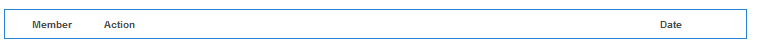

# 活動資料流功能 {#activity-streams-feature}

>[!CAUTION]
>
>AEM 6.4已結束延伸支援，本檔案不再更新。 如需詳細資訊，請參閱 [技術支援期](https://helpx.adobe.com//tw/support/programs/eol-matrix.html). 尋找支援的版本 [此處](https://experienceleague.adobe.com/docs/).

## 簡介 {#introduction}

已登錄社區成員的活動，例如發佈到論壇或部落格，被收集到流中，該流可以通過配置以各種方式被過濾和顯示 `Activity Streams` 元件。

當社群成員關注感興趣的帖子或關注其他社區成員的活動時，跟隨的能力將添加另一個活動視圖。

本檔案的本節說明

* 新增活動資料流元件至AEM網站
* 活動資料流元件的組態設定

## 新增活動資料流至頁面 {#adding-activity-streams-to-a-page}

如果需要新增 `Activity Streams` 在製作模式中，使用元件瀏覽器來尋找

* `Communities / Activity Streams`

並將其拖曳至應該顯示活動資料流的頁面上。

如需必要資訊，請造訪 [Communities元件基本知識](basics.md).

當 [必要的用戶端程式庫](essentials-activities.md#essentials-for-client-side) 包含在內，以下為方式 `Activity Streams` 元件隨即出現：

## 設定活動資料流 {#configuring-activity-streams}

選取已放置的 `Activity Streams` 要存取的元件並選取 `Configure` 表徵圖，開啟「編輯」對話框。

在 **[!UICONTROL 使用者活動]** 索引標籤，指定要顯示的活動：

* **[!UICONTROL 活動數上限]**
要顯示的活動數
* **[!UICONTROL 資料流資源路徑]**
保留為空白，以預設為社群網站或社群群組。 資料流資源路徑標識活動源。 預設為空白。
* **[!UICONTROL 顯示用戶活動視圖]**
如果勾選此選項，「活動」頁面將包含一個索引標籤，該索引標籤會根據目前成員在社群內產生的活動來篩選活動。 已勾選預設值。
* **[!UICONTROL 顯示所有活動視圖]**
如果勾選此選項，活動頁面將包含索引標籤，該索引標籤包含在目前成員有權存取的社群內產生的所有活動。 已勾選預設值。
* **[!UICONTROL 顯示以下視圖]**
如果選中，則活動頁將包含一個頁簽，該頁簽將根據當前成員正在跟蹤的活動來篩選活動。 已勾選預設值。

## 後續檢視 {#following-view}

必須配置元件以啟用以下功能。 允許下列項目的功能 [部落格](blog-feature.md), [論壇](forum.md), [QnA](working-with-qna.md), [日曆](calendar.md), [檔案庫](file-library.md)，和 [評論](comments.md).

此 **追隨** 按鈕提供將條目作為活動跟蹤的方法， [通知](notifications.md)，和/或 [訂閱](subscriptions.md). 每次 **追隨** 按鈕，則可以開啟或關閉選取項。 此 `Email Subscriptions` 只有在配置後才會顯示選擇。

如果選取下列任何方法，按鈕的文字會變更為 **追隨**. 為方便起見，您可以選擇 `Unfollow All` 切換所有方法。

此 **追隨** 按鈕隨即出現：

* 查看其他成員的配置檔案時
* 在主功能頁面，如論壇、QnA和部落格
   * 遵循該一般功能的所有活動

* 對於特定條目，如論壇主題、QnA問題或部落格文章
   * 跟蹤該特定條目的所有活動

## 其他資訊 {#additional-information}

如需詳細資訊，請參閱 [活動資料流基本資訊](essentials-activities.md) 頁面。
