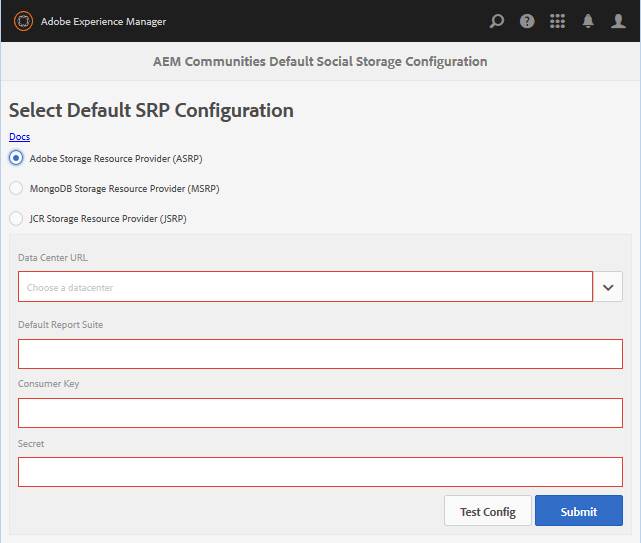

# ASRP - Adobe儲存資源供應商 {#asrp-adobe-storage-resource-provider}

## 關於ASRP {#about-asrp}

當AEM Communities設定為使用ASRP做為其公用儲存時，使用者產生的內容(UGC)可從所有作者和發佈例項存取，而不需同步或複製。

另請參 [閱SRP選項和建議的](working-with-srp.md#characteristics-of-srp-options)[拓撲特性](topologies.md)。

## 需求 {#requirements}

使用ASRP需要額外的授權。

若要設定您的AEM Communities網站以使用UGC的ASRP，請連絡您的帳戶代表，以取得：

* 資料中心URL（ASRP端點的位址）
* 消費者金鑰
* 機密金鑰
* 報表套裝ID

消費者和機密金鑰會在公司的所有報表套裝中共用。 每個租用戶有一個報表套裝。

## 設定 {#configuration}

### 選擇ASRP {#select-asrp}

存 [儲配置控制台](srp-config.md) (Storage Configuration Console)允許選擇預設儲存配置，該配置標識要使用的SRP實施。

**作者**:

* 從全域導覽： **[!UICONTROL 「工具>社群>儲存組態」]**

* Select **[!UICONTROL Adobe Storage Resource Provider (ASRP)]**
* 以下資訊來自設定過程

   * **[!UICONTROL 資料中心 URL]**

      下拉式清單，以選擇由您的帳戶代表所識別的生產資料中心

   * **[!UICONTROL 預設報表套裝]**

      輸入預設報表套裝的名稱

   * **[!UICONTROL 消費者金鑰]**

      輸入消費者金鑰

   * **[!UICONTROL 機密]**

      輸入密鑰

* 選擇「提 **[!UICONTROL 交」]**

準備發佈例項：

* [複製加密密鑰](#replicate-the-crypto-key)
* [複製配置](#publishing-the-configuration)

提交配置後，測試連接：

* 為每 **[!UICONTROL 個作者]**&#x200B;和發佈實例選擇測試配置，從儲存配置控制台測試到資料中心的連接

* 最後，請確定描述檔資料的網站URL可透過外部化連結從資料中心 [路由](#externalize-links)。

### 複製加密密鑰 {#replicate-the-crypto-key}

消費者金鑰和機密金鑰會加密。 為了正確加密／解密密鑰，所有AEM實例上的主Granite Crypto密鑰必須相同。

按照複製加密密 [鑰中的說明操作](deploy-communities.md#replicate-the-crypto-key)。

### 外部化連結 {#externalize-links}

如需正確的描述檔和描述檔影像連結，請務必正確 [設定連結外部化](../../help/sites-developing/externalizer.md)。

請務必將網域設定為可從資料中心URL（ASRP端點）路由的URL。

### 時間同步 {#time-synchronization}

為了成功與ASRP端點進行驗證，您所代管的AEM Communities的執行機器必須進行時間同步化，例如與 [Network Time Protocol(NTP)](https://www.ntp.org/)。

### 發佈設定 {#publishing-the-configuration}

ASRP必須被識別為所有作者和發佈實例上的公用商店。

要使相同的配置在發佈環境中可用，請執行以下操作：

* **作者**:

   * 從主菜單導航到「工 **[!UICONTROL 具」>「操作」>「複製」]**
   * 選擇 **[!UICONTROL 激活樹]**
   * **[!UICONTROL 開始路徑]**:

      * 瀏覽至 `/etc/socialconfig/srpc/`
   * 取消選中 **[!UICONTROL 僅已修改]**
   * 選取「啟 **[!UICONTROL 動」]**

## 從AEM 6.0升級 {#upgrading-from-aem}

>[!CAUTION]
>
>如果您在已發佈的社群網站上啟用ASRP，則已儲存在 [JCR](jsrp.md) 中的任何UGC將不再可見，因為內部部署儲存空間和雲端儲存空間之間的資料不會同步。

**`AEM Communities Extension`** 之前在AEM 6.0社交社群中以雲端服務的形式推出。 自AEM 6.1 Communities起，您不需要雲端設定，只需從儲存組態主控台 [選取ASRP](srp-config.md)。

由於新的儲存結構，從社交社群升級至社群時，必 [須依](upgrade.md#adobe-cloud-storage) 照升級指示進行。

## 管理使用者資料 {#managing-user-data}

如需使用者 *、使用者****、使用者*&#x200B;設定檔和使用者群組的相關資訊，請造訪

* [用戶同步](sync.md)
* [管理使用者和使用者群組](users.md)

## 疑難排解 {#troubleshooting}

### 升級後UGC消失 {#ugc-disappears-after-upgrade}

如果從現有的AEM 6.0社交社群網站升級，請務必依照升 [級指示](upgrade.md#adobe-cloud-storage)，否則UGC *將會遺失* 。

### 驗證錯誤 {#authentication-errors}

如果收到Data Center URL的驗證錯誤，而AEM error.log包含有關過時時間戳記的訊息，請確認時間同步正在進行。

建議您使用Network Time Protocol(NTP)  （網路時間通訊協定）等工具，來同步所有AEM作者和發佈伺服器的時間。

### 搜尋中不會顯示新內容 {#new-content-does-not-appear-in-searches}

Adobe雲端儲存基礎架構使用最 *終的一致性* ，協助實現其擴充和效能目標。 因此，新內容無法立即使用，而且可能需要幾秒鐘的時間才會顯示在搜尋結果中。

雖然會監控影響最終一致性的間隔，但若搜尋中出現新內容所花的時間超過幾秒，請連絡您的帳戶代表。

### UGC在ASRP中不可見 {#ugc-not-visible-in-asrp}

通過檢查儲存選項的配置，確保ASRP已配置為預設提供程式。 預設情況下，儲存資源提供方是JSRP，而不是ASRP。

在所有作者和發佈AEM例項上，請重新造訪「儲存組態控制台」或檢查AEM存放庫：

* 在JCR中，如 [果/etc/socialconfig](http://localhost:4502/crx/de/index.jsp#/etc/socialconfig/)

   * 不包含srpc節 [點](http://localhost:4502/crx/de/index.jsp#/etc/socialconfig/srpc) ，這表示儲存提供程式是JSRP
   * 如果srpc節點存在並包含節點 [defaultconfiguration](http://localhost:4502/crx/de/index.jsp#/etc/socialconfig/srpc/defaultconfiguration)，則defaultconfiguration的屬性應將ASRP定義為預設提供程式

