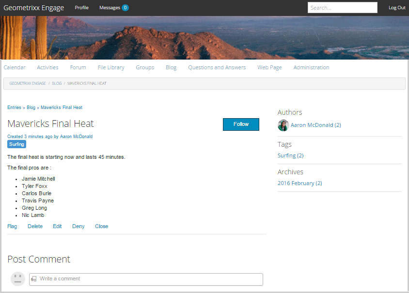

# 部落格功能{#blog-feature}

## 簡介 {#introduction}

AEM Communities的部落格功能已從編寫活動轉變為真正的社群活動，並在發佈環境中進行。

部落格功能支援以日誌格式提供社區資訊。 部落格項目是由授權會員（已註冊、已登入的使用者）在發佈環境中建立的。

部落格功能提供：

* 發佈端建立部落格文章和留言
* 豐富式文字編輯
* 內嵌影像（支援拖放）
* 內嵌社交網路內容([oEmbed support](blog-developer-basics.md#allowing-rich-media))
* 草稿模式
* 排程發佈
* 代表組成（[特權成員](users.md#privileged-members-group)可以代表不同社區成員建立內容）
* [內容內容與大量調](moderate-ugc.md) 整部落格文章和留言

本節說明

* 新增部落格功能至AEM網站
* 部落格元件的組態設定

>[!NOTE]
>
>元件`Journal`和`Journal Sidebar`的標題為`Blog`和`Blog Sidebar`。
>
>AEM 6.0及舊版中的部落格功能現在已移除。 它以範本為基礎，僅允許作者在作者環境中建立內容。

## 將部落格元件添加到頁面{#adding-blog-components-to-a-page}

如果想要以作者模式將部落格新增至頁面，請使用元件瀏覽器來尋找

* `Communities / Blog`
* `Communities / Blog Sidebar`

將它們拖曳至應該出現部落格的頁面上。

如需必要資訊，請造訪[Communities Components Basics](basics.md)。

當包含[必要的用戶端程式庫](blog-developer-basics.md#essentials-for-client-side)時，`Blog`元件的顯示方式如下：

以及`Blog Sidebar`的顯示方式：

### 配置部落格{#configuring-blog}

選擇要訪問的已放置的`Blog`元件，並選擇`Configure`表徵圖以開啟編輯對話框。

 

#### 「設定」頁籤{#settings-tab}

在&#x200B;**[!UICONTROL Settings]**&#x200B;標籤下，指定部落格的基本功能：

* **[!UICONTROL 允許附]**
件縮覽圖如果勾選，則會建立附加影像的縮覽圖。

* **[!UICONTROL 附加縮圖大]**
小附加縮圖影像的最大大小（像素）。預設值為800 x 800。

* **[!UICONTROL 縮圖的最小影像大]**
小影像的最小大小（以位元組為單位），以產生內嵌影像的縮圖。預設值為100000位元組(100kb)。

* **[!UICONTROL 最大縮圖]**
大小內嵌影像縮圖影像的最大大小（以像素為單位）。預設值為800 x 800。

* **[!UICONTROL 允許特權]**
成員如果選中，則僅允許特權成員建立內容。

* **[!UICONTROL 允許的特]**
權成員添加允許建立內容的特權成員。

* **[!UICONTROL 在作者編輯模式中封鎖使用者產生的內]**
容如果啟用，在作者模式中編輯時會封鎖使用者產生的內容。

* **[!UICONTROL 日誌]**
標題要顯示在頁面上的部落格標題。
   >注意:
   >「日誌標題」用於自動建立部落格的URL。 您在此處指定的日誌標題中，最多使用50個字元（另外還有5個字元）來建立部落格的URL。

* **[!UICONTROL 日誌]**
說明部落格說明。

* **[!UICONTROL 每頁主題]**

   定義每頁顯示的部落格項目／留言數。 預設值為10。

* **[!UICONTROL 已審核]**

   如果勾選，則必須先核准張貼部落格項目和留言，才能顯示在發佈網站上。 預設為未勾選。

* **[!UICONTROL 已關閉]**

   如果勾選，則部落格將關閉到新的部落格條目和注釋。 預設為未勾選。

* **[!UICONTROL RTF 編輯器]**

   如果勾選此選項，則可以使用標籤輸入部落格條目和注釋。 已勾選預設值。

* **[!UICONTROL 允許標記]**

   如果勾選，允許成員將標籤標籤新增至其貼文（請參閱&#x200B;**[!UICONTROL 標籤欄位]**&#x200B;標籤）。 預設為未勾選。

* **[!UICONTROL 允許檔案上傳]**

   如果選中，則允許將檔案附件添加到部落格條目或注釋中。 預設為未勾選。

* **[!UICONTROL 最大檔案大小]**

   僅當選中`Allow File Uploads`時相關。 此欄位將限制已上傳檔案的大小（以位元組為單位）。 預設值為104857600(10 Mb)。

* **[!UICONTROL 允許的檔案類型]**

   僅當選中`Allow File Uploads`時相關。 以逗號分隔的副檔名清單，並以&quot;dot&quot;分隔。 例如：.jpg、.jpeg、.png、.doc、.docx、.pdf。 如果指定任何檔案類型，則不允許上傳未指定的檔案類型。 未指定預設值，因此允許所有檔案類型。

* **[!UICONTROL 附加影像檔案最大大小]**

   僅在勾選「允許檔案上傳」時相關。 上傳的影像檔案的位元組數上限。 預設值為2097152(2 Mb)。

* **[!UICONTROL 允許回覆]**

   如果勾選，則允許回覆張貼至部落格項目的留言。 預設為未勾選。

* **[!UICONTROL 允許使用者刪除評論和主題]**

   如果勾選，允許成員刪除他們張貼的留言和部落格項目。 預設為未勾選。

* **[!UICONTROL 允許關注]**

   如果勾選，請為部落格文章加入下列功能，讓成員能夠收到新貼文的[通知。 ](notifications.md)預設為未勾選。

* **[!UICONTROL 允許電子郵件訂閱]**

   如果勾選，允許會員透過電子郵件收到新貼文的通知([subscription](subscriptions.md))。 需要檢查`Allow Following`並配置[電子郵件](email.md)。 預設為未勾選。

* **[!UICONTROL 允許投票]**

   如果勾選，請將「投票」功能與部落格項目一起加入。 預設為未勾選。

* **[!UICONTROL 顯示徽章]**

   如果勾選，則顯示已獲得且已指派[badges](implementing-scoring.md)及成員的部落格項目。 預設為未勾選。

* **[!UICONTROL 允許主要內容]**

   如果勾選，則可將構想識別為[特色內容](featured.md)。 預設為未勾選。

#### 使用者協調標籤{#user-moderation-tab}

在&#x200B;**[!UICONTROL 使用者協調]**&#x200B;標籤下，指定協調設定：

* **[!UICONTROL 拒絕貼文]**

   如果勾選，則可讓受信任的會員協調者拒絕貼文，並防止貼文出現在公開論壇。 預設為未勾選。

* **[!UICONTROL 關閉／重新開啟主題]**

   如果勾選，受信任的成員協調者可以關閉主題以進一步編輯和留言，也可以重新開啟主題。 預設為未勾選。

* **[!UICONTROL 標籤貼文]**

   如果勾選，允許成員將其他主題或注釋標籤為不適當。 預設為未勾選。

* **[!UICONTROL 標籤原因清單]**

   如果勾選，允許成員從下拉式清單中選擇其標籤主題或留言的不適當原因。 預設為未勾選。

* **[!UICONTROL 自訂標幟原因]**

   如果勾選，允許成員輸入自己將主題或留言標籤為不適當的原因。 預設為未勾選。

* **[!UICONTROL 協調臨界值]**

   輸入成員在通知協調者之前必須標籤主題或留言的次數。 預設值為1（一次）。

* **[!UICONTROL 標幟限制]**

   輸入主題或留言在公開檢視中隱藏前必須加以標幟的次數。 如果設為-1，則標籤的主題或留言絕不會從公開檢視中隱藏。 否則，此數字必須大於或等於「協調臨界值」。 預設值為5。

#### 標籤欄位標籤{#tag-field-tab}

在&#x200B;**[!UICONTROL Tag field]**&#x200B;標籤下，指定如果&#x200B;**[!UICONTROL Settings]**&#x200B;標籤上勾選了「允許標籤&#x200B;]**」，可套用哪些標籤：**[!UICONTROL 

* **[!UICONTROL 允許的命名空間]**

   如果在&#x200B;**[!UICONTROL Settings]**&#x200B;標籤下勾選`Allow Tagging`，則相關。 可套用的標籤僅限於已勾選之命名空間類別中的標籤。 名稱空間清單包含「標準標籤」（預設命名空間）和「包含所有標籤」。 預設值未勾選，表示允許所有命名空間。

* **[!UICONTROL 建議限制]**

   輸入要作為建議顯示給發佈到論壇的成員的標籤數。 值-1表示無限制。 預設值為0。

### 配置部落格側欄{#configuring-blog-sidebar}

按兩下`Blog Sidebar`元件時，將開啟編輯對話框。

在&#x200B;**[!UICONTROL 日誌側欄設定]**&#x200B;頁籤下，指定歸檔的日期格式以及要在側欄中顯示的條目類型：

* **[!UICONTROL 日期格式]**

   用於部落格條目存檔的顯示格式。 格式使用遵循Java約定的佔位符。

   * yyyy:全年，就像2015年一樣
   * yy:短年，比如15年。
   * MMMMMM:整月，就像6月
   * 嗯：短月，就像6月
   * MM:月數，例如06

   預設值為&quot;yyyy MMMMM&quot;，會顯示例如&quot;2015年6月&quot;

* **[!UICONTROL 視圖類型]**

   要顯示在側欄中的部落格項目的標題和類型。 選擇是

   * 作者
   * 類別
   * 封存

* **[!UICONTROL 日誌元件路徑]**

   *（可選）* 要列出部落格文章的部落格資源位置。如果保留為空白，將使用出現在同一頁上的resourceType `social/journal/components/hbs/journal`元件。

   * 例如， `/content/sites/engage/en/blog/jcr:content/content/primary/blog`

* **[!UICONTROL 建議限制]**

   要顯示的部落格文章數目。 值-1表示無限制。 預設值為-1。

## 網站訪客體驗{#site-visitor-experience}

在發佈環境中，部落格功能會以遞減順序顯示最近的部落格文章，接著是較舊的部落格文章。 部落格側邊欄可讓網站訪客套用篩選器，以限制所顯示的部落格文章選擇。

在部落格文章後面會加上貼文或檢視留言的連結。

選取部落格文章時，會顯示部落格文章和註解（如果已啟用）。

其他功能取決於網站訪客是協調者、管理員、社群成員、特權成員還是匿名。

### 使用文章{#working-with-articles}

建立新的部落格文章時，您可以選擇

1. 立即發佈
1. 發佈草稿
1. 在排程的日期和時間發佈

部落格文章會出現在適當的標籤（「已發佈」、「草稿」或「已排程」）下方，供能夠在發佈時撰寫的成員使用。

#### 協調者和管理員{#moderators-and-administrators}

當登入的使用者具有協調者或管理員權限時，他們可以在所有張貼至部落格的部落格文章和留言上執行[協調工作](moderate-ugc.md)（依照元件組態的許可）。

### 成員 {#members}

當登入的使用者是社群成員或[特權成員](users.md#privileged-members-group)（視設定而定）時，他們可以選取`New Article`來建立並張貼新的部落格文章。

具體而言，他們可能：

* 建立新的部落格文章
* 代表其他會員張貼新部落格文章
* 將評論張貼至部落格文章
* 編輯其自己的部落格文章或評論
* 刪除其自己的部落格或評論
* 標籤其他人的部落格文章或留言

 

### 匿名 {#anonymous}

未登入的網站訪客只能閱讀已張貼的部落格文章和留言、在受支援時加以翻譯，但不得新增部落格文章或留言，也不得為其他人的文章或留言加上旗標。

## 其他資訊 {#additional-information}

如需詳細資訊，請參閱開發人員的[Blog Essentials](blog-developer-basics.md)頁面。

如需部落格項目和留言的協調，請參閱[協調使用者產生的內容](moderate-ugc.md)。

有關標籤部落格條目和注釋的資訊，請參閱[標籤用戶生成的內容](tag-ugc.md)。

有關部落格條目和注釋的翻譯，請參見[ Transling User Generated Content](translate-ugc.md)。
