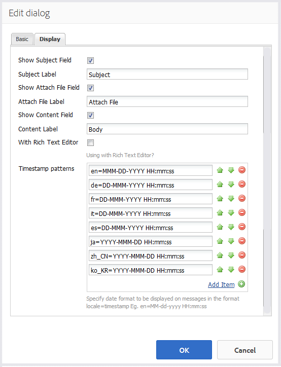

# 消息功能{#messaging-feature}

除了論壇和留言中公開顯示的互動外，AEM Communities的傳訊功能還可讓社群成員更私下互動。

建立[社群網站](overview.md#communitiessites)時，可能會包含此功能。

傳訊功能提供以下功能：

* 傳送訊息給一或多個社群成員
* 向社區成員組發送消息
* 傳送含附件的訊息
* 轉送訊息
* 回覆訊息
* 刪除訊息
* 還原已刪除的消息

若要啟用和修改傳訊功能，請造訪

* [為管理](messaging.md) 員配置消息
* [對開發人員](essentials-messaging.md) 而言至關重要的報文傳送

>[!NOTE]
>
>不支援將`Compose Message, Message, or Message List`元件（可在`Communities`元件群組中找到）新增至作者編輯模式中的頁面。

## 配置消息元件{#configuring-messaging-components}

為社群網站啟用傳訊功能時，系統會完全設定訊息，不需要進一步設定。 如果需要變更預設設定，則會提供此資訊。

### 配置消息清單（消息框）{#configuring-message-list-messagebox}

為了修改郵件功能的&#x200B;**收件箱**、**已發送項**&#x200B;和&#x200B;**垃圾筒**&#x200B;頁面的郵件清單的配置，請在[作者編輯模式](sites-console.md#authoring-site-content)中開啟站點。

在`Preview`模式中，選擇&#x200B;**[!UICONTROL Messages]**&#x200B;連結以開啟主消息頁。 然後，選擇「**[!UICONTROL 收件箱」、「已發送項目」或「清除」]** ，以配置該郵件清單的元件。

在`Edit`模式中，選取頁面上的元件。

要訪問配置對話框，必須通過選擇`link`表徵圖取消繼承。

完成配置後，必須通過選擇`broken link`表徵圖來恢復繼承。

取消繼承後，將可以選擇`configure`表徵圖以開啟配置對話框。

#### 基本頁簽{#basic-tab}

* **[!UICONTROL 服務選取器]**
(*必要*)將此值設為AEM Communities傳訊作業 `serviceSelector.name` 服務 [中屬性的值](messaging.md#messaging-operations-service)。

* **[!UICONTROL 撰寫頁面]**
(*必要*)成員按一下按鈕時要開啟的 `Reply` 頁面。目標頁面應包含&#x200B;**[!UICONTROL 撰寫訊息]**&#x200B;表單。

* **[!UICONTROL 以資源方式回]**
覆/檢視如果勾選此選項，回覆URL和檢視URL將參考資源，否則資料會以查詢參數的形式在URL中傳遞。

* **[!UICONTROL 配置檔案顯]**
示表單用於顯示發件人配置檔案的配置檔案表單。

* **[!UICONTROL 清除資]**
料夾如果勾選此選項，此「郵件清單」元件只會顯示標示為已刪除（清除）的郵件。

* **[!UICONTROL 資料夾路徑]**
(*必要*)參考AEM Communities `inbox.path.name` 傳訊作業 `sentitems.path.name` 服務 [中為](messaging.md#messaging-operations-service)和設定的值。為`Inbox`配置時，請使用`inbox.path.name`值添加一個條目。 為`Outbox`配置時，請使用`sentitems.path.name`值添加一個條目。 為`Trash`進行配置時，請添加兩個包含這兩個值的條目。

#### 顯示頁簽{#display-tab}

* **[!UICONTROL 標籤讀]**
取按鈕如果選中，則顯示 
`Read`按鈕，允許將消息標籤為已讀。

* **[!UICONTROL 標籤未讀]**
按鈕如果選中，則顯示 
`Mark Unread` 按鈕，允許將消息標籤為已讀。

* **[!UICONTROL 刪除]**
按鈕如果選中，則顯示 
`Delete`按鈕，允許將消息標籤為已讀。如果也檢查了&#x200B;**`Message Options`**，則會複製刪除功能。

* **[!UICONTROL 消息選]**
項如果選中，則顯示 
**`Reply`**、  **`Reply All`**、 **`Forward`** 和 **`Delete`** 按鈕，允許重新發送或刪除消息。如果也檢查了&#x200B;**`Delete Button`**，則會複製刪除功能。

* **[!UICONTROL 每頁消]**
息指定的數量是分頁方案中每頁顯示的最大消息數。若未指定數字（保留為空白），則會顯示所有訊息，且沒有分頁。

* **[!UICONTROL 時間戳]**
記模式提供一或多種語言的時間戳記模式。預設值為en、de、fr、it、es、ja、zh_CN、ko_KR。

* **[!UICONTROL 顯示用]**
戶選擇 
**`Sender`** 或， **`Recipients`** 以決定要顯示寄件者或收件者。

### 配置撰寫消息{#configuring-compose-message}

若要修改撰寫訊息頁面的設定，請在[作者編輯模式](sites-console.md#authoring-site-content)中開啟網站。

在`Preview`模式中，選擇&#x200B;**[!UICONTROL Messages]**&#x200B;連結以開啟主消息頁。 然後選擇「新建消息」按鈕以開啟`Compose Message`頁。

在`Edit`模式中，在包含Message body的頁面上選擇主元件。

要訪問配置對話框，必須通過選擇`link`表徵圖取消繼承。

完成配置後，必須通過選擇`broken link`表徵圖來恢復繼承。

取消繼承後，將可以選擇`configure`表徵圖以開啟配置對話框。

#### 基本頁簽{#basic-tab-1}

* **[!UICONTROL 重新]**
導向URL輸入傳送訊息後所顯示頁面的URL。例如， 
`../messaging.html`。

* **[!UICONTROL 取]**
消如果寄件者取消訊息，請輸入所顯示頁面的URL。例如， 
`../messaging.html`。

* **[!UICONTROL 消息主題的最]**
大長度「主題」欄位中允許的字元數上限。例如500。 預設為無限制。

* **[!UICONTROL Maximum length of Message Body(消息正文的]**
最大長度內容欄位中允許的最大字元數)。例如10000。 預設為無限制。

* **[!UICONTROL 服務選取器]**
(*必要*)將此值設為AEM Communities傳訊作業 **`serviceSelector.name`** 服務 [中屬性的值](messaging.md#messaging-operations-service)。

#### 顯示頁簽{#display-tab-1}

* **[!UICONTROL 顯示主]**
題欄位如果已勾選，則顯示 
`Subject` 欄位，並啟用將主旨新增至訊息。未勾選預設值。

* **[!UICONTROL 主]**
題標籤輸入要在 
`Subject` 欄位. 預設值為`Subject`。

* **[!UICONTROL 顯示附加檔]**
案欄位如果選中，則顯示 
`Attachment` 欄位，並啟用將檔案附件新增至訊息的功能。未勾選預設值。

* **[!UICONTROL 附加檔]**
案標籤輸入要在 
`Attachment` 欄位. 預設值為&#x200B;**`Attach File`**。

* **[!UICONTROL 顯示內容欄]**
位如果勾選，則顯示 
`Content` 欄位並啟用添加消息正文。未勾選預設值。

* **[!UICONTROL 內]**
容標籤輸入要在 
`Content` 欄位. 預設值為&#x200B;**`Body`**。

* **[!UICONTROL 使用RTF編]**
輯器如果選中此選項，表示使用自定義內容文本框及其自己的RTF編輯器。未勾選預設值。

* **[!UICONTROL 時間戳]**
記模式提供一或多種語言的時間戳記模式。預設值為en、de、fr、it、es、ja、zh_CN、ko_KR。
