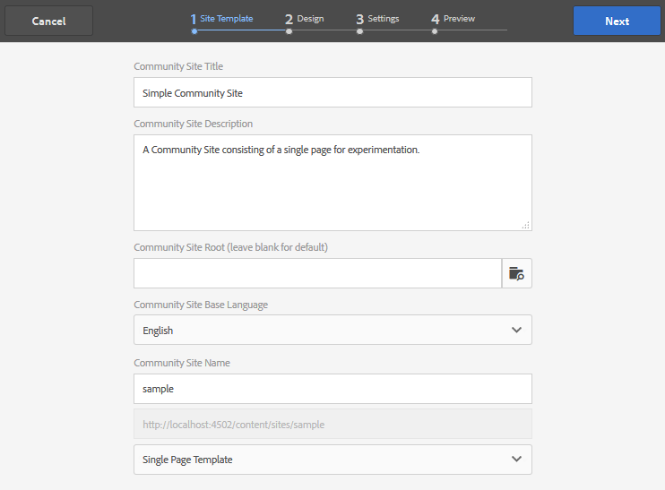

# 建立範例頁面 {#create-a-sample-page}

>[!CAUTION]
>
>AEM 6.4已結束延伸支援，本檔案不再更新。 如需詳細資訊，請參閱 [技術支援期](https://helpx.adobe.com//tw/support/programs/eol-matrix.html). 尋找支援的版本 [此處](https://experienceleague.adobe.com/docs/).

與AEM 6.1 Communities相同，建立範例頁面最簡單的方式是建立簡單的社群網站，只包含Page函式。

其中將包含parsys元件，以便您 [啟用製作元件](basics.md#accessing-communities-components).

使用範例元件探索的另一個選項，是使用 [社群元件指南](components-guide.md).

## 建立社群網站 {#create-a-community-site}

這非常類似於建立新網站，如 [開始使用AEM Communities](getting-started.md).

主要差異在於，本教學課程將建立只包含 [頁面函式](functions.md#page-function) 為了建立一個沒有其他功能的簡單社區站點（除了所有社區站點基本的預有線功能之外）。

### 建立新網站範本 {#create-new-site-template}

若要開始使用，請建立簡單 [社群網站範本](sites.md).

在製作例項上的全域導覽中選取 **[!UICONTROL 工具>社群>網站範本]**.

* 選取 `Create button`
* 基本資訊

   * `Name`:單頁範本
   * `Description`:由單一頁面函陣列成的範本。
   * 選取 `Enabled`

* 結構

   * 拖曳 `Page` 函式至範本產生器
   * 有關配置函式詳細資訊，請輸入

      * `Title`:單頁
      * `URL`: 頁面

* 選擇 **`Save`** 的
* 選擇 **`Save`** 網站範本

### 建立新的社區站點 {#create-new-community-site}

現在，根據簡單網站範本建立新的社群網站。

建立網站範本後，從全域導覽中選取 **[!UICONTROL 社群>網站]**.

* 選擇 **`Create`** 圖示

* 步驟 `1 - Site Template`

   * `Title`:簡單社群網站
   * `Description`:一個社群網站，包含單一實驗頁面。
   * `Community Site Root: (leave blank)`
   * `Community Site Base Language: English`
   * `Name`:範例

      * url = http://localhost:4502/content/sites/sample
   * `Template`:選擇 `Single Page Template`

* 選取 `Next`
* 步驟 `2 - Design`

   * 選擇任何設計

* 選取 `Next`
* 選取 `Next`

   （接受所有預設設定）

* 選取 `Create`

## 發佈網站 {#publish-the-site}

從 [社群網站主控台](sites-console.md)，選取要發佈網站的發佈圖示，依預設會是http://localhost:4503 。

## 在編輯模式中開啟作者網站 {#open-the-site-on-author-in-edit-mode}

選取開啟的網站圖示，以編輯模式檢視網站。

URL會是 [http://localhost:4502/editor.html/content/sites/sample/en.html](http://localhost:4502/editor.html/content/sites/sample/en.html)

在簡單的首頁上，您可以查看透過社群功能和範本預先連線的內容，並播放新增和設定社群元件的過程。

## 在發佈時檢視網站 {#view-site-on-publish}

發佈頁面後，在 [發佈例項](http://localhost:4503/content/sites/sample/en.html) 以匿名網站訪客、登入成員或管理員身分來試驗功能。 除非管理員登入，否則製作環境中可見的管理連結不會出現在發佈環境中。
