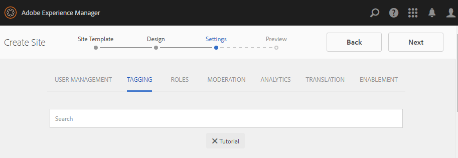

# 製作新社群網站 {#author-a-new-community-site}

## Create a New Community Site {#create-a-new-community-site}

使用作者例項建立新的社群網站

* 以管理員權限登入
* 從全域導覽： **[!UICONTROL 導覽>社群>網站]**

Communities Sites控制台提供了嚮導，可引導用戶完成建立社區站點的步驟。 在最後一步中提 `Next`交站 `Back`點之前，可以前進到步驟或上一步。

要開始建立新的社區站點，請執行以下操作：

* 選擇按 `Create` 鈕

### 步驟1: 網站範本 {#step-site-template}

在「網 [站範本」步驟中](sites-console.md#step2013asitetemplate)，輸入標題、說明、URL名稱，並選取社群網站範本，例如：

* **[!UICONTROL 社群網站標題]**: `Getting Started Tutorial`

* **[!UICONTROL 社群網站說明]**: `A site for engaging with the community.`

* **[!UICONTROL 社群網站根]**: (對於預設根，保留空白 `/content/sites`)

* **[!UICONTROL 雲端設定]**: （若未指定雲端設定，請留空）提供指定雲端設定的路徑。
* **[!UICONTROL 社群網站基本語言]**: （單語言不受影響） 英文)使用下拉式選單，從 *可用語言* (德文、義大利文、法文、日文、西班牙文、葡萄牙文（巴西）、中文（繁體）和簡體中文)選擇一或多種基本語言。 會針對新增的每種語言建立一個社群網站，並依照多語言網站翻譯內容中所述的最佳實務，存在於相 [同的網站資料夾中](../../help/sites-administering/translation.md)。 每個網站的根頁面將包含一個子頁面，該子頁面由其中一種語言的語言代碼命名，例如英文的&#39;en&#39;或法文的&#39;fr&#39;。

* **[!UICONTROL 社群網站名稱]**: 參與

   * 在建立網站後不易變更名稱，請再檢查此名稱
   * 初始URL將顯示在「社群網站名稱」下方
   * 若為有效的URL，請附加基本語言代碼+ &quot;。html&quot;
   * *例如*,http://localhost:4502/content/sites/ `engage/en.html`

* **[!UICONTROL 範本]**: 向下拉選擇 `Reference Site`

選擇下 **[!UICONTROL 一步]**

### 步驟2: 設計 {#step-design}

「設計」步驟會在兩節中顯示，以選取主題和品牌橫幅：

#### COMMUNITY SITE THEME {#community-site-theme}

選擇要套用至範本的樣式。 選取後，主題將會以勾選標籤覆蓋。

#### COMMUNITY SITE BRANDING {#community-site-branding}

（可選）上傳橫幅影像以顯示在網站頁面上。 橫幅會釘在瀏覽器的左邊，位於社群網站標題和功能表（導覽連結）之間。 橫幅高度會裁切為120像素。 橫幅的大小不會調整為適合瀏覽器寬度和120像素高度。

 

選擇 **[!UICONTROL 下一步]**。

### 步驟3: 設定 {#step-settings}

在「設定」步驟中，在選取 `Next`之前，請注意有7個區段提供使用者管理、標籤、協調、群組管理、分析、翻譯和啟用等組態的存取權。

請造訪 [AEM Communities快速入門啟用教學課程](getting-started-enablement.md) ，以體驗使用啟用功能的經驗。

#### USER MANAGEMENT {#user-management}

勾選「用戶管理」的所 [有複選框](sites-console.md#user-management)

* 若要允許網站訪客自行註冊
* 若要允許網站訪客檢視網站，而不需登入
* 允許成員從其他社區成員發送和接收消息
* 若要允許使用Facebook登入，而不是註冊和建立個人檔案
* 若要允許使用Twitter登入，而非註冊和建立描述檔

>[!NOTE]
>
>對於生產環境，必須建立自訂的Facebook和Twitter應用程式。 請參 [閱使用Facebook和Twitter的社交登入](social-login.md)。

#### TAGGING {#tagging}

可套用至社群內容的標籤是透過選取先前透過「標籤控制台」( [Tagging Console](../../help/sites-administering/tags.md#tagging-console) )定義的AEM名稱空間(例如 [Tutorial namespace](setup.md#create-tutorial-tags))來控制。

使用預先輸入搜尋功能，尋找名稱空間十分簡單。 例如，

* 輸入「tut」
* 選取 `Tutorial`

#### ROLES {#roles}

[社區成員角色](users.md) ，通過「角色」部分中的設定進行分配。

若要讓社群成員（或成員群組）以社群管理員的身分體驗網站，請使用預先輸入搜尋，並從下拉式清單的選項中選取成員或群組名稱。

例如，

* 鍵入&quot;q&quot;
* 選擇 [奎恩·哈珀](enablement-setup.md#publishcreateenablementmembers)

>[!NOTE]
>
>[隧道服務](https://helpx.adobe.com/experience-manager/6-3/communities/using/deploy-communities.html#tunnel-service-on-author) ，允許選擇僅存在於發佈環境中的成員和組。

#### MODERATION {#moderation}

接受預設的全域設定， [以協調](sites-console.md#moderation) 使用者產生的內容(UGC)。

#### ANALYTICS {#analytics}

如果Adobe Analytics已取得授權，且已設定Analytics雲端服務和架構，則可啟用Analytics並選取架構。

請參閱 [社群功能的Analytics設定](analytics.md)。

#### TRANSLATION {#translation}

「轉 [譯」設定](sites-console.md#translation) ，可指定網站的基本語言，以及UGC是否可轉譯，以及是否可轉譯為哪種語言。

* 檢查允 **[!UICONTROL 許機器翻譯]**
* 預設的機器翻譯服務將預設語言保留為翻譯選定
* 保留預設翻譯提供程式和配置
* 不需要全球商店，因為沒有語言復本
* 選擇 **[!UICONTROL 翻譯整個頁]**
* 保留預設永續性選項

#### ENABLEMENT {#enablement}

建立參與社群時留空。

如需快速建立啟用社群的類似教 [學課程](overview.md#enablement-community)，請 [參閱「啟用AEM社群快速入門」](getting-started-enablement.md)。

選擇 **[!UICONTROL 下一步]**。

### 步驟4: 建立社群網站 {#step-create-communities-site}

選擇 **[!UICONTROL 建立]**。

當流程完成時，新站點的資料夾將顯示在「社區——站點」控制台中。

## 發佈新社群網站 {#publish-the-new-community-site}

建立的站點應從Communities - Sites控制台進行管理，該控制台與建立新站點的控制台相同。

在選取社群網站的檔案夾以開啟檔案夾後，將滑鼠指標暫留在網站圖示上，以便顯示4個動作圖示：

在選取第四個省略號圖示（更多操作）時，會顯示「匯出網站」和「刪除網站」選項。

從左到右依次為：

* **開啟網站**&#x200B;選取鉛筆圖示，以作者編輯模式開啟社群網站，以新增和／或設定頁面元件

* **編輯網**&#x200B;站：選擇屬性圖示以開啟社群網站，以修改屬性，例如標題或變更主題

* **發佈網站**：選取全球圖示以發佈社群網站（例如，如果您的發佈伺服器正在本機電腦上執行，則預設為localhost:4503）

* **匯出網**&#x200B;站：選取匯出圖示，以建立儲存在套裝管理員中及已下載之社群網站 [的套裝](../../help/sites-administering/package-manager.md) 。

   請注意，網站套件中不包含UGC。

* **刪除網站**

   選擇「刪除」表徵圖，從「社群」>「站點」控制台 **[!UICONTROL 中刪除社群站點]**。 此動作會移除與網站相關的所有項目，例如UGC、使用者群組、資產和資料庫記錄。

>[!NOTE]
>
>如果未對發佈實例使用預設埠4503，請編輯預設複製代理，將埠號設定為正確值。
>
>在作者實例上，從主菜單
>
>1. 導覽至「工 **[!UICONTROL 具>操作>複製」功能表]** 。
>1. 選擇作 **[!UICONTROL 者上的代理]**
>1. 選擇 **[!UICONTROL 預設代理（發佈）]**
>1. 在「設定」旁 **[!UICONTROL 邊]** ，選擇「編 **[!UICONTROL 輯」]**
>1. 在「代理設定」的彈出對話框中，選擇「傳輸」頁籤
>1. 在URI中，將埠號4503更改為所需的埠號

>
>
例如，要使用埠6103: `http://localhost:6103/bin/receive?sling:authRequestLogin=1`
>
>1. 選擇「確 **[!UICONTROL 定」]**
>1. （可選）選擇 `Clear` 或重 `Force Retry` 設複製隊列

### 選擇發佈 {#select-publish}

在確保發佈伺服器正在執行後，選取要發佈社群網站的世界圖示。

成功發佈社群網站後，會短暫顯示訊息：

### 注意新社群使用者群組 {#notice-new-community-user-groups}

除了新社群網站外，還會建立新的使用者群組，其中已針對各種管理功能設定適當的權限。 如需詳細資訊，請 [造訪社群網站的使用者群組](users.md#usergroupsforcommunitysites)。

對於這個新社群網站，若在步驟1中指定網站名稱「參與」，則可從「群組」主控台(全域導覽  : 社群、群組):

* 社群互動社群經理
* 社群參與群組管理員
* 社群參與會員
* 社群參與協調者
* 社群參與特權成員
* 社群參與Sitecontentmanager

請注意， [Aaron McDonald](tutorials.md#demo-users) 是

* 社群互動社群經理
* 社群參與協調者
* 社群參與會員（間接地以協調者群組成員的身分）

#### http://localhost:4503/content/sites/engage/en.html {#http-localhost-content-sites-engage-en-html}

## 配置驗證錯誤 {#configure-for-authentication-error}

在設定網站並推送至發佈後，在 [發佈例項上設定登入對應](sites-console.md#configure-for-authentication-error) ( `Adobe Granite Login Selector Authentication Handler`)。 優點是，當登入憑證未正確輸入時，驗證錯誤會以錯誤訊息重新顯示社群網站的登入頁面。

新增為 `Login Page Mapping`

* /content/sites/engage/tw/signin:/content/sites/engage/tw

## 可選步驟 {#optional-steps}

### 變更預設首頁 {#change-the-default-home-page}

使用發佈網站進行展示時，將預設首頁變更為新網站可能會很有用。

要執行此操作，需要使 [用CRXDE](http://localhost:4503/crx/de) Lite在發佈時 [編輯資源映射表](../../help/sites-deploying/resource-mapping.md) 。

若要開始：

1. 在發佈時，使用管理員權限登入
1. 瀏覽至 [http://localhost:4503/crx/de](http://localhost:4503/crx/de)
1. 在專案瀏覽器中，展開 `/etc/map`
1. 選擇節 `http` 點

   * 選擇 **[!UICONTROL 建立節點]**

      * **名稱** localhost.4503

         (不 *使用*`:`)

      * **Type** [sling:Mapping](https://sling.apache.org/documentation/the-sling-engine/mappings-for-resource-resolution.html)

1. 選擇新建立 `localhost.4503` 的節點

   * 新增屬性

      * **Name** sling:match
      * **類型字串**
      * **值** localhost.4503/\$

         （必須以&#39;$&#39;字元結尾）
   * 新增屬性

      * **Name** sling:internalRedirect
      * **類型字串**
      * **值** /content/sites/engage/en.html

1. 選擇「 **[!UICONTROL 全部保存」]**
1. （可選）刪除瀏覽歷史記錄
1. 瀏覽至http://localhost:4503/

   * 請造訪http://localhost:4503/content/sites/engage/en.html

>[!NOTE]
>
>若要停用，只需在屬性 `sling:match` 值前面加上&#39;x&#39; - `xlocalhost.4503/$` —— 和 **[!UICONTROL 全部儲存]**。

#### 疑難排解： 保存映射時出錯 {#troubleshooting-error-saving-map}

如果無法保存更改，請確保節點名為 `localhost.4503`，帶有「dot」分隔符，而不帶有 `localhost:4503` 「冒號」分隔符，因為 `localhost`不是有效的命名空間前置詞。

#### 疑難排解： 無法重新導向 {#troubleshooting-fail-to-redirect}

規則運算式字&#x200B;**串結尾的&#39;**`sling:match``http://localhost:4503/` $&#39;至關重要，因此只會正確映射，否則，重新導向值會優先於URL中server:port之後可能存在的任何路徑。 因此，當AEM嘗試重新導向至登入頁面時，它會失敗。

### 修改網站 {#modify-the-site}

在初次建立網站後，作者可以使用「開啟網站」 [圖示](sites-console.md#authoring-site-content) ，執行標準的AEM製作活動。

此外，管理員可使用「編 [輯網站」圖示](sites-console.md#modifying-site-properties) ，修改網站的屬性，例如標題。

在進行任何修改後，請記 **得儲** 存 **並重新發佈網站** 。

>[!NOTE]
>
>如果不熟悉AEM，請檢視基本處理 [相關檔案](../../help/sites-authoring/basic-handling.md) ，以 [及製作頁面的快速指南](../../help/sites-authoring/qg-page-authoring.md)。