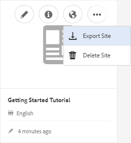

# 製作新的社群網站 {#author-a-new-community-site}

>[!CAUTION]
>
>AEM 6.4已結束延伸支援，本檔案不再更新。 如需詳細資訊，請參閱 [技術支援期](https://helpx.adobe.com//tw/support/programs/eol-matrix.html). 尋找支援的版本 [此處](https://experienceleague.adobe.com/docs/).

## 建立新的社群網站 {#create-a-new-community-site}

使用製作例項建立新的社群網站

* 以管理員權限登入
* 從全局導航： **[!UICONTROL 導覽>社群>網站]**

Communities Sites控制台提供嚮導，引導用戶完成建立社區站點的步驟。 您可以前往 `Next`步驟或 `Back`前一步，再在最後一步中提交網站。

若要開始建立新的社群網站：

* 選取 `Create` 按鈕

### 步驟1:網站範本 {#step-site-template}

在 [網站範本步驟](sites-console.md#step2013asitetemplate)，輸入標題、說明、URL名稱，然後選取社群網站範本，例如：

* **[!UICONTROL 社群網站標題]**: `Getting Started Tutorial`

* **[!UICONTROL 社群網站說明]**: `A site for engaging with the community.`

* **[!UICONTROL 社區站點根]**:（預設根值留空） `/content/sites`)

* **[!UICONTROL 雲端設定]**:（若未指定雲端設定，則保留空白）提供指定雲端設定的路徑。
* **[!UICONTROL 社區站點基語言]**:(單一語言不受影響：英文)使用下拉式功能表來選擇 *或更多* 可用語言的基本語言 — 德語、義大利語、法語、日語、西班牙語、葡萄牙語（巴西）、中文（繁體）和簡體中文。 系統會為每個新增的語言建立一個社群網站，並依照 [轉譯多語言網站的內容](../../help/sites-administering/translation.md). 每個網站的根頁面都會包含一個子頁面，其名稱是所選語言之一的語言代碼，例如英文為「en」，法文為「fr」。

* **[!UICONTROL 社群網站名稱]**:參與

   * 仔細檢查名稱，因為建立網站後不易變更
   * 初始URL將顯示在「社群網站名稱」下方
   * 為了有效的URL，請附加基本語言代碼+ &quot;。html&quot;
   * *例如*, http://localhost:4502/content/sites/ `engage/en.html`

* **[!UICONTROL 範本]**:下拉式選擇 `Reference Site`

選擇 **[!UICONTROL 下一個]**

### 步驟2:設計 {#step-design}

「設計」步驟會分兩節顯示，用於選取主題和品牌橫幅：

#### 社群網站主題 {#community-site-theme}

選取要套用至範本的所需樣式。 選取後，主題將會以勾號覆蓋。

#### 社群網站品牌推廣 {#community-site-branding}

（選用）上傳橫幅影像以在網站頁面間顯示。 橫幅會釘在瀏覽器的左側邊緣、社群網站標題和功能表（導覽連結）之間。 橫幅高度會裁切為120像素。 橫幅沒有調整大小以符合瀏覽器寬度和120像素高度。

 

選擇 **[!UICONTROL 下一個]**.

### 步驟3:設定 {#step-settings}

在「設定」步驟中，於選取 `Next`，請注意有七個區段提供對設定的存取，包括使用者管理、標籤、協調、群組管理、分析、翻譯和啟用。

造訪 [AEM Communities啟用快速入門](getting-started-enablement.md) 使用啟用功能的教學課程。

#### 使用者管理 {#user-management}

選中 [使用者管理](sites-console.md#user-management)

* 允許網站訪客自行註冊
* 允許網站訪客檢視網站而不登入
* 允許成員發送和接收來自其他社區成員的消息
* 允許使用Facebook登入，而非註冊和建立設定檔
* 允許使用Twitter登入，而非註冊和建立設定檔

>[!NOTE]
>
>針對生產環境，需建立自訂Facebook和Twitter應用程式。 請參閱 [使用Facebook和Twitter進行社交登入](social-login.md).

#### 標籤 {#tagging}

可套用至社群內容的標籤，是透過選取先前透過 [標籤主控台](../../help/sites-administering/tags.md#tagging-console) (例如 [教學課程命名空間](setup.md#create-tutorial-tags))。

使用預先輸入搜尋可輕鬆找到命名空間。 例如，

* 鍵入「tut」
* 選取 `Tutorial`

#### 角色 {#roles}

[社群成員角色](users.md) 會透過「角色」區段中的設定來指派。

若要讓社區成員（或成員組）以社區管理員的身份體驗站點，請使用「預先鍵入」搜索並從下拉清單中的選項中選擇成員或組名稱。

例如，

* 類型&quot;q&quot;
* 選擇 [奎恩·哈珀](enablement-setup.md#publishcreateenablementmembers)

>[!NOTE]
>
>[隧道服務](https://helpx.adobe.com/experience-manager/6-3/communities/using/deploy-communities.html#tunnel-service-on-author) 允許選取僅存在於發佈環境中的成員和組。

#### 協調 {#moderation}

接受的預設全局設定 [調節](sites-console.md#moderation) 使用者產生的內容(UGC)。

#### ANALYTICS {#analytics}

如果Adobe Analytics已授權，且已設定Analytics雲端服務和架構，則可啟用Analytics並選取架構。

請參閱 [Communities功能的Analytics設定](analytics.md).

#### 翻譯 {#translation}

此 [翻譯設定](sites-console.md#translation) 指定網站的基本語言，以及UGC是否可翻譯，以及UGC是否可翻譯為哪種語言（如果可以）。

* 檢查 **[!UICONTROL 允許機器翻譯]**
* 預設機器翻譯服務將預設語言保留為要翻譯的語言
* 保留預設翻譯提供者並設定
* 不需要全球商店，因為沒有語言副本
* 選擇 **[!UICONTROL 翻譯整個頁面]**
* 保留預設持久性選項

#### 啟用 {#enablement}

建立參與社群時，請保留空白。

如需快速建立 [啟用社群](overview.md#enablement-community)，請參閱 [AEM Communities啟用快速入門](getting-started-enablement.md).

選擇 **[!UICONTROL 下一個]**.

### 步驟4:建立社區網站 {#step-create-communities-site}

選擇 **[!UICONTROL 建立]**。

過程完成後，新站點的資料夾將顯示在Communities - Sites控制台中。

## 發佈新社群網站 {#publish-the-new-community-site}

應從Communities - Sites控制台管理建立的站點，該控制台與可建立新站點的控制台相同。

選取社群網站的資料夾以開啟後，將滑鼠指標暫留在網站圖示上，以便顯示四個動作圖示：

選取第四個點圖示（更多動作）時，會顯示「匯出網站」和「刪除網站」選項。

從左到右為：

* **開啟網站**
選取鉛筆圖示，以在作者編輯模式中開啟社群網站，以新增和/或設定頁面元件

* **編輯網站**
選取屬性圖示以開啟社群網站以修改屬性，例如標題或變更主題

* **發佈網站**
選取發佈社群網站的世界圖示（例如，如果您的發佈伺服器在本機電腦上執行，則預設會發佈至localhost:4503）

* **匯出網站**
選取匯出圖示，以建立同時儲存於 [封裝管理員](../../help/sites-administering/package-manager.md) 和下載。

   請注意，網站套件中未包含UGC。

* **刪除網站**

   選擇「刪除」表徵圖，從中刪除社區站點 **[!UICONTROL Communities > Sites主控台]**. 此動作會移除與網站相關聯的所有項目，例如UGC、使用者群組、資產和資料庫記錄。

>[!NOTE]
>
>如果未使用發佈實例的預設埠4503，請編輯預設複製代理以將埠號設定為正確的值。
>
>在製作例項上，從主功能表
>
>1. 導覽至 **[!UICONTROL 工具>操作>複製]** 功能表
>1. 選擇 **[!UICONTROL 作者代理]**
>1. 選擇 **[!UICONTROL 預設代理（發佈）]**
>1. 旁邊 **[!UICONTROL 設定]** 選取 **[!UICONTROL 編輯]**
>1. 在「代理設定」的彈出對話框中，選擇「傳輸」頁簽
>1. 在URI中，將埠號4503更改為所需的埠號

>
>例如，要使用埠6103: `http://localhost:6103/bin/receive?sling:authRequestLogin=1`
>
>1. 選擇 **[!UICONTROL 確定]**
>1. （選用）選取 `Clear` 或 `Force Retry` 重置複製隊列

### 選擇發佈 {#select-publish}

確保發佈伺服器正在運行後，選擇「世界」表徵圖以發佈社區站點。

成功發佈社群網站後，會短暫顯示訊息：

### 注意新的社群使用者群組 {#notice-new-community-user-groups}

除了新的社群網站外，還會建立新的使用者群組，這些使用者群組具有針對各種管理功能所設定的適當權限。 如需詳細資訊，請造訪 [社群網站的使用者群組](users.md#usergroupsforcommunitysites).

對於這個新的社群網站，如果在步驟1中的網站名稱為「參與」，則可能會從 [群組主控台](members.md) (全域導覽：社區、組):

* 社群參與社群經理
* 社群參與群組管理員
* 社群參與成員
* 社群參與協調者
* 社群參與權限成員
* 社群參與Sitecontentmanager

請注意 [阿隆·麥當諾](tutorials.md#demo-users) 是

* 社群參與社群經理
* 社群參與協調者
* 社群參與成員（間接作為協調者群組的成員）

#### http://localhost:4503/content/sites/engage/en.html {#http-localhost-content-sites-engage-en-html}

## 配置身份驗證錯誤 {#configure-for-authentication-error}

網站一經設定並推送至發佈後， [配置登錄映射](sites-console.md#configure-for-authentication-error) ( `Adobe Granite Login Selector Authentication Handler`)。 好處是當登錄信譽未正確輸入時，驗證錯誤將會以錯誤訊息重新顯示社群網站的登入頁面。

新增 `Login Page Mapping` as

* /content/sites/engage/en/signin:/content/sites/engage/en

## 可選步驟 {#optional-steps}

### 更改預設首頁 {#change-the-default-home-page}

使用發佈網站以進行示範時，將預設首頁變更為新網站可能會很實用。

若要這麼做，需使用 [CRXDE](http://localhost:4503/crx/de) 要編輯的精簡版 [資源映射](../../help/sites-deploying/resource-mapping.md) 表格。

若要開始：

1. 發佈時，使用管理員權限登入
1. 瀏覽至 [http://localhost:4503/crx/de](http://localhost:4503/crx/de)
1. 在專案瀏覽器中，展開 `/etc/map`
1. 選取 `http` 節點

   * 選擇 **[!UICONTROL 建立節點]**

      * **名稱** localhost.4503

         (do) *not* use `:`)

      * **類型** [sling：對應](https://sling.apache.org/documentation/the-sling-engine/mappings-for-resource-resolution.html)

1. 新建立 `localhost.4503` 已選節點

   * 新增屬性

      * **名稱** sling:match
      * **類型** 字串
      * **值** localhost.4503/\$

         （必須以「$」字元結尾）
   * 新增屬性

      * **名稱** sling:internalRedirect
      * **類型** 字串
      * **值** /content/sites/engage/en.html

1. 選擇 **[!UICONTROL 全部儲存]**
1. （選用）刪除瀏覽歷史記錄
1. 瀏覽至http://localhost:4503/

   * 到達http://localhost:4503/content/sites/engage/en.html

>[!NOTE]
>
>若要停用，只需在 `sling:match` 包含&#39;x&#39;的屬性值 —  `xlocalhost.4503/$`  — 和 **[!UICONTROL 全部儲存]**.

#### 疑難排解：保存映射時出錯 {#troubleshooting-error-saving-map}

如果無法保存更改，請確保節點名稱為 `localhost.4503`，使用「點」分隔符號，而非 `localhost:4503` 加上「冒號」分隔符號，如 `localhost`不是有效的命名空間前置詞。

#### 疑難排解：無法重新導向 {#troubleshooting-fail-to-redirect}

「**$**&#39;) `sling:match`字串很重要，所以 `http://localhost:4503/` 已對應，否則重新導向值會加到URL中server:port之後可能存在的任何路徑前面。 因此，當AEM嘗試重新導向至登入頁面時，會失敗。

### 修改網站 {#modify-the-site}

網站初次建立後，作者可使用 [開啟網站圖示](sites-console.md#authoring-site-content) 執行標準AEM製作活動。

此外，管理員可使用 [編輯網站圖示](sites-console.md#modifying-site-properties) 修改網站屬性，例如標題。

修改後，請記得 **儲存** 和 **重新發佈** 網站。

>[!NOTE]
>
>如果不熟悉AEM，請在 [基本處理](../../help/sites-authoring/basic-handling.md) 和 [製作頁面的快速指南](../../help/sites-authoring/qg-page-authoring.md).
