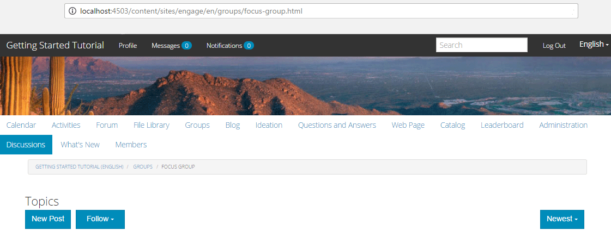

# 社群群組 {#community-groups}

社群群組功能是讓來自發佈和作者環境的授權使用者（社群成員和作者）在社群網站中動態建立子社群的能力。

當[社群網站](sites-console.md)結構中存在[群組函式](functions.md#groups-function)時，即會存在此能力。

[社區組模板](tools-groups.md)在動態建立社區組時提供社區組頁面的設計。

當將該功能添加到社區站點的結構或社區站點模板時，為組功能選擇一個或多個組模板。 此群組範本清單會顯示給從社群網站動態建立新群組的成員或作者。

## 建立新組{#creating-a-new-group}

建立新社群群組的能力取決於包含群組函式的社群網站的存在，例如從` [Reference Site Template](sites.md)`建立的社群網站。

下列範例使用從`Reference Site Template`建立的社群網站，如[AEM Communities](getting-started.md)快速入門教學課程所述。

這是選取&#x200B;**[!UICONTROL 群組]**&#x200B;功能表項目時在發佈時載入的頁面：

選擇&#x200B;**[!UICONTROL 新建組]**&#x200B;表徵圖時，將開啟編輯對話框。

在&#x200B;**[!UICONTROL Settings]**&#x200B;標籤下，提供組的基本功能：

* **[!UICONTROL 組]**
名稱要在社區站點上顯示的組的標題。

* ****
說明要在社群網站上顯示的群組說明。

* ****
邀請邀請邀請加入群組的成員清單。預先輸入搜尋可提供社群成員邀請的建議。

* **[!UICONTROL 群組URL]**
名稱成為URL一部分之群組頁面的名稱。

* **[!UICONTROL 開啟組]**
選擇 
`Open Group` 表示任何匿名網站訪客都可能檢視該內容，並將取消選 `Member Only Group`取。

* **[!UICONTROL 僅成員組]**
選擇 
`Member Only Group` 僅指示群組的成員可檢視內容，並將取消選取 `Open Group`。

在&#x200B;**[!UICONTROL Template]**&#x200B;頁簽下，可以從社區站點結構或社區站點模板中包含組函式時指定的社區組模板清單中進行選擇。

在&#x200B;**[!UICONTROL Image]**&#x200B;標籤下，可上傳影像以在社群網站的「群組」頁面上顯示群組。 預設樣式表會將影像大小為170 x 90像素。

通過選擇&#x200B;**[!UICONTROL 建立組]**&#x200B;按鈕，組的頁面將根據所選模板建立，並為成員身份建立用戶組，而「組」頁面將更新以顯示新的子社區。

例如，具有名為「焦點組」的新子社區的「組」頁將顯示如下（仍以社區組管理員身份登錄）:

選擇`Focus Group`連結將在瀏覽器中開啟焦點組頁面，該頁面具有基於所選模板的初始外觀，並在主社區站點的菜單下包含子菜單：

## 社區組成員清單元件{#community-group-member-list-component}

`Community Group Member List`元件供群組範本的開發人員使用。

## 其他資訊 {#additional-information}

如需詳細資訊，請參閱開發人員的[社群群組基本資訊](essentials-groups.md)頁面。

有關社區組的其他資訊，請訪問[管理用戶和用戶組](users.md)。
