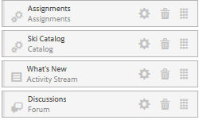

# 製作新的社群網站以啟用{#author-a-new-community-site-for-enablement}

## 建立社群網站 {#create-community-site}

[社群網](sites-console.md) 站建立採用精靈，可引導您完成建立社群網站的步驟。在最後步驟中提交站點之前，可以前移到`Next`步驟或`Back`到上一個步驟。

要開始建立新的社區站點，請執行以下操作：

使用[author instance](http://localhost:4502/)

* 以管理員權限登入
* 導覽至&#x200B;**[!UICONTROL 社群>網站]**

* 選擇&#x200B;**[!UICONTROL 建立]**

### 步驟1:網站範本{#step-site-template}

在&#x200B;**網站範本**&#x200B;步驟中，輸入標題、說明、URL名稱，並選取社群網站範本，例如：

* **社群網站標題**: `Enablement Tutorial`

* **社群網站說明**: `A site for enabling the community to learn.`

* **社群網站根**:(對於預設根，保留空白 `/content/sites`)

* **雲端設定**:（若未指定雲端設定，請留空）提供指定雲端設定的路徑。
* **社群網站基本語言**:（單語言不受影響）英文)使用下拉式選單，從 ** 可用語言中選擇一或多種基本語言——德文、義大利文、法文、日文、西班牙文、葡萄牙文（巴西）、中文（繁體）和簡體中文。會針對新增的每種語言建立一個社群網站，並依照[多語言網站轉譯內容](../../help/sites-administering/translation.md)中所述的最佳實務，存在於相同的網站資料夾中。 每個網站的根頁面將包含一個子頁面，該子頁面由其中一種語言的語言代碼命名，例如英文的&#39;en&#39;或法文的&#39;fr&#39;。

* **[!UICONTROL 社群網站名稱]**: `enable`

   * 初始URL將顯示在「社群網站名稱」下方
   * 若為有效的URL，請附加基本語言代碼+ &quot;。html&quot;

      *例如*,http://localhost:4502/content/sites/  `enable/en.html`

* **[!UICONTROL 參考網站範本]**:向下拉選擇  `Reference Structured Learning Site Template`

選擇&#x200B;**[!UICONTROL Next]**

### 步驟2:設計{#step-design}

「設計」步驟會分兩節顯示，用於選取主題和品牌橫幅：

#### 社群網站主題{#community-site-theme}

選擇要套用至範本的樣式。 選取後，主題將會以勾選標籤覆蓋。

#### 社群網站品牌{#community-site-branding}

（選用）上傳橫幅影像以顯示在網站頁面上。 橫幅會釘在瀏覽器的左邊，位於社群網站標題和功能表（導覽連結）之間。 橫幅高度會裁切為120像素。 橫幅的大小不會調整為適合瀏覽器寬度和120像素高度。

 

選擇&#x200B;**[!UICONTROL Next]**。

### 步驟3:設定{#step-settings}

在「設定」步驟中，在選取`Next`之前，請注意有7個區段提供對配置的存取，這些設定包括使用者管理、標籤、角色、協調、分析、翻譯和啟用。

#### 用戶管理{#user-management}

建議[啟用社群](overview.md#enablement-community)為私用。

當匿名網站訪客被拒絕存取、無法自行註冊且不能使用社交登入時，社群網站是私密的。

確保[User Management](sites-console.md#user-management)的大多數複選框都未選中：

* 不允許網站訪客自行註冊
* 不允許匿名網站訪客檢視網站
* 是否允許社群成員之間傳訊是可選的
* 不允許使用Facebook登入
* 不允許使用Twitter登入

#### 標籤{#tagging}

可套用至社群內容的標籤，是透過選取先前透過[標籤控制台](../../help/sites-administering/tags.md#tagging-console)（例如[教學課程名稱空間](enablement-setup.md#create-tutorial-tags)）定義的AEM名稱空間來控制。

此外，為社群網站選取「標籤名稱空間」會限制定義型錄和啟用資源時顯示的選擇。 如需重要資訊，請參閱[標籤啟用資源](tag-resources.md)。

使用預先輸入搜尋功能，尋找名稱空間十分簡單。 例如，

* 輸入「tut」
* 選取 `Tutorial`

### 角色{#roles}

[社群成](users.md) 員角色是通過「角色」部分中的設定分配的。

若要讓社群成員（或成員群組）以社群管理員的身分體驗網站，請使用預先輸入搜尋，並從下拉式清單的選項中選取成員或群組名稱。

例如，

* 鍵入&quot;q&quot;
* 選擇[Quinn Harper](enablement-setup.md#publishcreateenablementmembers)

>[!NOTE]
>
>[隧道](deploy-communities.md#tunnel-service-on-author) 服務允許選擇僅存在於發佈環境中的成員和組。

#### 協調{#moderation}

接受[協調](sites-console.md#moderation)使用者產生的內容(UGC)的預設全域設定。

#### ANALYTICS {#analytics}

從下拉式選單中，選取為此社群網站設定的Analytics雲端服務架構。

螢幕擷取中顯示的選項`Communities`是[組態檔案的架構範例。](analytics.md#aem-analytics-framework-configuration)

#### TRANSLATION {#translation}

[翻譯設定](sites-console.md#translation)指定UGC是否可翻譯，如果可以，可以翻譯到哪種語言。

* 檢查&#x200B;**[!UICONTROL 允許機器翻譯]**
* 使用預設設定

#### 啟用{#enablement}

對於啟用社群，必須識別一或多個社群啟用管理員。

* **[!UICONTROL 啟用管理員]**
（必要） 
`Community Enablement Managers` 可選擇組以管理此社區站點。

   * 類型&quot;s&quot;
   * 選取 `Sirius Nilson`

* **[!UICONTROL Marketing Cloud組織Id]**
（選用）在啟用報表中包含視訊心率分析時，必 [要的](analytics.md#video-heartbeat-analytics) Adobe Analytics帳戶ID。

選擇&#x200B;**[!UICONTROL Next]**。

### 步驟4:建立社區站點{#step-create-community-site}

選擇 **[!UICONTROL 建立]**。

當流程完成時，新站點的資料夾將顯示在「社區——站點」控制台中。

### 發佈新社群網站{#publish-the-new-community-site}

建立的站點應從Communities - Sites控制台進行管理，該控制台與建立新站點的控制台相同。

選取社群網站的資料夾後，將滑鼠指標暫留在網站圖示上，以便顯示4個動作圖示：

在選取省略號圖示（「更多操作」圖示）時，會顯示「導出站點」和「刪除站點」選項。

從左到右依次為：

* **開啟**
網站選取鉛筆圖示，以作者編輯模式開啟社群網站，以新增和／或設定頁面元件

* **編輯**
網站選擇屬性圖示以開啟社群網站，以修改屬性，例如標題或變更主題

* **發佈**
網站選取世界圖示以發佈社群網站（預設為localhost:4503）

* **匯出**
網站選取匯出圖示，以建立儲存在封裝管理員和已下載之社群網站 [的](../../help/sites-administering/package-manager.md) 封裝。

   請注意，網站套件中不包含UGC。

* **刪除**
站點要刪除社區站點，請選擇「刪除站點」表徵圖，該表徵圖將滑鼠懸停在「社區站點控制台」的站點上。此動作會移除與網站相關的所有項目，例如UGC、使用者群組、資產和資料庫記錄。

#### 選擇「發佈{#select-publish}」

選取「全球」圖示以發佈社群網站。

會顯示網站已發佈。

## 社群使用者與使用者群組{#community-users-user-groups}

### 注意：新社群使用者群組{#notice-new-community-user-groups}

除了新社群網站外，還會建立新的使用者群組，其中已針對各種管理功能設定適當的權限。 如需詳細資訊，請造訪[社群網站的使用者群組](users.md#usergroupsforcommunitysites)。

對於此新社群網站，如果在步驟1中的網站名稱為&quot;enable&quot;，則可從[社群成員與群組主控台](members.md#groups-console)中查看發佈環境中存在的新使用者群組：

### 將成員分配給社區啟用成員組{#assign-members-to-community-enable-members-group}

在作者身上，啟用隧道服務後，可以將在初始設定期間建立的[用戶分配給新建立的社區站點的社區成員組。](enablement-setup.md#publishcreateenablementmembers)

使用社群群組主控台，可以個別新增成員，或透過群組的成員資格新增成員。

在此示例中，組`Community Ski Class`被添加為組`Community Enable Members`的成員以及成員`Quinn Harper`。

* 導覽至&#x200B;**[!UICONTROL 社群>群組]**&#x200B;主控台
* 選擇&#x200B;**[!UICONTROL 社區啟用成員]**&#x200B;組
* 在&#x200B;**[!UICONTROL 將成員添加到組]**&#x200B;搜索框中輸入`ski`
* 選擇&#x200B;**[!UICONTROL 社區滑雪課]**（學員群組）
* 在搜索框中輸入`quinn`
* 選擇&#x200B;**[!UICONTROL Quinn Harper]**（啟用資源聯繫）

* 選擇&#x200B;**[!UICONTROL 保存]**

## 發佈{#configurations-on-publish}時的配置

### http://localhost:4503/content/sites/enable/en.html {#http-localhost-content-sites-enable-en-html}

### 配置驗證錯誤{#configure-for-authentication-error}

在設定網站並推送至發佈後，[會在發佈例項上設定登入對應](sites-console.md#configure-for-authentication-error)(`Adobe Granite Login Selector Authentication Handler`)。 優點是，當登入憑證未正確輸入時，驗證錯誤會以錯誤訊息重新顯示社群網站的登入頁面。

將`Login Page Mapping`新增為

* /content/sites/enable/tw/signin:/content/sites/enable/tw

### （可選）變更預設首頁{#optional-change-the-default-home-page}

使用發佈網站進行展示時，將預設首頁變更為新網站可能會很有用。

要執行此操作，需要使用[CRX|DE](http://localhost:4503/crx/de) Lite來編輯發佈時的[資源映射](../../help/sites-deploying/resource-mapping.md)表。

若要開始

1. 在發佈時，存取CRXDE並以管理員權限登入

   * 例如，瀏覽至[http://localhost:4503/crx/de](http://localhost:4503/crx/de)並使用`admin/admin`登入

1. 在項目瀏覽器中，展開`/etc/map`
1. 選擇`http`節點

   * 選擇&#x200B;**[!UICONTROL 建立節點]**

      * **** Namelocalhost.4503

         （*not*&#x200B;使用`:`）

      * **打** [字：映射](https://sling.apache.org/documentation/the-sling-engine/mappings-for-resource-resolution.html)

1. 已選擇新建立的`localhost.4503`節點

   * 新增屬性

      * **命** 名：匹配
      * **TypeString** 
      * **** Valuelocalhost.4503/\$

         （必須以&#39;$&#39;字元結尾）
   * 新增屬性

      * **命名** 空間：internalRedirect
      * **TypeString** 
      * **值** /content/sites/enable/en.html

1. 選擇&#x200B;**[!UICONTROL 全部保存]**
1. （可選）刪除瀏覽歷史記錄
1. 瀏覽至http://localhost:4503/

   * 請造訪http://localhost:4503/content/sites/enable/en.html

>[!NOTE]
>
>若要停用，只需在`sling:match`屬性值前加上&#39;x&#39; - `xlocalhost.4503/$` —— 和&#x200B;**[!UICONTROL 全部儲存]**。

#### 疑難排解：保存映射{#troubleshooting-error-saving-map}時出錯

如果無法保存更改，請確保節點名稱為`localhost.4503`（帶有&#39;dot&#39;分隔符），而不是帶有&#39;冒號&#39;分隔符的`localhost:4503`（因為`localhost`不是有效的命名空間前置詞）。

#### 疑難排解：無法重新導向{#troubleshooting-fail-to-redirect}

規則運算式`sling:match`字串結尾的&#39;**$**&#39;至關重要，因此僅對應`http://localhost:4503/`，否則重新導向值會優先於URL中server:port之後可能存在的任何路徑。 因此，當AEM嘗試重新導向至登入頁面時，它會失敗。

## 修改社區站點{#modifying-the-community-site}

在初次建立網站後，作者可使用[「開啟網站」圖示](sites-console.md#authoring-site-content)來執行標準的AEM製作活動。

此外，管理員可使用[編輯網站圖示](sites-console.md#modifying-site-properties)來修改網站的屬性，例如標題。

在進行任何修改後，請記住&#x200B;**Save**&#x200B;和re-**Publish**&#x200B;網站。

>[!NOTE]
>
>如果不熟悉AEM，請檢視[基本處理](../../help/sites-authoring/basic-handling.md)和[製作頁面快速指南的說明檔案](../../help/sites-authoring/qg-page-authoring.md)。

### 添加目錄{#add-a-catalog}

為此社區站點選擇的社區站點模板應包含目錄功能。

如果不是，則可輕鬆新增目錄功能。 這可讓社群的其他成員（未指派至啟用資源或學習路徑）從目錄中選擇啟用資源。

如果網站結構已包含目錄功能，則可變更其標題。

要修改站點的結構，請導航至&#x200B;**[!UICONTROL Communities、Sites]**&#x200B;控制台，開啟`enable`資料夾，然後選擇&#x200B;**編輯站點**&#x200B;表徵圖以訪問`Enablement Tutorial`的屬性。

選擇「結構」(STRUCTURE)面板以添加目錄或修改現有目錄：

* **標題**: `Ski Catalog`

* **URL**:  `catalog`

* **選擇所有名稱空間**:保留為預設值。
* 選擇&#x200B;**[!UICONTROL 保存]**

使用「位置」表徵圖將「目錄」功能移動到「分配」後的第二個位置。

選擇右上角的&#x200B;**[!UICONTROL Save]**&#x200B;將更改保存到社區站點。

然後重新-**發佈**&#x200B;網站。