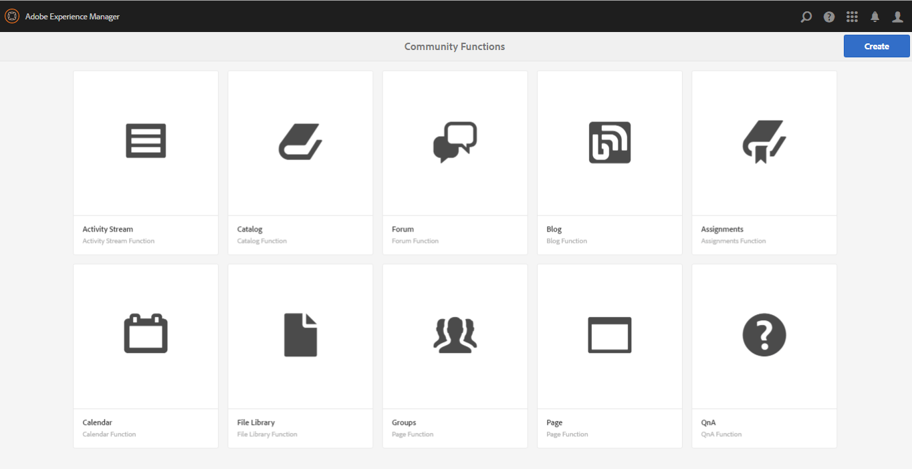

# 社群功能 {#community-functions}

社群體驗預期的功能類型已廣為人知。 社群功能可做為社群功能。 基本上，這些頁面是預先連線的一或多個頁面，以實作社群功能，其需要的不只是在作者模式下將元件新增至頁面。 它們是用於定義[社區站點模板](sites.md)的結構的構成塊，從中建立[社區站點。](sites-console.md)

在建立社群網站後，就可使用標準[AEM製作模式](../../help/sites-authoring/editing-content.md)將內容新增至產生的頁面。

許多社群功能可立即使用，如社群功能主控台所示。 未來版本將提供更多社群功能，並可建立自訂功能。

>[!NOTE]
>
>用於建立[社區站點](sites-console.md)、[社區站點模板](sites.md)、[社區組模板](tools-groups.md)和[社區功能](functions.md)的控制台僅用於作者環境。

## 社區功能控制台{#community-functions-console}

在作者環境中，要到達社群功能主控台

* 從全域導覽：**[!UICONTROL 工具>社群>社群功能]**

## 預建函式{#pre-built-functions}

以下是AEM Communities所提供功能的簡短說明。 每個函式都由一或多個AEM頁面組成，其中包含連線在功能中的Communities元件，此功能可輕鬆整合在[社群網站範本](sites.md)中。

社群網站範本提供社群網站的結構，包括登入、使用者設定檔、通知、訊息、網站選單、搜尋、主題和品牌功能。

### 標題和URL設定{#title-and-url-settings}

**標** 題和 **** URL是所有社群函式的通用屬性。

當社群函式被添加到社區站點模板或在[修改](sites-console.md#modifying-site-properties)社區站點結構時添加時，該函式的對話框開啟，以便可以配置標題和URL。

#### 設定功能詳細資料 {#configuration-function-details}

* **[!UICONTROL 標題]**
(
*必要*)網站功能選單中顯示的文字

* **[!UICONTROL URL]**
(必*要*)用於產生URI的名稱。名稱必須符合AEM和JCR所強加的[命名慣例](../../help/sites-developing/naming-conventions.md)。

例如，使用從[開始使用](getting-started.md)教學課程建立的網站，如果

* 標題=網頁
* URL =頁面

然後頁面的URL是http://local_host:4503/content/sites/engage/en/page.html，頁面的功能表連結會顯示為：

### 活動資料流功能 {#activity-stream-function}

活動流函式是具有[活動流元件](activities.md)的頁面，其中選定了所有視圖（所有活動、用戶活動和以下）。 另請參閱[開發人員的Activity Stream Essentials](essentials-activities.md)。

新增至範本時，會開啟下列對話方塊：

#### 設定功能詳細資料 {#configuration-function-details-1}

* 請參閱[標題和URL設定](#title-and-url-settings)
* **[!UICONTROL 顯示「我的活動」視]**
圖如果選中，「活動」頁將包含一個頁籤，該頁籤將根據當前成員在社區中生成的活動進行篩選。已勾選預設值。

* **[!UICONTROL 顯示「所有活動」視]**
圖如果選中，「活動」頁將包含一個頁籤，其中包含當前成員有權訪問的社區內生成的所有活動。已勾選預設值。

* **[!UICONTROL 顯示「動態消息」]**
檢視如果勾選，「活動」頁面將包含一個標籤，可依據目前成員所追蹤的活動來篩選活動。已勾選預設值。

### 指定任務功能 {#assignments-function}

指派函式是定義[社群網站以啟用](overview.md#enablement-community)的基本功能。 它允許向社區成員分配支援資源。 另請參閱[開發人員的Assignments Essentials](essentials-assignments.md)。

此函式是[enablement add-on](enablement.md)的功能。 啟用附加元件需要額外的授權才能用於生產環境。

新增至範本時，只有[標題和URL設定](#title-and-url-settings)的組態。

### 部落格功能 {#blog-function}

部落格函式是具有[Blog元件](blog-feature.md)的頁面，其設定用於標籤、檔案上傳、追蹤成員以進行自我編輯、投票和協調。 另請參閱[開發人員的Blog Essentials](blog-developer-basics.md)。

新增至範本時，會開啟下列對話方塊：

* 請參閱[標題和URL設定](#title-and-url-settings)
* **[!UICONTROL 允許特]**
權成員如果勾選，則部落格僅允許特權成員通過允許選擇特權成員組 [建立文章](users.md#privileged-members-group)。如果未選中，則允許所有社區成員建立。 預設為未勾選。

* **[!UICONTROL 允許上]**
傳檔案如果勾選，部落格將包含成員上傳檔案的功能。已勾選預設值。

* **[!UICONTROL 允許串]**
連回覆如果未勾選，部落格將允許文章的回覆（留言），但不允許回覆留言。已勾選預設值。

* **[!UICONTROL 允許特]**
色內容如果勾選，即可將構想識別為特 [色內容](featured.md)。已勾選預設值。

### 日曆功能 {#calendar-function}

日曆函式是具有[日曆元件](calendar.md)的頁，配置為允許標籤。 另請參閱[開發人員的Calendar Essentials](calendar-basics-for-developers.md)。

新增至範本時，會開啟下列對話方塊：

* 請參閱[標題和URL設定](#title-and-url-settings)
* **[!UICONTROL 允許]**
釘選如果勾選，論壇將允許將主題回覆釘選至留言清單的開頭。已勾選預設值。

* **[!UICONTROL 允許特]**
權成員如果勾選，則部落格僅允許特權成員通過允許選擇特權成員組 [建立文章](users.md#privileged-members-group)。如果未選中，則允許所有社區成員建立。 預設為未勾選。

* **[!UICONTROL 允許上]**
傳檔案如果勾選，部落格將包含成員上傳檔案的功能。已勾選預設值。

* **[!UICONTROL 允許串]**
連回覆如果未勾選，部落格將允許文章的回覆（留言），但不允許回覆留言。已勾選預設值。

* **[!UICONTROL 允許特]**
色內容如果勾選，即可將構想識別為特 [色內容](featured.md)。已勾選預設值。

### 目錄功能 {#catalog-function}

目錄功能使[啟用社區](overview.md#enablement-community)成員能夠瀏覽未分配給他們的啟用資源。 請參閱[為開發人員標籤啟用資源](tag-resources.md)和[Catalog Essentials](catalog-developer-essentials.md)。

如果社群網站的屬性` [Show in Catalog](resources.md)`設為true，則所有目錄中都會顯示社群網站的所有啟用資源和學習路徑。 要明確包括資源和學習路徑，必須將[pre-filter](catalog-developer-essentials.md#pre-filters)應用到目錄。

新增至範本時，此設定可讓您指定用於設定提供給網站訪客之標籤篩選的標籤命名空間：

* 請參閱[標題和URL設定](#title-and-url-settings)
* **[!UICONTROL 選取所有命名空間]**

   * 所選標籤名稱空間定義哪些標籤可由訪客選擇以篩選目錄中所列的啟用資源清單。
   * 勾選後，社群網站允許的所有標籤名稱空間都可用。
   * 如果取消選中，則可以選擇允許為社區站點使用的一個或多個名稱空間。
   * 已勾選預設值。

### 精選內容功能{#featured-content-function}

精選內容功能是具有[精選內容元件](featured.md)的頁面，設定為允許新增和刪除註解。

可允許或禁止每個元件使用特徵內容的能力（請參閱[部落格函式](#blog-function)、[日曆函式](#calendar-function)、[論壇函式](#forum-function)、[標識函式](#ideation-function)和[QnA函式](#qna-function)）。

新增至範本時，只有[標題和URL設定](#title-and-url-settings)的組態。

### 檔案庫功能 {#file-library-function}

檔案庫函式是具有[檔案庫元件](file-library.md)的頁，配置為允許添加和刪除注釋。

新增至範本時，只有[標題和URL設定](#title-and-url-settings)的組態。

### 論壇功能 {#forum-function}

論壇函式是具有[論壇元件](forum.md)的頁面，該元件配置為標籤、檔案上載、跟蹤成員以自行編輯、投票和調節。

新增至範本時，會開啟下列對話方塊：

#### 設定功能詳細資料 {#configuration-function-details-2}

* 請參閱[標題和URL設定](#title-and-url-settings)
* **[!UICONTROL 允許]**
釘選如果勾選，論壇將允許將主題回覆釘選至留言清單的開頭。已勾選預設值。

* **[!UICONTROL 允許特]**
權成員如果選中，論壇將只允許特權成員通過允許選擇特權成員組來 [發佈主題](users.md#privileged-members-group)。如果未勾選，則允許所有社群成員張貼。 預設為未勾選。

* **[!UICONTROL 允許上]**
傳檔案如果勾選，論壇將包含成員上傳檔案的能力。已勾選預設值。

* **[!UICONTROL 允許線程]**
化回覆如果未勾選，論壇將允許對主題的留言，但不允許對這些留言的回覆。已勾選預設值。

* **[!UICONTROL 允許特]**
色內容如果勾選，即可將構想識別為特 [色內容](featured.md)。已勾選預設值。

### 群組函式{#groups-function}

>[!CAUTION]
>
>群組函式必須&#x200B;*not*&#x200B;是&#x200B;*的第一個，也不是站點結構或社區站點模板中唯一的*&#x200B;函式。
>
>任何其他函式（例如[page函式](#page-function)）必須先包含並列出。

群組功能可讓社群成員在發佈環境中在社群網站內建立子社群。

視[設定](sites-console.md#groupmanagement)在[社群網站範本](sites.md)中包含群組功能時，群組可以是公用或私用，且一或多個社群群組範本可設定為在實際建立社群群組時（例如來自發佈環境）提供範本選擇。 [社群群組範本](tools-groups.md)指定為群組頁面（如論壇和日曆）建立哪些社群功能。

建立社區組時，會為新組動態建立成員組，可將成員分配或加入到該組。 如需詳細資訊，請參閱[管理使用者和使用者群組](users.md)。

從Communities [功能包1](deploy-communities.md#latestfeaturepack)開始，使用[Communities Sites的Groups控制台](groups.md)在作者環境中建立社區組，並且在啟用後可在發佈環境中建立社區組。

新增至範本時，會開啟下列對話方塊：

* 請參閱[標題和URL設定](#title-and-url-settings)
* **[!UICONTROL 選擇組]**
模板下拉菜單允許選擇一個或多個啟用的組模板，新社區組（在發佈環境中）的將來建立者可以從中選擇這些模板。

* **[!UICONTROL 允許特]**
權成員如果選中，論壇將只允許特權成員通過允許選擇特權成員安全組來 [發佈主題](users.md#privileged-members-group)。如果未勾選，則允許所有社群成員張貼。 預設為未勾選。

* **[!UICONTROL 允許發]**
布建立如果選中，則授權社區成員可以在發佈環境中建立組。如果未選中，則只能在作者環境中從「社群站點」的「組」控制台建立新組（子社區）。

   預設值為`checked`。

### 創意力功能 {#ideation-function}

識別函式是具有一個[識別元件](ideation-feature.md)的頁面。

新增至範本時，會開啟下列對話方塊，指定範本的預設標題和URL名稱，以及預設顯示設定：

* 請參閱[標題和URL設定](#title-and-url-settings)
* **[!UICONTROL 允許特]**
權成員如果選中，論壇將只允許特權成員通過允許選擇特權成員安全組來 [發佈主題](users.md#privileged-members-group)。如果未勾選，則允許所有社群成員張貼。 預設為未勾選。

* **[!UICONTROL 允許上]**
傳檔案如果勾選此選項，將包含成員上傳檔案的能力。已勾選預設值。

* **[!UICONTROL 允許線程]**
化回覆如果未勾選，此構想將允許對主題的回覆（留言），但不允許回覆留言。已勾選預設值。

* **[!UICONTROL 允許特]**
色內容如果勾選，即可將構想識別為特 [色內容](featured.md)。已勾選預設值。

### 排行榜功能 {#leaderboard-function}

排行榜功能是具有一個[排行榜元件](enabling-leaderboard.md)的頁面。

**注意**:在從包含Leedroard功能的社區模板 ** 建立社區站點後，Leedroard元件需要進一步配置。需要指定Leaderboard元件的[規則](enabling-leaderboard.md#rules-tab)，這取決於社區站點的[計分和標章](implementing-scoring.md)的配置。

新增至範本時，會開啟下列對話方塊，指定範本的預設標題和URL名稱，以及預設顯示設定：

* 請參閱[標題和URL設定](#title-and-url-settings)
* **[!UICONTROL 顯示]**
標章如果勾選，則標誌圖示的欄會包含在排行榜中。

   預設為未勾選。

* **[!UICONTROL 顯示標]**
章名稱如果勾選，則標誌名稱的欄會包含在排行榜中。

   預設為未勾選。

* **[!UICONTROL 顯示]**
頭像如果勾選，成員的頭像影像會包含在排行榜中，位於其成員描述檔的名稱連結旁。

   預設為未勾選。

### 頁面功能 {#page-function}

頁面功能會將空白頁面新增至社群網站，並將其連線至社群網站的功能：登入、選單、通知、訊息、主題和品牌。 內容可使用[標準AEM製作模式](../../help/sites-authoring/editing-content.md)新增至頁面。

新增至範本時，只有[標題和URL設定](#title-and-url-settings)的組態。

### QnA 功能 {#qna-function}

QnA函式是一個具有[QnA元件](working-with-qna.md)的頁面，該元件配置為標籤、檔案上載、跟蹤成員以進行自我編輯、投票和調節。

將配置添加到模板時，該配置允許對特權成員進行限制：

* 請參閱[標題和URL設定](#title-and-url-settings)
* **[!UICONTROL 允許]**
釘選如果勾選，論壇將允許將主題回覆釘選至留言清單的開頭。已勾選預設值。

* **[!UICONTROL 允許特]**
權成員如果選中，則QnA論壇將只允許特權成員通過允許選擇特權成員組來 [發佈問題](users.md#privileged-members-group)。如果未勾選，則允許所有社群成員張貼。 預設為未勾選。

* **[!UICONTROL 允許上]**
載檔案如果選中此選項，QnA論壇將包括成員上載檔案的能力。已勾選預設值。

* **[!UICONTROL 允許線程]**
化回覆如果未勾選，QnA論壇將允許對已張貼的問題留言（答案），但不允許回覆答案。已勾選預設值。

* **[!UICONTROL 允許特]**
色內容如果勾選，即可將構想識別為特 [色內容](featured.md)。已勾選預設值。

## 建立社群功能 {#create-community-function}

通過選擇「社區功能」控制台頂部的`Create Community Function`表徵圖，可以建立社區功能。 您可以建立以相同AEM Blueprint為基礎的多個函式，然後以作者編輯模式開啟，進行唯一自訂。

### 社群功能名稱 {#community-function-name}

在「社群功能名稱」面板上，會設定名稱、說明，以及函式是啟用還是停用：

* **[!UICONTROL 社群函式]**
名稱用於顯示和儲存的函式名稱

* **[!UICONTROL 社群功能]**
說明顯示的功能說明

* **[!UICONTROL 禁用／啟]**
用切換開關控制是否可引用函式

### AEM 藍圖 {#aem-blueprint}

在`AEM Blueprint`面板上，可以選擇作為社區功能基礎實現的藍圖。

社群功能是由一或多個頁面組成的迷你網站，預先連線以加入社群網站，包括登入、使用者設定檔、通知、訊息、網站選單、搜尋、主題和品牌功能。 在建立函式後，[可以在作者編輯模式下開啟函式](#open-community-function)並自定義頁面和／或元件設定。

由於社區函式被實作為[blueprint](../../help/sites-administering/msm-livecopy.md#creatingablueprint)的[即時副本](../../help/sites-administering/msm.md#live-copies)，因此可以對影響從包含該函式的[社區站點模板](sites.md)或[社區組模板](tools-groups.md)建立的所有社區站點頁的函式進行改變。 您也可以將頁面與其父藍圖取消關聯，以便進行頁面層級的修改。

另請參閱[多站點管理器](../../help/sites-administering/msm.md)。

### 縮圖 {#thumbnail}

在「縮圖」面板上，影像可上傳以顯示在[社群功能主控台](#community-functions-console)中。

## 開啟社群功能 {#open-community-function}

選擇`Open Community Function`表徵圖可進入作者編輯模式以編寫頁面內容並修改功能元件的配置。

### 配置元件{#configuring-components}

社群函式會實作為AEM Blueprint的即時副本，其詳細資訊會記錄在[ Multi Site Manager](../../help/sites-administering/msm.md)中。

您不僅可以製作頁面內容，還可以設定元件。

如果在已建立的社區站點的頁面上配置元件，則可能需要取消[inheritance](../../help/sites-administering/msm-livecopy.md#changing-live-copy-content)以配置元件。 配置完成時，應重新建立繼承。

有關配置詳細資訊，請訪問[Communities Components](author-communities.md)作者。

## 編輯社群功能 {#edit-community-function}

選擇`Edit Community Function`表徵圖，使用與[建立社區函式](#create-community-function)相同的面板來編輯函式的屬性，包括啟用或禁用該函式。
