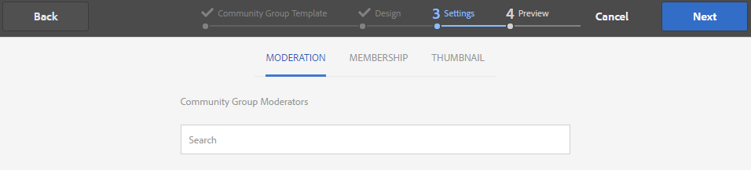

# 社群群組主控台 {#community-groups-console}

>[!CAUTION]
>
>AEM 6.4已結束延伸支援，本檔案不再更新。 如需詳細資訊，請參閱 [技術支援期](https://helpx.adobe.com//tw/support/programs/eol-matrix.html). 尋找支援的版本 [此處](https://experienceleague.adobe.com/docs/).

「群組」主控台可讓您在社群網站的 [模板結構](sites-console.md#step1) 包括 [組函式](functions.md#groups-function).

* 組可以嵌套在其他組內。 當 [新集團的結構](tools-groups.md) 包含群組函式。
* 僅適用於製作環境，會有與網站建立精靈類似的群組建立精靈。
* 將組函式添加到社區站點結構或社區組結構時，成員是否可從發佈環境建立組是可配置的。

在包含的三個群組範本中，僅 `Reference Group` 範本的結構中包含群組函式。

社群群組的幾個方面包括：

* 建立：可在作者上建立新群組，也可選擇在發佈時建立
* 控制：群組可能為開啟或機密
* 嵌套：組可以包含零個或多個組

>[!NOTE]
>
>社群群組，在發佈環境中建立，於 [社區組控制台的存在性](https://helpx.adobe.com/in/experience-manager/6-3/communities/using/version-history.html#FeaturePack1FP1)，不會列在社群群組主控台中，因此，無法使用主控台修改。

>[!NOTE]
>
>此組控制台僅可從Communities Sites控制台訪問，不與成員混淆 [群組主控台](members.md) 用於管理成員組。
>
>成員群組是在發佈環境中註冊，並使用 [隧道服務](deploy-communities.md#tunnel-service-on-author).

## 群組建立 {#group-creation}

若要存取「群組」主控台：

* 在作者上，以管理員權限登入
* 從全局導航： **[!UICONTROL 社群>網站]**
* 選擇現有的社區站點資料夾以開啟它
* 在資料夾中選取社群網站的例項

   * 社群網站的結構必須包含群組函式
   * 以下螢幕擷取畫面來自後續的快速入門教學課程 [在發佈時建立群組](published-site.md)

選取 **[!UICONTROL 群組資料夾]** 來開啟它。

開啟時，會顯示所有現有群組（無論是在製作或發佈時建立）。

在此「群組」主控台中，可以製作新群組。

* 選擇 **[!UICONTROL 建立群組]** 按鈕

### 步驟1:社群群組範本 {#step-community-group-template}

* **[!UICONTROL 社群群組標題]**:群組的顯示標題。

   標題會顯示在群組的已發佈網站上。

* **[!UICONTROL 社群群組說明]**:群組的說明。
* **[!UICONTROL 社群群組根]**:群組的根路徑。

   預設根為父網站，但根可移至網站內的任何位置。 不建議更改它。

* **[!UICONTROL 其他可用的社群群組語言]** 功能表：使用下拉式功能表來選取可用的社群群組語言。 功能表會顯示建立父社群網站的所有語言。 使用者可在這些語言中選取，以在這個單一步驟中建立多個地區設定中的群組。 系統會在個別社群網站的群組控制台中，以多種指定語言建立相同的群組。

* **[!UICONTROL 社區組名]**:顯示在URL中的群組根頁面名稱

   * 仔細檢查名稱，因為建立群組後不易變更
   * 基礎URL會顯示在 `Community Group Name`
   * 對於有效的URL，請附加&quot;。html&quot;

      *例如*, `http://localhost:4502/content/sites/mysight/en/mygroup.html`

* **[!UICONTROL 社群群組範本]** 功能表：使用下拉式功能表來選擇可用 [社群群組範本](tools.md).

### 步驟2:設計 {#step-design}

#### 社群群組主題 {#community-group-theme}

框架使用 `Twitter Bootstrap` 為網站帶來回應式、彈性的設計。 可以選擇多個預載的Bootstrap主題之一來設定所選社區組模板的樣式，或者可以上載Bootstrap主題。

選取時，主題將會以不透明的藍色核取記號覆蓋。

您可以選取與父網站主題不同的主題。

發佈社群網站後，您可以 [編輯屬性](#modifying-group-properties) 並選取不同的主題。

#### 社群群品牌推廣 {#community-group-branding}

社群網站品牌化是顯示為頁首的影像，橫跨每個頁面。 可以顯示群組的橫幅，而此橫幅與其他網站頁面不同。

影像的大小應與瀏覽器中頁面的預期顯示大小一樣寬，高度應為120像素。

建立或選取影像時，請記住：

* 影像高度會裁切為120個像素，從影像的上邊緣測量
* 影像會固定至瀏覽器視窗的左側邊緣
* 影像沒有大小調整，因此當影像寬度為……

   * 小於瀏覽器寬度，影像會水準重複
   * 大於瀏覽器的寬度，影像就會看起來被裁切

### 步驟3:設定 {#step-settings}

#### 協調 {#moderation}

依預設，會繼承父社群網站的協調者清單。

可以新增群組的特定協調者：

* 搜尋成員（從發佈環境）以將其新增為協調者

#### 會籍 {#membership}

成員資格設定允許選擇以下三種方法之一來保護社區組。

* 可選成員資格

   如果選中，則社區組為公共組。 網站成員可以參與群組並張貼，而不需明確加入群組。 已選取預設值。
* 必要的成員資格

   如果選定，則社區組為開啟的組。 社群網站成員可以查看組的內容，但必須先加入組才能發佈內容。 通過選擇 `Join` 按鈕。 未選取預設值。

* 限制的成員資格

   如果選中，則社區組為機密組。 必須明確邀請社群成員。 已邀請的成員將輸入到搜索框中。 稍後可使用 [成員和組控制台](members.md) 製作環境。 未選取預設值。

#### 縮圖 {#thumbnail}

縮圖是要在製作和發佈時針對群組顯示的影像。

群組影像的最佳大小為170 x 90像素，且為支援的影像格式(例如JPG或PNG)。

如果未新增影像，則會顯示預設影像。

### 步驟4:建立群組 {#step-create-group}

如果需要任何調整，請使用 **返回** 按鈕來製作。

一次 **建立** 已選取並啟動，則建立群組的程式無法中斷。

流程完成後，新子社區站點（組）的卡將顯示在「社區站點組」控制台中，供作者添加頁面內容或管理員修改站點的屬性。

>[!NOTE]
>
>群組會以所有語言建立，如 [步驟1:社群群組範本](groups.md#step1communitygrouptemplate) 在各個社群網站的「社群群組」主控台中，以其他可用的社群群組語言顯示。

## 製作群組內容 {#authoring-group-content}

群組的頁面內容可以使用與任何其他AEM頁面相同的工具撰寫。 若要開啟群組以進行製作，請選取將游標移至群組卡片時顯示的「開啟網站」圖示。

## 修改組屬性 {#modifying-group-properties}

在社區組建立過程中指定的現有子社區站點的屬性可以通過選擇「編輯站點」表徵圖來修改，該表徵圖在將游標暫留在組卡上時顯示：

下列屬性的詳細資料與 [群組建立](#group-creation) 區段。 任何巢狀群組都可修改，無論是在發佈環境或製作環境中建立。

### 修改基本 {#modify-basic}

BASIC面板允許修改

* 社群群組標題
* 社群群組說明

不能修改社區組名稱。

選擇不同的社區組模板對現有的社區組站點沒有影響，因為模板和站點之間沒有連接。

反之， [結構](#modify-structure) 可以修改子社區。

### 修改結構 {#modify-structure}

「結構」面板允許修改最初從從作者或發佈環境建立子社區站點時選定的社區組模板建立的結構。 從面板，您可以

* 拖放其他 [社群功能](functions.md) 進入網站結構
* 在網站結構中的社群函式例項上：

   * **`gear icon`**

      編輯設定，包括顯示標題和URL名稱 [特權成員組](users.md#privilegedmembersgroups)

   * **`trashcan icon`**

      從網站結構中移除（刪除）函式

   * **`grid icon`**

      修改網站頂層導覽列中顯示的函式順序

>[!CAUTION]
>
>雖然顯示標題可以不產生副作用而變更，但不建議編輯屬於社群網站之社群函式的URL名稱。
>
>例如，重新命名URL不會移動現有的UGC，因此會產生「遺失」UGC的效果。

>[!CAUTION]
>
>組函式必須 *not* be *第一，也不是唯一* 功能。
>
>任何其他函式，例如 [頁面函式](functions.md#page-function)，必須包含在內並列出。

#### 範例：將日曆函式添加到子社區（組）結構 {#example-adding-a-calendar-function-to-a-sub-community-group-structure}

### 修改設計 {#modify-design}

「設計」面板允許修改主題：

* [社群群組主題](#community-group-theme)
* [社群群組品牌](#community-group-branding)

   * 捲動至面板底部以變更品牌影像

### 修改設定 {#modify-settings}

「設定」面板可讓您新增社群 [協調者](#moderation).

### 修改成員資格 {#modify-membership}

此 [會籍](#membership) 面板僅供參考。 無法更改已建立的組成員類型，無論是可選、必需還是受限。

### 修改縮圖 {#modify-thumbnail}

此 [縮圖](#thumbnail) 面板可讓您上傳影像，以在發佈環境以及製作環境的社群網站群組控制台中，向網站訪客呈現社群群組。

## 發佈群組 {#publishing-the-group}

在新建立或修改社群群組後，您可以選取 `Publish Site` 表徵圖。

成功發佈群組後，會顯示訊息：

>[!CAUTION]
>
>應已發佈父社區站點和父組。
>
>社群網站和巢狀群組應由上而下發佈。

## 刪除群組 {#deleting-the-group}

通過選擇「刪除組」表徵圖，從社區組控制台中刪除組，該表徵圖顯示在將滑鼠懸停在組上。

這會刪除與組關聯的所有項，例如，組的所有內容將被永久刪除，並且用戶成員會從系統中刪除。
