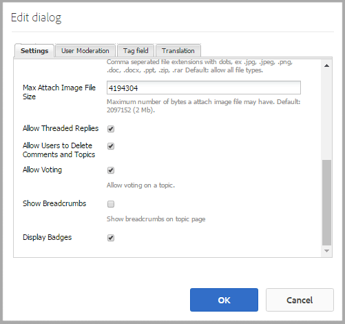

# 社群計分和徽章 {#communities-scoring-and-badges}

>[!CAUTION]
>
>AEM 6.4已結束延伸支援，本檔案不再更新。 如需詳細資訊，請參閱 [技術支援期](https://helpx.adobe.com//tw/support/programs/eol-matrix.html). 尋找支援的版本 [此處](https://experienceleague.adobe.com/docs/).

## 概觀 {#overview}

AEM Communities計分和徽章功能提供識別和獎勵社群成員的能力。

評分和徽章的主要方面是：

* [指派徽章](#assign-and-revoke-badges) 確定成員在社區中的作用

* [基本獎章](#enable-scoring) 鼓勵成員參與（建立的內容數量）
* [高級徽章獎勵](advanced.md) 將成員標識為專家（建立的內容質量）

**附註** 頒發徽章 [預設為未啟用](implementing-scoring.md#main-pars-text-237875536).

>[!CAUTION]
>
>當UI可用時，CRXDE Lite中可見的實作結構可能會變更。

## 徽章 {#badges}

徽章會放置在成員的名下，以指出其角色或在社群中的地位。 徽章可以顯示為影像或名稱。 顯示為影像時，名稱會包含為協助工具的替代文字。

預設情況下，徽章位於存放庫的

* /etc/community/badging/images

如果儲存在不同的位置，則每個人都應該可以讀取這些內容。

徽章在UGC中區別於是指定的徽章，還是根據規則掙得的徽章。 當前，已分配的徽章以文本形式顯示，而已獲得的徽章以影像形式顯示。

### 徽章管理UI {#badge-management-ui}

社群 [徽章主控台](badges.md) 提供添加自定義徽章的功能，該徽章可在獲得（授予）成員或成員在社區中承擔特定角色（已分配）時為成員顯示。

### 指派的徽章 {#assigned-badges}

管理員會根據社群中的角色，將角色型徽章指派給社群成員。

已分配（和已喚醒）的徽章儲存在選定的 [SRP](srp.md) 和無法直接存取。 在GUI可用之前，指派角色型徽章的唯一方法是使用程式碼或cURL來指派。 如需cURL指示，請參閱 [指派和撤銷徽章](#assign-and-revoke-badges).

此發行包含三個角色型徽章：

* 版主

   `/etc/community/badging/images/moderator/jcr:content/moderator.png`

* 群組管理員

   `/etc/community/badging/images/group-manager/jcr:content/group-manager.png`

* 特權成員

   `/etc/community/badging/images/privileged-member/jcr:content/privileged-member.png`


### 獎章 {#awarded-badges}

評分服務會根據套用至社群中活動的規則，將基於獎勵的徽章授予社群成員。

為了讓徽章顯示為活動的獎勵，必須執行下列兩項操作：

* 簽名必須是 [已啟用](#enable-badges-for-component) 特徵元件
* 計分和加號規則必須 [已套用](#apply-rules-to-content) 至元件放置所在的頁面（或上階）

發行包含三個獎勵型徽章：

* 金級

   `/etc/community/badging/images/gold-badge/jcr:content/gold.png`

* 銀級

   `/etc/community/badging/images/silver-badge/jcr:content/silver.png`

* 銅級

   `/etc/community/badging/images/bronze-badge/jcr:content/bronze.png`


>[!NOTE]
>
>可以配置評分規則，為標示為不適當的貼文指派負分，因此影響分數值。 不過，一旦獲得徽章，就不會因為分數減少或分數規則變更而自動移除徽章。
>
>吊銷獎勵徽章的方式與吊銷指定徽章相同。 請參閱 [指派和撤銷徽章](#assign-and-revoke-badges) 區段。 未來的改善將包括管理成員徽章的UI。

### 自訂徽章 {#custom-badges}

可使用 [徽章主控台](badges.md) 和在標籤規則中指定或指定的。

從徽章控制台安裝時，自訂徽章會自動複製到發佈環境。

## 啟用計分 {#enable-scoring}

預設未啟用計分。 設定及啟用徽章評分與獎勵的基本步驟為：

* 識別收入點的規則([計分規則](#scoring-rules))
* 針對每個分數規則累積的點數，指派 [徽章](#badges) ([亂碼規則](#badging-rules))

* [將分數和徽章規則套用至社群網站](#apply-rules-to-content)
* [啟用社區功能的簽名](#enable-badges-for-component)

請參閱 [快速測試](#quick-test) 區段，使用論壇和留言的預設計分和徽章規則來啟用社群網站的計分。

### 將規則套用至內容 {#apply-rules-to-content}

要啟用計分和徽章，請添加屬性 `scoringRules` 和 `badgingRules`至網站內容樹中的任何節點。

如果網站已發佈，在套用所有規則並啟用元件後，請重新發佈網站。

適用於啟用徽章的元件的規則是當前節點或其上階的規則。

如果節點為類型 `cq:Page` （建議），然後使用CRXDE|Lite將屬性新增至其中 `jcr:content`節點。

| **屬性** | **類型** | **說明** |
|---|---|---|
| 簽章規則 | 字串[] | 陣列清單 [亂碼規則](#badging-rules) |
| scoringRules | 字串[] | 陣列清單 [計分規則](#scoring-rules) |

>[!NOTE]
>
>如果評分規則似乎對獎勵徽章沒有影響，請確保評分規則未被評分規則的scorinRules屬性阻止。 請參閱 [簽章規則](#badging-rules).

### 為元件啟用徽章 {#enable-badges-for-component}

計分和徽章規則僅適用於已透過編輯元件組態以啟用徽章的元件例項 [製作模式](author-communities.md).

布林屬性， `allowBadges`，會啟用/停用元件例項的徽章顯示。 可在 [元件編輯對話方塊](author-communities.md) 針對論壇、QnA和通過標籤為 **顯示徽章**.

#### 範例：論壇元件例項的allowBadges {#example-allowbadges-for-forum-component-instance}



>[!NOTE]
>
>任何元件都可重疊，以顯示徽章，例如，可使用論壇、QnA和注釋中找到的HBS代碼。

## 計分規則 {#scoring-rules}

評分規則是評分的基礎，用於授予徽章。

很簡單，每個分數規則都是一或多個子規則的清單。 計分規則會套用至社群網站內容，以識別在啟用徽章時要套用的規則。

分數規則是繼承的，但不是加性的。 例如：

* 如果page2包含計分規則2，其上階page1包含計分規則1
* page2元件上的動作將同時叫用rule1和rule2
* 如果這兩個規則包含相同的適用子規則 `topic/verb`:

   * 只有規則2的子規則會影響分數
   * 兩個子規則的分數不會加在一起

當有多個計分規則時，會針對每個規則分別維護分數。

計分規則是類型的節點 `cq:Page` 具有屬性 `jcr:content`指定定義子規則清單的節點。

分數會儲存在SRP中。

>[!NOTE]
>
>最佳實務：為每個計分規則命名唯一名稱。
>
>計分規則名稱應為全域唯一；它們的結尾不應該是同一個名稱。
>
>以下範例 *not* 要執行：\
>/etc/community/scoring/rules/site1/forums計分\
>/etc/community/scoring/rules/site2/forums計分

### 計分子規則 {#scoring-sub-rules}

分數子規則包含詳細說明參與社群之值的屬性。

每個計分子規則識別

* 正在追蹤哪些活動
* 涉及哪些特定的社區功能
* 分數

預設情況下，除非子規則將內容的所有者指定為接收點( `forOwner`)。

每個子規則可以包含在一個或多個計分規則中。

子規則的名稱通常遵循使用 *主題，對象* 和 *動詞*. 例如：

* member-comment-create
* 成員接受表決

子規則是類型的節點 `cq:Page` 具有屬性 `jcr:content`指定節點 [動詞和主題](#topics-and-verbs) .

<table> 
 <tbody> 
  <tr> 
   <th>屬性</th> 
   <th>類型</th> 
   <th> 值 說明</th> 
  </tr> 
  <tr> 
   <td><i><code>VERB</code></i></td> 
   <td>長整數</td> 
   <td> 
    <ul> 
     <li>必要；動詞與事件動作相對應</li> 
     <li>必須至少有一個動詞屬性</li> 
     <li>動詞必須輸入全大寫</li> 
     <li>可以有多個動詞屬性，但沒有重複項</li> 
     <li>值是要套用至此事件的分數</li> 
     <li>值可為正值或負值</li> 
     <li>版本支援的動詞清單位於 <a href="#topics-and-verbs">主題和動詞</a> 節</li> 
    </ul> </td> 
  </tr> 
  <tr> 
   <td><code>topics</code></td> 
   <td>字串[]</td> 
   <td> 
    <ul> 
     <li>可選；將子規則限制為以事件主題識別的社群元件</li> 
     <li>如果指定：值是事件主題的多值字串</li> 
     <li>發行中的主題清單位於 <a href="#topics-and-verbs">主題和動詞</a> 節</li> 
     <li>預設值是應用於與動詞相關聯的所有主題</li> 
    </ul> </td> 
  </tr> 
  <tr> 
   <td><code>forOwner</code></td> 
   <td>布林值</td> 
   <td> 
    <ul> 
     <li>可選；當成員根據自己擁有的內容採取行動時不相關</li> 
     <li>若為true，則將分數套用至所執行內容的擁有者</li> 
     <li>如果為false，則將分數應用於成員採取的操作</li> 
     <li>預設為false</li> 
    </ul> </td> 
  </tr> 
  <tr> 
   <td><code>scoringType</code></td> 
   <td>字串</td> 
   <td> 
    <ul> 
     <li>可選；識別計分引擎</li> 
     <li>如果為「basic」，則根據數量指定計分引擎 
      <ul> 
       <li>包含在發行中</li> 
      </ul> </li> 
     <li>如果為「進階」，則根據質量和數量指定評分引擎 
      <ul> 
       <li>要求 <a href="advanced.md">其他套件</a></li> 
      </ul> </li> 
     <li>預設為"basic"</li> 
    </ul> </td> 
  </tr> 
 </tbody> 
</table>

### 包含計分規則和子規則 {#included-scoring-rules-and-sub-rules}

此發行包含的兩個計分規則 [論壇功能](functions.md#forum-function) （論壇功能的「論壇」和「評論」元件各一個）:

1. /etc/community/scoring/rules/comments計分

   * subRules[] =

      /etc/community/scoring/rules/subrules/member-comment-create

      /etc/community/scoring/rules/sub rules/member-receive-vote

      /etc/community/scoring/rules/subrules/member-give-tope

      /etc/community/scoring/rules/subrules/member-is-readed

1. /etc/community/scoring/rules/forums計分

   * subRules[] =

      /etc/community/scoring/rules/subrules/member-forum-create

      /etc/community/scoring/rules/sub rules/member-receive-vote

      /etc/community/scoring/rules/subrules/member-give-tope

      /etc/community/scoring/rules/subrules/member-is-readed

**附註:**

* 兩者 `rules`和 `sub-rules` 節點類型為cq:Page

* `subRules`是字串類型的屬性[] 規則 `jcr:content` 節點

* `sub-rules` 可在各種計分規則之間共用
* `rules`應位於具有每個人讀取權限的儲存庫位置

   * 規則名稱必須是唯一的，無論位置為何

### 啟用自訂計分規則 {#activating-custom-scoring-rules}

必須在發佈時安裝在製作環境中對計分規則或子規則所做的任何變更或新增。

## 簽章規則 {#badging-rules}

簽名規則通過指定以下內容將計分規則連結到徽章：

* 哪個計分規則
* 喚醒特定徽章所需的分數

簽名規則是類型的節點 `cq:Page` 具有屬性 `jcr:content`將計分規則與分數和徽章關聯的節點。

簽章規則是強制性的 `thresholds`屬性，此屬性是對應至徽章之分數的有序清單。 必須以增加的值排序分數。 例如：

* `1|/etc/community/badging/images/bronze-badge/jcr:content/bronze.png`

   * 獲得1分的銅牌

* `60|/etc/community/badging/images/silver-badge/jcr:content/silver.png`

   * 當積分達60分時，授予銀徽章

* `80|/etc/community/badging/images/gold-badge/jcr:content/gold.png`

   * 當累積80分時，會喚醒金徽章

徽章規則與分數規則搭配，可決定積分的累積方式。 請參閱 [將規則套用至內容](#apply-rules-to-content).

此 `scoringRules`徽章規則上的屬性只會限制哪些分數規則可以與該特定徽章規則配對。

>[!NOTE]
>
>最佳實務：建立每個AEM網站特有的徽章影像。


<table> 
 <tbody> 
  <tr> 
   <th>屬性</th> 
   <th>類型</th> 
   <th>值 說明</th> 
  </tr> 
  <tr> 
   <td>閾值</td> 
   <td>字串[]</td> 
   <td><em>（必要）</em> 「number|path」形式的多值字串 
    <ul> 
     <li>數字=分數</li> 
     <li>| =垂直線字元(U+007C)</li> 
     <li>path =徽章影像資源的完整路徑</li> 
    </ul> 必須排序字串，使數字在值中增加，數字和路徑之間不應出現空白空格。<br /> 範例項目：<br /> <code>80|/etc/community/badging/images/gold-badge/jcr:content/gold.png</code></td> 
  </tr> 
  <tr> 
   <td>badgingType</td> 
   <td>字串</td> 
   <td><em>（可選）</em> 將計分引擎識別為「基本」或「進階」。 如果需要進階計分引擎，請參閱 <a href="advanced.md">進階計分和徽章</a>. 預設為「基本」。</td> 
  </tr> 
  <tr> 
   <td> 
    <code>scoringRules </code></td> 
   <td>字串[]</td> 
   <td>(<em>可選</em>)多值字串，將徽章規則限制為根據分數規則識別的分數事件</td> 
  </tr> 
 </tbody> 
</table>

### 包含徽章規則 {#included-badging-rules}

此發行包含與 [論壇和評論評分規則](#includedscoringrules).

* /etc/community/badging/rules/comments-badging
* /etc/community/badging/rules/forums/badging

**附註:**

* `rules` 節點類型為cq:Page
* `rules`應位於具有每個人讀取權限的儲存庫位置

   * 規則名稱必須是唯一的，無論位置為何

### 啟用自訂徽章規則 {#activating-custom-badging-rules}

在製作環境中對標籤規則或影像所做的任何變更或新增，都必須安裝在發佈上。

## 指派和撤銷徽章 {#assign-and-revoke-badges}

徽章可以使用 [成員控制台](members.md#badges-tab) 或以程式設計方式使用cURL命令。

下列cURL命令顯示指派和撤銷徽章的HTTP要求所需的項目。 基本格式為：

cURL -i -XPOST-H *標題* -u *登錄* -F *操作* -F *徽章* *member-profile-url*

*標題* = &quot;Accept:application/json&quot;\
要傳遞至伺服器的自訂標頭（必要）

*簽入* =administrator-id:password\
例如：admin:admin

*操作* = &quot;:operation=social:assignBadge&quot; OR &quot;:operation=social:deleteBadge&quot;

*徽章* = &quot;badgeContentPath=*徽章 — 影像檔案*&quot;

*徽章 — 影像檔案* =徽章影像檔案在存放庫中的位置\
例如：/etc/community/badging/images/daldorator/jcr:content/moderator.png

*member-profile-url* =發佈時成員配置檔案的端點\
例如：https://&lt;server>:&lt;port>/home/users/community/riley/profile.social.json

>[!NOTE]
>
>此 *member-profile-url*
>
>* 若 [通道服務](users.md#tunnel-service) 已啟用
>* 可能是個模糊的隨機名稱 — 請參閱 [安全性檢查清單](../../help/sites-administering/security-checklist.md#verify-that-you-are-not-disclosing-personally-identifiable-information-in-the-users-home-path) 關於可授權的ID
>


### 範例： {#examples}

#### 指派協調者徽章 {#assign-a-moderator-badge}

```shell
curl -i -X POST -H "Accept:application/json" -u admin:admin -F ":operation=social:assignBadge" -F "badgeContentPath=/etc/community/badging/images/moderator/jcr:content/moderator.png" /home/users/community/updcs9DndLEI74DB9zsB/profile.social.json
```

#### 撤銷指派的銀徽章 {#revoke-an-assigned-silver-badge}

```shell
curl -i -X POST -H "Accept:application/json" -u admin:admin -F ":operation=social:deleteBadge" -F "badgeContentPath=/etc/community/badging/images/silver/jcr:content/silver.png" /home/users/community/updcs9DndLEI74DB9zsB/profile.social.json
```

>[!NOTE]
>
>使用cURL來指派和撤銷徽章適用於任何徽章影像，但當指派而非掙得徽章時，這些徽章會標示為已指派的徽章並據此處理。

## 自訂元件的計分和徽章 {#scoring-and-badges-for-custom-components}

可為自訂元件建立計分和徽章規則，方法是將為元件建立的事件主題與動詞相關聯。

## 主題和動詞 {#topics-and-verbs}

當成員與社區功能交互時，會發送可觸發非同步偵聽器的事件，如通知和計分。

元件的SocialEvent例項會將事件記錄為 `actions`在 `topic`. SocialEvent包含傳回 `verb`與動作相關聯。 有 *n-1* 關係 `actions`和 `verbs`.

對於傳遞的社群元件，下表說明 `verbs`為每個 `topic`供使用 [計分子規則](#scoring-sub-rules).

>[!NOTE]
>
>新的布林屬性， `allowBadges`，會啟用/停用元件例項的徽章顯示。 可在更新後設定 [元件編輯對話方塊](author-communities.md) 核取方塊，標籤為 **顯示徽章**.

**[日曆元件](calendar.md)**
SocialEvent `topic`= com/adobe/cq/social/calendar

| **動詞** | **說明** |
|---|---|
| POST | 成員建立日曆事件 |
| 新增 | 日曆事件上的成員注釋 |
| 更新 | 編輯成員的日曆事件或注釋 |
| 刪除 | 會刪除成員的日曆事件或注釋 |

**[注釋元件](comments.md)**
SocialEvent `topic`= com/adobe/cq/social/comment

| **動詞** | **說明** |
|---|---|
| POST | 成員建立注釋 |
| 新增 | 成員對評論的答復 |
| 更新 | 已編輯成員的注釋 |
| 刪除 | 刪除成員的注釋 |

**[檔案庫元件](file-library.md)**
SocialEvent `topic`= com/adobe/cq/social/fileLibrary

| **動詞** | **說明** |
|---|---|
| POST | 成員建立資料夾 |
| 附加 | 成員上傳檔案 |
| 更新 | 成員更新資料夾或檔案 |
| 刪除 | 成員刪除資料夾或檔案 |

**[論壇元件](forum.md)**
SocialEvent `topic`= com/adobe/cq/social/forum

| **動詞** | **說明** |
|---|---|
| POST | 成員建立論壇主題 |
| 新增 | 成員對論壇主題的答復 |
| 更新 | 編輯成員的論壇主題或回復 |
| 刪除 | 會刪除成員的論壇主題或回復 |

**[日記帳元件](blog-feature.md)**
SocialEvent `topic`= com/adobe/cq/social/journal

| **動詞** | **說明** |
|---|---|
| POST | 成員建立部落格文章 |
| 新增 | 部落格文章中的成員評論 |
| 更新 | 編輯會員的部落格文章或評論 |
| 刪除 | 會員的部落格文章或評論被刪除 |

**[QnA元件](working-with-qna.md)**
SocialEvent `topic` = com/adobe/cq/social/qna

| **動詞** | **說明** |
|---|---|
| POST | 成員建立QnA問題 |
| 新增 | 成員建立QnA答案 |
| 更新 | 成員的QnA問題或答案已編輯 |
| 選擇 | 已選擇成員的答案 |
| 取消選擇 | 已取消選擇成員的答案 |
| 刪除 | 成員的QnA問題或答案將被刪除 |

**[查看元件](reviews.md)**
SocialEvent `topic`= com/adobe/cq/social/review

| **動詞** | **說明** |
|---|---|
| POST | 成員建立審核 |
| 更新 | 已編輯成員的審核 |
| 刪除 | 會刪除成員的審核 |

**[評等元件](rating.md)**
SocialEvent `topic`= com/adobe/cq/social/tally/rating

| **動詞** | **說明** |
|---|---|
| 新增評等 | 會員的內容已被評級 |
| 移除評等 | 會員的內容已降級 |

**[投票元件](voting.md)**
SocialEvent `topic`= com/adobe/cq/social/tally/voting

| **動詞** | **說明** |
|---|---|
| 添加投票 | 會員的內容被投票 |
| 刪除投票 | 會員的內容被否決 |

**已啟用協調的元件**
SocialEvent `topic`= com/adobe/cq/social/moderation

| **動詞** | **說明** |
|---|---|
| 拒絕 | 拒絕成員的內容 |
| 標示為不適當 | 會標籤成員的內容 |
| 取消標幟為不適當 | 會取消標籤成員的內容 |
| 接受 | 會員的內容由版主批准 |
| 關閉 | 成員關閉編輯和回覆的注釋 |
| 開啟 | 成員重新開啟注釋 |

### 自訂元件事件 {#custom-component-events}

對於自訂元件，SocialEvent會實例化，以將元件的事件記錄為 `actions`在 `topic`.

若要支援計分，SocialEvent必須覆寫方法 `getVerb()` 這樣才合適 `verb`會針對每個 `action`. 此 `verb` 針對動作傳回的可能是常用的(例如 `POST`)或專用於元件(例如 `ADD RATING`)。 有 *n-1* 關係 `actions`和 `verbs`.

## 疑難排解 {#troubleshooting}

### 徽章未顯示 {#badges-are-not-appearing}

如果已將分數和徽章規則套用至網站的內容，但未察覺任何活動的徽章，請確定已為該元件的例項啟用徽章。

請參閱 [為元件啟用徽章](#enable-badges-for-component).

### 計分規則無效 {#scoring-rule-has-no-effect}

如果已對網站的內容應用了計分和徽章規則，並且為某些操作（但不為其他操作）授予徽章，請檢查徽章規則是否未限制其應用的計分規則。

請參閱 `scoringRules`屬性 [簽章規則](#badging-rules).

### 區分大小寫類型 {#case-sensitive-typo}

大部分的屬性和值（尤其是動詞）都區分大小寫。 在計分子規則中使用動詞時，必須全部大寫。

如果功能未如預期運作，請確定資料已正確輸入。

## 快速測試 {#quick-test}

您可以快速嘗試使用 [快速入門教學課程](getting-started.md) （參與）網站：

* 作者的存取CRXDE Lite
* 瀏覽到基頁：

   * /content/sites/engage/en/jcr:content

* 新增badgingRules屬性：

   * **名稱**: `badgingRules`
   * **類型**: `String`
   * 選擇 **[!UICONTROL 多]**
   * 選擇 **[!UICONTROL 新增]**
   * 輸入 `/etc/community/badging/rules/forums-badging`
   * 選取 `+`
   * 輸入 `/etc/community/badging/rules/comments-badging`
   * 選擇 **[!UICONTROL 確定]**

* 添加scorinRules屬性：

   * **名稱**: `scoringRules`
   * **類型**: `String`
   * 選擇 **[!UICONTROL 多]**
   * 選擇 **[!UICONTROL 新增]**
   * 輸入 `/etc/community/scoring/rules/forums-scoring`
   * 選取 `+`
   * 輸入 `/etc/community/scoring/rules/comments-scoring`
   * 選擇 **[!UICONTROL 確定]**

* 選擇 **[!UICONTROL 全部儲存]**


接下來，請確定論壇和注釋元件允許顯示徽章：

* 再次使用CRXDE Lite
* 瀏覽至論壇元件

   * `/content/sites/engage/en/forum/jcr:content/content/primary/forum`

* 如有必要，請新增allowBadges布林屬性，並確定為true

   * **名稱**: `allowBadges`
   * **類型**: `Boolean`
   * **值**: `true`


下一個， [重新發佈](sites-console.md#publishing-the-site) 社群網站。

最後，

* 瀏覽至發佈執行個體上的元件
* 以社群成員身分登入(例如：weston.mccall@dodgit.com /密碼)
* 張貼新論壇主題
* 必須重新整理頁面才會顯示徽章

   * 登出並以不同社群成員身分登入(例如：aaron.mcdonald@mailinator.com /密碼)

* 選擇論壇

這應該能為社群成員爭取到銅牌，因為第一個論壇徽章規則的第一個臨界值是1分，可在論壇貼文上看到。


## 其他資訊 {#additional-information}

如需詳細資訊，請參閱 [計分和徽章要點](configure-scoring.md) 頁面。

有關高級計分引擎的資訊，請參閱 [進階計分和徽章](advanced.md).

可配置的排行榜 [元件](enabling-leaderboard.md) 和 [函式](functions.md#leaderboard-function) 可簡化成員及其分數在社群網站上的顯示。
