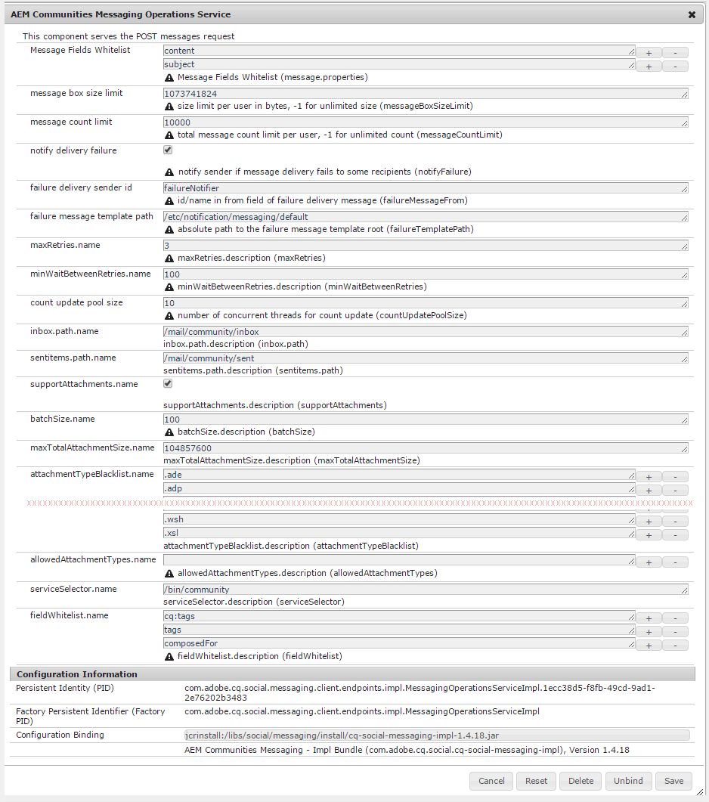

# 配置消息傳遞{#configuring-messaging}

## 概覽 {#overview}

AEM Communities的訊息功能可讓登入網站訪客（成員）彼此傳送訊息，當登入網站時，這些訊息可供存取。

在[社區站點建立](sites-console.md)期間選中框，可為社區站點啟用消息傳遞。

本頁提供有關預設配置和可能調整的資訊。

如需開發人員的詳細資訊，請參閱[Messaging Essentials](essentials-messaging.md)。

## 消息傳遞操作服務{#messaging-operations-service}

[AEM Communities Messaging Operations Service](http://localhost:4502/system/console/configMgr/com.adobe.cq.social.messaging.client.endpoints.impl.MessagingOperationsServiceImpl)可識別處理訊息相關要求的端點、服務應用來儲存訊息的資料夾，以及如果訊息可能包含檔案附件，允許使用哪些檔案類型。

對於使用[Communities Sites控制台](sites-console.md)建立的社區站點，服務實例已存在，收件箱設定為`/mail/community/inbox`。

### 社區消息服務{#community-messaging-operations-service}

如下所示，對於使用[站點建立嚮導](sites-console.md)建立的站點，存在服務配置。 選取設定旁的鉛筆圖示，即可檢視或編輯設定：

### 新配置{#new-configuration}

要添加新配置，請選擇服務名稱旁邊的加號「**+**」表徵圖：

* **[!UICONTROL 消息欄位]**
允許清單指定合成消息元件用戶可以編輯和保存的屬性。如果新增了表單元素，則需要新增元素ID，才能儲存在SRP中。 預設為兩個項目： 
*主* 題和 *內容*。

* **[!UICONTROL 消息框大]**
小限制每個用戶消息框中的最大位元組數。預設值為 
*1073741824* (1 GB)。

* **[!UICONTROL 訊息計數]**
限制每位使用者允許的訊息總數。值-1表示允許的消息數不限，但須受消息框大小限制。 預設值為 
*10000* (10k)。

* **[!UICONTROL 通知傳送]**
失敗如果勾選，則在某些收件者無法傳送訊息時通知傳送者。預設值為 
*已勾選*.

* **[!UICONTROL 失敗傳送傳送]**
者id傳送失敗訊息中顯示之傳送者名稱。預設值為 
*failureNotifier*。

* **[!UICONTROL 失敗消息模]**
板路徑傳遞失敗消息模板根的絕對路徑。預設值為 
*/etc/notification/messaging/default*。

* **[!UICONTROL maxRetries.]**
name嘗試重新傳送失敗訊息的次數。預設值為 
*3*.

* **[!UICONTROL minWaitBetweenRetries.]**
name嘗試在無法傳送時重新傳送訊息之間等待的秒數。預設值為*100 *（秒）。

* **[!UICONTROL 計數更新池]**
大小用於計數更新的併發線程數。預設值為 
*10*.

* **[!UICONTROL inbox.path.name]**
(
*必要*)相對於使用者節點(/home/users/*username*)的路徑，用於資料 **`inbox`** 夾。路徑不能以尾隨正斜線&#39;/&#39;結束。 預設值為&#x200B;*/mail/inbox*。

* **[!UICONTROL sentitems.path.name]**
(
*必要*)相對於使用者節點(/home/users/*username*)的路徑，用於資料 **`senditems`** 夾。路徑不能以尾隨正斜線&#39;/&#39;結束。 預設值為&#x200B;*/mail/sentitems*。

* **[!UICONTROL supportAttachments.]**
name如果選中，用戶可以將附件添加到其郵件中。預設值為 
*已勾選*.

* **[!UICONTROL batchSize.]**
name傳送給大量收件者時，要一起批次傳送的訊息數。預設值為 
*100*.

* **[!UICONTROL maxTotalAttachmentSize.]**
name如果勾選supportAttachments，此值會指定所有附件的最大允許總大小（以位元組為單位）。預設值為 
*104857600* (100 MB)。

* **[!UICONTROL attachmentTypeBlocklist.]**
name副檔名的區塊清單，前置詞為&#39;
**。**&#x200B;被制度拒絕。如果未列出阻止，則允許擴展。 可以使用「**+**」和「**-**」表徵圖添加或移除擴展。 預設值為&#x200B;*DEFAULT*。

* **[!UICONTROL allowedAttachmentTypes.name]**

   **(需&#x200B;*要操作*)** 檔案副檔名的允許清單，與塊清單相反。要允許除列出的塊外的所有檔案副檔名，請使用「**-**」表徵圖刪除單個空條目。

* **[!UICONTROL serviceSelector.name]**
(*必要*)調用服務的絕對路徑（端點）（虛擬資源）。所選路徑的根必須包含在OSGi配置&#x200B;**[的「執行路徑」配置設定中，例如`Apache Sling Servlet/Script Resolver and Error Handler`、](http://localhost:4502/system/console/configMgr/org.apache.sling.servlets.resolver.SlingServletResolver)和`/bin/`。 `/apps/``/services/`要為站點的消息功能選擇此配置，此端點將作為`Message List and Compose Message components`的&#x200B;**`Service selector`**&#x200B;值提供（請參見[消息功能](configure-messaging.md)）。 預設值為&#x200B;*/bin/messaging*。

* **[!UICONTROL fieldAllowlist.]**
nameUse 
**消息欄位允許清單**。

>[!CAUTION]
>
>每次開啟`Messaging Operations Service`配置進行編輯時，如果`allowedAttachmentTypes.name`已被刪除，則會重新添加一個空條目以使屬性可配置。 單個空條目有效地禁用檔案附件。
>
>要允許除列出的塊外的所有檔案副檔名，請使用「**-**」表徵圖刪除單個空條目，然後再按一下「保存」。****

## 疑難排解 {#troubleshooting}

疑難排解問題的一種方式是啟用日誌中的[調試消息。](../../help/sites-administering/troubleshooting.md)

另請參閱[個別服務的記錄程式和寫入程式](../../help/sites-deploying/configure-logging.md#loggers-and-writers-for-individual-services)。

要監視的軟體包為`com.adobe.cq.social.messaging`。
