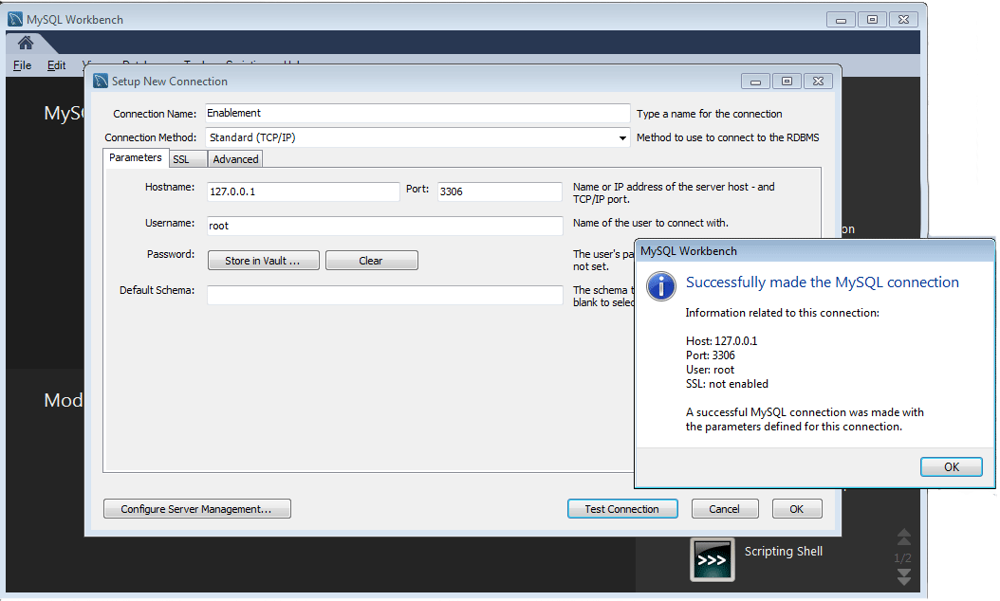

# MySQL啟用功能配置{#mysql-configuration-for-enablement-features}

MySQL是關係型資料庫，主要用於SCORM追蹤和報告資料，以利啟用資源。 包含其他功能的表格，例如追蹤視訊暫停／繼續。

這些說明說明如何連接到MySQL伺服器、建立啟用資料庫，以及使用初始資料填充資料庫。

## 要求{#requirements}

在配置MySQL for Communities啟用功能之前，請務必

* 安裝[MySQL Server](https://dev.mysql.com/downloads/mysql/) Community Server 5.6版
   * SCORM不支援5.7版
   * 可能與作者實例相同的服AEM務器
* 在所AEM有實例上，安裝MySQL的正式[JDBC驅動程式](deploy-communities.md#jdbc-driver-for-mysql)
* 安裝[MySQL工作台](https://dev.mysql.com/downloads/tools/workbench/)
* 在所AEM有實例上，安裝[SCORM軟體包](enablement.md#scorm)

## 安裝MySQL {#installing-mysql}

MySQL應按照目標OS的說明下載並安裝。

### 小寫表名{#lower-case-table-names}

由於SQL不區分大小寫，因此對於區分大小寫的作業系統，必須包含將所有表名都小寫的設定。

例如，要在Linux OS上指定所有小寫表名：

* 編輯檔案`/etc/my.cnf`
* 在`[mysqld]`節中，添加以下行：
   `lower_case_table_names = 1`

### UTF8字元集{#utf-character-set}

為提供更佳的多語言支援，必須使用UTF8字元集。

將MySQL更改為以UTF8作為其字元集：
* mysql> SET NAMES &#39;utf8&#39;;

將MySQL資料庫變更為預設為UTF8:
* 編輯檔案`/etc/my.cnf`
* 在`[client]`節中，添加以下行：
   `default-character-set=utf8`
* 在`[mysqld]`節中，添加以下行：
   `character-set-server=utf8`

## 安裝MySQL Workbench {#installing-mysql-workbench}

MySQL Workbench提供了一個UI，用於執行安裝模式和初始資料的SQL指令碼。

MySQL Workbench應按照目標OS的說明下載並安裝。

## 啟用連接{#enablement-connection}

當MySQL工作台首次啟動時（除非已用於其他用途），它將不顯示任何連接：

### 新的連接設定{#new-connection-settings}

1. 選擇`MySQL Connections`右側的&#39;+&#39;圖示。
1. 在對話框`Setup New Connection`中，輸入適合您平台的值以進行演示，作者實例和MySQL位AEM於同一伺服器上：
   * 連接名稱：`Enablement`
   * 連接方法：`Standard (TCP/IP)`
   * 主機名：`127.0.0.1`
   * 使用者名稱: `root`
   * 密碼: `no password by default`
   * 預設方案：`leave blank`
1. 選擇`Test Connection`以驗證到正在運行的MySQL服務的連接

**附註**:

* 預設埠為`3306`
* 在[JDBC OSGi配置](#configure-jdbc-connections)中輸入`Connection Name`作為`datasource`名稱

#### 成功連接{#successful-connection}

#### 新啟用連接{#new-enablement-connection}

## 資料庫設定{#database-setup}

開啟新的啟用連線時，請注意有測試架構和預設使用者帳戶。

### 獲取SQL指令碼{#obtain-sql-scripts}

SQL指令碼是使用作者實例上的CRXDE Lite獲取的。 必須安裝[SCORM軟體包](deploy-communities.md#scorm):

1. 瀏覽至CRXDE Lite
   * 例如，[http://localhost:4502/crx/de](http://localhost:4502/crx/de)
1. 展開`/libs/social/config/scorm/`資料夾
1. 下載 `database_scormengine.sql`
1. 下載 `database_scorm_integration.sql`

下載架構的方法之一是

* 為sql檔案選擇`jcr:content`節點
* 請注意，`jcr:data`屬性的值是視圖連結
* 選取檢視連結，將資料儲存至本機檔案

### 建立SCORM資料庫{#create-scorm-database}

要建立的啟用SCORM資料庫是：

* 名稱: `ScormEngineDB`
* 從指令碼建立：
   * 結構描述: `database_scormengine.sql`
   * 資料：`database_scorm_integration.sql`
請遵循下列步驟(
[open](#step-open-sql-file),  [execute](#step-execute-sql-script))來安裝每 [個SQL指令碼](#obtain-sql-scripts) 。[視需](#refresh) 要重新整理，以查看指令碼執行的結果。

請務必先安裝架構，然後再安裝資料。

>[!CAUTION]
>
>如果資料庫名稱已更改，請務必在
>
>* [JDBC配置](#configure-jdbc-connections)
>* [SCORM設定](#configure-scorm)

>

#### 步驟1:開啟SQL檔案{#step-open-sql-file}

在MySQL工作台中

* 從「檔案」下拉菜單
* 選取 `Open SQL Script ...`
* 按此順序，選擇以下選項之一：
   1. `database_scormengine.sql`
   1. `database_scorm_integration.sql`

#### 步驟2:執行SQL指令碼{#step-execute-sql-script}

在步驟1中開啟的檔案的「工作台」窗口中，選擇`lightening (flash) icon`以執行指令碼。

請注意，`database_scormengine.sql`指令碼建立SCORM資料庫可能需要一分鐘的時間才能完成。

#### 重新整理 {#refresh}

執行指令碼後，需要刷新`Navigator`的`SCHEMAS`部分才能查看新資料庫。 使用「方案」右側的刷新表徵圖：

#### 結果：scormenginedb {#result-scormenginedb}

安裝和刷新SCHEMAS後，將顯示&#x200B;**`scormenginedb`**。

## 配置JDBC連接{#configure-jdbc-connections}

**Day Commons JDBC連接池**&#x200B;的OSGi配置配置MySQL JDBC驅動程式。

所有發佈和作AEM者實例都應指向相同的MySQL伺服器。

當MySQL在與不同的伺服器上運行時AEM，必須在JDBC連接器中指定伺服器主機名來代替「localhost」（該連接器填充[ScormEngine](#configurescormengineservice)配置）。

* 在每個作者和發佈例AEM項上
* 以管理員權限登入
* 訪問[Web控制台](../../help/sites-deploying/configuring-osgi.md)
   * 例如，[http://localhost:4502/system/console/configMgr](http://localhost:4502/system/console/configMgr)
* 找到`Day Commons JDBC Connections Pool`
* 選擇`+`表徵圖以建立新配置

* 輸入下列值：
   * **[!UICONTROL JDBC驅動程式類]**:  `com.mysql.jdbc.Driver`
   * **DBC連接URIJ**: `jdbc:mysql://localhost:3306/aem63reporting` 如果MySQL伺服器與&#39;this&#39;伺服器不相同，則指定伺服器代替localhost AEM
   * **[!UICONTROL 使用者名稱]**:為MySQL伺服器輸入已配置的Root用戶名（如果不是「root」）
   * **[!UICONTROL 密碼]**:如果未為MySQL設定口令，請清除此欄位，否則，請輸入MySQL用戶名的配置口令
   * **[!UICONTROL 資料來源名稱]**:為 [MySQL連接輸入的名稱](#new-connection-settings)，例如「啟用」
* 選擇&#x200B;**[!UICONTROL 保存]**

## 配置Scorm {#configure-scorm}

### AEM CommunitiesScormEngine服務{#aem-communities-scormengine-service}

**AEM CommunitiesScormEngine服務**&#x200B;的OSGi配置將SCORM配置為啟用社區使用MySQL伺服器。

當安裝[SCORM軟體包](deploy-communities.md#scorm-package)時，此配置即存在。

所有發佈和作者實例都指向同一個MySQL伺服器。

當MySQL在與不同的伺服器上運行時AEM，必須在ScormEngine服務中指定伺服器主機名，而ScormEngine服務通常從[JDBC連接](#configure-jdbc-connections)配置中填充。

* 在每個作者和發佈例AEM項上
* 以管理員權限登入
* 訪問[Web控制台](../../help/sites-deploying/configuring-osgi.md)
   * 例如，[http://localhost:4502/system/console/configMgr](http://localhost:4502/system/console/configMgr)
* 找到`AEM Communities ScormEngine Service`
* 選取編輯圖示
   
* 驗證以下參數值是否與[JDBC Connection](#configurejdbcconnectionspool)配置一致：
   * **[!UICONTROL JDBC連接URI]**: `jdbc:mysql://localhost:3306/ScormEngineDB` ** ScormEngineDB是SQL指令碼中的預設資料庫名
   * **[!UICONTROL 使用者名稱]**:為MySQL伺服器輸入已配置的Root用戶名（如果不是「root」）
   * **[!UICONTROL 密碼]**:如果未為MySQL設定口令，請清除此欄位，否則，請輸入MySQL用戶名的配置口令
* 關於下列參數：
   * **[!UICONTROL Scorm使用者密碼]**:不要編輯

      僅供內部使用。 它是供AEM Communities使用的特殊服務用戶與Scorm引擎通信。
* 選擇&#x200B;**[!UICONTROL 保存]**

### Adobe花崗岩CSRF濾鏡{#adobe-granite-csrf-filter}

為確保啟用課程在所有瀏覽器中都能正常運作，必須將Mozilla新增為未經CSRF篩選器勾選的使用者代理。

* 在每個發佈例AEM項上
* 以管理員權限登入
* 訪問[Web控制台](../../help/sites-deploying/configuring-osgi.md)
   * 例如，[http://localhost:4503/system/console/configMgr](http://localhost:4503/system/console/configMgr)
* 找到`Adobe Granite CSRF Filter`
* 選取編輯圖示
   
* 選擇`[+]`表徵圖以添加安全用戶代理
* 輸入`Mozilla/*`
* 選擇&#x200B;**[!UICONTROL 保存]**

