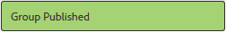

# 編寫嵌套組{#authoring-nested-groups}

## 在作者上建立群組{#creating-groups-on-author}

在作者上，從全域導覽

* 選擇&#x200B;**[!UICONTROL Communities > Sites]**
* 選擇&#x200B;**[!UICONTROL 參與資料夾]**&#x200B;以開啟它
* 選擇&#x200B;**[!UICONTROL 快速入門教程]**&#x200B;英文站點的卡
   * 選取卡片影像
   * 選擇&#x200B;*not*&#x200B;表徵圖

結果是到達[群組控制台](groups.md):

群組函式會顯示為資料夾，其中會建立群組的例項。 選擇「組」資料夾以開啟它。 在發佈時建立的群組可見。

## 建立主要藝術組{#create-main-arts-group}

可以建立此組，因為參與的站點結構包括組功能。 站點的`Reference Template`中函式的配置預設為允許選擇任何已啟用的組模板。 因此，為此新組選擇的模板將是`Reference Group`。

這些主控台與Communities Sites主控台非常類似。

* 選擇&#x200B;**[!UICONTROL 建立組]**
* `1 Community Group Template`:
   * 社群群組標題：藝術
   * 社區組描述：不同藝術團體的父團體。
   * 社區組根：*保留為預設*
   * 其他可用的社區組語言：使用下拉菜單選擇可用的社區組語言。 功能表會顯示建立父社群網站的所有語言。 使用者可在這些語言中選取，以在這個單一步驟中建立多個地區設定中的群組。 系統會在個別社群網站的群組控制台中，以多種指定語言建立相同的群組。
   * 社區組名稱：藝術
   * 範本：下拉選擇`Reference Group`
   * 選取 `Next`

      

繼續使用下列設定瀏覽其他面板：

* **2設計**
   * 您可以變更設計或允許預設為父網站的設計
   * 選擇&#x200B;**[!UICONTROL Next]**
* **3設定**
   * **審核**
      * 保留為空（繼承自父站點）
   * **成員資格**
      * 使用預設`Optional Membership`
   * **縮圖**
      * `optional`
   * 選取 `Next`
* 選擇&#x200B;**[!UICONTROL 建立]**

### 藝術組{#nesting-groups-within-arts-group}中的嵌套組

`groups`資料夾現在應包含兩個群組（可能需要重新整理頁面）。

#### 發佈群組 {#publish-group}

在`arts`群組內建立巢狀群組之前，請將滑鼠指標暫留在`arts`卡片上，並選取發佈圖示加以發佈。

等待群組已發佈的確認。

`arts`組還應包含`groups`資料夾，但該資料夾為空，可在其中建立新組。 導覽至藝術群組資料夾，並建立3個巢狀群組，每個群組具有不同的成員資格設定：

1. 視覺
   * 標題: `Visual Arts`
   * 名稱: `visual`
   * 範本: `Reference Group`
   * 會籍：選擇`Optional Membership`
公開群組，開放給所有成員
1. 聽覺
   * 標題: `Auditory Arts`
   * 名稱: `auditory`
   * 範本: `Reference Group`
   * 會籍：選擇`Required Membership`
一個開放的組，可供成員加入

1. 歷史

   * 標題: `Art History`
   * 名稱: `history`
   * 範本: `Reference Group`
   * 會籍：選擇`Restricted Membership`
秘密組（僅對受邀成員可見，例如，邀請） 
[示範使用者](tutorials.md#demo-users) `emily.andrews@mailinator.com`

重新整理頁面以查看所有三個巢狀群組（子社群）。

如有必要，請從Communities Sites控制台導覽至巢狀群組：

* 選擇&#x200B;**[!UICONTROL 參與資料夾]**
* 選擇&#x200B;**[!UICONTROL 快速入門教程]**&#x200B;卡
* 選擇&#x200B;**[!UICONTROL 組資料夾]**
* 選擇&#x200B;**[!UICONTROL arts card]**
* 選擇&#x200B;**[!UICONTROL 組資料夾]**

## 發佈群組{#publishing-groups}

發佈主要社群網站後，必須

* 個別發佈每個群組
   * 等待群組已發佈的確認
* 發佈內嵌的任何群組之前先發佈父群組
   * 所有群組都必須以由上而下的方式發佈。

## 發佈體驗{#experience-on-publish}

登入時，可能會體驗不同的群組，例如使用[示範使用者](tutorials.md#demo-users)

* 藝術/歷史組成員：emily.andrews@mailinator.com
   * 受限（秘密）組，藝術/歷史，將可見
   * 可以看到選用（公開）群組
   * 可以加入受限制（開啟）組
* 群組管理員：aaron.mcdonald@mailinator.com
   * 可以看到選用（公開）群組
   * 可以加入受限制（開啟）組
   * 不會看到受限（秘密）群組

在作者上存取Communities [Members and Groups控制台](members.md)，以將其他使用者新增至與社群群組相對應的各種成員群組。
