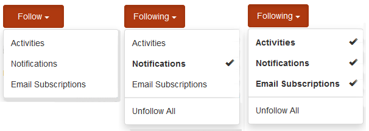

# 社群通知 {#communities-notifications}

## 概覽 {#overview}

AEM Communities提供通知區段，可顯示已登入社群成員感興趣的事件。

通知與活動 [和](essentials-activities.md)[訂閱類](subscriptions.md) 似，因為

* 發佈內容的成員
* 選擇跟隨另一個成員的成員
* 選擇遵循特定主題、文章和其他內容主題的成員

通知與活動和訂閱的區別在於

* 通知區段的連結永遠會出現在社群網站的標題中
   * 活動需 [要將活動流功能](functions.md#activity-stream-function) ，納入社群網站的結構
   * 訂閱需要 [設定電子郵件](email.md)
* 通知的實作是透過可擴充和可插拔的通道
   * 活動僅在Web上提供
   * 訂閱僅能使用電子郵件

自Communities [FP1起](deploy-communities.md#latestfeaturepack)，可用的通知渠道為

* 使用連結存取的網路頻 `Notifications` 道
* 電子郵件通道，在正確設定電子郵件時可用

未來的通道包括行動和案頭。

### 需求 {#requirements}

**設定電子郵件**

必須設定電子郵件，才能讓電子郵件通路正常運作。

如需設定電子郵件的指示，請參閱 [設定電子郵件](analytics.md)。

**啟用追蹤**

必須配置元件以啟用以下功能。 允許以下功能：部落格 [、論壇](blog-feature.md)、 [QnQnPn](forum.md)、Filary [brary、elicary行事歷、](working-with-qna.md)elicary注釋。

請注意，

* 社群網站範本 [和群組範本](sites.md)[中使用的元件](tools-groups.md) ，可能已設定為允許下列項目：

* 成員配置檔案已配置為允許其他成員遵循

## 來自下列的通知 {#notifications-from-following}

「跟 **蹤** 」按鈕提供了一種方法，可以跟蹤條目作為活動、訂閱和／或通知。 每次選取「 **跟隨** 」按鈕時，都可以開啟或關閉選取範圍。 只有 `Email Subscriptions` 在配置時，才會顯示選擇。

如果選取任何下列方法，按鈕的文字會變更為「下 **列」**。 為方便起見，您可以選取以 `Unfollow All` 關閉所有方法。

將出 **現** 「跟蹤」按鈕

* 查看其他成員的配置檔案時
* 在主要功能頁面上，例如論壇、QnA和部落格
   * 遵循該一般功能的所有活動
* 針對特定項目，例如論壇主題、QnA問題或部落格文章
   * 跟蹤該特定條目的所有活動

## 管理通知設定 {#managing-notification-settings}

從「通知」頁面選擇「通知設定」連結，可讓每個成員管理接收通知的方式。

Web頻道一律啟用。

電子郵件渠道依賴於電子郵件的 [正確配置](email.md)，它提供與Web渠道相同的設定。

電子郵件頻道預設為關閉。

成員可以開啟它，但仍取決於正在配置的電子郵件。

## 檢視通知 {#viewing-notifications}

### 網頁通知 {#web-notifications}

建 [立社群網站的精靈](sites-console.md) ，現在會在橫幅上 `Notifications` 方的網站標題列中包含功能的連結。 與訊息不同的是，會為每個社群網站建立通知，而訊息必須在網站建立程式中啟用。

在造訪發佈網站時，選取連結 `Notifications` 會顯示成員的所有通知。

### 電子郵件通知 {#email-notifications}

啟用電子郵件頻道後，會員會收到電子郵件，其中包含網路內容的連結。

