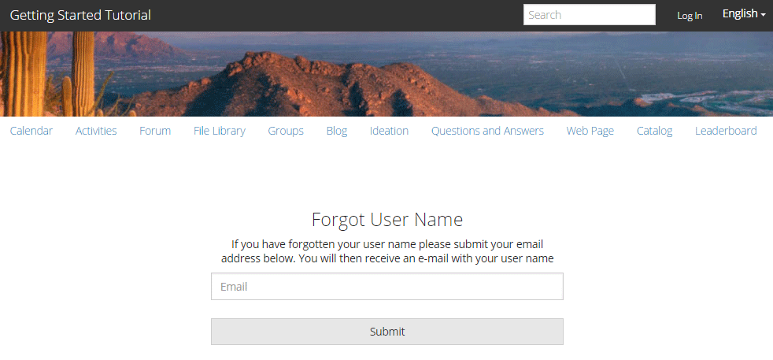

# 體驗發佈網站{#experience-the-published-site}

## 瀏覽至發佈時的新網站{#browse-to-new-site-on-publish}

現在新建立的社群網站已經發佈，請瀏覽至建立網站時顯示的URL，但瀏覽至發佈伺服器，例如

* 作者URL = http://localhost:4502/content/sites/engage/en.html
* 發佈URL = http://localhost:4503/content/sites/engage/en.html

為了盡量避免使用者在作者和發佈上登入哪些會員的混淆，建議針對每個例項使用不同的瀏覽器。

首次到達發佈網站時，網站訪客通常尚未登入，且是匿名的。

## http://localhost:4503/content/sites/engage/en.html {#http-localhost-content-sites-engage-en-html}

## 匿名網站訪客{#anonymous-site-visitor}

匿名網站訪客在UI中會看到下列內容：

* 網站的標題。 哪些是快速入門教學課程
* 無描述檔連結
* 無消息連結
* 無通知連結
* 沙爾奇場
* 登入連結
* 品牌橫幅
* 「參考站點模板」中包含的元件的菜單連結

如果您選取各種連結，您會發現這些連結是唯讀模式。

## 防止對JCR {#prevent-anonymous-access-on-jcr}的匿名訪問

已知限制會透過jcr內容和json將社群網站內容公開給匿名訪客，但&#x200B;**允許匿名存取**&#x200B;會停用網站內容。 不過，這個行為可以使用Sling Restrictions做為因應措施加以控制。

若要保護您的社群網站內容不受匿名使用者透過jcr內容和json存取，請遵循下列步驟：

1. 在「AEM作者」例項上，請前往https://&lt;host>:&lt;port>/editor.html/content/site/&lt;sitename>.html。

   >[!NOTE]
   >
   >請勿前往本地化網站。

1. 前往&#x200B;**[!UICONTROL 頁面屬性]**。

   

1. 轉至「**[!UICONTROL 高級]**」頁籤。

   

1. 啟用&#x200B;**[!UICONTROL 驗證要求]**。
1. 新增登入頁面的路徑。 例如，`/content/......./GetStarted`。
1. 發佈頁面。

## 受信任的社區成員{#trusted-community-member}

本體驗假設[Aaron McDonald](tutorials.md#demo-users)被指派為[社群經理和協調者](create-site.md#roles)的角色。 如果沒有，請返回作者環境以[修改站點設定](sites-console.md#modifying-site-properties)並選擇Aaron McDonald作為社區經理和協調者。

在右上角，選擇`Log in`，並使用使用者名稱&quot;aaron.mcdonald@mailinator.com&quot;和密碼&quot;password&quot;簽名。 請注意，使用Twitter或Facebook認證登入的能力。

登入後，請注意會出現新的功能表項目`Administration`，因為會員被賦予協調者角色。 現在，選取各種連結會更有趣。

請注意，「日曆」頁面是首頁，因為選擇的「參考網站範本」會先包含「日曆」功能，接著是「活動串流」功能、「論壇」功能等。 此結構可從[網站範本](sites.md#edit-site-template)控制台或在作者環境中修改網站屬性時顯示：

>[!NOTE]
>
>有關Communities元件和功能的詳細資訊，請造訪
>
>* [社群元件](author-communities.md) （適用於作者）
>* [元件、功能和功能基本工具](essentials.md) （適用於開發人員）

>

## 論壇連結{#forum-link}

選擇「論壇」連結，以檢視基本論壇功能。

成員可以發佈新主題或關注主題。

網站訪客可以檢視貼文，並以多種方式加以排序。

## 群組連結{#groups-link}

由於Aaron是群組管理員，選擇「群組」連結可讓Aaron透過選擇群組範本、影像、群組是開啟還是機密，以及邀請成員來建立新的社群群組。

這是在發佈環境中建立群組的範例。

群組也可以在作者環境中建立，並在作者環境的社群網站中管理（[社群群組主控台](groups.md)）。 本教學課程提供[在author](nested-groups.md)上建立群組的經驗。

建立參考群組：

1. 選擇&#x200B;**[!UICONTROL 新建組]**
1. **[!UICONTROL 「設定」頁籤]**
   * 群組名稱: `Sports`
   * 說明: `A parent group for various sporting groups`
   * 群組 URL 名稱: `sports`
   * 選擇`Open Group`（允許任何社區成員通過加入參與）
1. **[!UICONTROL 範本標籤]**
   * 選擇`Reference Group`（在其結構中包含組函式以允許嵌套組）
1. 選擇&#x200B;**[!UICONTROL 建立組]**

建立新群組後，**選取新的運動群組**，以便在其中建立兩個群組（巢狀）。 由於網站結構無法以群組功能開始，因此在開啟「運動」群組後，必須選取「群組」連結：

以`Blog`開頭的第二組連結屬於當前選定的組`Sports`組。 選取「運動」(Sports)`Groups`連結，即可在「運動」(Sports)群組內巢狀內嵌兩個群組。

例如，新增兩個n `ew groups.`

* 一個名為`Baseball`
   * 將其設為`Open Group`（必要會籍）
   * 在「模板」頁籤上，選擇`Conversational Group`
* 一個名為`Gymnastics`
   * 將其設定變更為`Member Only Group`（限制會籍）
   * 在「模板」頁籤上，選擇`Conversational Group`

**注意**:

* 在顯示兩個群組之前，可能需要重新整理頁面
* 此範本不*not *include the groups function，因此將無法再巢狀化群組
* 在作者身上，[Groups console](groups.md)提供第三種選擇- a `Public Group`（選擇性會籍）

建立兩個群組後，請選取「棒球」群組、開啟的群組，並注意其連結：`Discussions` `What's New` `Members`
群組的連結會顯示在主網站的連結下方，並產生下列顯示：

在作者上——具有管理權限，導航至[Communities Groups控制台](members.md)，並將Weston McCall添加到`Community Engage Gymnastics <uid> Members`組。

繼續發佈時，以Aaron McDonald的身分登出，並以匿名網站訪客的身分檢視運動群組：

* 從首頁
* 選擇`Groups`link
* 選擇`Sports`link
* 選擇「運動」`Groups`連結

只會顯示棒球群組。

以Weston McCall(weston.mccall@dodgit.com /密碼)的身分登入，並導覽至相同的位置。 請注意，Weston能夠`Join`開啟的`Baseball`群組，以及`enter or Leave`私人`Gymnastics`群組。

## 網頁連結{#web-page-link}

選取「網頁」連結，即可檢視網站所包含的基本網頁。 標準的AEM製作工具可用來在作者環境中將內容新增至此頁面。

例如，前往&#x200B;**author**&#x200B;例項，在[Communities Sites控制台](sites-console.md)中開啟`engage`資料夾，選取&#x200B;**Open Site**&#x200B;圖示以進入作者編輯模式。 然後選擇預覽模式以選擇`Web Page`連結，然後選擇編輯模式以添加標題和文本元件。 最後，只重新發佈頁面或整個網站。

## 管理連結{#administration-link}

當社群成員具有協調權限時，「管理」連結將會顯示，並選取它將顯示張貼的社群內容，並允許其以類似於作者環境中[協調控制台](moderation.md)的方式進行[協調](moderate-ugc.md)。

使用瀏覽器的「上一步」按鈕可返回已發佈的網站。 在發佈環境中，大多數控制台都無法從全局導航訪問。

## 自助註冊{#self-registration}

登出後，可建立新的使用者註冊。

* 選取 `Log In`
* 選取 `Sign up for a new account`

 

依預設，電子郵件地址為登入ID。 若未勾選，訪客可輸入其專屬的登入ID（使用者名稱）。 使用者名稱在發佈環境中必須是唯一的。

在指定使用者名稱、電子郵件和密碼後，選取`Sign Up`將會建立使用者並讓他們簽名。

登入後，第一個顯示的頁面是其`Profile`頁面，可供個人化。

如果成員忘記其登錄ID，則可以使用其電子郵件地址進行恢復。

