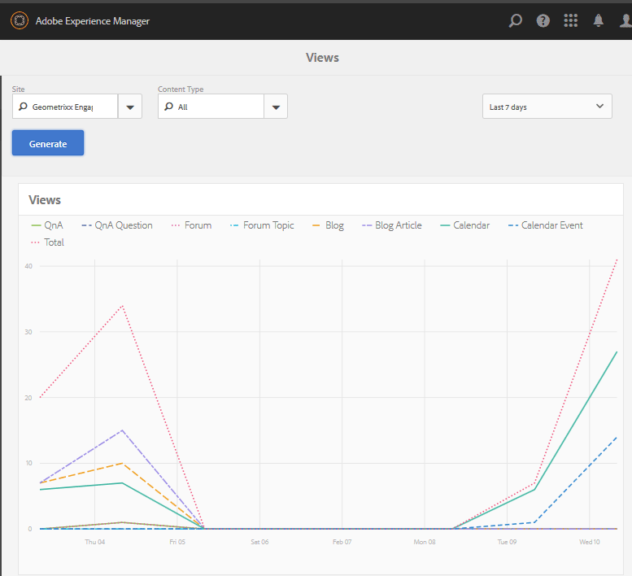

# 報表主控台 {#reports-console}

## 概覽 {#overview}

對於AEM Communities，有多種報表可透過數種方式從作者環境存取。

一般而言，各種報表包括：

* [工作報表](#assignments-report) -針對啟用 [社群](overview.md#enablement-community)，提供學員在其工作上的進度概觀，包括在實作SCORM標準時的相關分數
* [檢視報表](#views-report) -提供任何社群網站的社群成員和網站訪客的內容檢視圖表
* [貼文報表](#posts-report) -提供社群成員張貼至任何社群網站的各種貼文類型圖表

啟用 [Adobe Analytics後](sites-console.md#analytics)，報表將包含一段時間內每個啟用資源的檢視次數、播放次數、留言和評分

表格報表可匯出為。csv格式，以供後續處理。

## 報告控制台 {#reporting-consoles}

### 社群網站的報表 {#reports-for-community-sites}

* 從全域導覽： **[!UICONTROL 導覽>社群>報表]**
* 從
   * **[!UICONTROL 指定任務報表]**
      * 為選定的社區站點、用戶或組和分配生成報告
   * **[!UICONTROL 貼文報表]**
      * 為選取的社群網站、內容類型和時段產生報表
   * **[!UICONTROL 檢視報表]**
      * 為選取的社群網站、內容類型和時段產生報表
         

### 啟用資源和學習路徑的報表 {#reports-for-enablement-resources-and-learning-paths}

* 從全域導覽： **[!UICONTROL 導覽>社群>資源]**
* 選取現有的啟用社群網站
   * 選擇 **[!UICONTROL 報表圖示]** ，以產生涵蓋所有啟用資源的報表
   * 選擇啟用學習路徑
   * 選取 **[!UICONTROL 報表圖示]** ，以產生報表
      * 隨附的啟用資源
      * 指派給學習路徑的學員
* 這些報告提供：
   * 表格資料，可下載為CSV
      * 識別學員
      * 他們的狀態
      * 是指派或透過目錄存取
      * 留言數
      * 指定星級

如需詳細資訊，請參 [閱「資源](resources.md#report) 」主控台的「報表」區段。

## 指定任務報表 {#assignments-report}

「工作總管」可讓報表依啟用社群網站、使用者或群組以及工作來篩選。

報告提供有關其進度的資訊，以及所提供的任何意見或評分。

選擇報表的標準：

* **[!UICONTROL 網站]**&#x200B;選擇啟用社群網站
* **[!UICONTROL 使用者或群組]**
   * 選擇「使用者」以產生一個學員的報表
   * 選擇「群組」以產生學員群組的報表通道服務將從發佈環境存取成員和成員群組
* **[!UICONTROL 指派]**&#x200B;從指派給所選學員的啟用資源中選擇

選擇 **[!UICONTROL 生成]** ，建立報表：

## 檢視報表 {#views-report}

「檢視」控制台可讓報表在指定時段內，依社群功能在頁面檢視時產生。

選擇報表的標準：

* **[!UICONTROL 網站]**&#x200B;選擇社群網站
* **[!UICONTROL 內容類]**&#x200B;型可以選擇「所有內容」，或選擇網站上存在的功能之一
* 時間範圍選擇以下選項之一：
   * 過去 7 天
   * 過去 30 天
   * 過去 90 天
   * 去年

選擇 **[!UICONTROL 生成]** ，建立報表：

## 貼文報表 {#posts-report}

「貼文」控制台可讓您針對特定時段內社群功能的貼文數產生報表。

選擇報表的標準：

* **[!UICONTROL 網站]**&#x200B;選擇社群網站
* **[!UICONTROL 內容類]**&#x200B;型可以選擇「所有內容」，或選擇網站上存在的功能之一
* 時間範圍選擇以下選項之一：
   * 過去 7 天
   * 過去 30 天
   * 過去 90 天
   * 去年

選擇 **[!UICONTROL 生成]** ，建立報表：

## 疑難排解 {#troubleshooting}

### 未列出社群網站 {#no-community-sites-listed}

如果未列出社群網站，請確定已為網站啟用Adobe Analytics。 如果選擇分配報告，請確保分配功能位於社區站點的結構中。
