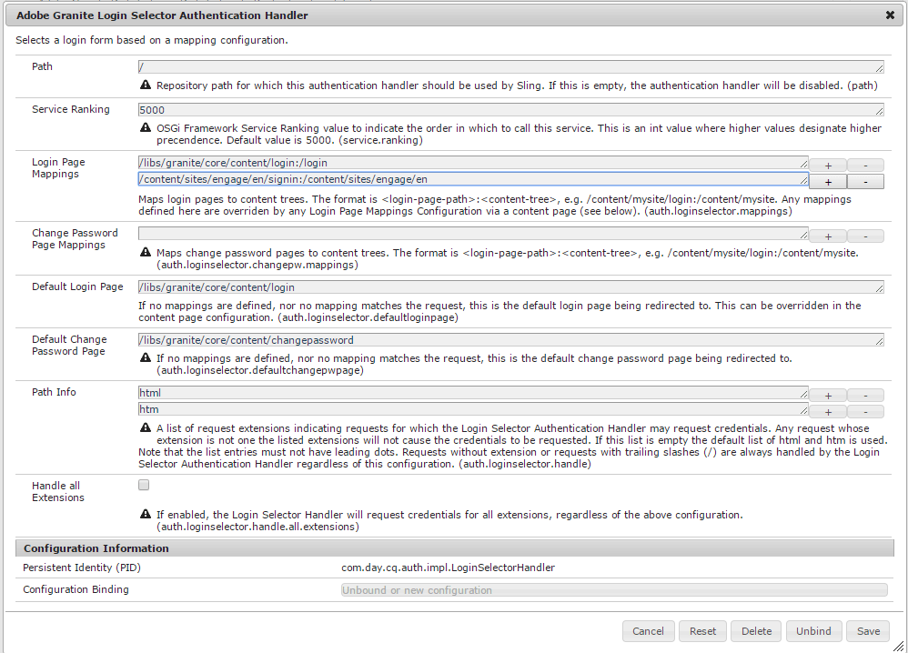

# Communities Sites Console {#communities-sites-console}

Communities Sites控制台可讓您存取：

* 網站建立
* 網站編輯
* 網站管理
* [建立和編輯巢狀群組](groups.md) （子社群）

請參 [閱AEM Communities快速入門](getting-started.md) ，體驗在作者環境中建立社群網站的速度，以及如何從作者和發佈環境建立社群群組。

>[!NOTE]
>
>用於建立社區站點的主要「社 [區」菜單](sites-console.md)、 [社區站點模板](sites.md)、社 [區組模板](tools-groups.md) ，以及社區功  能的社區功能僅供作者環境使用。

## 必備條件 {#prerequisites}

在建立社群網站之前，必須 *先* :

* 確定有一或多個發佈例項在執行
* 啟用 [隧道服務](deploy-communities.md#tunnel-service-on-author) ，以管理成員和成員組
* 識別主要 [發行者](deploy-communities.md#primary-publisher)
* [當主發行者埠不是預設埠時](deploy-communities.md#replication-agents-on-author) ，配置複製(4503)

最佳實務是，為確保網站已準備好支援許多功能，請採取下列步驟：

* 安裝最 [新功能包](deploy-communities.md#latestfeaturepack)
* 啟用 [AEM Communities適用的Adobe Analytics](analytics.md)
* 設定電子 [郵件](email.md)
* 識別社 [群管理員](users.md#creating-community-members)
* [啟用社交登入的OAuth處理常式](social-login.md#adobe-granite-oauth-authentication-handler) ,

## 訪問Communities Sites控制台 {#accessing-communities-sites-console}

在作者環境中，要訪問Communities Sites控制台：

* 從全域導覽： **[!UICONTROL 社群>網站]**

「社群網站」主控台會顯示任何現有的社群網站。 在此控制台中，可以建立、編輯、管理和刪除社區站點。

若要建立新社群網站，請選取「建 **立** 」圖示。

若要存取現有社群網站，請為編寫、修改、發佈、匯出或新增巢狀群組之目的，選取網站的檔案夾圖示。

例如，下圖顯示主Communities Sites控制台，顯示兩個社區站點的資料夾： [啟用](getting-started-enablement.md) 並 [吸引](getting-started.md):

## 網站建立 {#site-creation}

網站建立主控台提供逐步方式，根據選取的社群網站範本和設定來組 [合網站](sites.md) 。

每個建立的網站都包含登入功能，因為網站訪客必須先登入才能張貼內容、傳送訊息或參與群組。 其他包含的功能包括使用者設定檔、訊息、通知、網站選單、搜尋、主題和品牌。

通過選擇位於Communities Sites控 `Create` 制台頂部的按鈕，啟動進程。

建立過程是一系列步驟，這些步驟顯示為包含要配置的一組特徵的面板（顯示為子面板）。 在最後一步中提交站 **點之前** ，可以前 **移至** 「下一步」或「返回上一步」。

### 步驟1:網站範本 {#step-site-template}

在「網站範本」面板上，會指定「標題」、「說明」、「網站根」、「基本語言」、「名稱」和「網站範本」:

* **[!UICONTROL 社群網站標題]**:網站的顯示標題。

   標題會出現在已發佈的網站上，也會出現在網站管理員UI中。

* **[!UICONTROL 社群網站說明]**:網站的說明。

   說明不會出現在發佈的網站上。

* **[!UICONTROL 社群網站根]**:網站的根路徑。

   預設根目錄為 `/content/sites`，但根目錄可移至網站內的任何位置。

* **[!UICONTROL 社群網站基本語言]**:（單語言不受影響）英文)使用下拉式選單，從 *可用語言* (德文、義大利文、法文、日文、西班牙文、葡萄牙文（巴西）、中文（繁體）和簡體中文)選擇一或多種基本語言。 會針對新增的每種語言建立一個社群網站，並依照多語言網站翻譯內容中所述的最佳實務，存在於相 [同的網站資料夾中](../../help/sites-administering/translation.md)。 每個網站的根頁面將包含一個子頁面，該子頁面由其中一種語言的語言代碼命名，例如英文的&#39;en&#39;或法文的&#39;fr&#39;。

* **[!UICONTROL 社群網站名稱]**:顯示在URL中的網站根頁面名稱

   * 在建立網站後不易變更名稱，請再檢查此名稱
   * 基本URL( `https://*server:port/site root/site name*)` 將顯示在 `Community Site Name`
   * 若為有效的URL，請附加基本語言代碼+ &quot;。html&quot;

      *例如*, `http://localhost:4502/content/sites/mysight/en.html`

* **[!UICONTROL 社群網站範本]** (Community Site Template)功能表：使用下拉式功能表來選擇可用的社 [群網站範本](tools.md)。

選擇下 **[!UICONTROL 一步]**

### 步驟2:設計 {#step-design}

「設計」面板包含2個子面板，用於選取主題和品牌橫幅：

#### COMMUNITY SITE THEME {#community-site-theme}

此架構使 [用Twitter引導](https://twitterbootstrap.org/) ，為網站提供回應式、有彈性的設計。 可以選擇多個預載入的引導主題之一來設定所選社區站點模板的樣式，或者可以上載引導主題。

選取後，主題將會以不透明的藍色核取標籤覆蓋。

社群網站發佈後，您可以編輯 [屬性](#modifying-site-properties) ，並選取不同的主題。

#### COMMUNITY SITE BRANDING {#community-site-branding}

社群網站品牌是顯示為每個頁面上方標題的影像。

影像的大小應與預期的頁面在瀏覽器中顯示的大小相同，高度應為120像素。

建立或選取影像時，請記住：

* 影像高度會裁切為120像素，從影像的上邊緣測量
* 影像會固定在瀏覽器視窗的左邊緣
* 影像沒有調整大小，因此當影像寬度為……

   * 小於瀏覽器寬度，影像將會水準重複
   * 大於瀏覽器寬度時，影像會看起來會遭到裁切

選擇 **[!UICONTROL 下一步]**。

### 步驟3:設定 {#step-settings}

「設定」面板包含數個子面板，這些子面板會先顯示要設定的功能，然後再移至建立網站的最後一個步驟。

* [使用者管理](#user-management)
* [標籤](#tagging)
* [角色](#roles)
* [協調](#moderation)
* [ANALYTICS](#analytics)
* [翻譯](#translation)
* [啟用](#enablement)

>[!NOTE]
>
>**啟用隧道服務**
>
>數個「設定」子面板可讓受信任成員在發佈環境中協調UGC、管理群組或成為啟用資源的聯絡人。
>
>此約定適用於發佈端使 [用者和使用者群組](users.md) （成員和成員群組）不會在作者環境中複製。
>
>因此，在作者環境中建立社區站點並將受信任成員分配給各種角色時，必須從發佈環境中檢索成員資料。
>
>這是通過為作者環 ` [AEM Communities Publish Tunnel Service](deploy-communities.md#tunnel-service-on-author)`境啟用來實現的。

#### USER MANAGEMENT {#user-management}

>[!NOTE]
>
>建議將啟用社 [群網站私用](overview.md#enablement-community) （如需詳細資訊，請連絡您的帳戶代表）。
>
>當匿名網站訪客被拒絕存取、無法自行註冊且不能使用社交登入時，社群網站是私密的。

* **[!UICONTROL 允許使用者註冊]**

   如果勾選，網站訪客可能會透過自行註冊成為社群成員。

   如果未勾選，則會限制社群網 *站* ，且必須將網站訪客指派給社群網站的成員群組、提出請求或透過電子郵件傳送邀請。 如果未勾選，則不允許匿名存取。

   取消勾選私人 *社群* 網站。 已勾選預設值。

* **[!UICONTROL 允許匿名存取]**

   如果勾選，社群網站會 *開啟* ，任何網站訪客都可存取網站。

   若未勾選，則只有登入會員可存取網站。

   取消勾選私人 *社群* 網站。 已勾選預設值。

* **[!UICONTROL 允許傳訊]**

   如果選中此選項，成員可以向彼此發送消息，也可以向社區站點中的組發送消息。

   如果未選中，則不會為社區設定消息。

   預設為未勾選。

* **[!UICONTROL 允許社交登入: Facebook]**

   如果勾選，允許網站訪客使用其Facebook帳戶認證登入。 選取的 [Facebook雲端設定](social-login.md#create-a-facebook-connect-cloud-service) ，應設定為在社群網站建立後，將使用者新增至社群網站的成員群組。

   如果未勾選，則不會顯示Facebook登入。

   對於私人社區站點， *請不選* 定此選項。 預設為未勾選。

* **[!UICONTROL 允許社交登入: Twitter]**

   如果勾選，允許網站訪客使用其Twitter帳戶認證登入。 選取的 [Twitter雲端設定](social-login.md#create-a-twitter-connect-cloud-service) ，應設定為在社群網站建立後，將使用者新增至社群網站的成員群組。

   如果取消勾選，則不會顯示Twitter登入。

   對於私人社區站點， *請不選* 定此選項。 預設為未勾選。

>[!NOTE]
>
>**[!UICONTROL 允許社交登入]**
>
>雖然範例Facebook和Twitter設定可能存在且可供選取，但對於生 [產環境](../../help/sites-administering/production-ready.md)，則必須建立自訂Facebook和Twitter應用程式。 請參 [閱使用Facebook和Twitter的社交登入](social-login.md)。

#### TAGGING {#tagging}

可套用至社群內容的標籤是透過選取「標籤控制台」先前定義的「標籤名稱空間」來 [控制的](../../help/sites-administering/tags.md#tagging-console)。

此外，為社群網站選取標籤名稱空間會限制在定義目錄和資源時顯示的選擇。 如需重 [要資訊，請參閱標籤](tag-resources.md) 啟用資源。

* 文字搜尋方塊：開始鍵入以識別允許在網站上使用的標籤

#### ROLES {#roles}

社 [群成員的角色](users.md) ，會隨這些設定指派。

使用預先輸入搜尋，尋找社群成員十分簡單。

* **[!UICONTROL 社群管理員]**

   開始鍵入以選擇一個或多個社區成員或成員組，這些成員組可以管理社區成員和成員組。

* **[!UICONTROL 社群版主]**

   開始鍵入以選擇一個或多個要作為用戶生成內容的協調者信任的社區成員或成員組。

* **[!UICONTROL 社群有特殊權限的成員]**

   開始鍵入以選擇一個或多個社區成員或成員組，以便在為社區功能選擇時 `Allow Privileged Member` 能夠建立新 [內容](functions.md)。

#### MODERATION {#moderation}

協調使用者產生內容(UGC)的全域設定由這些設定控制。 個別元件有其他設定可控制協調。

* **[!UICONTROL 內容已預先審核]**

   如果勾選，則張貼的社群內容在協調者核准後才會顯示。 預設為未勾選。 如需詳細資訊，請參閱 [協調社群內容](moderate-ugc.md#premoderation)。

* **[!UICONTROL 隱藏內容之前的標幟臨界值]**

   如果大於0，則主題或貼文在隱藏於公開檢視之前必須加以標幟的次數。 如果設為-1，則標籤的主題或貼文永遠不會隱藏在公開檢視中。 預設值為5。

#### ANALYTICS {#analytics}

* **[!UICONTROL 啟動 Analytics]**

   只有在Adobe Analytics已針對社群功能 [設定](analytics.md) 時才可用。

   預設為未勾選。 勾選後，會出現其他選擇功能表：

* **[!UICONTROL 雲端設定框架引用]**

   從下拉式選單中，選取為此社群網站設定的Analytics雲端服務架構。

   `Communities`是Analytics Configuration for Communities Features檔案 [的架構範例](analytics.md#aem-analytics-framework-configuration) 。

#### TRANSLATION {#translation}

* **[!UICONTROL 允許機器翻譯]**&#x200B;選中（預設為未選中）後，將為站點內的UGC啟用機器翻譯。 這不會影響任何其他內容，例如頁面內容，即使網站設定為多語言網站亦然。 如需 [為AEM Communities設定授權翻譯服務的詳細資訊，請參閱轉譯使用者產生的內容](translate-ugc.md) 。 如需 [完整概觀，請參閱多語言網站的轉譯內容](../../help/sites-administering/translation.md) 。

* **[!UICONTROL 為選取的語言啟用機器翻譯]**

   啟用機器翻譯的語言預設為翻譯整合配置指定的 [系統設定](translate-ugc.md#translation-integration-configuration)。 透過刪除預設值及／或從下拉式選單選取其他語言，可覆寫此網站的這些預設設定。

* **[!UICONTROL 選擇翻譯提供者]**

   依預設，服務提供者是僅供展示之 `microsoft`試用服務。 如果未授權翻譯服務提供商，則應 **取消選中「允許機器翻譯** 」。

* **[!UICONTROL 選擇全域共用存放區]**

   對於具有多個語言副本的網站，全域共用商店會提供單一對話串，每個語言副本都可看到。 這是通過選擇其中一種語言作為語言副本來實現的。 預設為 *無全域共用商店*。

* **[!UICONTROL 選擇翻譯提供者設定]**

   選擇為 [許可翻譯提供者建立的翻譯整合框架](../../help/sites-administering/tc-tic.md) 。

* **選取您社群網站的翻譯選項**

   * **[!UICONTROL 翻譯整個頁面]**

      如果選取此選項，頁面上的所有UGC都會轉譯為頁面的基本語言。

      未選 *擇預設值*。

   * **[!UICONTROL 只翻譯選取項目]**

      如果選取此選項，則每個貼文旁會出現一個翻譯選項，允許將個別貼文翻譯為頁面的基本語言。

      已選取預 *設值*。

* **選取保留選項**

   * **[!UICONTROL 翻譯使用者要求上的貢獻並於之後繼續保留]**

      如果選取此選項，則在提出要求之前，不會翻譯內容。 翻譯完成後，翻譯將儲存在儲存庫中。

      未選 *擇預設值*。

   * **[!UICONTROL 不保留翻譯]**

      如果選中此選項，則翻譯不會儲存在儲存庫中。

      如果未選擇，則保留翻譯。

      未選 *擇預設值*。

* **[!UICONTROL 智慧型演算]**&#x200B;選取其中一個

   * `Always show contributions in the original language` (預設)
   * `Always show contributions in user preferred language`
   * `Show contributions in user preferred language for only logged-in users`

#### ENABLEMENT {#enablement}

當選 `ENABLEMENT`擇的社群網站範本包含指派功能時，即可 [使用這些設定](functions.md#assignments-function)，當啟用功能獲得授權並設定時，即 [可使用](enablement.md)。 包括分配功能的參考站點模板是 `Reference Structured Learning Site Template.`

* **[!UICONTROL 啟用管理員]**

   （必要）只有群組的成 `Community Enablementmanagers` 員可供選擇，以管理此啟用社群。 啟用經理負責指派成員至資源。 另請參閱 [管理用戶和用戶組](users.md)。

* **[!UICONTROL Marketing Cloud 組織 ID]**

   （可選）視訊心率分 [析授權的ID](analytics.md#video-heartbeat-analytics) 。

選擇 **[!UICONTROL 下一步]**。

### 步驟4:建立社群網站 {#step-create-communities-site}

如果需要調整，請使用「上 **一步** 」按鈕進行調整。

一旦選 **取並啟** 動「建立」後，建立網站的程式便無法中斷。

建立網站後：

* 不支援變更URL（節點名稱）
* 未來對社群網站範本的變更，將不會影響建立的社群網站
* 禁用社區站點模板不會影響建立的社區站點
* 可通過修改社 [群站點](#modify-structure) 的屬性來編輯其STRUCTURE

當程式完成時，新站點的資料夾將顯示在「社群站點」控制台中，作者可以從中添加頁面內容，或者管理員可以修改站點的屬性。

要修改社區站點，請選擇其項目資料夾以將其開啟：

當用滑鼠暫留在網站上或觸碰網站卡時，會出現允許以作者模式編輯網站、 [開啟網站以進行修改的圖示](#authoring-site-content)、網站發佈、網站發佈 [、](#modifying-site-properties)SiteProbishing、刪除The Site Probiste Administration的圖示 ，這些圖示允許以作者模式編輯網站。

## 製作網站內容 {#authoring-site-content}

網站的內容可能與任何其他AEM網站使用相同的工具編寫。 若要開啟網站以進行製作，請選取 `Open Site` 滑鼠暫留在網站上的圖示。 該站點將在新頁籤中開啟，以便Communities Sites控制台仍可訪問。

>[!NOTE]
>
>如果不熟悉AEM，請檢視基本處理 [相關檔案](../../help/sites-authoring/basic-handling.md) ，以 [及製作頁面的快速指南](../../help/sites-authoring/qg-page-authoring.md)。

## 修改站點屬性 {#modifying-site-properties}

在網站建立程式中指定的現有網站屬性，可透過選取滑鼠暫留在網 `Edit Site`站上的圖示來修改。

`Details of the following properties match the descriptions provided in the` [「網站建立](#site-creation) 」區段。

### 修改基本 {#modify-basic}

BASIC面板允許修改

* 社群網站標題
* 社群網站說明

不得修改社群網站名稱。

選擇不同的社群網站範本對現有社群網站不會有任何影響，因為範本和網站之間沒有任何連接。

可以改 [變社群網](#modify-structure) 站的STRUCTURE。

### 修改結構 {#modify-structure}

「結構」(STRUCTURE)面板允許修改最初從所選社區站點模板建立的結構。 從面板，您可以

* 將其他社群功能拖放 [至網站結](functions.md) 構中
* 在網站結構中的社群功能例項上：

   * **`gear icon`**

      編輯設定，包括顯示標題和URL name&amp;ast;

      以及特權 [成員組](users.md#privilegedmembersgroups)

   * **`trashcan icon`**

      從網站結構移除（刪除）函式

   * **`grid icon`**

      修改網站頂層導覽列中顯示的功能順序

>[!NOTE]
>
>您可以變更「網站結構」中除頂部函式外的所有函式順序。 因此，無法變更社群網站的首頁。

>[!CAUTION]
>
>雖然顯示標題可以不產生副作用而變更，但不建議編輯屬於社群網站之社群函式的URL名稱。
>
>例如，重新命名URL不會移動現有的UGC，因此會產生「遺失」UGC的效果。

>[!CAUTION]
>
>群組函式不 *能是**網站結構中的* 第一個函式，也不能是唯一函式。
>
>任何其他函式(例如頁 [面函式](functions.md#page-function))必須先包含並列出。

#### 範例：將目錄函式添加到社區站點結構 {#example-adding-a-catalog-function-to-a-community-site-structure}

### 修改設計 {#modify-design}

DESIGN面板可套用新主題：

* [社群網站主題](#community-site-theme)
* [社群網站品牌](#community-site-branding)
   * 捲動至面板底部以變更品牌影像

### 修改設定 {#modify-settings}

「設定」面板可讓您存取「社群網站建立步驟3」子面板下的大部分設定：

* [使用者管理](#user-management)
* [標記](#tagging)
* [審核](#moderation)
* [會員角色](#roles)
* [分析](#analytics)
* [轉換](#translation)

### 修改縮圖 {#modify-thumbnail}

THUMBNAIL面板允許上傳影像，以在Communities Sites主控台中呈現網站。

### 修改啟用 {#modify-enablement}

ENABLEMENT面板可讓您存取社群網站建立期間提供的設定。

請參閱 [啟用](#enablement) 說明。

## 發佈網站 {#publishing-the-site}

社群網站新建或修改後，可以選取滑鼠暫留在網站上方的圖示來發佈(啟 `Publish Site` 用)網站。

網站成功發佈後，將會出現指示。

### 使用巢狀群組發佈 {#publishing-with-nested-groups}

發佈社群網站後，必須個別發佈使用「群組」主控台建立的每個子社群(巢狀 [群組)](groups.md)。

## 匯出網站 {#exporting-the-site}

選擇將滑鼠懸停在站點上的導出表徵圖，以建立同時儲存在包管理器中和已下載的社區站點 [的包](../../help/sites-administering/package-manager.md) 。\
請注意，網站套件中不包含UGC。

## 刪除網站 {#deleting-the-site}

要刪除社區站點，請選擇「刪除站點」表徵圖，該表徵圖將滑鼠懸停在「社區站點控制台」中的站點上。 此動作會移除與網站相關的所有項目，例如UGC、使用者群組、資產和資料庫記錄。

## 建立的社區用戶組 {#created-community-user-groups}

發佈新社群網站後，新成員群組（使用者群組是在發佈環境中建立的）會針對各種管理和成員角色設定適當的權限。

為成員群組建立的名稱包括 *Step 1* （URL中顯示的名稱）中指定網站的網站名稱  ，以及唯一ID，以避免與不同社群網站根目錄具有相同網站名稱的社群網站和群組發生衝突。

例如，如果名稱為「參與」的網站標題為「快速入門教學課程」，則協調者的使用者群組為：

* 標題：社群參與協調者
* 名稱：community-*engage-uid*-moderators

請注意，在建立站點時，任何分配角色作為協調者或組管理員的成員都將被分配給相應的組，並被分配給成員組。 發佈新網站時，會在發佈時建立這些群組和成員指派。

如需詳細資訊，請 [參閱管理使用者和使用者群組](users.md)。

>[!NOTE]
>
>如果 [允許社交登入：一旦使用者群組](#user-management) ,Facebook就會啟用
>
>* community-*&lt;site-name>*-*&lt;uid>*-members

建立後，應將已套 [用的Facebook雲端服務](social-login.md#createafacebookcloudservice) ，設定為新增使用者至此群組。

## 配置驗證錯誤 {#configure-for-authentication-error}

依預設，當使用者輸入錯誤的認證且無法登入時，社群網站會重新導向至範例登入頁面。 此範例登入不會出現在生產伺 [服器上](../../help/sites-administering/production-ready.md)。

若要正確重新導向，在設定網站並推送至發佈後，請完成下列步驟，以取得重新導向至社群網站的驗證失敗：

* 在每個AEM發佈例項上
* 以管理員權限首次登入
* 存取 [Web主控台](../../help/sites-deploying/configuring-osgi.md)
   * 例如， [http://localhost:4503/system/console/configMgr](http://localhost:4503/system/console/configMgr)

* 尋找 `Adobe Granite Login Selector Authentication Handler`
* 選取圖 `pencil`示以開啟要編輯的組態
* 按如下方 **[!UICONTROL 式輸入登錄頁]** 「映射」:

   `/content/sites/<site-name>/path/to/login/page:/content/sites/<site-name>`

   例如：

   `/content/sites/engage/en/signin:/content/sites/engage/en`

* 選擇保 **[!UICONTROL 存]**

### 測試驗證重定向 {#test-authentication-redirection}

在相同的AEM發佈例項上，設定了社群網站的登入頁面對應：

* 瀏覽至社群網站首頁
   * 例如， [http://localhost:4503/content/sites/engage/en.html](http://localhost:4503/content/sites/engage/en.html)

* 選擇註銷
* 選擇登入
* 輸入明顯不正確的憑證，例如使用者名稱&quot;x&quot;和密碼&quot;x&quot;
* 登入頁面應顯示「無效登入」錯誤

## 從主站點控制台訪問社區站點 {#accessing-community-sites-from-main-sites-console}

在全域導覽網站主控台中，社群網站位於資料夾 `Community Sites` 中。

雖然可以通過這種方式訪問社區站點，但對於管理任務，應從「社區站點」控制台訪問社區站點。

