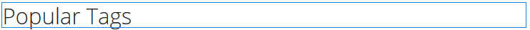

# 使用Social Tag Cloud {#using-social-tag-cloud}

>[!CAUTION]
>
>AEM 6.4已結束延伸支援，本檔案不再更新。 如需詳細資訊，請參閱 [技術支援期](https://helpx.adobe.com//tw/support/programs/eol-matrix.html). 尋找支援的版本 [此處](https://experienceleague.adobe.com/docs/).

## 簡介 {#introduction}

此 `Social Tag Cloud` 元件會強調顯示發佈內容時社群成員套用的標籤。 這是一種識別趨勢主題，並允許網站訪客快速找到已標籤內容的方法。

若要尋找其他可識別目前趨勢的方法，請造訪 [活動趨勢](trends.md).

本頁記錄 `Social Tag Cloud` 元件對話方塊設定並說明使用者體驗。

如需開發人員的詳細資訊，請參閱 [標籤要點](tag.md).

請參閱 [管理標籤](../../help/sites-administering/tags.md) ，以取得建立和管理標籤以及套用內容標籤的相關資訊。

## 新增社交標籤雲端 {#adding-a-social-tag-cloud}

新增 `Social Tag Cloud` 在製作模式中，使用元件瀏覽器來尋找 `Communities / Social Tag Cloud` 並將其拖曳至應顯示標籤雲端的頁面上。

如需必要資訊，請造訪 [Communities元件基本知識](basics.md).

當 [必要的用戶端程式庫](tag.md#essentials-for-client-side) 包含在內，以下為方式 `Social Tag Cloud` 元件隨即出現：

## 設定Social標籤雲 {#configuring-social-tag-cloud}

選取已放置的 `Social Tag Cloud` 要存取的元件並選取 `Configure` 表徵圖，開啟「編輯」對話框。

在 **[!UICONTROL 社交標籤雲]** 頁簽，指定要顯示哪些標籤，如果標籤是活動連結，則指定搜索結果頁的位置：

* **[!UICONTROL 要顯示的社交標籤]**
識別要顯示的UGC標籤。 下拉式選項包括

   * `From page and child pages`
   * `All tags`

   預設為 `From page and child pages`，其中「page」是指 **頁面** 設定。

* **[!UICONTROL 頁面]**
（若非必要，則為必要） 
`All tags)` 頁面的UGC路徑。 若保留為空白，則預設為目前頁面。

* **[!UICONTROL 標籤上沒有連結]**
若勾選此選項，標籤會以純文字顯示於標籤雲中。 如果取消勾選，標籤會顯示為作用中連結，可搜尋套用該標籤的所有內容。 預設為未勾選，且需要 **[!UICONTROL 搜索結果路徑]** 設定。

* **[!UICONTROL 搜索結果路徑]**
頁面的路徑，其中 
`Search Result` 元件已放置，並設定為參照UGC，該UGC包括由 **頁面** 設定。

## 變更Social標籤雲的顯示 {#change-display-of-social-tag-cloud}

若要編輯 **社交標籤雲**，輸入 [設計模式](../../help/sites-authoring/default-components-designmode.md) 並按兩下放置的 `Social Tag Cloud` 元件，以開啟具有其他索引標籤的對話方塊。

使用 **[!UICONTROL Social Tag Cloud（設計）]** ，指定標籤的顯示方式。 標籤可以是簡單標籤、預設命名空間中的單一字或分層分類法：

* **[!UICONTROL 顯示完整標題路徑]**
若勾選此選項，會顯示父標籤的標題和每個套用標籤的命名空間。

   例如：

   * 已核取: `Geometrixx Media: Gadgets / Cars`
   * 未核取: `Cars`

   簡單標籤沒有差異。

   預設為未勾選。

* **[!UICONTROL 僅顯示葉標籤]**
若勾選此選項，則只會顯示不含其他標籤的已套用標籤。

   例如，在

   `Geometrixx Media: Gadgets / Cars`

   可套用3個標籤： `Geometrixx Media (the namespace)`, `Gadgets`，和 `Cars`

   * 已勾選：僅限 `Cars` 將顯示，若已套用
   * 未勾選： `Geometrixx Media` 和 `Gadgets`和 `Cars` 將顯示，若已套用

   簡單的標籤是葉標籤。

   預設為未勾選。

* **[!UICONTROL 連結範本]**
透過元件編輯對話方塊啟用連結時，用來在Tag Cloud中顯示連結的範本（預設值除外）。

* **[!UICONTROL 所有標籤的大小相同]**
若勾選此選項，標籤雲端中的所有字詞都會設定相同的樣式。 如果未勾選，字詞的樣式會根據其使用方式而有所不同。 預設為未勾選。

## 其他資訊 {#additional-information}

如需詳細資訊，請參閱 [標籤要點](tag.md) 頁面。

請參閱 [標籤使用者產生的內容](tag-ugc.md) (UGC)，以取得建立和管理標籤的相關資訊。
