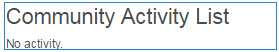

# 活動趨勢 {#activity-trends}

>[!CAUTION]
>
>AEM 6.4已結束延伸支援，本檔案不再更新。 如需詳細資訊，請參閱 [技術支援期](https://helpx.adobe.com//tw/support/programs/eol-matrix.html). 尋找支援的版本 [此處](https://experienceleague.adobe.com/docs/).

## 簡介 {#introduction}

此 `Community Activity List` 「元件」可新增與貼文和檢視相關的趨勢資訊，此資訊可依成員以及貼文和內容檢視。

本檔案的本節說明

* 新增 `Community Activity List` 元件 [社群網站](overview.md#community-sites)

* 的組態設定 `Community Activity List` 元件

## 需求 {#requirement}

資料 `Community Activity List` 只有在Adobe Analytics已授權並已針對社群網站進行設定時，才可使用。

請參閱 [Communities功能的Analytics設定](analytics.md).

## 將社群活動清單新增至頁面 {#adding-a-community-activity-list-to-a-page}

新增 `Community Activity List` 在製作模式中，找到元件至頁面 `Communities / Community Activity List` 並將其拖曳到頁面上。

如需必要資訊，請造訪 [Communities元件基本知識](basics.md).

首次放置在社群網站的頁面時，元件的顯示方式如下：

## 配置社區活動清單  {#configuring-community-activity-list}

選取已放置的 `Community Activity List` 要存取的元件並選取 `Configure` 表徵圖，開啟「編輯」對話框。

在 **[!UICONTROL 註解]** 索引標籤，指定上傳檔案的註解是否及顯示方式：

* **[!UICONTROL 類型]**

   指定要顯示社群成員或使用者產生內容(UGC)的相關資料。

   從
   * `Members`
   * `Content`

   預設為 `Members`.

* **[!UICONTROL 顯示標題]**

   要在資料上方顯示的描述性標題，例如 `Trending Content`.

   預設為無標題。

* **[!UICONTROL 顯示計數]**

   要列出的項目數。

   預設為10。

* **[!UICONTROL 活動類型]**

   選取其中一個
   * `Views`（頁面瀏覽次數）
   * `Posts`（建立UGC）
   * `Follows`
   * `Likes`

   預設為檢視。

* **[!UICONTROL 時間段]**

   選取其中一個
   * `Last 24 hours`
   * `Last 7 days`
   * `Last 30 days`
   * `Last 90 days`
   * `This year (since Jan 1st)`
   * `Total`

   預設為 `Total`.

* **[!UICONTROL 內容路徑]**

   提供將活動範圍限定為網站子集（如特定部落格）的能力。

   預設值是整個社群網站。

* **[!UICONTROL 成員人數彙總]**

   取消勾選後（關閉），只會計算最上層貼文。 例如，如果內容是根頁面（預設值），則 `Activity Type`of `Posts`不會顯示任何活動，因為無法將內容張貼至根頁面。 若勾選此選項，則會包含所有子系頁面上的計數。

   已勾選預設值。

## 包含4個元件的範例頁面 {#example-page-with-components}

**排名在前的訪客** 設定：類型=成員，活動類型=檢視

**排名最前的貢獻者** 設定：類型=成員，活動類型=貼文

**排名在前的內容** 設定：類型=內容，活動類型=檢視，

**趨勢內容** 設定：類型=內容，活動類型=貼文

