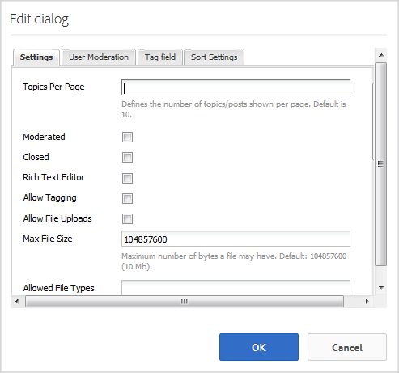

# 問答論壇功能{#q-a-forum-feature}

## 簡介 {#introduction}

QnA（問題和解答）論壇功能為社區成員提供了一個問題和解答區域：

* 建立新問題
* 內嵌影像（支援拖放）
* 檢視及回答問題
* 搜尋問題
* 幫助協調QnA內容
* 找出最佳答案
* 將QnA問題從一個頁面移至另一個頁面

本檔案的本節說明

* 將QnA論壇功能添加到AEM站點
* `QnA`元件的組態設定

## 將問答論壇新增至頁面{#adding-a-q-a-forum-to-a-page}

若要在製作模式下將`QnA`元件添加到頁面，請使用元件瀏覽器查找`Communities / QnA`，並將其拖動到應出現QnA論壇的頁面上的位置。

如需必要資訊，請造訪[Communities Components Basics](basics.md)。

包含[必要的用戶端程式庫](qna-essentials.md#essentials-for-client-side)時，以下是`QnA`元件的顯示方式：

### 配置QnA {#configuring-qna}

選取要存取的放置`QnA`元件，並選取開啟編輯對話方塊的`Configure`圖示。

 

#### 設定頁簽{#settings-tab}

在&#x200B;**[!UICONTROL Settings]**&#x200B;標籤下，指定主題（問題）和回覆（答案）的設定：

* **[!UICONTROL 每頁主]**
題定義每頁顯示的問題/貼文數。預設為10。

* ****
已審核如果勾選此選項，則必須先核准張貼主題和留言，才會顯示在發佈網站上。預設為未勾選。

* ****
已關閉如果勾選此選項，論壇將不會顯示新問題和評論。預設為未勾選。

* **[!UICONTROL RTF編]**
輯器如果選中此選項，則主題和注釋可以用標籤輸入。預設為未勾選。

* **[!UICONTROL 允許]**
標籤如果選中此選項，允許成員向其貼文中添加標籤標籤(請參閱 **[!UICONTROL 標籤]** 欄位頁簽)。預設為未勾選。

* **[!UICONTROL 允許檔]**
案上載如果選中此選項，允許將檔案附件添加到問題或注釋中。預設為未勾選。

* **[!UICONTROL 檔案大小]**
上限僅與 
`Allow File Uploads` 已勾選。此欄位將限制上傳檔案的大小（以位元組為單位）。 預設為104857600(10 Mb)。

* **[!UICONTROL 允許的檔案]**
類型僅與 
`Allow File Uploads` 已勾選。副檔名清單（以逗號分隔）以「點」分隔。 例如：.jpg、.jpeg、.png、.doc、.docx、.pdf。 如果指定了任何檔案類型，則不允許上載未指定的檔案類型。 未指定預設值，因此允許所有檔案類型。

* **[!UICONTROL 最大附加影像檔案]**
大小僅在勾選「允許檔案上傳」時相關。上傳的影像檔案可能具有的最大位元組數。 預設為2097152(2 Mb)。

* **[!UICONTROL 允]**
許下列若勾選此選項，則為論壇貼文加入下列功能，可通知  成員新貼文。預設為未勾選。

* **[!UICONTROL 允]**
許固定如果選中，論壇主題可能會固定到主題清單的頂部。預設為未勾選。

* **[!UICONTROL 允許電子]**
郵件訂閱如果勾選此選項，允許成員透過電子郵件([訂閱](subscriptions.md))接收新貼文的通知。需要檢查`Allow Following`，並配置[電子郵件](email.md)。 預設為未勾選。

* **[!UICONTROL 允許]**
回覆如果勾選，則允許回覆張貼至問題的留言。預設為未勾選。

* **[!UICONTROL 允許用戶刪除評論和主]**
題如果選中此選項，允許成員刪除他們發佈的評論和問題。預設為未勾選。

* **[!UICONTROL 允]**
許投票如果選中，則包括含有問題的投票功能。預設為未勾選。

* **[!UICONTROL 將選定答案移到頂部如果]**
選中，則顯示的第一個答案為選定答案。已勾選預設值。

* **[!UICONTROL 顯示]**
徽章如果選中，則使用成員的部落  格條目顯示已獲得和已分配徽章。預設為未勾選。

* **[!UICONTROL 若勾選]**
「允許精選內容」，即可將構想識別為精選 [內容](featured.md)。預設為未勾選。

#### 使用者協調標籤{#user-moderation-tab}

在&#x200B;**[!UICONTROL 使用者協調]**&#x200B;標籤下，指定如何管理已張貼的主題（問題）和答案（使用者產生的內容）。 如需詳細資訊，請參閱[協調使用者產生的內容](moderate-ugc.md)。

* **[!UICONTROL 拒絕]**
答案如果選中此選項，可信任的成員協調者將允許拒絕發佈的答案，並阻止答案在公共問答論壇上出現。預設為未勾選。

* **[!UICONTROL 關閉/重新開]**
啟主題如果選中此選項，受信任的成員協調者可以關閉問題（主題）以進一步編輯和回答，也可以重新開啟問題。預設為未勾選。

* **[!UICONTROL 移動]**
主題如果勾選此選項，允許發佈端協調者移動問題。預設為未勾選。

* **[!UICONTROL 標幟]**
貼文如果勾選此選項，可讓成員將他人的問題或答案標示為不適當。預設為未勾選。

* **[!UICONTROL 標幟原]**
因清單如果勾選此選項，允許成員從下拉式清單中選擇將問題或答案標示為不適當的原因。預設為未勾選。

* **[!UICONTROL 自定義標]**
簽原因如果選中此選項，允許成員輸入自己的原因來標籤問題或答案為不適當。預設為未勾選。

* **[!UICONTROL 協調]**
臨界值輸入在通知協調者之前，成員必須標籤某個問題或答案的次數。預設為1（一次）。

* **[!UICONTROL 標]**
簽限制輸入在從公共視圖中隱藏某個問題或答案之前必須標籤的次數。如果設為–1，則標籤的問題或答案永遠不會在公共視圖中隱藏。 否則，此數字必須大於或等於協調臨界值。 預設為5。

#### 標籤欄位標籤{#tag-field-tab}

在&#x200B;**[!UICONTROL 標籤欄位]**&#x200B;標籤下，如果&#x200B;**[!UICONTROL 設定]**&#x200B;標籤下允許，則可以套用的標籤會根據所選的命名空間受到限制。

* **[!UICONTROL 允許的命]**
名空間相關(若 
`Allow Tagging` 在「設定」標籤下 **** 被檢查。可套用的標籤僅限於所檢查命名空間類別中的標籤。 命名空間清單包含「標準標籤」（預設命名空間）以及「包含所有標籤」。 預設值未勾選，這表示允許所有命名空間。

* **[!UICONTROL 建]**
議限制輸入要作為建議顯示給論壇的成員的標籤數。值 
`-1` 表示沒有限制。預設為0。

#### 排序設定頁簽{#sort-settings-tab}

在&#x200B;**[!UICONTROL 排序設定]**&#x200B;標籤下，指定顯示張貼留言時的排序方式。

* **[!UICONTROL 按檢]**
查所有允許的排序選擇： 
`Newest, Oldest, Last Updated, Most Viewed, Most Active, Most Followed and Most Liked`. 預設值為`Newest, Oldest, Last Updated`。

* **[!UICONTROL 設定為「預]**
設」(Default)「下拉清單」(Downloak)，以選擇選定的排序選項之一，以顯示為預設選項。預設為 
`Newest`。

* **[!UICONTROL 選取Analytics的時間選項排序]**
下拉式清單以選取其中一個 
`All, Last 24 Hours, Last 7 Days, Last 30 Days`.預設值為`All`。

## 網站訪客體驗{#site-visitor-experience}

### 識別答案{#identifying-answers}

使用`Select Answer`按鈕，一個答案可標籤為正確或有用的答案。 將「問題」標籤為「已回答」後，使用`Unmark Chosen Answer`按鈕取消選擇第一個答案之前，無法選擇另一個答案。

一旦選擇為可行答案，則可使用`Unmark Chosen Answer`按鈕取消選擇該答案。

一旦選擇了可行答案，則主QnA頁面上的問題主題旁將顯示問題`Answered`的指示。

### 協調者和管理員{#moderators-and-administrators}

當登入的使用者擁有版主或管理員權限時，無論是撰寫問題或回答的人，都能執行元件組態所允許的協調工作。

他們也有能力找出答案。

### 成員 {#members}

網站訪客登入時（視設定而定），可能會

* 發佈新問題
* 編輯或刪除他們撰寫的問題
* 也可以標示他人的問題或答案
* 可針對他們撰寫的問題找出答案

### 匿名 {#anonymous}

未登入的網站訪客只能閱讀已張貼的問題和答案、翻譯（如有支援），但不得新增問題和答案，也不得標籤其他人的貼文。

## 其他資訊 {#additional-information}

有關開發人員的詳細資訊，請參見[QnA Essentials](qna-essentials.md)頁。

有關已張貼主題和留言的調節，請參閱[調節用戶生成的內容](moderate-ugc.md)。

有關標籤已發佈的主題和評論，請參閱[標籤用戶生成的內容](tag-ugc.md)。
