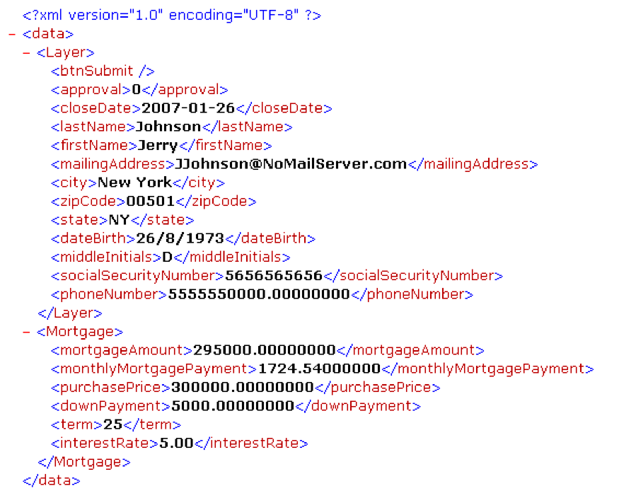

# 處理提交的表單 {#handling-submitted-forms}

讓使用者能夠填寫互動式表單的網路應用程式，需要將資料送回伺服器。 使用Forms服務，您可以擷取使用者在互動式表單中輸入的資料。 擷取資料後，您可以處理資料以符合您的業務需求。 例如，您可以將資料儲存在資料庫中、將資料傳送至其他應用程式、將資料傳送至其他服務、將資料合併為表單設計、在網頁瀏覽器中顯示資料等。

表單資料會以XML或PDF資料的形式提交至Forms服務，此選項是在Designer中設定的選項。 以XML形式提交的表單可讓您擷取個別欄位資料值。 也就是說，您可以擷取使用者在表單中輸入之每個表單欄位的值。 提交為PDF資料的表單是二進位資料，而非XML資料。 您可將表單儲存為PDF檔案，或將表單傳送至其他服務。 如果您想要從提交為XML的表單擷取資料，然後使用表單資料來建立PDF檔案，請叫用其他AEM Forms作業。 (請參 [閱使用提交的XML資料建立PDF檔案](/help/forms/developing/creating-pdf-documents-submitted-xml.md))

下圖顯示從Web瀏覽器中顯示的互動式表單 `HandleData` 中名為Java Servlet的提交資料。

下表說明了圖中的步驟。

<table>
 <thead>
  <tr>
   <th>
步驟
</th>
   <th>
說明
</th>
  </tr>
 </thead>
 <tbody>
  <tr>
   <td>
1
</td>
   <td>
使用者填寫互動式表單，然後按一下表單的「提交」按鈕。
</td>
  </tr>
  <tr>
   <td>
2
</td>
   <td>
資料會以XML資料的形 <code>HandleData</code> 式提交至Java Servlet。
</td>
  </tr>
  <tr>
   <td>
3
</td>
   <td>
Java <code>HandleData</code> Servlet包含用於檢索資料的應用程式邏輯。
</td>
  </tr>
 </tbody>
</table>

## 處理提交的XML資料 {#handling-submitted-xml-data}

當表單資料以XML形式提交時，您可以擷取代表已提交資料的XML資料。 所有表單欄位都會以節點的形式出現在XML架構中。 節點值對應於用戶填入的值。 請考慮使用貸款表單，表單中每個欄位都會以節點的形式出現在XML資料中。 每個節點的值對應於用戶填入的值。 假設使用者填入貸款表單時，會顯示下清單單中的資料。

下圖顯示使用Forms服務用戶端API擷取的對應XML資料。

貸款表單中的欄位。 這些值可以使用Java XML類來檢索。

>[!NOTE]
>
>表單設計必須在設計工具中正確設定，才能將資料提交為XML資料。 要正確配置表單設計以提交XML資料，請確保將表單設計上的「提交」按鈕設定為提交XML資料。 如需設定「送出」按鈕以送出XML資料的詳細資訊，請參閱 [AEM Forms Designer](https://www.adobe.com/go/learn_aemforms_designer_63)。

## 處理提交的PDF資料 {#handling-submitted-pdf-data}

考慮調用Forms服務的Web應用程式。 在Forms服務將互動式PDF表單轉譯至用戶端網頁瀏覽器後，使用者會填入表單並將其提交回PDF資料。 當Forms服務收到PDF資料時，可將PDF資料傳送至其他服務，或儲存為PDF檔案。 下圖顯示應用程式的邏輯流程。

下表說明此圖中的步驟。

<table>
 <thead>
  <tr>
   <th>
步驟
</th>
   <th>
說明
</th>
  </tr>
 </thead>
 <tbody>
  <tr>
   <td>
1
</td>
   <td>
網頁包含一個連結，用於訪問調用Forms服務的Java Servlet。
</td>
  </tr>
  <tr>
   <td>
2
</td>
   <td>
Forms服務會將互動式PDF表單轉譯至用戶端網頁瀏覽器。
</td>
  </tr>
  <tr>
   <td>
3
</td>
   <td>
使用者填入互動式表單，然後按一下提交按鈕。 表單會以PDF資料的形式提交回Forms服務。 此選項在設計器中設定。
</td>
  </tr>
  <tr>
   <td>
4
</td>
   <td>
Forms服務會將PDF資料儲存為PDF檔案。 
</td>
  </tr>
 </tbody>
</table>

## 處理已提交的URL UTF-16資料 {#handling-submitted-url-utf-16-data}

如果表單資料是以URL UTF-16資料提交，用戶端電腦需要Adobe Reader或Acrobat 8.1或更新版本。 此外，如果表單設計包含具有URL編碼資料（HTTP貼文）的提交按鈕，且資料編碼選項為UTF-16，表單設計必須在文字編輯器（例如記事本）中修改。 您可以將編碼選項設定為 `UTF-16LE` 或 `UTF-16BE` 提交按鈕。 設計人員不提供此功能。

>[!NOTE]
>
>如需Forms服務的詳細資訊，請參閱「AEM Forms [的服務參考」](https://www.adobe.com/go/learn_aemforms_services_63)。

## 步驟摘要 {#summary-of-steps}

要處理提交的表單，請執行以下任務：

1. 包含專案檔案。
1. 建立Forms用戶端API物件。
1. 擷取表單資料。
1. 確定表單提交是否包含檔案附件。
1. 處理提交的資料。

**包含專案檔案**

將必要的檔案加入您的開發專案中。 如果要使用Java建立客戶端應用程式，請包括必要的JAR檔案。 如果您使用web services，請確定您包含proxy檔案。

**建立Forms用戶端API物件**

您必須先建立Forms服務用戶端，才能以程式設計方式執行Forms服務用戶端API操作。 如果您使用Java API，請建立物 `FormsServiceClient` 件。 如果您使用Forms web service API，請建立物 `FormsService` 件。

**擷取表單資料**

若要擷取已提交的表單資料，請叫 `FormsServiceClient` 用物件的方 `processFormSubmission` 法。 在叫用此方法時，您必須指定已提交表單的內容類型。 當資料從用戶端網頁瀏覽器提交至Forms服務時，可以以XML或PDF資料的形式提交。 若要擷取輸入表單欄位的資料，可以將資料以XML資料提交。

您也可以設定下列執行時期選項，從提交為PDF資料的表單擷取表單欄位：

* 將下列值作為內容類 `processFormSubmission` 型參數傳遞給方法： `CONTENT_TYPE=application/pdf`。
* 將物 `RenderOptionsSpec` 件的值設 `PDFToXDP` 定為 `true`
* 將物 `RenderOptionsSpec` 件的值設 `ExportDataFormat` 定為 `XMLData`

在叫用方法時，可指定已提交表單的內容 `processFormSubmission` 類型。 下列清單指定適用的內容類型值：

* **text/xml**:表示當PDF表單以XML形式提交表單資料時要使用的內容類型。
* **application/x-www-form-urlencoded**:表示當HTML表單以XML形式提交資料時要使用的內容類型。
* **application/pdf**:表示PDF表單以PDF格式提交資料時要使用的內容類型。

>[!NOTE]
>
>您會注意到，「處理提交的表單」區段有三個對應的快速開始。 使用Java API快速入門處理以PDF格式提交的PDF表單，示範如何處理已提交的PDF資料。 此快速入門中指定的內容類型為 `application/pdf`。 使用Java API快速入門處理以XML格式提交的PDF表單，說明如何處理從PDF表單提交的已提交XML資料。 此快速入門中指定的內容類型為 `text/xml`。 同樣地，使用Java API快速入門處理以XML形式提交的HTML表單，將示範如何處理從HTML表單提交的已提交XML資料。 此快速入門中指定的內容類型為application/x-www-form-urlencoded。

您可擷取張貼至Forms服務的表單資料，並判斷其處理狀態。 也就是說，當資料提交至Forms服務時，並不一定表示Forms服務已完成處理資料，而且資料已準備好處理。 例如，資料可以提交至Forms服務，以便執行計算。 計算完成時，表單會轉譯回用戶並顯示計算結果。 在處理已提交的資料之前，建議您判斷Forms服務是否已完成處理資料。

Forms服務返回以下值，以指示它是否已完成資料處理：

* **0（提交）:** 已提交的資料已準備好可供處理。
* **1（計算）:** Forms服務對資料執行了計算操作，結果必須向用戶呈現。
* **2（驗證）:** Forms服務驗證的表單資料，且結果必須轉譯回使用者。
* **3（下一個）:** 目前頁面已變更，結果必須寫入用戶端應用程式。
* **4(舊版**):目前頁面已變更，結果必須寫入用戶端應用程式。

>[!NOTE]
>
>必須將計算和驗證轉譯回用戶。 (請參閱 [計算表單資料](/help/forms/developing/calculating-form-data.md#calculating-form-data)。)

**確定表單提交是否包含檔案附件**

提交到Forms服務的表單可以包含檔案附件。 例如，使用Acrobat的內建附件窗格，使用者可以選取要連同表單一起送出的檔案附件。 此外，使用者也可以使用HTML工具列來選取檔案附件，該工具列會以HTML檔案呈現。

確定表單是否包含檔案附件後，您可以處理資料。 例如，可以將檔案附件保存到本地檔案系統。

>[!NOTE]
>
>表單必須提交為PDF資料，才能擷取檔案附件。 如果表單以XML資料形式提交，則不會提交檔案附件。

**處理提交的資料**

視已提交資料的內容類型而定，您可以從已提交的XML資料擷取個別的表單欄位值，或將已提交的PDF資料儲存為PDF檔案（或將它傳送至其他服務）。 若要擷取個別表單欄位，請將提交的XML資料轉換為XML資料來源，然後使用類別來擷取XML資料來源 `org.w3c.dom` 值。

**另請參閱**

[包含AEM Forms Java程式庫檔案](/help/forms/developing/invoking-aem-forms-using-java.md#including-aem-forms-java-library-files)

[設定連接屬性](/help/forms/developing/invoking-aem-forms-using-java.md#setting-connection-properties)

[Forms Service API快速入門](/help/forms/developing/forms-service-api-quick-starts.md#forms-service-api-quick-starts)

[將檔案傳送至Forms服務](/help/forms/developing/passing-documents-forms-service.md)

[建立轉譯表單的Web應用程式](/help/forms/developing/creating-web-applications-renders-forms.md)

## 使用Java API處理提交的表單 {#handle-submitted-forms-using-the-java-api}

使用Forms API(Java)處理提交的表單：

1. 包含專案檔案

   在Java專案的類別路徑中包含用戶端JAR檔案，例如adobe-forms-client.jar。

1. 建立Forms用戶端API物件

   * 建立包 `ServiceClientFactory` 含連接屬性的對象。
   * 使用其 `FormsServiceClient` 建構函式並傳遞物件，以建立物 `ServiceClientFactory` 件。

1. 擷取表單資料

   * 若要擷取張貼至Java Servlet的表單資料，請使用其建構函式 `com.adobe.idp.Document` 建立物件，並從建構函式中叫 `javax.servlet.http.HttpServletResponse` 用物 `getInputStream` 件的方法。
   * 使用其 `RenderOptionsSpec` 建構函式建立物件。 調用物件的方法並傳 `RenderOptionsSpec` 遞指定地區 `setLocale` 值的字串值，以設定地區值。
   >[!NOTE]
   >
   >您可以叫用物件的方法、傳遞，以及呼叫和傳遞，指示Forms服務從提交的PDF內 `RenderOptionsSpec` 容建立XDP或XML `setPDF2XDP` 資料 `true``setXMLData``true`。 然後，您可以叫 `FormsResult` 用物件的方 `getOutputXML` 法來擷取與XDP/XML資料對應的XML資料。 (對 `FormsResult` 像由 `processFormSubmission`*方法返回，將在下一個子步驟中說明。)*

   * 叫用物 `FormsServiceClient` 件的方 `processFormSubmission` 法並傳遞下列值：

      * 包 `com.adobe.idp.Document` 含表單資料的物件。
      * 一個字串值，它指定包括所有相關HTTP標題的環境變數。 指定要處理的內容類型。 要處理XML資料，請為此參數指定以下字串值： `CONTENT_TYPE=text/xml`。 若要處理PDF資料，請為此參數指定下列字串值： `CONTENT_TYPE=application/pdf`。
      * 指定標題值的字 `HTTP_USER_AGENT` 串值，例如。 `Mozilla/4.0 (compatible; MSIE 6.0; Windows NT 5.1; SV1; .NET CLR 1.1.4322)`. 此參數值是可選的。
      * 存 `RenderOptionsSpec` 儲運行時選項的對象。
      該方 `processFormSubmission` 法返回包 `FormsResult` 含表單提交結果的對象。

   * 調用物件的方法，以判斷Forms服務是否已完成表 `FormsResult` 單資料的處 `getAction` 理。 如果此方法傳回值 `0`，資料就可供處理。

1. 確定表單提交是否包含檔案附件

   * 叫用 `FormsResult` 物件的方 `getAttachments` 法。 此方法返回 `java.util.List` 包含隨表單提交的檔案的對象。
   * 逐步處理對 `java.util.List` 像以確定是否存在檔案附件。 如果存在檔案附件，則每個元素都是實 `com.adobe.idp.Document` 例。 您可以叫用物件的方法並傳 `com.adobe.idp.Document` 遞物件，以 `copyToFile` 儲存檔案附 `java.io.File` 件。
   >[!NOTE]
   >
   >此步驟僅適用於表單以PDF格式提交的情況。

1. 處理提交的資料

   * 如果資料內容類型為或 `application/vnd.adobe.xdp+xml` ，請建立 `text/xml`應用程式邏輯以擷取XML資料值。

      * 調用 `com.adobe.idp.Document` 物件的方 `FormsResult` 法以建立物 `getOutputContent` 件。
      * 通過調 `java.io.InputStream` 用建構子並傳遞對 `java.io.DataInputStream` 像來建立對 `com.adobe.idp.Document` 像。
      * 呼叫 `org.w3c.dom.DocumentBuilderFactory` 靜態物件的方 `org.w3c.dom.DocumentBuilderFactory` 法以建立物 `newInstance` 件。
      * 調用 `org.w3c.dom.DocumentBuilder` 物件的方 `org.w3c.dom.DocumentBuilderFactory` 法以建立物 `newDocumentBuilder` 件。
      * 調用 `org.w3c.dom.Document` 物件的方法並傳 `org.w3c.dom.DocumentBuilder` 遞物件， `parse` 以建立物 `java.io.InputStream` 件。
      * 檢索XML文檔中每個節點的值。 完成此任務的一種方法是建立接受兩個參數的自定義方法：要 `org.w3c.dom.Document` 檢索其值的對象和節點的名稱。 此方法返回表示節點值的字串值。 在此程式後面的代碼示例中，調用此自定義方法 `getNodeText`。 本文給出了該方法的主體。
   * 如果資料內容類型為， `application/pdf`請建立應用程式邏輯，將提交的PDF資料儲存為PDF檔案。

      * 調用 `com.adobe.idp.Document` 物件的方 `FormsResult` 法以建立物 `getOutputContent` 件。
      * 使用其 `java.io.File` 公用建構函式建立物件。 請務必指定PDF為副檔名。
      * 調用物件的方法並傳 `com.adobe.idp.Document` 遞物件， `copyToFile` 以填入PDF `java.io.File` 檔案。

**另請參閱**

[快速入門（SOAP模式）:使用Java API處理以XML格式提交的PDF表單](/help/forms/developing/forms-service-api-quick-starts.md#quick-start-soap-mode-handling-pdf-forms-submitted-as-xml-using-the-java-api)

[快速入門（SOAP模式）:使用Java API處理以XML形式提交的HTML表單](/help/forms/developing/forms-service-api-quick-starts.md#quick-start-soap-mode-handling-html-forms-submitted-as-xml-using-the-java-api)

[快速入門（SOAP模式）:使用Java API處理以PDF格式提交的PDF表單](/help/forms/developing/forms-service-api-quick-starts.md#quick-start-soap-mode-handling-pdf-forms-submitted-as-pdf-using-the-java-api)

[包含AEM Forms Java程式庫檔案](/help/forms/developing/invoking-aem-forms-using-java.md#including-aem-forms-java-library-files)

[設定連接屬性](/help/forms/developing/invoking-aem-forms-using-java.md#setting-connection-properties)

## 使用web service API處理提交的PDF資料 {#handle-submitted-pdf-data-using-the-web-service-api}

使用Forms API(web service)處理提交的表單：

1. 包含專案檔案

   * 建立使用Forms服務WSDL的Java代理類。
   * 將Java代理類包含到類路徑中。

1. 建立Forms用戶端API物件

   建立對 `FormsService` 像並設定驗證值。

1. 擷取表單資料

   * 要檢索張貼到Java Servlet的表單資料，請使用其 `BLOB` 建構子建立對象。
   * 調用 `java.io.InputStream` 物件的方 `javax.servlet.http.HttpServletResponse` 法以建立物 `getInputStream` 件。
   * 使用 `java.io.ByteArrayOutputStream` 其建構函式並傳遞物件長度，以建立物 `java.io.InputStream` 件。
   * 將對象的內 `java.io.InputStream` 容複製到對 `java.io.ByteArrayOutputStream` 像。
   * 叫用物件的方法，以 `java.io.ByteArrayOutputStream` 建立位元組 `toByteArray` 陣列。
   * 調用對 `BLOB` 像的方法並將字 `setBinaryData` 節陣列作為引數傳遞，以填充對象。
   * 使用其 `RenderOptionsSpec` 建構函式建立物件。 調用物件的方法並傳 `RenderOptionsSpec` 遞指定地區 `setLocale` 值的字串值，以設定地區值。
   * 叫用物 `FormsService` 件的方 `processFormSubmission` 法並傳遞下列值：

      * 包 `BLOB` 含表單資料的物件。
      * 一個字串值，它指定包括所有相關HTTP標題的環境變數。 指定要處理的內容類型。 要處理XML資料，請為此參數指定以下字串值： `CONTENT_TYPE=text/xml`。 若要處理PDF資料，請為此參數指定下列字串值： `CONTENT_TYPE=application/pdf`。
      * 指定標題值的 `HTTP_USER_AGENT` 字串值；例如， `Mozilla/4.0 (compatible; MSIE 6.0; Windows NT 5.1; SV1; .NET CLR 1.1.4322)`。
      * 存 `RenderOptionsSpec` 儲運行時選項的對象。
      * 由方 `BLOBHolder` 法填充的空對象。
      * 由方 `javax.xml.rpc.holders.StringHolder` 法填充的空對象。
      * 由方 `BLOBHolder` 法填充的空對象。
      * 由方 `BLOBHolder` 法填充的空對象。
      * 由方 `javax.xml.rpc.holders.ShortHolder` 法填充的空對象。
      * 由方 `MyArrayOf_xsd_anyTypeHolder` 法填充的空對象。 此參數用於儲存隨表單一起提交的檔案附件。
      * 由方 `FormsResultHolder` 法填入的空對象，其表單為已提交。
      方 `processFormSubmission` 法會以表 `FormsResultHolder` 單提交的結果填入參數。

   * 調用物件的方法，以判斷Forms服務是否已完成表 `FormsResult` 單資料的處 `getAction` 理。 如果此方法傳回值 `0`，表單資料就可供處理。 您可以取 `FormsResult` 得物件資料成員的 `FormsResultHolder` 值，以取 `value` 得物件。

1. 確定表單提交是否包含檔案附件

   取得物件資 `MyArrayOf_xsd_anyTypeHolder` 料成員 `value` 的值(物 `MyArrayOf_xsd_anyTypeHolder` 件已傳遞至方 `processFormSubmission` 法)。 此資料成員返回陣列 `Objects`。 陣列中的每 `Object` 個元素都 `Object`與隨表單一起提交的檔案相對應。 您可以取得陣列中的每個元素，並將其轉換為物 `BLOB` 件。

1. 處理提交的資料

   * 如果資料內容類型為或 `application/vnd.adobe.xdp+xml` ，請建立 `text/xml`應用程式邏輯以擷取XML資料值。

      * 調用 `BLOB` 物件的方 `FormsResult` 法以建立物 `getOutputContent` 件。
      * 叫用物件的方法，以 `BLOB` 建立位元組 `getBinaryData` 陣列。
      * 通過調 `java.io.InputStream` 用建構子並傳遞字 `java.io.ByteArrayInputStream` 節陣列來建立對象。
      * 呼叫 `org.w3c.dom.DocumentBuilderFactory` 靜態物件的方 `org.w3c.dom.DocumentBuilderFactory` 法以建立物 `newInstance` 件。
      * 調用 `org.w3c.dom.DocumentBuilder` 物件的方 `org.w3c.dom.DocumentBuilderFactory` 法以建立物 `newDocumentBuilder` 件。
      * 調用 `org.w3c.dom.Document` 物件的方法並傳 `org.w3c.dom.DocumentBuilder` 遞物件， `parse` 以建立物 `java.io.InputStream` 件。
      * 檢索XML文檔中每個節點的值。 完成此任務的一種方法是建立接受兩個參數的自定義方法：要 `org.w3c.dom.Document` 檢索其值的對象和節點的名稱。 此方法返回表示節點值的字串值。 在此程式後面的代碼示例中，調用此自定義方法 `getNodeText`。 本文給出了該方法的主體。
   * 如果資料內容類型為， `application/pdf`請建立應用程式邏輯，將提交的PDF資料儲存為PDF檔案。

      * 調用 `BLOB` 物件的方 `FormsResult` 法以建立物 `getOutputContent` 件。
      * 叫用物件的方法，以 `BLOB` 建立位元組 `getBinaryData` 陣列。
      * 使用其 `java.io.File` 公用建構函式建立物件。 請務必指定PDF為副檔名。
      * 使用其 `java.io.FileOutputStream` 建構函式並傳遞物件，以建立物 `java.io.File` 件。
      * 調用物件的方法並傳 `java.io.FileOutputStream` 遞位元組陣列， `write` 以填入PDF檔案。

**另請參閱**

[使用Base64編碼叫用AEM Forms](/help/forms/developing/invoking-aem-forms-using-web.md#invoking-aem-forms-using-base64-encoding)