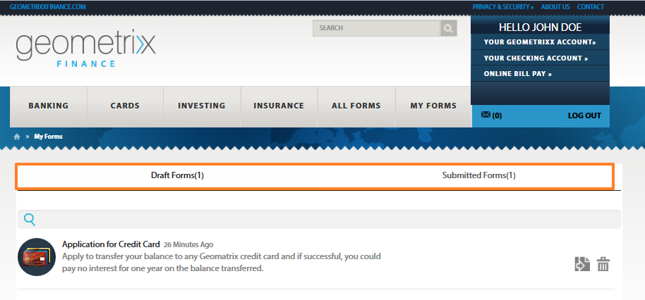

# 存取和填寫已發佈的表格 {#accessing-and-filling-published-forms}

在以表單為中心的入口網站部署設定中，表單開發和入口網站開發是兩個不同的活動。 當表單設計人員在儲存庫中設計和儲存表單時，網頁開發人員會建立網頁應用程式，以列出表單並處理提交。 然後，表單會複製到Web層，因為表單儲存庫和Web應用程式之間沒有通信。

這通常會導致管理設定和生產延遲的問題。 例如，如果儲存庫中有較新版本的表單，表單設計器將替換Web層上的表單，修改Web應用程式，並在公共站點上重新部署表單。 重新部署Web應用程式可能會造成伺服器停機。 由於伺服器停機是計畫中的活動，所以無法立即將更改推送到公共站點。

Forms Portal可減少管理開銷和生產延遲。 它為網頁開發人員提供元件，讓他們在使用Adobe Experience Manager(AEM)製作的網站上建立和自訂表單入口網站。

如需表單入口網站及其功能的詳細資訊，請參 [閱在入口網站上發佈表單簡介](/help/forms/using/introduction-publishing-forms.md)。

## 表單入口網站快速入門 {#getting-started-with-forms-portal}

導覽至已發佈的表單入口網頁。 如需建立表單入口網頁的詳細資訊，請參 [閱建立表單入口網頁](/help/forms/using/creating-form-portal-page.md)。

Roms Portal的Search and Lister元件會顯示AEM伺服器的Publish例項中可用的表格。 此清單包含在編寫表單入口網站頁面時，篩選器中定義的所有表單或表單。 表單入口網站頁面外觀類似於下圖所示：

**圖：** *表單入口網頁範例*

### Search and Lister {#search-and-lister}

Search and Lister元件可讓您將下列功能新增至表單入口網站：

* 在面板、卡片或格線檢視中列出現成可用的表單。 它也支援自訂範本從Forms Manager中的特定資料夾列出表格。
* 指定表單的轉譯方式- HTML5、PDF或兩者。
* 指定PDF和XFA表格的轉換方式- HTML5、PDF或兩者。 非XFA表單為HTML5。
* 可根據條件（例如表單屬性、中繼資料和標籤）來搜尋表單。
* 將表單資料提交至servlet。
* 使用自訂樣式表(CSS)來自訂入口網站的外觀和感覺。
* 建立表單連結。

您可以使用下列選項，在「表單入口網站」頁面中搜尋表單：

* 全文搜尋
* 進階搜尋

全文搜尋可讓您根據指定的關鍵字尋找並列出表單。

**圖：** *進階搜尋對話方塊*

「進階搜尋」可讓您根據指定的表單屬性來搜尋表單。 這提供比全文搜尋更具體的結果。 進階搜尋包括根據標籤、屬性（例如作者、說明和標題）、修改日期和全文的搜尋。

Lister會根據搜尋參數顯示表單。 搜索結果中的每個表單都顯示一個表徵圖，該表徵圖已超級連結到關聯的表單。 您可以按一下圖示以開啟並使用關聯的表單。

### 填寫表格 {#filling-a-form}

**圖：** *範例自適應表單*

您可從頁面的Search and Lister元件中隨同表單提供的連結存取表單。

每個表格都包含說明資訊，讓使用者可填寫表格。

#### 草稿和提交 {#drafts-and-submission}

使用者可以選擇按一下「儲存」按鈕來儲存表單草稿。 這可讓使用者在提交表單之前，先在一段時間內處理表單。

表格中填入的資料（包括附件）會儲存為伺服器上的草稿。 表單草稿可以儲存任意次數。 已保存的表單將顯示在頁面「草稿與提交」元件的「草稿」頁籤中。

填表完成後，使用者按一下表單上的「提交」按鈕來提交表單。 提交的表單會顯示在「頁面」的「草稿與提交」元件的「提交」標籤中。

>[!NOTE]
>
>僅當最適化表單的提交動作設定為表單入口網站提交動作時，提交的表單才會出現在「已提交表單」標籤中。 有關提交操作的詳細資訊，請參 [閱配置提交操作](/help/forms/using/configuring-submit-actions.md)。

**圖：** *草稿和提交元件*

## Start a new form using submitted form data {#start-a-new-form-using-submitted-form-data}

您需要經常填寫和提交某些表格。 如個人納稅申報表每年提交一次， 在這種情況下，雖然您每次填寫表格時，會有一些資訊變更，但大部分資訊（例如個人和家庭詳細資訊）並不會變更。 不過，您仍需從頭開始重新填寫整個表格。

AEM Forms可協助最佳化表單填寫體驗，並大幅縮短再次填寫和提交表單的時間。 使用者可使用提交表單中的資料來啟動新表單。 這項功能是內建在「草稿與提 [交」元件中](/help/forms/using/draft-submission-component.md)。 當您將「草稿和提交」元件新增至表單入口網頁並發佈時，使用者會在「已提交表單」和「草稿表單」標籤中找到選項，以使用已提交表單的資料來啟動新表單。 以下影像會反白顯示該選項。

當您按一下按鈕以啟動新表單時，它會開啟新表單，其中包含對應提交表單的資料。 您現在可以視需要檢閱和更新資訊，並提交表格。
