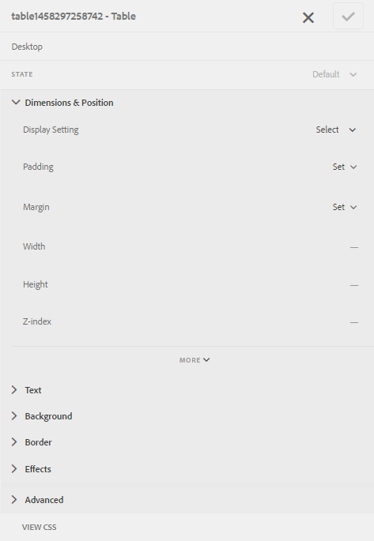

# 適用性表單中的表格 {#tables-in-adaptive-forms}

>[!CAUTION]
>
>AEM 6.4已結束延伸支援，本檔案不再更新。 如需詳細資訊，請參閱 [技術支援期](https://helpx.adobe.com//tw/support/programs/eol-matrix.html). 尋找支援的版本 [此處](https://experienceleague.adobe.com/docs/).

使用表格是呈現複雜資料的有效、簡化且有組織的方式。 它幫助用戶方便地識別資訊，並以有序排列的行和列提供輸入。 金融服務和政府組織的大多數表單都要求使用大資料表來放置數字並執行計算。

AEM Forms在側欄的「元件」瀏覽器中提供「表格」元件，可讓您以最適化表單建立表格。 它提供的一些關鍵功能包括：

* 行動裝置上的回應式版面
* 可設定的列和列
* 在執行階段動態新增和刪除列
* 合併或合併及分割儲存格
* 由螢幕助讀程式存取
* 使用CSS的自訂配置
* 與XDP表元件相容並對應
* 支援使用XSD複雜類型元素新增列或儲存格
* 從XML檔案合併資料

## 建立表格 {#create-a-table}

若要建立表格，請從最適化表單的sidekick中的元件瀏覽器，拖放表格元件。 依預設，表格包含兩欄和三列，包括標題列。


### 關於標題和內文儲存格 {#about-header-and-body-cells}

標題儲存格是文字欄位。 若要變更標題的標籤，請以滑鼠右鍵按一下標題儲存格，然後按一下 **編輯**. 在「編輯」對話方塊中，更新 **值** 欄位，按一下 **確定**.

內文儲存格預設為文字方塊。 您可以將內文儲存格取代為sidekick中可用的任何其他適用性表單元件，例如數值方塊、日期選取器或下拉式清單。

例如，下表中的第一個內文列包含文字方塊、日期選取器，以及儲存格形式的下拉式清單元件。


您可以選取要合併的儲存格，按一下滑鼠右鍵並選取「 」，以合併兩個或多個內文儲存格 **合併**. 您也可以對合併的儲存格按一下滑鼠右鍵並選取 **分割儲存格**.

### 添加、刪除、移動行和列 {#add-delete-move-rows-and-columns}

您可以新增和刪除列或欄，以及在表格中上下移動列。

要添加或刪除行或列或移動行，請按一下行或列中的任何單元格。 下拉式功能表會顯示在欄頂端和列左側。 頂端的功能表提供新增或刪除欄的選項，而左側的功能表則可讓您新增、刪除或移動列。

* 「添加」操作將在所選行或列的右下添加一行或列。
* 「刪除」操作將刪除選定的行或列。
* 上移和下移操作可上下移動所選行。

該行的下拉菜單還提供編輯操作，以編輯行屬性、設定和樣式選項。


>[!NOTE]
>
>雖然您可以在表格中新增任意數量的列，但您可新增的最大欄數為6。 此外，您也無法從表格中刪除標題列。

### 設定表的列寬 {#set-column-width}

執行下列步驟來設定表格的欄寬：

1. 在 **[!UICONTROL 內容]** 標籤，點選 **[!UICONTROL 表格]** 元件，然後點選「設定」()圖示。

1. 在 **[!UICONTROL 欄寬]** 欄位來指定表格中每欄的比例寬度。 例如，對於包含3欄的表格，將2,4,6指定為 **[!UICONTROL 欄寬]** 欄位會將第一欄的欄寬設為2/12，第二欄設為4/12，第三欄設為6/12。 2/12：第一列的寬度是表寬度的六分之一。 同樣，4/12將第二列寬度設定為表寬的三分之一，而6/12將第三列寬度設定為表寬的一半。

### 添加表說明 {#add-table-description}

您可以新增表格說明，說明如何組織資訊，讓螢幕助讀程式解譯及閱讀。 若要新增說明：

1. 選取表格並點選  以在側欄中查看其屬性。
1. 在「輔助功能」頁簽中指定摘要。
1. 按一下 **完成**.

## 配置表樣式 {#configure}

可以使用頁面工具欄中的樣式模式來定義表的樣式。 執行下列步驟以切換至樣式模式並編輯表格樣式

1. 在頁面工具列中的「預覽」之前，點選  > **樣式**.

1. 在側欄中選取表格，然後點選「編輯」按鈕 .

   您可以在側欄中看到樣式屬性。



>[!NOTE]
>
>您可以變更LESS變數的值，以變更標題和內文列的顏色主題。 如需詳細資訊，請參閱 [AEM Forms主題](/help/forms/using/themes.md).

## 動態新增或刪除列 {#add-or-delete-a-row-dynamically}

表格提供立即可用的支援，可在執行階段動態新增或刪除列。

1. 選取表格列並點選 .
1. 在「重複設定」索引標籤中，指定限制表格中列數的最小和最大計數。
1. 按一下 **完成**.

在執行階段中，您會看到 **`+`** 和 *`-`* 按鈕添加或刪除行。


>[!NOTE]
>
>表格左側行動配置的標題不支援動態新增或刪除列。

## 表中的運算式 {#expressions-in-a-table}

適用性表單中的表格可讓您在JavaScript中撰寫運算式，以誘導行為，例如顯示或隱藏表格或列、加總所有數字並顯示儲存格中的總計、啟用或停用儲存格、驗證使用者輸入等。 這些運算式使用適用性表單指令碼模型API。

雖然表格和列僅支援可見性運算式，以便根據運算式傳回的值來控制其可見性，但儲存格支援下列運算式：

* **初始化指令碼：** 對欄位初始化執行操作。
* **值提交指令碼：** 更改欄位值後表單的元件。

>[!NOTE]
>
>如果XFA變更/退出指令碼也套用至相同欄位，則XFA變更/退出指令碼會在值提交指令碼之前執行。

* **計算運算式**:自動計算欄位值。
* **驗證運算式**:來驗證欄位。
* **存取運算式**:啟用/停用欄位。
* **可見性運算式**:控制欄位和面板的可見性。

表或行的可見性表達式可在其相應「編輯」元件對話框的「面板屬性」頁簽中定義。 儲存格的運算式可在其「編輯」元件對話方塊的「指令碼」索引標籤中定義。

如需適用性表單類別、事件、物件和公用API的完整清單，請參閱 [適用於最適化表單的JavaScript程式庫API參考](https://helpx.adobe.com/aem-forms/6/javascript-api/index.html).

## 行動版面 {#mobile-layouts}

適用性表單中的表格因其流暢且回應式的配置，提供無與倫比的體驗行動裝置。 AEM Forms提供兩種類型的表格行動配置 — 左側標題和可折疊欄。

您可以從表格的「編輯」元件對話方塊的「樣式」索引標籤，為表格設定行動版面。

### 左側的標題 {#headers-on-left}

在左側版面的「標題」中，表格中的標題會在左側轉置，只有一個儲存格會對標題顯示。 此版面中的每一列都會以不同區段顯示。 下列影像會比較案頭上的表格和行動裝置上的表格。


**圖：** *左側佈局為「標題」的表的案頭視圖*


**圖：** *左側版面為「標題」的表格行動檢視*

### 可折疊的欄佈局 {#collapsible-columns-layout}

在「可折疊」列佈局中，表格中的列會折疊以顯示一列或兩列（視設備大小而定），而其他列則會折疊。 您可以按一下折疊/展開圖示來檢視表格中的其他欄。

>[!NOTE]
>
>雖然可折疊欄版面已針對行動裝置最佳化，但如果可用寬度不足以顯示表格中的所有欄位，也可在案頭使用。

下列影像比較表格在具有折疊和展開欄的裝置上的外觀。


**圖：** *行動裝置上僅顯示兩欄的已折疊表格欄*


**圖：** *行動裝置上表格的擴充欄*

## 合併表格中的資料 {#merge-data-in-a-table}

適用性表單中的表格可讓您使用XML檔案中的資料，在執行階段填入表格。 資料XML檔案可位於執行AEM Forms伺服器之電腦的本機檔案系統或CRX存放庫中。

讓我們舉一下要用XML檔案中的資料填充的銀行交易摘要表。


在此範例中，為下列項目提供的Element name屬性：

* 行是 **列1**
* 「交易日期」下的正文儲存格為 **tableItem1**
* 「說明」下的正文單元格為 **tableItem2**
* 「事務類型」下的正文單元格為 **type**
* 以USD表示的體單元格為 **tableItem3**

包含以下格式的資料的XML檔案：

```xml
<?xml version="1.0" encoding="UTF-8"?><afData>
  <afUnboundData>
    <data>
 <typeSelect>0</typeSelect>
 <Row1>
      <tableItem1>2015-01-08</tableItem1>
      <tableItem2>Purchase laptop</tableItem2>
      <type>0</type>
      <tableItem3>12000</tableItem3>
 </Row1>
 <Row1>
      <tableItem1>2015-01-05</tableItem1>
      <tableItem2>Transport expense</tableItem2>
      <type>0</type>
      <tableItem3>120</tableItem3>
 </Row1>
 <Row1>
      <tableItem1>2014-01-08</tableItem1>
      <tableItem2>Laser printer</tableItem2>
      <type>0</type>
      <tableItem3>500</tableItem3>
 </Row1>
 <Row1>
      <tableItem1>2014-12-08</tableItem1>
      <tableItem2>Credit card payment</tableItem2>
      <type>0</type>
      <tableItem3>300</tableItem3>
 </Row1>
 <Row1>
      <tableItem1>2015-01-06</tableItem1>
      <tableItem2>Interest earnings</tableItem2>
      <type>1</type>
      <tableItem3>12000</tableItem3>
 </Row1>
 <Row1>
      <tableItem1>2015-01-05</tableItem1>
      <tableItem2>Payment from a client</tableItem2>
      <type>1</type>
      <tableItem3>500</tableItem3>
 </Row1>
 <Row1>
      <tableItem1>2015-01-08</tableItem1>
      <tableItem2>Food expense</tableItem2>
      <type>0</type>
      <tableItem3>120</tableItem3>
 </Row1>
 </data>
  </afUnboundData>
  <afBoundData>
    <data/>
  </afBoundData>
  <afBoundData/>
</afData>
```

在範例XML中，列的資料由 `<Row1>` 標籤，即表格中列的元素名稱。 在 `<Row1>` 標籤，則每個儲存格的資料會在標籤中定義其元素名稱，例如 `<tableItem1>`, `<tableItem2>`, `<tableItem3>`，和 `<type>`.

若要在執行階段將此資料與表格合併，我們需要將包含表格的最適化表單指向停用wcmmode時的絕對XML位置。 例如，如果適用性表單位於 *http://localhost:4502/myForms/bankTransaction.html* 而資料XML檔案儲存在 *C:/myTransactions/bankSummary.xml*，您可以在下列URL中檢視含有資料的表格：

*http://localhost:4502/myForms/bankTransaction.html?dataRef=file:/// C:/myTransactions/bankSummary.xml&amp;wcmmode=disabled*


## 使用XDP元件和XSD複雜類型 {#use-xdp-components-and-xsd-complex-types}

如果您根據XFA表單範本建立最適化表單，「AEM內容尋找器」的「資料模型」標籤中會提供XFA元素。 您可以在最適化表單中拖放這些XFA元素，包括表格。

XFA表格元素會對應至表格元件，並在最適化表單中立即可用。 XDP表格的所有屬性和功能在移入最適化表單時都會保留，您可以像使用原生最適化表單表格一樣對其執行任何操作。 例如，如果XDP表格中的列標示為可重複，則也會在最適化表單中放置時重複該列。

此外，您可以拖放XDP子表單，在表格中新增一列。 但請注意，刪除巢狀子表單並無作用。

>[!NOTE]
>
>沒有標題列的XDP表格將不會對應至最適化表單表格元件。 而是會以流暢的版面配置，對應至最適化表單面板元件。 此外，當您將巢狀表格從XDP新增至最適化表單時，外表會轉換為面板，同時保留內表。

此外，您可以拖放一組XSD複雜類型元素，以建立表格列。 系統會在您放置元素的列正下方建立新列。 使用XSD複雜類型元素建立的儲存格會維護XSD的系結參考。 您也可以將元素拖放至儲存格，以XSD複雜類型元素取代內文儲存格。

>[!NOTE]
>
>XDP表元件、子表單或XSD複雜類型中的元素數不能超過一列中的儲存格數。 例如，您無法將四個元素拖放到只有三個儲存格的列上。 這會導致錯誤。
>
>如果元素數少於一列中的儲存格數，新列會先根據元素新增儲存格，然後新增預設儲存格以填入列中剩餘的儲存格。 例如，如果您將一個由三個元素組成的群組拖曳到一個有四個儲存格的列中，前三個儲存格會以您拖放的元素為基礎，其餘一個儲存格則會是預設的表格儲存格。

## 主要考量 {#key-considerations}

* 如果您在編寫基於XSD的表時上下移動行，則在提交表單時生成的資料XML中會看到表行中的一些資料丟失。
* 預設表格中的每個主體單元格都具有與其關聯的預定義元素名稱。 如果您在適用性表單中新增其他表格，新表格中的預設內文儲存格將與第一個表格中的元素名稱相同。 在這種情況下，提交表單時產生的資料將僅包含其中一個表格的預設內文儲存格中的資料。 因此，請務必重新命名預設內文儲存格的元素名稱，以讓這些名稱在各表格中保持唯一，並避免資料遺失。

   請注意，這僅適用於預設的內文儲存格。 如果向表中添加更多行或列，則會自動為非預設主體單元格生成唯一的元素名稱。
