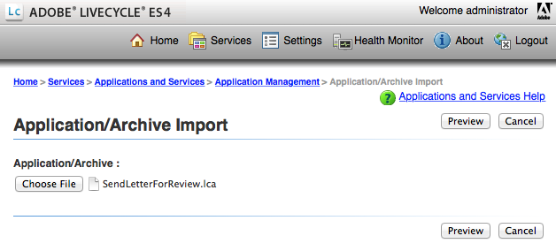

# 在建立通信UI {#add-custom-action-button-in-create-correspondence-ui}中新增自訂動作/按鈕

## 概覽 {#overview}

通信管理解決方案可讓您將自訂動作新增至「建立通信」使用者介面。

本檔案中的案例說明如何在「建立通信使用者介面」中建立按鈕，以共用附加至電子郵件的審核PDF格式信函。

### 必備條件 {#prerequisites}

若要完成此案例，您需要下列項目：

* CRX和JavaScript相關知識
* LiveCycle伺服器

## 案例：在建立通信用戶介面中建立按鈕，以發送要審核的信函{#scenario-create-the-button-in-the-create-correspondence-user-interface-to-send-a-letter-for-review}

將具有動作的按鈕（此處傳送信函以供檢閱）新增至「建立通信使用者介面」，包括：

1. 將按鈕新增至建立通信使用者介面
1. 將動作處理新增至按鈕
1. 新增LiveCycle程式以啟用動作「處理」

### 將按鈕添加到建立通信用戶介面{#add-the-button-to-the-create-correspondence-user-interface}

1. 前往`https://[server]:[port]/[ContextPath]/crx/de`並以管理員身分登入。
1. 在應用程式資料夾中，建立名為`defaultApp`的資料夾，其路徑/結構類似於defaultApp資料夾（位於設定資料夾中）。 使用下列步驟建立資料夾：

   * 按一下右鍵以下路徑的&#x200B;**[!UICONTROL defaultApp]**&#x200B;資料夾，然後選擇&#x200B;**[!UICONTROL 覆蓋節點]**:

      /libs/fd/cm/config/defaultApp/

      

   * 確定「覆蓋節點」對話方塊有下列值：

      **[!UICONTROL 路徑：]** /libs/fd/cm/config/defaultApp/

      **[!UICONTROL 覆蓋位置：]** /apps/

      **[!UICONTROL 匹配節點類型：已]** 勾選

      

   * 按一下&#x200B;**[!UICONTROL 「確定」]**。
   * 按一下「**[!UICONTROL 全部保存]**」。

1. 複製/apps分支下的acmExtensionsConfig.xml檔案（存在於/libs分支下）。

   * 前往「/libs/fd/cm/config/defaultApp/acmExtensionsConfig.xml」

   * 以滑鼠右鍵按一下acmExtensionsConfig.xml檔案，然後選取&#x200B;**[!UICONTROL Copy]**。

      

   * 按一下右鍵位於「/apps/fd/cm/config/defaultApp/，」的&#x200B;**[!UICONTROL defaultApp]**&#x200B;資料夾，然後選擇&#x200B;**[!UICONTROL 貼上]**。
   * 按一下「**[!UICONTROL 全部保存]**」。

1. 連按兩下您新在應用程式資料夾中建立的acmExtentionsConfig.xml副本。 檔案隨即開啟供編輯。
1. 找出下列程式碼：

   ```xml
   <?xml version="1.0" encoding="utf-8"?>
   <extensionsConfig>
       <modelExtensions>
           <modelExtension type="LetterInstance">
     <customAction name="Preview" label="loc.letterInstance.preview.label" tooltip="loc.letterInstance.preview.tooltip" styleName="previewButton"/>
               <customAction name="Submit" label="loc.letterInstance.submit.label" tooltip="loc.letterInstance.submit.tooltip" styleName="submitButton" permissionName="forms-users"/>
               <customAction name="SaveAsDraft" label="loc.letterInstance.saveAsDraft.label" tooltip="loc.letterInstance.saveAsDraft.tooltip" styleName="submitButton" permissionName="forms-users"/>
               <customAction name="Close" label="loc.letterInstance.close.label" tooltip="loc.letterInstance.close.tooltip" styleName="closeButton"/>
           </modelExtension>
       </modelExtensions>
   </extensionsConfig> 
   ```

1. 若要傳送電子郵件，您可以使用LiveCycleForms Workflow。 在acmExtensionsConfig.xml中的modelExtension標籤下新增customAction標籤，如下所示：

   ```xml
    <customAction name="Letter Review" label="Letter Review" tooltip="Letter Review" styleName="" permissionName="forms-users" actionHandler="CM.domain.CCRCustomActionHandler">
         <serviceName>Forms Workflow -> SendLetterForReview/SendLetterForReviewProcess</serviceName>
       </customAction>
   ```

   

   modelExtension標籤有一組customAction子標籤，用於配置操作按鈕的操作、權限和外觀。 以下是customAction設定標籤的清單：

   | **名稱** | **說明** |
   |---|---|
   | 名稱 | 要執行的動作的英數字元名稱。 此標籤的值為必要值，必須是唯一的（在modelExtension標籤內），且必須以字母開頭。 |
   | 標籤 | 要在動作按鈕上顯示的標籤 |
   | 工具提示 | 按鈕的工具提示文字，當使用者將游標暫留在按鈕上時，就會顯示此文字。 |
   | styleName | 應用於操作按鈕的自定義樣式的名稱。 |
   | permissionName | 只有當使用者擁有permissionName所指定的權限時，才會顯示對應的動作。 將permissionName指定為`forms-users`時，所有用戶都可以訪問此選項。 |
   | actionHandler | 用戶按一下按鈕時調用的ActionHandler類的完全限定名稱。 |

   除了上述參數外，還可能有其他與customAction相關聯的設定。 這些附加配置可通過CustomAction對象提供給處理程式。

   | **名稱** | **說明** |
   |---|---|
   | serviceName | 如果customAction包含名為serviceName的子標籤，則按一下相關按鈕/連結時，將調用一個進程，該進程的名稱由serviceName標籤表示。 確保此進程與Letter PostProcess具有相同的簽名。 在服務名稱中新增「Forms Workflow->」首碼。 |
   | 標籤名稱中包含cm_前置詞的參數 | 如果customAction包含以名稱cm_開頭的子標籤，則在後置處理（無論是信函後置處理或serviceName標籤所代表的特殊處理）中，這些參數可在輸入XML代碼中刪除的相關標籤下使用。 |
   | actionName | 每當貼文處理因點按而發生時，提交的XML都會在標籤下方包含一個特殊標籤，其名稱為使用者動作的名稱。 |

1. 按一下「**[!UICONTROL 全部保存]**」。

#### 在/apps分支{#create-a-locale-folder-with-properties-file-in-the-apps-branch}中建立具有屬性檔案的區域設定資料夾

ACMExtensionsMessages.properties檔案包含「建立通信」用戶介面中各欄位的標籤和工具提示消息。 為了讓自訂動作/按鈕正常運作，請在/apps分支中製作此檔案的復本。

1. 按一下右鍵以下路徑上的&#x200B;**[!UICONTROL locale]**&#x200B;資料夾，然後選擇&#x200B;**[!UICONTROL 覆蓋節點]**:

   /libs/fd/cm/config/defaultApp/locale

1. 確定「覆蓋節點」對話方塊有下列值：

   **[!UICONTROL 路徑：]** /libs/fd/cm/config/defaultApp/locale

   **[!UICONTROL 覆蓋位置：]** /apps/

   **[!UICONTROL 匹配節點類型：已]** 勾選

1. 按一下&#x200B;**[!UICONTROL 「確定」]**。
1. 按一下「**[!UICONTROL 全部保存]**」。
1. 按一下右鍵以下檔案，然後選擇&#x200B;**[!UICONTROL Copy]**:

   `/libs/fd/cm/config/defaultApp/locale/ACMExtensionsMessages.properties`

1. 按一下右鍵以下路徑上的&#x200B;**[!UICONTROL locale]**&#x200B;資料夾，然後選擇&#x200B;**[!UICONTROL 貼上]**:

   `/apps/fd/cm/config/defaultApp/locale/`

   ACMExtensionsMessages.properties檔案是在地區設定資料夾中複製的。

1. 要將新添加的自定義操作/按鈕的標籤本地化，請為`/apps/fd/cm/config/defaultApp/locale/`中的相關區域設定建立ACMExtensionsMessages.properties檔案。

   例如，若要將本文中建立的自訂動作/按鈕翻譯為當地語系化，請建立名為ACMExtensionsMessages_fr.properties的檔案，並輸入下列項目：

   `loc.letterInstance.letterreview.label=Revue De Lettre`

   同樣地，您可以在此檔案中新增更多屬性，例如工具提示和樣式。

1. 按一下「**[!UICONTROL 全部保存]**」。

#### 重新啟動Adobe資產撰寫器建置區塊套件組合{#restart-the-adobe-asset-composer-building-block-bundle}

進行每個伺服器端變更後，請重新啟動Adobe資產撰寫器建置區塊套件組合。 在此案例中，伺服器端的acmExtensionsConfig.xml和ACMExtensionsMessages.properties檔案經過編輯，因此Adobe資產撰寫器建置區塊套件組合需要重新啟動。

>[!NOTE]
>
>您可能需要清除瀏覽器快取。

1. 前往 `https://[host]:[port]/system/console/bundles`. 如有必要，請以管理員身分登入。

1. 找出Adobe資產撰寫器建置區塊套件組合。 重新啟動套件組合：按一下停止，然後按一下開始。

   

重新啟動Adobe資產撰寫器建置區塊套件組合後，自訂按鈕會顯示在建立通信使用者介面中。 您可以在建立通信使用者介面中開啟信函，以預覽自訂按鈕。

### 將操作處理添加到按鈕{#add-action-handling-to-the-button}

預設情況下，建立通信用戶介面在cm.domain.js檔案中的以下位置具有ActionHandler的實現：

/libs/fd/cm/ccr/gui/components/admin/clientlibs/ccr/js/cm.domain.js

對於自訂動作處理，請在CRX的/apps分支中建立cm.domain.js檔案的覆蓋。

在按一下動作/按鈕時處理動作/按鈕包含下列邏輯：

* 將新新增的動作設為可見/隱藏：透過覆寫actionVisible()函式來完成。
* 啟用/禁用新添加的操作：透過覆寫actionEnabled()函式來完成。
* 使用者按一下按鈕時的實際動作處理：覆寫handleAction()函式的實作。

1. 前往 `https://[server]:[port]/[ContextPath]/crx/de`. 如有必要，請以管理員身分登入。

1. 在應用程式資料夾中，在CRX的/apps分支中建立名為`js`的資料夾，其結構類似於以下資料夾：

   `/libs/fd/cm/ccr/gui/components/admin/clientlibs/ccrui/js`

   使用下列步驟建立資料夾：

   1. 以滑鼠右鍵按一下以下路徑的&#x200B;**[!UICONTROL js]**&#x200B;資料夾，然後選取&#x200B;**[!UICONTROL 覆蓋節點]**:

      `/libs/fd/cm/ccr/gui/components/admin/clientlibs/ccrui/js`

   1. 確定「覆蓋節點」對話方塊有下列值：

      **[!UICONTROL 路徑：]** /libs/fd/cm/ccr/gui/components/admin/clientlibs/ccrui/js

      **[!UICONTROL 覆蓋位置：]** /apps/

      **[!UICONTROL 匹配節點類型：已]** 勾選

   1. 按一下&#x200B;**[!UICONTROL 「確定」]**。
   1. 按一下「**[!UICONTROL 全部保存]**」。

1. 在js資料夾中，使用按鈕的動作處理程式碼，建立名為ccrcustomization.js的檔案，步驟如下：

   1. 按一下右鍵以下路徑的&#x200B;**[!UICONTROL js]**&#x200B;資料夾，然後選擇&#x200B;**[!UICONTROL 建立>建立檔案]**:

      `/apps/fd/cm/ccr/gui/components/admin/clientlibs/ccrui/js`

      將檔案命名為ccrcustomization.js。

   1. 連按兩下ccrcustomization.js檔案，以在CRX中開啟它。
   1. 在檔案中，貼上下列程式碼，然後按一下&#x200B;**[!UICONTROL 儲存全部]**:

      ```
      /* for adding and handling custom actions in Extensible Toolbar.
        * One instance of handler will be created for each action.
        * CM.domain.CCRCustomActionHandler is actionHandler class.
        */
      var CCRCustomActionHandler;
          CCRCustomActionHandler = CM.domain.CCRCustomActionHandler = new Class({
              className: 'CCRCustomActionHandler',
              extend: CCRDefaultActionHandler,
              construct : function(action,model){
              }
          });
          /**
           * Called when user user click an action
           * @param extraParams additional arguments that may be passed to handler (For future use)
           */
          CCRCustomActionHandler.prototype.handleAction = function(extraParams){
              if (this.action.name == CCRCustomActionHandler.SEND_FOR_REVIEW) {
                  var sendForReview = function(){
                      var serviceName = this.action.actionConfig["serviceName"];
                      var inputParams = {};
                      inputParams["dataXML"] = this.model.iccData.data;
                      inputParams["letterId"] = this.letterVO.id;
                      inputParams["letterName"] = this.letterVO.name;
                      inputParams["mailId"] = $('#email').val();
                      /*function to invoke the LivecyleService */
                      ServiceDelegate.callJSONService(this,"lc.icc.renderlib.serviceInvoker.json","invokeProcess",[serviceName,inputParams],this.onProcessInvokeComplete,this.onProcessInvokeFail);
                      $('#ccraction').modal("hide");
                  }
                  if($('#ccraction').length == 0){
                      /*For first click adding popup & setting letterName.*/
                      $("body").append(popUp);
                      $("input[id*='letterName']").val(this.letterVO.name);   
                      $(document).on('click',"#submitLetter",$.proxy( sendForReview, this ));
                  }
                  $('#ccraction').modal("show");
              }
          };
          /**
           * Should the action be enabled in toolbar
           * @param extraParams additional arguements that may be passed to handler (For future use)
           * @return flag indicating whether the action should be enabled
           */
         CCRCustomActionHandler.prototype.actionEnabled = function(extraParams){
                  /*can be customized as per user requirement*/
                  return true;
          };
          /**
           * Should the action be visible in toolbar
           * @param extraParams additional arguments that may be passed to handler (For future use)
           * @return flag indicating whether the action should be enabled
           */
          CCRCustomActionHandler.prototype.actionVisible = function(extraParams){
              /*Check can be enabled for Non-Preview Mode.*/
              return true;
          };
          /*SuccessHandler*/
          CCRCustomActionHandler.prototype.onProcessInvokeComplete = function(response) {
              ErrorHandler.showSuccess("Letter Sent for Review");
          };
          /*FaultHandler*/
          CCRCustomActionHandler.prototype.onProcessInvokeFail = function(event) {
              ErrorHandler.showError(event.message);
          };
          CCRCustomActionHandler.SEND_FOR_REVIEW  = "Letter Review";
      /*For PopUp*/
          var popUp = '<div class="modal fade" id="ccraction" tabindex="-1" role="dialog" aria-hidden="true">'+
          '<div class="modal-dialog modal-sm">'+
              '<div class="modal-content">' +
                  '<div class="modal-header">'+
                      '<button type="button" class="close" data-dismiss="modal" aria-label="Close"><span aria-hidden="true">&times;</span></button>'+
                      '<h4 class="modal-title"> Send Review </h4>'+
                  '</div>'+
                  '<div class="modal-body">'+
                      '<form>'+
                          '<div class="form-group">'+
                              '<label class="control-label">Email Id</label>'+
                              '<input type="text" class="form-control" id="email">'+
                          '</div>'+
                          '<div class="form-group">'+
                              '<label  class="control-label">Letter Name</label>'+
                              '<input id="letterName" type="text" class="form-control" readonly>'+
                          '</div>'+
                          '<div class="form-group">'+
                              '<input id="letterData" type="text" class="form-control hide" readonly>'+
                          '</div>'+
                      '</form>'+
                  '</div>'+
                  '<div class="modal-footer">'+
                     '<button type="button" class="btn btn-default" data-dismiss="modal"> Cancel </button>'+
                     '<button type="button" class="btn btn-primary" id="submitLetter"> Submit </button>'+
                  '</div>'+
              '</div>'+
          '</div>'+
      '</div>';
      ```

### 添加LiveCycle進程以啟用操作<span class="acrolinxCursorMarker"></span>處理{#add-the-livecycle-process-to-enable-action-span-class-acrolinxcursormarker-span-handling}

在此案例中，請啟用下列元件，這些元件是附加元件.zip檔案的一部分：

* DSC元件罐(`DSCSample.jar`)
* 發送供複查流程LCA的信函(`SendLetterForReview.lca`)

下載並解壓縮`components.zip`檔案以取得`DSCSample.jar`和`SendLetterForReview.lca`檔案。 按照以下過程中的指定使用這些檔案。

[取得檔案](assets/components.zip)

#### 配置LiveCycle伺服器以運行LCA進程{#configure-the-livecycle-server-to-run-the-lca-process}

>[!NOTE]
>
>只有在您處於「 OSGI設定」，且要實施的自訂類型需要LC整合時，才需要執行此步驟。

LCA進程在LiveCycle伺服器上運行，需要伺服器地址和登錄憑據。

1. 前往`https://[server]:[port]/system/console/configMgr`並以管理員身分登入。
1. 找到「AdobeLiveCycle用戶端SDK設定」 ，然後按一下「**[!UICONTROL 編輯]**」（編輯圖示）。 「配置」面板隨即開啟。

1. 輸入以下詳細資訊，然後按一下&#x200B;**[!UICONTROL Save]**:

   * **[!UICONTROL 伺服器Url]**:操作處理程式代碼使用的Send For Review服務的LC伺服器的URL。
   * **[!UICONTROL 使用者名稱]**:LC伺服器的管理員用戶名
   * **[!UICONTROL 密碼]**:管理員用戶名的密碼

   

#### 安裝LiveCycle存檔(LCA){#install-livecycle-archive-lca}

啟用電子郵件服務流程所需的LiveCycle流程。

>[!NOTE]
>
>若要檢視此程式的功用，或自行建立類似程式，您需要Workbench。

1. 以管理員身分登入Livecycle Server adminui at `https:/[lc server]/:[lc port]/adminui`。

1. 導航至&#x200B;**[!UICONTROL 首頁>服務>應用程式和服務>應用程式管理]**。

1. 如果SendLetterForReview應用程式已存在，請跳過此過程中的其餘步驟，否則繼續執行後續步驟。

   

1. 按一下&#x200B;**[!UICONTROL Import]**。

1. 按一下「**[!UICONTROL 選擇檔案]**」並選擇「**[!UICONTROL SendLetterForReview.lca]**」。

   

1. 按一下「**[!UICONTROL 預覽]**」。

1. 選取&#x200B;**[!UICONTROL 匯入完成時將資產部署至執行階段]**。

1. 按一下&#x200B;**[!UICONTROL Import]**。

#### 將ServiceName添加到AllowListed服務清單{#adding-servicename-to-the-allowlisted-service-list}

在AEM伺服器中提及您要存取AEM伺服器的LiveCycle服務。

1. 以管理員身分登入`https:/[host]/:[port]/system/console/configMgr`。

1. 找到並按一下&#x200B;**[!UICONTROL AdobeLiveCycle用戶端SDK設定]**。 AdobeLiveCycle用戶端SDK設定面板隨即顯示。
1. 在「服務名稱」清單中，按一下+表徵圖並添加服務名&#x200B;**[!UICONTROL SendLetterForReview/SendLetterForReviewProcess]**。

1. 按一下「**[!UICONTROL 儲存]**」。

#### 配置電子郵件服務{#configure-the-email-service}

在此案例中，若要讓通信管理能夠傳送電子郵件，請在LiveCycle伺服器中設定電子郵件服務。

1. 以管理員憑證登入Livecycle Server adminui at `https:/[lc server]:[lc port]/adminui`。

1. 導航至&#x200B;**[!UICONTROL 首頁>服務>應用程式和服務>服務管理]**。

1. 找到並按一下&#x200B;**[!UICONTROL EmailService]**。

1. 在&#x200B;**[!UICONTROL SMTP主機]**&#x200B;中，配置電子郵件服務。

1. 按一下「**[!UICONTROL 儲存]**」。

#### 配置DSC服務{#configure-the-dsc-service}

若要使用通信管理API，請下載`DSCSample.jar`（附於本檔案中，作為`components.zip`的一部分）並上傳至LiveCycle伺服器。 將`DSCSample.jar`檔案上傳至LiveCycle伺服器後，AEM伺服器會使用`DSCSample.jar`檔案來存取renderLetter API。

如需詳細資訊，請參閱[將AEM Forms與AdobeLiveCycle連線](/help/forms/using/aem-livecycle-connector.md)。

1. 更新`DSCSample.jar`中cmsa.properties中的AEM伺服器URL，該位置如下：

   DSCSample.jar\com\adobe\livecycle\cmsa.properties

1. 在設定檔案中提供下列參數：

   * **crx.serverUrl**=https:/[host]/:[port]/[context path]/[AEM URL]
   * **crx.username** = AEM使用者名稱
   * **crx.password** = AEM密碼
   * **crx.appRoot** =/content/apps/cm

   >[!NOTE]
   >
   >每次在伺服器端進行任何變更時，請重新啟動LiveCycle伺服器。 有關建立自己的LiveCycle元件的資訊，請參閱[透過自訂DSC開發擴展LiveCycleES軟體](https://www.adobe.com/devnet/livecycle/articles/dsc_development.html)。

   `DSCSample.jar`檔案使用`renderLetter` API。 如需renderLetter API的詳細資訊，請參閱[介面LetterRenderService](https://helpx.adobe.com/aem-forms/6-2/javadocs/com/adobe/icc/ddg/api/LetterRenderService.html)。

#### 將DSC匯入LiveCyle {#import-dsc-to-livecyle}

`DSCSample.jar` 檔案使用 `renderLetter` API，從C作為輸入提供的XML資料將字母轉譯為PDF位元組。如需renderLetter和其他API的詳細資訊，請參閱[Letter Render Service](https://helpx.adobe.com/aem-forms/6-2/javadocs/com/adobe/icc/ddg/api/LetterRenderService.html)。

1. 啟動Workbench並登入。
1. 選擇&#x200B;**[!UICONTROL 窗口>顯示視圖>元件]**。 元件檢視會新增至Workbench ES2。

1. 按一下右鍵&#x200B;**[!UICONTROL 元件]**&#x200B;並選擇&#x200B;**[!UICONTROL 安裝元件]**。

1. 通過檔案瀏覽器選擇`DSCSample.jar`檔案，然後按一下&#x200B;**[!UICONTROL Open]**。
1. 按一下右鍵&#x200B;**[!UICONTROL RenderWrapper]**&#x200B;並選擇&#x200B;**[!UICONTROL 啟動元件]**。 如果元件啟動，元件名稱旁會出現綠色箭頭。

## 發送信函以供審核{#send-letter-for-review}

設定好傳送信函以供審核的動作和按鈕後：

1. 清除瀏覽器快取。

1. 在「建立通信」UI中，按一下「**[!UICONTROL 信函審核]**」並指定審核者的電子郵件ID。

1. 按一下&#x200B;**[!UICONTROL Submit]**。


審核者從系統收到一封電子郵件，信件為PDF附件。
