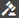

# 非同步提交最適化表單{#asynchronous-submission-of-adaptive-forms}

傳統上，網路表單的設定是同步提交。 當使用者提交表單時，系統會將他們重新導向至確認頁面，或在提交失敗時，重新導向錯誤頁面。 不過，單頁應用程式等現代化網頁體驗正日益普及，當用戶端與伺服器互動於背景時，網頁會維持靜態。 您現在可以設定非同步提交，透過最適化表單提供此體驗。 在這種情況下，適用性表單的行為會類似於單頁應用程式，因為表單不會重新載入，或提交的表單資料在伺服器上驗證時，其URL不會變更。

如需適用性表單中非同步提交的詳細資訊，請參閱。

## 設定非同步提交 {#configure}

設定最適化表單的非同步提交：

1. 在最適化表單編寫模式中，選取「表單容器」物件，然後點選以開啟其屬性。
1. 在&#x200B;**[!UICONTROL Submission]**&#x200B;屬性區段中，啟用&#x200B;**[!UICONTROL 使用非同步提交]**。
1. 在&#x200B;**[!UICONTROL 提交]**&#x200B;區段中，選擇以下選項之一以在成功提交表單時執行。

   * **[!UICONTROL 重新導向至URL]**:重新導向至表單提交時指定的URL或頁面。您可以指定URL或瀏覽，以在&#x200B;**[!UICONTROL 重新導向URL/路徑]**&#x200B;欄位中選擇頁面的路徑。
   * **[!UICONTROL 顯示消息]**:在表單提交時顯示訊息。您可以在「顯示訊息」選項下方的文字欄位中撰寫訊息。 文字欄位支援RTF格式。

1. 點選以儲存屬性。

## 非同步提交如何運作{#how-asynchronous-submission-works}

AEM Forms為表單提交提供現成可用的成功和錯誤處理常式。 處理常式是根據伺服器回應執行的用戶端函式。 提交表單時，將資料發送到伺服器進行驗證，伺服器會向客戶端返回一個響應，其中包含有關提交成功或錯誤事件的資訊。 資訊會以參數形式傳遞至相關處理常式，以執行函式。

此外，表單作者和開發人員可以在表單層級撰寫規則，以覆寫預設處理常式。 如需詳細資訊，請參閱[使用規則覆寫預設處理常式](#custom)。

讓我們先檢閱伺服器對成功和錯誤事件的回應。

### 提交成功事件的伺服器響應{#server-response-for-submission-success-event}

提交成功事件的伺服器回應結構如下：

```
{
  contentType : "<xmlschema or jsonschema>", 
  data : "<dataXML or dataJson>" , 
  thankYouOption : <page/message>, 
  thankYouContent : "<thank you page url/thank you message>"
}
```

成功提交表單時的伺服器回應包括：

* 表單資料格式類型：XML或JSON
* XML或JSON格式的表單資料
* 已選取重新導向至頁面或顯示訊息的選項（如表單中所設定）
* 頁面URL或訊息內容，如表單中設定

成功處理常式會讀取伺服器回應，並因此重新導向至設定的頁面URL或顯示訊息。

### 提交錯誤事件的伺服器響應{#server-response-for-submission-error-event}

提交錯誤事件的伺服器回應結構如下：

```
{
   errorCausedBy : "<CAPTCHA_VALIDATION or SERVER_SIDE_VALIDATION>",

   errors : [
               { "somExpression" : "<SOM Expression>",
                 "errorMessage"  : "<Error Message>"
               },
               ...
             ]
 }
```

提交表單時發生錯誤時的伺服器回應包括：

* 錯誤原因、驗證碼失敗或伺服器端驗證
* 錯誤對象清單，包括驗證失敗的欄位的SOM表達式和相應的錯誤消息

錯誤處理程式讀取伺服器回應，並因此在表單上顯示錯誤訊息。

## 使用規則覆蓋預設處理程式 {#custom}

表單開發人員和作者可以在表單層級的程式碼編輯器中撰寫規則，以覆寫預設處理常式。 成功和錯誤事件的伺服器回應會在表單層級公開，開發人員可在規則中使用`$event.data`存取。

執行下列步驟以在程式碼編輯器中撰寫規則，以處理成功和錯誤事件。

1. 在製作模式中開啟最適化表單，選取任何表單物件，然後點選以開啟規則編輯器。
1. 在「表單對象」樹中選擇「**[!UICONTROL 表單]**」，然後點選「**[!UICONTROL 建立]**」。
1. 從模式選擇下拉清單中選擇&#x200B;**[!UICONTROL 代碼編輯器]**。
1. 在程式碼編輯器中，點選&#x200B;**[!UICONTROL 編輯程式碼]**。 點選確認對話方塊上的&#x200B;**[!UICONTROL 編輯]** 。
1. 從&#x200B;**[!UICONTROL Event]**&#x200B;下拉式清單中選擇&#x200B;**[!UICONTROL Successful Submission]**&#x200B;或&#x200B;**[!UICONTROL Submission]**&#x200B;中的錯誤。
1. 撰寫所選事件的規則，然後點選&#x200B;**[!UICONTROL Done]**&#x200B;以儲存規則。
