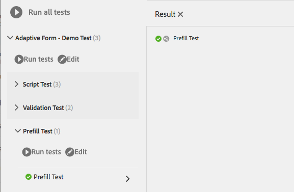

# 自動測試最適化表單 {#automate-testing-of-adaptive-forms}

>[!CAUTION]
>
>AEM 6.4已結束延伸支援，本檔案不再更新。 如需詳細資訊，請參閱 [技術支援期](https://helpx.adobe.com//tw/support/programs/eol-matrix.html). 尋找支援的版本 [此處](https://experienceleague.adobe.com/docs/).

## 概觀 {#overview}

最適化表單是客戶互動的必備項目。 務必透過您在表單中所做的每項變更（例如推出新的修正套件或變更表單中的規則）來測試最適化表單。 不過，功能測試適用性表單及其中的每個欄位可能都很繁瑣。

Calvin允許您在網路瀏覽器中自動測試您的最適化表單。 卡爾文利用 [霍布斯](/help/sites-developing/hobbes.md)用於運行測試的用戶介面，並提供以下工具：

* 用於建立測試的JavaScript API。
* 用於運行測試的用戶介面。

使用Calvin，您可以在CRXDE中建立測試用例，並直接在Web瀏覽器中運行UI測試，以徹底測試您的最適化表單的以下方面：

<table> 
 <tbody> 
  <tr> 
   <td><strong>要測試的最適化表單方面</strong></td> 
   <td><strong>說明</strong></td> 
  </tr> 
  <tr> 
   <td>預填最適化表單的體驗</td> 
   <td> 
    <ul> 
     <li>表單是否會根據資料模型類型，如預期預先填入？</li> 
     <li>表單對象的預設值是否按預期方式預填？</li> 
    </ul> </td> 
  </tr> 
  <tr> 
   <td>提交最適化表單的體驗</td> 
   <td> 
    <ul> 
     <li>提交時生成的資料是否正確？</li> 
     <li>提交期間表單是否在伺服器上重新驗證？</li> 
     <li>是否針對要執行的表單設定提交動作？</li> 
    </ul> </td> 
  </tr> 
  <tr> 
   <td><p>運算式規則</p> <p> </p> </td> 
   <td> 
    <ul> 
     <li>表單物件（例如計算、可見、在退出欄位後執行指令碼）的相關運算式是否在執行相關的UI操作後執行？<br /> </li> 
    </ul> </td> 
  </tr> 
  <tr> 
   <td>驗證</td> 
   <td> 
    <ul> 
     <li>執行操作後，欄位驗證是否如預期執行？</li> 
    </ul> </td> 
  </tr> 
  <tr> 
   <td><p>延遲載入</p> <p> </p> </td> 
   <td> 
    <ul> 
     <li>按一下索引標籤（或面板的任何導覽項目）時，系統是否會根據延遲載入設定從伺服器擷取HTML?</li> 
    </ul></td> 
  </tr> 
  <tr> 
   <td><p>UI互動</p> </td> 
   <td> 
    <ul> 
     <li><a href="https://helpx.adobe.com/aem-forms/6-3/calvin-sdk-javascript-api/calvin.html#toc2__anchor" target="_blank">測試與適用性表單物件的UI互動</a></li> 
    </ul> </td> 
  </tr> 
 </tbody> 
</table>

### 必備條件 {#prerequisites}

使用此文章建立測試案例之前，您需要了解下列事項：

* 使用建立測試套裝和執行測試案例 [霍布斯](https://docs.adobe.com/docs/en/aem/6-3/develop/components/hobbes.html)
* [Hobbes JavaScript API](https://docs.adobe.com/docs/en/aem/6-2/develop/ref/test-api/index.html)
* [Calvin JavaScript API](https://helpx.adobe.com/aem-forms/6-3/calvin-sdk-javascript-api/calvin.html)

## 範例：使用霍布斯作為測試架構，為最適化表單建立測試套裝 {#example-create-a-test-suite-for-an-adaptive-form-using-hobbes-as-testing-framework}

下列範例會逐步引導您建立測試套裝，以測試多個最適化表單。 您需要為每個需要測試的表單建立個別的測試案例。 依照類似下列步驟的操作並修改步驟11中的JavaScript程式碼，您可以建立自己的測試套裝來測試最適化表單。

1. 前往網頁瀏覽器中的CRXDE Lite: `https://[server]:[port]/crx/de`.
1. 以滑鼠右鍵按一下/etc/clientlibs子資料夾，然後按一下 **[!UICONTROL 建立>建立節點]**. 輸入名稱（此處為afTestRegistration），將節點類型指定為cq:ClientLibraryFolder，然後按一下 **[!UICONTROL 確定]**.

   clientlibs資料夾包含應用程式（JS和Init）的註冊方面。 建議您在clientlibs資料夾中註冊所有特定於表單的霍布斯測試套裝物件。

1. 在新建立的節點（此處為afTestRegistration）中指定以下屬性值，然後按一下 **[!UICONTROL 全部儲存]**. 這些屬性可協助霍布斯將資料夾識別為測試。 若要在其他用戶端程式庫中重複使用此用戶端程式庫作為相依性，請將其命名為granite.testing.calvin.tests。

<table> 
 <tbody> 
  <tr> 
   <td>屬性</td> 
   <td>類型</td> 
   <td>值</td> 
  </tr> 
  <tr> 
   <td><p>類別</p> </td> 
   <td><p>字串[]</p> </td> 
   <td><p>granite.testing.hobbes.tests, granite.testing.calvin.tests</p> </td> 
  </tr> 
  <tr> 
   <td><p>相依性</p> </td> 
   <td><p>字串[]</p> </td> 
   <td><p>granite.testing.hobbes.testrunner, granite.testing.calvin, apps.testframework.all</p> </td> 
  </tr> 
 </tbody> 
</table>

>[!NOTE]
>
>granite.testing.calvin.af clientlib包含所有最適化表單API。 這些API是calvin命名空間的一部分。


1. 以滑鼠右鍵按一下測試節點（此處） **afTestRegistration)** 然後按一下 **[!UICONTROL 建立>建立檔案]**. 將檔案命名為js.txt，然後按一下 **[!UICONTROL 確定]**.
1. 在js.txt檔案中，新增下列文字：

   ```
   #base=.
   js.txt
   ```

1. 按一下 **[!UICONTROL 全部儲存]** 然後關閉js.txt檔案。
1. 以滑鼠右鍵按一下測試節點（此處） **afTestRegistration)** 按一下 **[!UICONTROL 建立>建立檔案]**. 將檔案命名為init.js，然後按一下 **[!UICONTROL 確定]**.
1. 將下列程式碼複製到init.js檔案中，然後按一下 **[!UICONTROL 全部儲存]**:

   ```
   (function(window, hobs) {
       'use strict';
       window.testsuites = window.testsuites || {};
     // Registering the test form suite to the sytem
     // If there are other forms, all registration should be done here
       window.testsuites.testForm = new hobs.TestSuite("Adaptive Form - Demo Test", {
           path: '/etc/clientlibs/afTestRegistration/init.js',
           register: true
       });
    // window.testsuites.testForm1 = new hobs.TestSuite("testForm1");
   }(window, window.hobs));
   ```

   上述程式碼會建立名為 **適用性表單 — 示範測試**. 若要建立具有不同名稱的測試套裝，請據此變更名稱。

1. 按一下 **[!UICONTROL 建立]** > **建立節點** 為要測試的每個表單在clientlib資料夾下建立節點。 此範例使用名為 **testForm** 以測試 **testForm** `.`指定下列屬性，然後按一下 **[!UICONTROL 確定]**:

   * 名稱：testForm（您的表單名稱）
   * 類型：cq:ClientLibraryFolder

1. 將下列屬性新增至新建立的節點（此處為testForm），以測試最適化表單：

   | **屬性** | **類型** | **值** |
   |---|---|---|
   | 類別 | 字串[] | granite.testing.hobbes.tests, granite.testing.hobbes.tests.testForm |
   | 相依性 | 字串[] | granite.testing.calvin.tests |

   >[!NOTE]
   >
   >此範例使用對用戶端lib granite.testing.calvin.tests的相依性，以提供更理想的管理。 此範例也新增用戶端程式庫類別&quot;granite.testing.hobbes.testForm&quot;，以視需要重複使用此用戶端程式庫。

   

1. 按一下右鍵為測試表單建立的資料夾（此處為testForm），然後選擇 **[!UICONTROL 建立>建立檔案]**. 將檔案命名為scriptingTest.js，並將下列程式碼新增至檔案中，然後按一下 **[!UICONTROL 全部儲存。]**

   若要使用下列程式碼來測試另一個最適化表單，請在 **navigateTo** （第11、36和62行）和相應的測試用例。 如需測試表單和表單物件不同層面之API的詳細資訊，請參閱 [卡爾文API](https://helpx.adobe.com/aem-forms/6-3/calvin-sdk-javascript-api/calvin.html).

   ```
   (function(window, hobs) {
       'use strict';
   
    var ts = new hobs.TestSuite("Script Test", {
           path: '/etc/clientlibs/testForm/scriptingTest.js',
     register: false
    }) 
   
       .addTestCase(new hobs.TestCase("Checking execution of calculate script")
           // navigate to the testForm which is to be tested
           .navigateTo("/content/forms/af/testForm.html?wcmmode=disabled")
           // check if adaptive form is loaded
           .asserts.isTrue(function () {
               return calvin.isFormLoaded()
           })
           .execSyncFct(function () {
               // create a spy before checking for the expression
               calvin.spyOnExpression("panel1.textbox1");
               // setValue would trigger enter, set the value and exit from the field
               calvin.setValueInDOM("panel1.textbox", "5");
           })
           // if the calculate expression was setting "textbox1" value to "5", let's also check that
           .asserts.isTrue(function () {
               return calvin.isExpressionExecuted("panel1.textbox1", "Calculate");
           })
           .execSyncFct(function () {
               calvin.destroySpyOnExpression("panel1.textbox1");
           })
           .asserts.isTrue(function () {
               return calvin.model("panel1.textbox1").value == "5"
           })
       )
   
       .addTestCase(new hobs.TestCase("Calculate script Test")
           // navigate to the testForm which is to be tested
           .navigateTo("/content/forms/af/cal/demoform.html?wcmmode=disabled&dataRef=crx:///content/forms/af/cal/prefill.xml")
           // check if adaptive form is loaded
           .asserts.isTrue(function () {
               return calvin.isFormLoaded()
           })
   
           .execSyncFct(function () {
               // create a spy before checking for the expression
               calvin.spyOnExpression("panel2.panel1488218690733.downPayment");
               // setValue would trigger enter, set the value and exit from the field
               calvin.setValueInDOM("panel2.panel1488218690733.priceProperty", "1000000");
           })
           .asserts.isTrue(function () {
               return calvin.isExpressionExecuted("panel2.panel1488218690733.downPayment", "Calculate");
           })
           .execSyncFct(function () {
               calvin.destroySpyOnExpression("panel2.panel1488218690733.downPayment");
           })
           .asserts.isTrue(function () {
               // if the calculate expression was setting "downPayment" value to "10000", let's also check that
      return calvin.model("panel2.panel1488218690733.downPayment").value == 10000
           })
       )
   
       .addTestCase(new hobs.TestCase("Checking execution of Value commit script")
           // navigate to the testForm which is to be tested
           .navigateTo("/content/forms/af/cal/demoform.html?wcmmode=disabled&dataRef=crx:///content/forms/af/cal/prefill.xml")
           // check if adaptive form is loaded
           .asserts.isTrue(function () {
               return calvin.isFormLoaded()
           })
   
           .execSyncFct(function () {
               // create a spy before checking for the expression
               calvin.spyOnExpression("panel2.panel1488218690733.priceProperty");
               // setValue would trigger enter, set the value and exit from the field
               calvin.setValueInDOM("panel2.panel1488218690733.priceProperty", "100");
           })
           .asserts.isTrue(function () {
               return calvin.isExpressionExecuted("panel2.panel1488218690733.priceProperty", "Value Commit");
           })
           .execSyncFct(function () {
               calvin.destroySpyOnExpression("panel2.panel1488218690733.priceProperty");
           })
           .asserts.isTrue(function () {
            // if the value commit expression was setting "textbox1488215618594" value to "0", let's also check that
               return calvin.model("panel2.panel1488218690733.textbox1488215618594").value == 0
           })
       );
   
    // register the test suite with testForm
     window.testsuites.testForm.add(ts);
   
    }(window, window.hobs));
   ```

   已建立測試案例。 繼續執行測試案例，透過Hobbes測試最適化表單。 如需執行測試案例的步驟，請參閱 [使用自動化測試在測試您的UI中執行測試](/help/sites-developing/hobbes.md).

您也可以將套件安裝在附加的檔案SampleTestPackage.zip中，以取得與範例中說明的步驟相同的結果：使用霍布斯作為測試架構，為最適化表單建立測試套裝。

[取得檔案](assets/sampletestpackage.zip)

## 使用自動化測試來測試您的UI {#testing-your-ui-using-automated-tests}

### 執行單一測試套裝 {#running-a-single-test-suite}

測試套裝可個別執行。 當您執行測試套裝時，頁面會隨著測試案例及其動作執行而變更，結果會在測試完成後顯示。 圖示會指出結果。

勾選記號圖示表示通過的測試： 

「X」圖示表示測試失敗： 

若要執行測試套裝：

1. 在「測試」面板中，按一下或點選您要執行的「測試案例」名稱，以展開「動作」的詳細資訊。

   

1. 按一下或點選「執行測試」按鈕。 

   

1. 測試執行時，預留位置會以頁面內容取代。

   

1. 點選或按一下說明以開啟「結果」面板，以檢閱測試案例的結果。 點選或按一下「結果」面板中的「測試案例」名稱，即會顯示所有詳細資訊。

   

測試AEM最適化表單的步驟與測試AEM UI的步驟類似。 如需測試最適化表單的詳細資訊，請參閱 [測試您的UI](https://helpx.adobe.com//experience-manager/6-3/sites-developing/hobbes.html):

* 檢視測試套裝
* 執行多個測試

## 字彙表 {#glossary}

<table> 
 <tbody> 
  <tr> 
   <td><strong>術語</strong></td> 
   <td><strong>說明</strong></td> 
  </tr> 
  <tr> 
   <td><p>測試套裝</p> </td> 
   <td><p>測試套裝是相關測試案例的集合。</p> </td> 
  </tr> 
  <tr> 
   <td><p>測試案例</p> </td> 
   <td><p>測試案例代表使用者使用您的UI執行的任務。 將測試案例新增至您的測試套裝，以測試使用者執行的活動。</p> </td> 
  </tr> 
  <tr> 
   <td><p>動作</p> </td> 
   <td><p>動作是在UI中執行手勢的方法，例如按一下按鈕或使用值填入輸入方塊。</p> <p>howe.actions.Afliase、thowe.actions.Core和thowe.utils.af類別的方法是可用於測試的動作。 所有動作會同步執行。</p> </td> 
  </tr> 
  <tr> 
   <td><p>製作或發佈環境</p> </td> 
   <td><p>一般而言，表單可在製作或發佈環境中測試。 若是發佈環境，依預設，執行測試的存取權會受限。 這是因為與測試運行程式相關的所有客戶端庫都位於JCR結構的/libs內。</p> </td> 
  </tr> 
 </tbody> 
</table>
