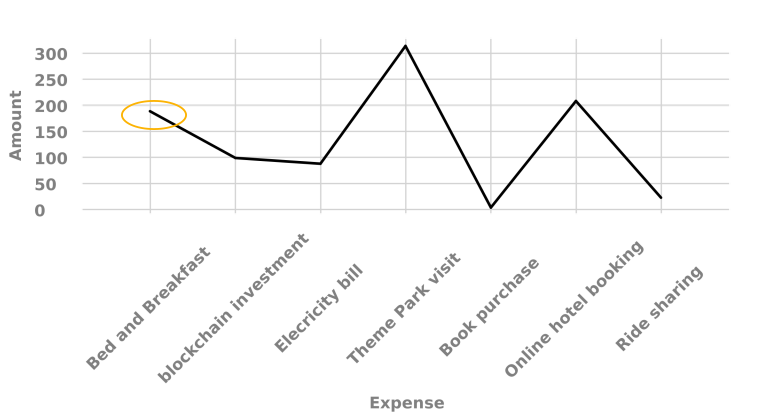

# 在互動式通信中使用圖表 {#using-charts-in-interactive-communications}

>[!CAUTION]
>
>AEM 6.4已結束延伸支援，本檔案不再更新。 如需詳細資訊，請參閱 [技術支援期](https://helpx.adobe.com//tw/support/programs/eol-matrix.html). 尋找支援的版本 [此處](https://experienceleague.adobe.com/docs/).

在互動式通信中使用圖表，可以將大量資訊濃縮成易於分析和理解的可視格式

圖表或圖表是資料的視覺表示。 它將大量資訊濃縮成易於理解的視覺格式，使互動式通信的接收方能夠更好地對複雜的資料進行可視化、解譯和分析。

建立互動式通訊時，您可以新增圖表，以從互動式通訊的表單資料模型以視覺化方式呈現二維資料。 圖表元件允許您添加和配置以下類型的圖表：

* 圓餅圖
* 欄
* 圈狀
* 長條圖（僅限Web頻道）
* Line
* 線條和點
* 點
* 區域

## 在互動式通訊中新增及設定圖表 {#add-and-configure-chart-in-an-interactive-communication}

完成下列步驟，將圖表新增至互動式通訊：

1. 從AEM側欄的「元件」中，拖放互動式通訊的列印或網頁通道中的下列其中一個：

   * 打印通道：目標區域和影像欄位
   * Web頻道：面板和目標區域

   掉格圖表元件會建立圖表的預留位置。

1. 在「互動式通訊」編輯器中點選圖表元件，然後從「元件」工具列中選取 **[!UICONTROL 配置(]** )。

   屬性邊欄隨焦點圖表的基本屬性一起出現。

   
   **圖：** *打印通道中線型圖的基本屬性*

   
   **圖：** *Web通道中線型圖的基本屬性*

1. 為打印通道和Web通道配置圖表的基本屬性。 除了通用屬性，還有專用於打印和Web通道以及圖表類型的屬性。

   * **[!UICONTROL 名稱]**:圖表對象的名稱。 您在此處指定的圖表名稱不會顯示在圖表輸出中，但用於引用圖表的規則中。
   * **[!UICONTROL 圖表類型]**:指定圖表類型：圓形、列、環圈、線、線和點、點或區域。
   * **[!UICONTROL 隱藏對象]**:選擇以隱藏最終輸出中的圖表。
   * 指定下列 **[!UICONTROL x軸]** 和 **[!UICONTROL y軸]**:

      * **[!UICONTROL 標題]**:指定要在「交互通信」中顯示的X和Y軸的標題。
      * **[!UICONTROL 資料模型物件*]**:從建立交互通信時指定的表單資料模型瀏覽並選擇圖表的X和Y軸的資料模型對象。 選擇相同父資料模型對象的兩個集合/陣列類型屬性，這些屬性彼此相對有意義，以在圖表的X和Y軸上繪製。
      * **[!UICONTROL 函式]**:要使用統計函式計算軸上的值，請選擇X/Y軸的函式。 如需函式的詳細資訊，請參閱 [在圖表中使用函式](#usefunction) 和 [範例2:求和函式與均值函式線上圖中的應用](#applicationsumfrequency).

   >[!NOTE]
   >
   >對於打印通道，在X軸上，綁定的資料模型對象應為「數字」、「字串」或「日期」類型。 在Y軸上，綁定的資料模型對象應為Number類型。 建議您在列印管道中使用右側圖例。

   如需圖表屬性的詳細資訊，請參閱 [圖表中的基本屬性](#basicpropertiescharts).

1. （僅打印通道）在「代理設定」中，指定代理是否必須使用此圖表。 如果 **[!UICONTROL t是代理使用此圖表的必填項目]** 選項，則代理可以在代理UI的「內容」頁簽中點選圖表的眼睛表徵圖以顯示/隱藏圖表。

   

1. 在「屬性」側邊欄中，點選 .

   預覽以查看圖表的外觀和資料。 如有必要，返回以重新設定圖表的屬性。

1. 返回到在互動式通信中進行其他更改。

## 範例1:打印和Web中的圖表輸出 {#chartoutputprintweb}

在「基本」頁簽中，可以定義圖表類型、包含資料的源表單資料模型屬性、要在圖表的x軸和y軸上繪製的標籤，以及可選的統計函式，以計算要在圖表上繪製的值。

讓我們在使用互動式通訊產生的信用卡對帳單的幫助下，詳細了解基本屬性中所需的最低資訊。 請考慮您要生成一個圖表來描述報表中不同費用的金額。 要使用不同類型的圖表來打印和Interactive Communication的Web輸出。

若要完成此操作，您需要指定：

* **[!UICONTROL 圖表類型]**  — 在此示例中，打印管道的列和Web管道的環圈
* **[!UICONTROL 資料模型物件]** 作為圖表的X和Y軸的源 — 在此示例中，X軸的事務處理金額和Y軸的費用名稱
* **[!UICONTROL 標題]** 對於X軸和Y軸（僅在此示例中針對打印通道中的列類型圖表） — 在此示例中，對於X軸，金額($)對於Y軸，對於費用。
* **[!UICONTROL 標籤方向]** （僅在此示例中，針對打印通道中的列類型圖表） — 在此示例中 `Tilt Left`

* **[!UICONTROL 工具提示]** 顯示在費用的滑鼠上（僅限Web通道） — 在此示例中 `${x}: $ ${y}`，顯示為 `[Expense Label: $ Amount]` (範例：主題公園參觀：315美元)


**圖：** *交互通信打印輸出中的清單*

**答：** Y軸 — 從表單資料模型屬性中擷取的金額，以及設為「金額」($)的「標題」屬性 **B.** 將X軸設定為左傾的標籤方向 **C.** X軸 — 從表單資料模型屬性和設定為「費用」的「標題」屬性中提取的費用說明


**圖：** *互動式通信Web輸出中的環圈圖*

**答：** 已設定環圈的「內半徑」屬性 **B.** 已選擇「顯示圖例」屬性，並將「圖例位置」屬性設定為「右」 **C.** 工具提示在滑鼠上顯示項的詳細資訊 — 工具提示設定為${x}:$ ${y}

## 範例2:和頻函式線上圖中的應用 {#applicationsumfrequency}

在圖表中套用函式，即可繪製非表單資料模型直接提供的資料。 在此示例中，我們使用信用卡對帳單示例來了解如何將總和和頻率函式應用於圖表。


**圖：** *線性圖，不含三個「Bed and Breakfast」交易的函式*

### 求和函式 {#sum-function}

您可以套用求和函式來加總相同資料屬性的多個例項的值，且只顯示一次。 例如，在下圖中，Sum函式應用在Y軸上，以加總三個Bed and Breakfast事務處理（$99.45、$78和$12）的金額，並且只顯示一個事務處理($189.45)。

當您想要對相同資料屬性的許多例項進行整理和顯示總和時，總和函式可讓圖表更實用。



### 頻率函式 {#frequency-function}

頻率函式返回X軸或Y軸上另一個軸上給定值的值數。 在Y軸上應用頻率函式(Amount/TransAmount)後，圖表顯示有三次出現「Bed and Breakfast」事務處理，另一次出現其餘類型的事務處理。


## 圖表中的基本屬性 {#basicpropertiescharts}

在「基本」索引標籤中，您可以設定下列屬性：

**名稱** 圖表元素的識別碼。 圖表上不會顯示名稱，但在參考其他元件、指令碼和SOM運算式中的元素時有幫助。

**標題（僅打印通道）** 指定圖表的標題。

**圖表類型** 指定要生成的圖表類型。 可用選項有餅圖、列、環圈圖、條形圖（僅限Web通道）、線條圖、線條圖和點、點和區域圖。 如需詳細資訊，請參閱範例1:打印和Web中的圖表輸出。

**X軸>標題** 指定x軸的標題。

**X軸>資料模型對象&amp;ast;** 指定要在x軸上繪製的表單資料模型收集項目的名稱。

**X軸>函式** 指定用於計算x軸上值的統計/自訂函式。 如需函式的詳細資訊，請參閱圖表中的使用函式和範例2:求和函式和均值函式線上圖中的應用

**X軸>標籤方向** 打印通道中圖表上標籤的方向。 如果選擇標籤的方向作為「自定義旋轉」(Custom Rotation)，則會出現「自定義旋轉角度（度）」(Custom Rotation Angle(deges))欄位。 在「自定旋轉角度（度）」(Custom Rotation Angle(degeres))欄位中，可以按15度的步驟選擇旋轉角度。

**Y軸>標題** 指定Y軸的標題。

**Y軸>資料模型對象&amp;ast;** 指定要在Y軸上繪製的表單資料模型收集項。 在「打印」通道中，Y軸的資料模型對象應為「編號」類型。

**Y軸>函式** 指定用於計算Y軸上值的統計/自訂函式。 如需函式的詳細資訊，請參閱圖表中的使用函式和範例2:求和函式和均值函式線上圖中的應用

**顯示圖例** 顯示圓形圖或環圈圖的圖例。

**圖例位置** 指定圖例相對於圖表的位置。 可用選項有「右」、「左」、「上」和「下」。

**高度（僅限列印通道）** 圖表的高度（像素）。

**寬度（僅限列印通道）** 圖表的寬度（像素）。

>[!NOTE]
>
>您可以使用樣式層或套用主題，控制Web通道中圖表的寬度。

**工具提示（僅限網頁通道）** 指定工具提示在Web通道圖表中資料點滑鼠上顯示的格式。 預設值為\${x}(\${y})。 根據圖表類型，當您將滑鼠指向圖表中的點、條或切片時，變數\${x}和\${y}將動態替換為x軸和y軸上的相應值，並顯示在工具提示中。

要禁用工具提示，請將工具提示欄位留空。 此選項不適用於折線圖和區域圖。 例如，請參閱 [範例1:打印和Web中的圖表輸出](#chartoutputprintweb).

**CSS類（僅限Web通道）** 在CSS類欄位中指定CSS類的名稱，以將自定義樣式應用到圖表。

**前段必填分頁符（僅限列印管道）** 選取「 」，在圖表前新增強制分頁符，並將圖表放在新頁面的頂端。

**之後強制分頁（僅限列印管道）** 選取「 」，在圖表後新增強制分頁符，並將圖表後的內容放在新頁面頂端。

**縮排（僅打印通道）** 從頁面左側指定圖表的縮排。

**圖表專屬設定** 除了常見設定外，還提供下列圖表專屬設定：

* **內半徑**:供環圈圖指定圖表中內圓的半徑（以像素為單位）。
* **線條顏色**:可用於折線圖、折線圖、點圖和面積圖，以指定圖表中折線顏色的十六進位值。
* **點顏色**:可用於點圖、折線圖和點圖，以指定圖表中點的顏色的十六進位值。

* **區域顏色**:區域圖可用於指定圖表中折線下區域顏色的十六進位值。

## 在圖表中使用函式 {#usefunction}

您可以設定圖表，使用統計函式從來源資料計算值，以便在圖表上繪製。 在圖表中套用函式，即可繪製非表單資料模型直接提供的資料。

雖然圖表元件附帶一些內建函式，但您可以編寫自己的函式，並將它們用於Web通道的圖表配置中。


>[!NOTE]
>
>您可以使用函式來計算圖表中X軸或Y軸的值。

### 預設函式 {#default-functions}

圖表元件預設提供下列函式：

**平均值** 傳回X或Y軸上其他軸上指定值的平均值。

**總和** 傳回X或Y軸上其他軸上指定值的所有值總和。

**最大值** 傳回X或Y軸上另一個軸上給定值的最大值。

**頻率** 傳回X軸或Y軸上其他軸上指定值的值數。

**範圍** 傳回X或Y軸上另一個軸上指定值之值的最大值與最小值之差。

**中位數** 傳回在X或Y軸上，將較高和較低值分隔為一半的值，以分隔另一個軸上的指定值。

**最低** 傳回X或Y軸上另一個軸上給定值的最小值。

**模式** 傳回值，在X或Y軸上，最常出現另一個軸上指定值的值

### Web通道中的自訂函式 {#custom-functions-in-web-channel}

除了在圖表中使用預設函式外，您還可以在JavaScript™中編寫自定義函式，並在Web通道的圖表元件的函式清單中使用這些函式。

函式以陣列或值和類別名稱作為輸入，並返回值。 例如：

```
Multiply(valueArray, category) {
 var val = 1;
 _.each(valueArray, function(value) {
 val = val * value;
 });
 return val;
}
```

撰寫自訂函式後，請執行下列操作，使其可用於圖表配置：

1. 在與相關互動式通訊相關聯的用戶端程式庫中新增自訂函式。 如需詳細資訊，請參閱 [設定提交動作](/help/forms/using/configuring-submit-actions.md) 和 [使用用戶端程式庫](/help/sites-developing/clientlibs.md).

1. 若要在「函式」下拉式清單中顯示自訂函式，請在CRXDe Lite中建立 `nt:unstructured` 節點（位於應用資料夾中），具有以下屬性：

   * 新增屬性 `guideComponentType` 值為 `fd/af/reducer`. （強制）
   * 新增屬性 `value` 填入自訂JavaScript™函式的完全限定名稱。 （必要），並將其值設為自訂函式的名稱，例如「乘」。
   * 新增屬性 `jcr:description` 以「函式」下拉式清單中顯示的自訂函式名稱。 例如， **乘**.
   * 新增屬性 `qtip` 值，此值將簡短說明自訂函式。 將指標暫留在 **函式** 下拉式清單。

1. 按一下 **全部儲存** 以儲存設定。

函式現在可在圖表中使用。
