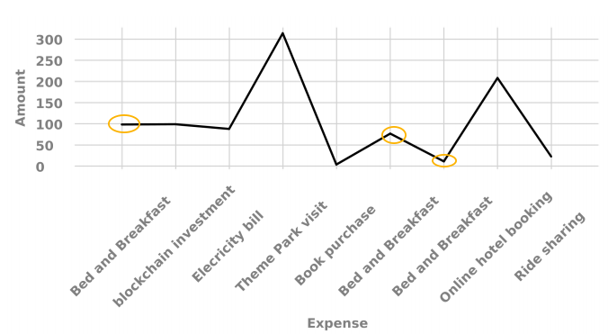

# 在互動通信中使用圖表{#using-charts-in-interactive-communications}

在互動式通訊中使用圖表，您可以將大量資訊濃縮成易於分析和瞭解的視覺格式

圖表或圖表是資料的視覺表示。 它將大量資訊匯整為簡單易懂的視覺化格式，讓互動式通訊的接收者能夠更清楚地視覺化、解譯和分析複雜的資料。

在建立互動式通訊時，您可以新增圖表，以視覺化方式呈現來自互動式通訊表單資料模型的二維資料。 圖表元件允許您添加和配置以下類型的圖表：

* 圓餅圖
* 欄
* 圈狀
* 橫條（僅限網頁頻道）
* Line
* 線條和點
* 點
* 區域

## 在互動式通訊{#add-and-configure-chart-in-an-interactive-communication}中新增及設定圖表

完成下列步驟，將圖表新增至互動式通訊：

1. 從AEM側欄的「元件」中，將「圖表」元件拖放至下列互動式通訊的列印或網路頻道之一：

   * 列印頻道：目標區域和影像欄位
   * 網路頻道：面板和目標區域

   放置的圖表元件會建立圖表的佔位符。

1. 在「Interactive Communication」（互動式通信）編輯器中按一下圖表元件，然後從「元件」工具欄中選擇「配置」(**** configure_icon

   屬性邊欄將顯示，焦點是圖表的基本屬性。

   
   **圖：列** *印通道中折線圖的基本屬性*

   
   **圖：** *Web通道中折線圖的基本屬性*

1. 為列印頻道和Web頻道配置圖表的基本屬性。 除了常用屬性外，還有特定於列印和Web頻道及圖表類型的屬性。

   * **[!UICONTROL 名稱]**:圖表對象的名稱。您在此處指定的圖表名稱不會出現在圖表輸出中，但會用於規則中以參考圖表。
   * **[!UICONTROL 圖表類型]**:指定圖表類型：圓形、圓柱、環圈、線、線和點、點或區域。
   * **[!UICONTROL 隱藏對象]**:選擇該選項可在最終輸出中隱藏圖表。
   * 為&#x200B;**[!UICONTROL x軸]**&#x200B;和&#x200B;**[!UICONTROL y軸]**&#x200B;指定下列項目：

      * **[!UICONTROL 標題]**:指定要在「互動式通訊」中顯示的X和Y軸標題。
      * **[!UICONTROL 資料模型物件*]**:從建立交互通信時指定的表單資料模型中瀏覽並選擇圖表的X和Y軸的資料模型對象。選擇相同父資料模型對象的兩個收集／陣列類型屬性，這些屬性相對於彼此有意義，以在圖表的X和Y軸上繪製圖。
      * **[!UICONTROL 函式]**:要使用統計函式計算軸上的值，請為X/Y軸選擇函式。有關函式的詳細資訊，請參見[Use functions in chart](#usefunction)和[ Example 2:求和和和均值函式在折線圖中的應用](#applicationsumfrequency)

   >[!NOTE]
   >
   >對於打印通道，在X軸上，您綁定的資料模型對象應為「編號」(Number)、「字串」(String)或「日期」(Date)類型。 在Y軸上，綁定的資料模型對象應為Number類型。 建議您使用列印頻道中的右側圖例。

   有關圖表屬性的詳細資訊，請參閱圖表](#basicpropertiescharts)中的[基本屬性。

1. （僅限列印渠道）在「代理設定」中，指定代理是否必須使用此圖表。 如果&#x200B;**[!UICONTROL t是代理使用的必備選項未選擇此圖表]**&#x200B;選項，則代理可以在代理UI的「內容」頁籤中點選圖表的眼睛表徵圖以顯示／隱藏圖表。

   

1. 在「屬性」側欄中，點選。

   預覽以查看圖表的外觀和資料。 返回以重新配置圖表的屬性（如果需要）。

1. 回到互動式通訊中進行其他變更。

## 範例1:列印和網頁中的圖表輸出{#chartoutputprintweb}

在「基本」頁籤中，您定義圖表類型、包含資料的源表單資料模型屬性、要在圖表的x軸和y軸上繪製的標籤，以及可選的統計函式，以計算在圖表上繪製的值。

讓我們在使用互動式通訊產生的信用卡對帳單的協助下，詳細瞭解基本屬性中最低要求的資訊。 請考慮您要生成一個圖表來描述語句中不同費用的金額。 您希望使用不同類型的圖表來輸出互動式通訊的平面和網頁。

若要完成此作業，您必須指定：

* **[!UICONTROL 圖表類型]** -在此範例中，列印渠道的欄和Web渠道的環圈
* **[!UICONTROL 資料模]** 型對象作為圖表X軸和Y軸的源——在本例中，X軸的事務處理金額和Y軸的費用名稱
* **[!UICONTROL X]** 軸和Y軸的標題（僅在此示例中，列類型圖表）-在此示例中，X軸的標題為Amount($),Y軸的標題為Expense。
* **[!UICONTROL 標籤方向]** （僅在此示例中，用於打印通道中的列類型圖表）-在此示例中  `Tilt Left`

* **[!UICONTROL 工]** 具表顯示在費用的滑鼠上方（僅限Web渠道）-在此例中 `${x}: $ ${y}`，顯示為 `[Expense Label: $ Amount]` (示例：主題公園之旅：315美元)


**Communication打印輸出中的列** *表圖：Interactive Communication打印輸出中的清單*

**A.** Y axis —— 從表單資料模型屬性提取的金額，Title屬性設定為Amount($) **B.** Label Direction of X-axis設定為Tilt Left  **C.** X Axis —— 從表單資料模型屬性提取的費用說明，Title屬性設定為Expense


**CommunicationFigure:Donut圖在Interactive Communication的Web輸** *出中的環圈圖*

**環圈的** Inner Radius屬性已設定 **B。** Show Legend屬性已選取，而Legend Position屬性已設為Right  **C.** Tooltip在滑鼠上方顯示項目的詳細資料- Tooltip設定為${x}:$ ${y}

## 範例2:和頻函式線上圖{#applicationsumfrequency}中的應用

在圖表中套用函式，即可繪製表格資料模型未直接提供的資料。 在此範例中，我們使用信用卡對帳單範例來瞭解如何將總和和和頻率函式套用至圖表。


**務圖：** *無函式的折線圖有三個「Bed and Breakfast」事務*

### Sum函式{#sum-function}

您可以套用sum函式，將多個相同資料屬性例項的值相加，並只顯示一次。 例如，在下圖中，Sum函式會套用在Y軸上，以加總三個「住宿加早餐」事務處理（$99.45、$78和$12）的金額，並且只顯示一個事務處理($189.45)。

Sum函式可讓圖形在您想要拼貼和顯示相同資料屬性之許多例項的sum時更有用。


### 頻率函式{#frequency-function}

「頻率」(Frequency)函式返回X或Y軸上另一個軸上給定值的值數。 在Y軸上應用Frequency函式(Amount/TransAmount)時，圖表顯示Bed and Breakfast事務已發生三次，其餘事務類型已發生一次。


## 圖表{#basicpropertiescharts}中的基本屬性

在「基本」索引標籤中，您可以設定下列屬性：

**名** 稱圖表元素的識別碼。名稱在圖表上不可見，但在參照其他元件、指令碼和SOM運算式中的元素時會有所幫助。

**標題（僅限列印頻道）** 指定圖表的標題。

**圖** 表類型指定要產生的圖表類型。可用的選項有圓形圖、欄、環圈圖、橫條圖（僅限Web通道）、線條圖、線條圖和點圖、點圖和區域圖。 如需詳細資訊，請參閱範例1:列印和網頁中的圖表輸出。

**X軸>標** 題指定x軸的標題。

**X軸>資料模型對象&amp;ast;** 指定要在X軸上繪製的表單資料模型收集項的名稱。

**X軸>函** 數指定用於計算X軸上值的統計／自訂函式。如需函式的詳細資訊，請參閱圖表中的使用函式和範例2:求和與均值函式在折線圖中的應用

**X軸>標籤方** 向列印通道中圖表上標籤的方向。如果選擇標籤的方向作為「自定義旋轉」，則會出現「自定義旋轉角度（度）」欄位。 在「自訂旋轉角度（度）」欄位中，您可以以15度的步驟選擇旋轉角度。

**Y軸>標** 題指定Y軸的標題。

**Y軸>資料模型對象&amp;ast;** 指定要在Y軸繪製的表單資料模型收集項。在「打印」通道中，Y軸的資料模型對象應為「編號」類型。

**Y軸>函** 數指定用於計算Y軸上值的統計／自訂函式。如需函式的詳細資訊，請參閱圖表中的使用函式和範例2:求和與均值函式在折線圖中的應用

**顯示** 圖例啟用時顯示圓形圖或環圈圖的圖例。

**圖** 例位置指定圖例相對於圖表的位置。可用的選項有「右」、「左」、「上」和「下」。

**高度（僅限列印色版）** 圖表的高度（以像素為單位）。

**寬度（僅限列印色版）** 圖表的寬度（以像素為單位）。

>[!NOTE]
>
>您可以使用樣式圖層或套用主題，控制Web頻道中圖表的寬度。

**工具提示（僅限網頁色版）** 指定工具提示在網頁色版中圖表資料點上滑鼠移動時顯示的格式。預設值為\${x}(\${y})。 根據圖表類型，當您將滑鼠指向圖表中的點、長條或切片時，變數\${x}和\${y}會動態取代為x軸和y軸上的對應值，並顯示在工具提示中。

若要停用工具提示，請將「工具提示」欄位留空。 此選項不適用於折線圖和面積圖。 例如，請參閱[範例1:列印和網頁中的圖表輸出](#chartoutputprintweb)。

**CSS類別（僅限Web頻道）** 在CSS類別欄位中指定CSS類別的名稱，以將自訂樣式套用至圖表。

**前段必要分頁符（僅限列印渠道）** 選擇在圖表前面新增必要分頁符，並將圖表置於新頁面的頂端。

**之後強制分頁（僅限列印渠道）** 選取以在圖表後新增強制分頁，並將圖表後面的內容置於新頁面的頂端。

**縮排（僅限列印渠道）** 指定從頁面左側縮排圖表。

**圖表特定** 配置除了常用配置外，還提供以下圖表特定配置：

* **內半徑**:可用於環圈圖，以指定圖表中內圓的半徑（以像素計）。
* **線條顏色**:可用於折線圖、折線圖、點圖和面積圖，以指定圖表中折線的十六進位顏色值。
* **點顏色**:可用於點圖和折線圖和點圖，以指定圖表中點的顏色十六進位值。

* **區域顏色**:可用於區域圖，以指定圖表折線下方區域顏色的十六進位值。

## 在圖表{#usefunction}中使用函式

您可以設定圖表，使用統計函式從來源資料計算值，以便在圖表上繪圖。 在圖表中套用函式，即可繪製表格資料模型未直接提供的資料。

雖然圖表元件隨附一些內建函式，但您可以編寫自己的函式，並將它們用於網頁頻道的圖表設定中。


>[!NOTE]
>
>您可以使用函式來計算圖表中X軸或Y軸的值。

### 預設函式{#default-functions}

Chart元件預設提供以下函式：

**平均值（平均值）** 傳回X或Y軸上其他軸上指定值之平均值。

**總** 和返回X軸或Y軸上另一個軸上給定值的所有值總和。

**最** 大值返回X或Y軸上其它軸上給定值的最大值。

**頻** 率傳回X或Y軸上另一個軸上給定值的值數。

**范** 圍傳回X或Y軸上其他軸上指定值的最大值與最小值之差。

**中** 值傳回在X或Y軸上，對於另一個軸上的指定值，將較高值和較低值分隔一半的值。

**最** 小值返回X或Y軸上其它軸上給定值的最小值。

**模** 式傳回X或Y軸上最常出現的值，其他軸上的指定值出現次數最多

### Web頻道{#custom-functions-in-web-channel}中的自訂函式

除了使用圖表中的預設函式外，您還可以在JavaScript™中編寫自訂函式，並將它們列在Web頻道的圖表元件的函式清單中。

函式將陣列或值和類別名稱作為輸入並返回值。 例如：

```
Multiply(valueArray, category) {
 var val = 1;
 _.each(valueArray, function(value) {
 val = val * value;
 });
 return val;
}
```

編寫自訂函式後，請執行下列動作，以便在圖表設定中使用：

1. 將自訂函式新增至與相關互動式通訊關聯的用戶端程式庫。 如需詳細資訊，請參閱[設定提交動作](/help/forms/using/configuring-submit-actions.md)和[使用用戶端程式庫](/help/sites-developing/clientlibs.md)。

1. 若要在「函式」下拉式清單中顯示自訂函式，請在CRXDe Lite中，使用下列屬性在apps資料夾中建立`nt:unstructured`節點：

   * 新增`guideComponentType`屬性，其值為`fd/af/reducer`。 （強制）
   * 將屬性`value`新增至自訂JavaScript™函式的完全限定名稱。 （必要），並將其值設為自訂函式的名稱，例如「乘法」。
   * 新增屬性`jcr:description`，其中包含您要顯示為「函式」下拉式清單中自訂函式名稱的值。 例如，**Pulmy**。
   * 新增屬性`qtip`，其值將是自訂函式的簡短說明。 當將指標暫留在&#x200B;**Function**&#x200B;下拉式清單中的函式名稱上時，它會顯示為工具提示。

1. 按一下&#x200B;**保存所有**&#x200B;保存配置。

函式現在可用於圖表中。