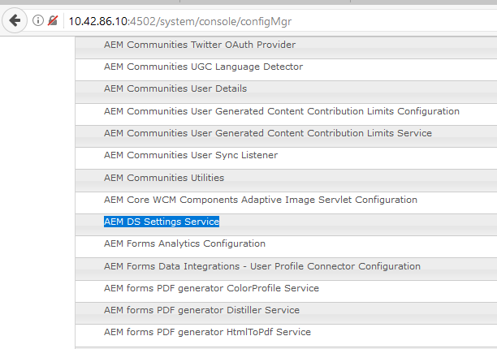

# 設定AEM DS設定{#configuring-aem-ds-settings}

本文說明如何設定&#x200B;**AEM DS Settings Service**。 此設定可用於多個藍本，例如：

* 在通信管理中

   * 若要設定AEM Forms工作流程
   * 使用表單入口網站遠端儲存草稿／提交

* 在最適化表單中，當從發佈例項提交最適化表單時

以下是設定&#x200B;**[!UICONTROL AEM DS設定]**&#x200B;的步驟：

1. 使用URL在發佈例項上開啟「設定管理員」:

   *http://localhost:port/system/console/configMgr*.

   

1. 在&#x200B;**[!UICONTROL Adobe Experience Manager Web Console Configuration]**&#x200B;視窗中，找到並按一下&#x200B;**[!UICONTROL AEM DS Settings]**&#x200B;選項。

   

1. **[!UICONTROL AEM DS設定服務]**&#x200B;視窗會顯示AEM DS元件的常用組態設定。

   

1. 在各自的欄位中新增下列資訊：

   **[!UICONTROL 處理伺服器URL]**:「處理伺服器」是需要觸發表單或AEM工作流程的伺服器。這可以與AEM作者例項的URL或其他伺服器URL(即http:// localhost:port/)相同。

   **[!UICONTROL 處理伺服器用戶名]**:根據所使用的伺服器URL, [工作流程使用者的使用者名稱]

   **[!UICONTROL 處理伺服器密碼]**:工作流用戶密碼

   >[!NOTE]
   >
   >* 使用表單或AEM工作流程時，在您從發佈伺服器提交任何內容之前，必須先設定DS設定服務。 否則，提交表單應當失敗。

