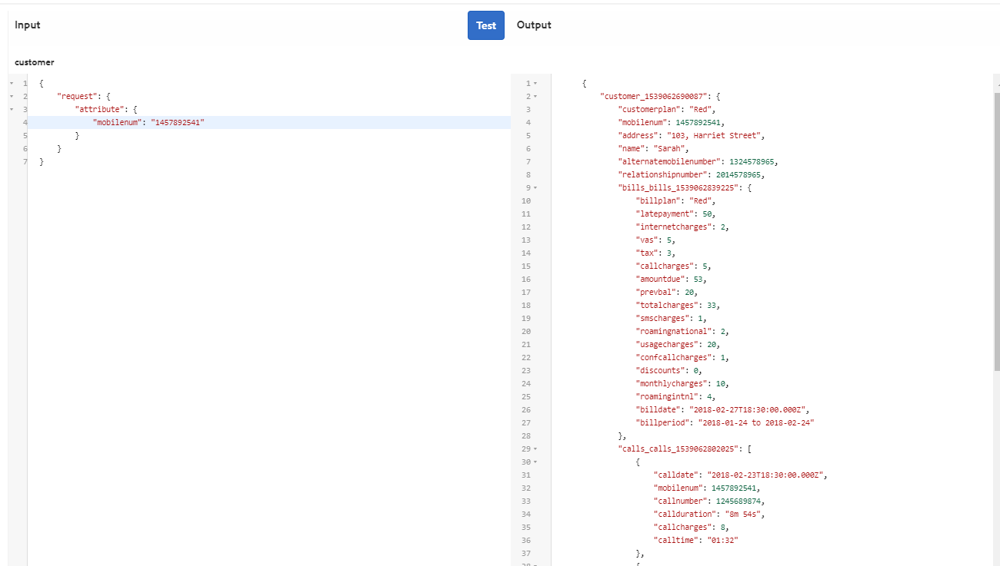

# 教學課程：建立表單資料模型{#tutorial-create-form-data-model}

建立互動式通訊的表單資料模型


本教學課程是[建立您第一個互動式通訊](/help/forms/using/create-your-first-interactive-communication.md)系列中的步驟。 建議依序依序依序排列，以瞭解、執行和展示完整的教學課程使用案例。

## 關於教學課程{#about-the-tutorial}

AEM Forms資料整合模組允許您從不同的後端資料源建立表單資料模型AEM，如用戶配置檔案、REST風格的Web服務、基於SOAP的Web服務、OData服務和關係資料庫。 您可以在表單資料模型中配置資料模型對象和服務，並將其與自適應表單關聯。 最適化表單欄位會系結至資料模型物件屬性。 這些服務可讓您預先填寫最適化表單，並將提交的表單資料寫回資料模型物件。

如需表單資料整合與表單資料模型的詳細資訊，請參閱[AEM Forms資料整合](data-integration.md)。

本教學課程會逐步帶您準備、建立、設定表單資料模型，並將之與互動式通訊建立關聯。 在本教學課程結束時，您將能夠：

* [設定資料庫](#step-set-up-the-database)
* [將MySQL資料庫配置為資料源](#step-configure-mysql-database-as-data-source)
* [建立表單資料模型](#step-create-form-data-model)
* [設定表單資料模型](#step-configure-form-data-model)
* [測試表單資料模型](#step-test-form-data-model-and-services)

表單資料模型看起來類似下列：


**A.** Configured data sources  **B.** Data sources結構 **C.** Available services  **D.** D. **** Dobjects configured E.E.D.D.D.D.D.D.D.Services服務

## 必備條件 {#prerequisites}

開始之前，請確定您有下列項目：

* 具有[設定資料庫](#step-set-up-the-database)部分中所述示例資料的MySQL資料庫。
* MySQL JDBC驅動程式的OSGi捆綁包，如[捆綁JDBC資料庫驅動程式](https://helpx.adobe.com/experience-manager/6-3/sites-developing/jdbc.html#bundling-the-jdbc-database-driver)中所述

## 步驟1:設定資料庫{#step-set-up-the-database}

建立互動式通訊時，資料庫是不可或缺的。 本教學課程使用資料庫來顯示「表單資料模型」和「互動式通訊」的永續性功能。 設定包含客戶、帳單和呼叫表的資料庫。\
下圖說明客戶表格的示例資料：


使用以下DDL語句在資料庫中建立&#x200B;**customer**&#x200B;表。

```sql
CREATE TABLE `customer` (
   `mobilenum` int(11) NOT NULL,
   `name` varchar(45) NOT NULL,
   `address` varchar(45) NOT NULL,
   `alternatemobilenumber` int(11) DEFAULT NULL,
   `relationshipnumber` int(11) DEFAULT NULL,
   `customerplan` varchar(45) DEFAULT NULL,
   PRIMARY KEY (`mobilenum`),
   UNIQUE KEY `mobilenum_UNIQUE` (`mobilenum`)
 ) ENGINE=InnoDB DEFAULT CHARSET=utf8
```

使用以下DDL語句在資料庫中建立&#x200B;**bills**&#x200B;表。

```sql
CREATE TABLE `bills` (
   `billplan` varchar(45) NOT NULL,
   `latepayment` decimal(4,2) NOT NULL,
   `monthlycharges` decimal(4,2) NOT NULL,
   `billdate` date NOT NULL,
   `billperiod` varchar(45) NOT NULL,
   `prevbal` decimal(4,2) NOT NULL,
   `callcharges` decimal(4,2) NOT NULL,
   `confcallcharges` decimal(4,2) NOT NULL,
   `smscharges` decimal(4,2) NOT NULL,
   `internetcharges` decimal(4,2) NOT NULL,
   `roamingnational` decimal(4,2) NOT NULL,
   `roamingintnl` decimal(4,2) NOT NULL,
   `vas` decimal(4,2) NOT NULL,
   `discounts` decimal(4,2) NOT NULL,
   `tax` decimal(4,2) NOT NULL,
   PRIMARY KEY (`billplan`)
 ) ENGINE=InnoDB DEFAULT CHARSET=utf8
```

使用以下DDL語句在資料庫中建立&#x200B;**calls**&#x200B;表。

```sql
CREATE TABLE `calls` (
   `mobilenum` int(11) DEFAULT NULL,
   `calldate` date DEFAULT NULL,
   `calltime` varchar(45) DEFAULT NULL,
   `callnumber` int(11) DEFAULT NULL,
   `callduration` varchar(45) DEFAULT NULL,
   `callcharges` decimal(4,2) DEFAULT NULL,
   `calltype` varchar(45) DEFAULT NULL
 ) ENGINE=InnoDB DEFAULT CHARSET=utf8
```

**呼叫**&#x200B;表包括呼叫詳細資訊，如呼叫日期、呼叫時間、呼叫號碼、呼叫持續時間和呼叫費用。 **customer**&#x200B;表格使用「行動號碼(mobilenum)」欄位連結至呼叫表格。 對於&#x200B;**customer**&#x200B;表中列出的每個移動號碼，**calls**&#x200B;表中有多個記錄。 例如，您可以參照&#x200B;**calls**&#x200B;表來檢索&#x200B;**1457892541**&#x200B;移動號碼的呼叫詳細資訊。

**bills**&#x200B;表格包含帳單詳細資訊，例如帳單日期、帳單期間、每月費用和通話費用。 **customer**&#x200B;表使用「清單計畫」欄位連結到&#x200B;**bills**&#x200B;表。 **customer**&#x200B;表中有與每個客戶關聯的計畫。 **bills**&#x200B;表格包含所有現有計畫的定價詳細資訊。 例如，您可以從&#x200B;**customer**&#x200B;表中檢索&#x200B;**Sarah**&#x200B;的計畫詳細資訊，並使用這些詳細資訊從&#x200B;**bills**&#x200B;表中檢索定價詳細資訊。

## 步驟2:將MySQL資料庫配置為資料源{#step-configure-mysql-database-as-data-source}

您可以設定不同類型的資料來源以建立表單資料模型。 在本教程中，您將配置已配置並填入示例資料的MySQL資料庫。 如需其他支援資料來源的詳細資訊以及如何設定這些資料來源，請參閱「AEM Forms資料整合」。[](data-integration.md)

執行下列操作以配置MySQL資料庫：

1. 將MySQL資料庫的JDBC驅動程式作為OSGi包安裝：

   1. 以管理員身分登入AEM Forms作者例項，並前往AEMWeb主控台組合。 預設URL為[http://localhost:4502/system/console/bundles](http://localhost:4502/system/console/bundles)。
   1. 點選&#x200B;**安裝／更新**。 出現&#x200B;**上傳／安裝包**&#x200B;對話框。
   1. 點選&#x200B;**選擇檔案**&#x200B;以瀏覽並選擇MySQL JDBC驅動程式OSGi包。 選擇&#x200B;**啟動Bundle**&#x200B;和&#x200B;**刷新包**，然後按一下&#x200B;**安裝**&#x200B;或&#x200B;**更新**。 確保Oracle公司的MySQL JDBC驅動程式處於活動狀態。 已安裝驅動程式。

1. 將MySQL資料庫配置為資料源：

   1. 前往AEM位於[http://localhost:4502/system/console/configMgr](http://localhost:4502/system/console/configMgr)的Web主控台。
   1. 找到&#x200B;**Apache Sling Connection Pooled DataSource**&#x200B;組態。 點選以在編輯模式中開啟設定。
   1. 在設定對話方塊中，指定下列詳細資訊：

      * **資料來源名稱：** 您可以指定任何名稱。例如，指定&#x200B;**MySQL**。
      * **DataSource服務屬性名稱**:指定包含DataSource名稱的服務屬性名稱。在將資料源實例註冊為OSGi服務時指定。 例如，**datasource.name**。
      * **JDBC驅動程式類**:指定JDBC驅動程式的Java類名。對於MySQL資料庫，請指定&#x200B;**com.mysql.jdbc.Driver**。
      * **JDBC連接URI**:指定資料庫的連線URL。對於在埠3306和模式teleca上運行的MySQL資料庫，URL為：`jdbc:mysql://[server]:3306/teleca?autoReconnect=true&useUnicode=true&characterEncoding=utf-8`
      * **用戶名：** 資料庫的用戶名。必須啟用JDBC驅動程式才能與資料庫建立連接。
      * **密碼：** 資料庫的密碼。必須啟用JDBC驅動程式才能與資料庫建立連接。
      * **借閱時測試：** 啟用 **Test on** Borrow選項。
      * **Test on Return:** Enable the  **Test on** Returnoption.
      * **驗證查詢：** 指定SQL SELECT查詢以驗證池中的連接。查詢至少必須返回一行。 例如，**選擇&amp;ast;來自客戶**。
      * **事務隔離**:將值設定為 **READ_COMMITTED**。

   將其他屬性保留為預設值[值](https://tomcat.apache.org/tomcat-7.0-doc/jdbc-pool.html)並點選&#x200B;**保存**。

   系統會建立類似下列的設定。

   

## 步驟3:建立表單資料模型{#step-create-form-data-model}

AEM Forms提供直覺式使用者介面，以從設定的資料來源建立表單資料模式。 [](data-integration.md)您可以在表單資料模型中使用多個資料來源。 在本教程中，您將使用MySQL作為資料源。

執行下列動作以建立表單資料模型：

1. 在作AEM者例項中，導覽至&#x200B;**Forms** > **資料整合**。
1. 點選「**建立** > **表單資料模型**」。
1. 在「建立表單資料模型」嚮導中，為表單資料模型指定&#x200B;**name**。 例如，**FDM_Create_First_IC**。 點選&#x200B;**Next**。
1. 選取資料來源畫面會列出所有已設定的資料來源。 選擇&#x200B;**MySQL**&#x200B;資料源並按一下&#x200B;**建立**。

   

1. 按一下&#x200B;**Done**。 建立&#x200B;**FDM_Create_First_IC**&#x200B;表單資料模型。

## 步驟4:配置表單資料模型{#step-configure-form-data-model}

設定表單資料模型包括：

* [添加資料模型對象和服務](#add-data-model-objects-and-services)
* [建立資料模型對象的計算子屬性](#create-computed-child-properties-for-data-model-object)
* [添加資料模型對象之間的關聯](#add-associations-between-data-model-objects)
* [編輯資料模型對象屬性](#edit-data-model-object-properties)
* [為資料模型對象配置服務](#configure-services)

### 添加資料模型對象和服務{#add-data-model-objects-and-services}

1. 在作AEM者例項上，導覽至&#x200B;**Forms** > **資料整合**。 預設URL為[http://localhost:4502/aem/forms.html/content/dam/formsanddocuments-fdm](http://localhost:4502/aem/forms.html/content/dam/formsanddocuments-fdm)。
1. 此處列出了您先前建立的&#x200B;**FDM_Create_First_IC**&#x200B;表單資料模型。 選擇它，然後點選&#x200B;**編輯**。

   選定的資料源&#x200B;**MySQL**&#x200B;顯示在&#x200B;**資料源**&#x200B;窗格中。

   

1. 展開&#x200B;**MySQL**&#x200B;資料源樹。 從&#x200B;**teleca**&#x200B;架構中選擇以下資料模型對象和服務：

   * **資料模型物件**:

      * bills
      * 呼叫
      * 客戶
   * **服務:**

      * get
      * 更新

   點選「**新增選取的**」，將選取的資料模型物件和服務新增至表單資料模型。

   

   清單、呼叫和客戶資料模型對象顯示在&#x200B;**Model**&#x200B;頁籤的右窗格中。 get和update服務顯示在&#x200B;**Services**&#x200B;頁籤中。

   

### 為資料模型對象{#create-computed-child-properties-for-data-model-object}建立計算子屬性

計算屬性是根據規則或表達式計算其值的屬性。 使用規則，可以將計算屬性的值設定為文本字串、數字、數學表達式的結果或表單資料模型中其他屬性的值。

根據使用案例，使用以下數學表達式在&#x200B;**bills**&#x200B;資料模型對象中建立&#x200B;**usagecharges**&#x200B;子計算屬性：

* 使用費=通話費+會議通話費+ SMS費+移動網際網路費+漫遊國家+漫遊國際+ VAS（所有這些屬性都存在於帳單資料模型對象中）

   有關&#x200B;**usagecharges**&#x200B;子計算屬性的詳細資訊，請參閱[規劃互動式通信](/help/forms/using/planning-interactive-communications.md)。

執行以下步驟為清單資料模型對象建立計算子屬性：

1. 選中&#x200B;**bills**&#x200B;資料模型對象頂部的複選框以選擇它，然後點選&#x200B;**建立子屬性**。
1. 在&#x200B;**建立子屬性**&#x200B;窗格中：

   1. 輸入&#x200B;**usagecharges**&#x200B;作為子屬性的名稱。
   1. 啟用&#x200B;**Computed**。
   1. 選擇&#x200B;**Float**&#x200B;作為類型，並點選&#x200B;**Done**&#x200B;將子屬性添加到&#x200B;**bills**&#x200B;資料模型對象。

   

1. 點選&#x200B;**編輯規則**&#x200B;以開啟規則編輯器。
1. 點選&#x200B;**Create**。 將開啟&#x200B;**設定值**&#x200B;規則窗口。
1. 從「選擇選項」下拉式清單中，選擇「數學運算式」。****

   

1. 在數學表達式中，分別選擇&#x200B;**callcharges**&#x200B;和&#x200B;**confcallcharges**&#x200B;作為第一和第二對象。 選擇&#x200B;**plus**&#x200B;作為運算子。 在數學運算式中點選並點選「延伸運算式」****&#x200B;以新增&#x200B;**smscharges**、**internetcharges**、**roamingnational**、**roamingintnl**&#x200B;和&#x200B;**vas**&#x200B;對象。

   下圖描述了規則編輯器中的數學表達式：

   

1. 點選&#x200B;**Done**。 規則會在規則編輯器中建立。
1. 點選「**關閉**」以關閉「規則編輯器」視窗。

### 在資料模型對象{#add-associations-between-data-model-objects}之間添加關聯

定義資料模型對象後，您可以在它們之間建立關聯。 關聯可以是一對一或一對多。 例如，可以有多個與員工關聯的家屬。 它被稱為一對多關聯，在連接相關資料模型對象的線上以1:n表示。 但是，如果關聯為給定的員工ID返回唯一的員工名稱，則稱為一對一關聯。

將資料源中的關聯資料模型對象添加到表單資料模型時，它們的關聯將保留並顯示為通過箭頭線連接。

根據使用案例，在資料模型物件之間建立下列關聯：

| 關聯 | 資料模型物件 |
|---|---|
| 1:n | customer:calls（每月帳單中可將多個呼叫與客戶關聯） |
| 1:1 | 客戶：清單（一個清單與特定月份的客戶關聯） |

執行以下步驟以建立資料模型對象之間的關聯：

1. 選中&#x200B;**customer**&#x200B;資料模型對象頂部的複選框以選擇它，然後點選&#x200B;**添加關聯**。 將開啟&#x200B;**添加關聯**&#x200B;屬性窗格。
1. 在&#x200B;**添加關聯**&#x200B;窗格中：

   * 指定關聯的標題。 此欄位為選擇性欄位。
   * 從&#x200B;**Type**&#x200B;下拉式清單中選擇&#x200B;**一對多**。
   * 從&#x200B;**模型對象**&#x200B;下拉清單中選擇&#x200B;**calls**。
   * 從&#x200B;**Service**&#x200B;下拉式清單中選擇&#x200B;**get**。
   * 點選「**新增**」，使用屬性將&#x200B;**customer**&#x200B;資料模型物件連結至&#x200B;**呼叫**&#x200B;資料模型物件。 根據使用案例，呼叫資料模型物件必須連結至客戶資料模型物件中的行動號碼屬性。 將開啟&#x200B;**添加參數**&#x200B;對話框。

   

1. 在&#x200B;**添加參數**&#x200B;對話框中：

   * 從&#x200B;**名稱**&#x200B;下拉式清單中選擇&#x200B;**mobilenum**。 行動編號屬性是客戶和呼叫資料模型物件中的通用屬性。 因此，它用於建立客戶和調用資料模型對象之間的關聯。

      對於客戶資料模型對象中可用的每個移動號碼，呼叫表中有多個可用呼叫記錄。

   * 指定引數的可選標題和說明。
   * 從&#x200B;**綁定到**&#x200B;下拉清單中選擇&#x200B;**customer**。
   * 從&#x200B;**捆綁值**&#x200B;下拉式清單中選擇&#x200B;**mobilenum**。
   * 點選&#x200B;**Add**。

   

   mobilenum屬性顯示在&#x200B;**Arguments**&#x200B;部分。

   

1. 點選&#x200B;**Done**&#x200B;可建立客戶與呼叫資料模型物件之間的1:n關聯。

   在客戶和呼叫資料模型對象之間建立關聯後，在客戶和清單資料模型對象之間建立1:1關聯。

1. 選中&#x200B;**customer**&#x200B;資料模型對象頂部的複選框以選擇它，然後點選&#x200B;**添加關聯**。 將開啟&#x200B;**添加關聯**&#x200B;屬性窗格。
1. 在&#x200B;**添加關聯**&#x200B;窗格中：

   * 指定關聯的標題。 此欄位為選擇性欄位。
   * 從&#x200B;**Type**&#x200B;下拉式清單中選擇&#x200B;**一對一**。
   * 從&#x200B;**模型對象**&#x200B;下拉清單中選擇&#x200B;**bills**。
   * 從&#x200B;**Service**&#x200B;下拉式清單中選擇&#x200B;**get**。 **billplan**&#x200B;屬性是清單表的主鍵，已在&#x200B;**Arguments**&#x200B;部分中提供。

      清單和客戶資料模型對象分別使用開單計畫（清單）和客戶計畫（客戶）屬性進行連結。 在這些屬性之間建立綁定，以檢索MySQL資料庫中任何可用客戶的計畫詳細資訊。

   * 從&#x200B;**綁定到**&#x200B;下拉清單中選擇&#x200B;**customer**。
   * 從&#x200B;**綁定值**&#x200B;下拉清單中選擇&#x200B;**customerplan**。
   * 點選&#x200B;**Done**&#x200B;可在計費計畫和客戶計畫屬性之間建立綁定。

   

   下圖描述了資料模型對象和用於建立它們之間關聯的屬性之間的關聯：

   

### 編輯資料模型對象屬性{#edit-data-model-object-properties}

在建立客戶與其他資料模型物件之間的關聯後，編輯客戶屬性以定義從資料模型物件擷取資料的屬性。 根據使用案例，使用行動號碼作為屬性，從客戶資料模型物件擷取資料。

1. 選擇&#x200B;**customer**&#x200B;資料模型對象頂部的複選框以選擇它，然後點選&#x200B;**編輯屬性**。 將開啟&#x200B;**編輯屬性**&#x200B;窗格。
1. 將&#x200B;**customer**&#x200B;指定為&#x200B;**頂層模型對象**。
1. 從&#x200B;**讀取服務**&#x200B;下拉式清單中選擇&#x200B;**get**。
1. 在&#x200B;**參數**&#x200B;部分：

   * 從&#x200B;**綁定到**&#x200B;下拉清單中選擇&#x200B;**請求屬性**。
   * 指定&#x200B;**mobilenum**&#x200B;作為綁定值。

1. 從&#x200B;**Write** Service（服務）下拉清單中選擇&#x200B;**update**。
1. 在&#x200B;**參數**&#x200B;部分：

   * 對於&#x200B;**mobilenum**&#x200B;屬性，從&#x200B;**綁定到**&#x200B;下拉式清單中選擇&#x200B;**customer**。
   * 從&#x200B;**捆綁值**&#x200B;下拉式清單中選擇&#x200B;**mobilenum**。

1. 點選「**Done**」以儲存屬性。

   

1. 選中&#x200B;**calls**&#x200B;資料模型物件頂端的核取方塊以加以選取，然後點選&#x200B;**編輯屬性**。 將開啟&#x200B;**編輯屬性**&#x200B;窗格。
1. 針對&#x200B;**呼叫**&#x200B;資料模型物件停用&#x200B;**頂層模型物件**。
1. 點選&#x200B;**Done**。

   重複步驟8 - 10以配置&#x200B;**bills**&#x200B;資料模型對象的屬性。

### 配置服務{#configure-services}

1. 轉到&#x200B;**服務**&#x200B;頁籤。
1. 選擇&#x200B;**get**&#x200B;服務，然後點選&#x200B;**編輯屬性**。 將開啟&#x200B;**編輯屬性**&#x200B;窗格。
1. 在&#x200B;**編輯屬性**&#x200B;窗格中：

   * 輸入可選標題和說明。
   * 從&#x200B;**輸出模型對象**&#x200B;下拉清單中選擇&#x200B;**customer**。
   * 點選「**Done**」以儲存屬性。

   

1. 選擇&#x200B;**update**&#x200B;服務並點選&#x200B;**編輯屬性**。 將開啟&#x200B;**編輯屬性**&#x200B;窗格。
1. 在&#x200B;**編輯屬性**&#x200B;窗格中：

   * 輸入可選標題和說明。
   * 從&#x200B;**輸入模型對象**&#x200B;下拉清單中選擇&#x200B;**customer**。
   * 點選&#x200B;**Done**。
   * 點選「**儲存**」以儲存表單資料模型。

   

## 步驟5:測試表單資料模型和服務{#step-test-form-data-model-and-services}

您可以測試資料模型物件和服務，以驗證表單資料模型已正確設定。

執行下列動作以執行測試：

1. 轉至&#x200B;**Model**&#x200B;標籤，選擇&#x200B;**customer**&#x200B;資料模型物件，並點選&#x200B;**Test Model Object**。
1. 在&#x200B;**測試表單資料模型**&#x200B;窗口中，從&#x200B;**選擇模型／服務**&#x200B;下拉清單中選擇&#x200B;**讀取模型對象**。
1. 在&#x200B;**Input**&#x200B;區段中，為&#x200B;**mobilenum**&#x200B;屬性指定值，該屬性存在於已配置的MySQL資料庫中，然後點選&#x200B;**Test**。

   會擷取與指定mobilenum屬性相關聯的客戶詳細資料並顯示在「輸出」區段中，如下所示。 關閉對話框。

   

1. 轉到&#x200B;**服務**&#x200B;頁籤。
1. 選擇&#x200B;**get**&#x200B;服務並點選&#x200B;**測試服務。**
1. 在&#x200B;**Input**&#x200B;區段中，為&#x200B;**mobilenum**&#x200B;屬性指定值，該屬性存在於已配置的MySQL資料庫中，然後點選&#x200B;**Test**。

   會擷取與指定mobilenum屬性相關聯的客戶詳細資料並顯示在「輸出」區段中，如下所示。 關閉對話框。

   

### 編輯並保存示例資料{#edit-and-save-sample-data}

表單資料模型編輯器允許您在表單資料模型中為所有資料模型對象屬性生成示例資料，包括計算屬性。 它是一組隨機值，符合為每個屬性設定的資料類型。 您也可以編輯和儲存資料，即使重新產生範例資料，也會保留這些資料。

執行下列動作以產生、編輯和儲存範例資料：

1. 在表單資料模型頁面上，點選&#x200B;**編輯範例資料**。 它會在「編輯樣本資料」窗口中生成並顯示樣本資料。

   

1. 在&#x200B;**編輯範例資料**&#x200B;視需要編輯資料，然後點選&#x200B;**儲存**。 關上窗戶。

