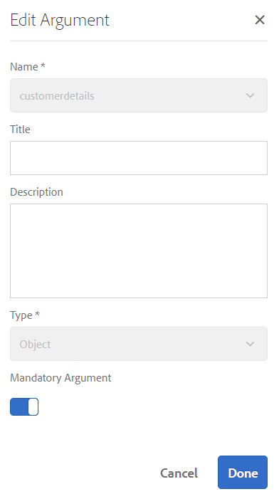

# 教學課程：建立表單資料模型  {#tutorial-create-form-data-model}

>[!CAUTION]
>
>AEM 6.4已結束延伸支援，本檔案不再更新。 如需詳細資訊，請參閱 [技術支援期](https://helpx.adobe.com//tw/support/programs/eol-matrix.html). 尋找支援的版本 [此處](https://experienceleague.adobe.com/docs/).

本教學課程是 [建立第一個最適化表單](/help/forms/using/create-your-first-adaptive-form.md) 系列。 建議您依序依序依序執行系列，以了解、執行和示範完整的教學課程使用案例。

## 關於教學課程 {#about-the-tutorial}

AEM Forms資料整合模組可讓您從不同的後端資料來源建立表單資料模型，例如AEM使用者設定檔、RESTful Web服務、SOAP型Web服務、OData服務和關係資料庫。 您可以在表單資料模型中配置資料模型對象和服務，並將其與最適化表單關聯。 適用性表單欄位會系結至資料模型物件屬性。 這些服務可讓您預填最適化表單，並將提交的表單資料寫回資料模型物件。

如需表單資料整合和表單資料模型的詳細資訊，請參閱 [AEM Forms資料整合](/help/forms/using/data-integration.md).

本教學課程會逐步引導您完成準備、建立、設定表單資料模型與最適化表單的相關步驟。 在本教學課程結束時，您將能夠：

* [將MySQL資料庫配置為資料源](#config-database)
* [使用MySQL資料庫建立表單資料模型](#create-fdm)
* [設定表單資料模型](#config-fdm)
* [測試表單資料模型](#test-fdm)

表單資料模型看起來類似下列：

**答：** 已設定的資料來源 **B.** 資料來源結構 **C.** 可用服務 **D.** 資料模型物件 **E.** 配置的服務

## 必備條件 {#prerequisites}

開始之前，請確定您有下列項目：

* MySQL資料庫，包含示例資料，如 [建立第一個最適化表單](/help/forms/using/create-your-first-adaptive-form.md)
* MySQL JDBC驅動程式的OSGi捆綁，如 [綁定JDBC資料庫驅動程式](/help/sites-developing/jdbc.md#bundling-the-jdbc-database-driver)
* 第一個教學課程中說明的最適化表單 [建立最適化表單](/help/forms/using/create-adaptive-form.md)

## 步驟1:將MySQL資料庫配置為資料源 {#config-database}

您可以配置不同類型的資料來源以建立表單資料模型。 在本教程中，我們將配置您配置的MySQL資料庫並填入示例資料。 如需其他支援資料來源以及如何設定的相關資訊，請參閱 [AEM Forms資料整合](/help/forms/using/data-integration.md).

執行以下操作來配置MySQL資料庫：

1. 將MySQL資料庫的JDBC驅動程式作為OSGi包安裝：

   1. 以管理員身分登入AEM Forms Author Instance，並前往AEM Web主控台套件組合。 預設URL為 [http://localhost:4502/system/console/bundles](http://localhost:4502/system/console/bundles).

   1. 點選 **安裝/更新**. 安 **上傳/安裝套件組合** 對話框。

   1. 點選 **選擇檔案** 瀏覽並選擇MySQL JDBC驅動程式OSGi包。 選擇 **開始套件組合** 和 **刷新包**，然後點選 **安裝或更新**. 確保Oracle公司的MySQL JDBC驅動程式處於活動狀態。 已安裝驅動程式。

1. 將MySQL資料庫配置為資料源：

   1. 前往AEM Web主控台，網址為 [http://localhost:4502/system/console/configMgr](http://localhost:4502/system/console/configMgr).
   1. 找出 **Apache Sling Connection Pooled DataSource** 設定。 點選以在編輯模式中開啟設定。
   1. 在設定對話方塊中，指定下列詳細資料：

      * **資料源名稱：** 您可以指定任何名稱。 例如，指定 **WeRetailMySQL**.
      * **資料源服務屬性名稱**:指定包含DataSource名稱的服務屬性的名稱。 在將資料源實例註冊為OSGi服務時指定。 例如， **datasource.name**.
      * **JDBC驅動程式類**:指定JDBC驅動程式的Java類名。 對於MySQL資料庫，請指定 **com.mysql.jdbc.driver**.
      * **JDBC連接URI**:指定資料庫的連接URL。 對於在埠3306和架構weretail上運行的MySQL資料庫，URL為： `jdbc:mysql://[server]:3306/weretail?autoReconnect=true&useUnicode=true&characterEncoding=utf-8`
      * **用戶名：** 資料庫的用戶名。 需要啟用JDBC驅動程式來建立與資料庫的連接。
      * **密碼：** 資料庫的密碼。 需要啟用JDBC驅動程式來建立與資料庫的連接。
      * **借用時測試：** 啟用 **借閱時測試** 選項。
      * **返回時測試：** 啟用 **返回時測試** 選項。
      * **驗證查詢：** 指定SQL SELECT查詢以驗證池中的連接。 查詢必須至少返回一行。 例如， **選擇&amp;ast;來自customerdetails**.
      * **事務隔離**:將值設為 **READ_COMMITTED**.

      保留其他屬性為預設 [值](https://tomcat.apache.org/tomcat-7.0-doc/jdbc-pool.html) 點選 **儲存**.
   系統會建立類似下列的設定。

   

## 步驟2:建立表單資料模型 {#create-fdm}

AEM Forms為 [建立表單資料模型](data-integration.md) 從設定的資料來源。 您可以在表單資料模型中使用多個資料來源。 對於我們的使用案例，我們將使用配置的MySQL資料源。

執行下列操作以建立表單資料模型：

1. 在AEM製作例項中，導覽至 **Forms** >  **資料整合** s.
1. 點選 **建立** >  **表單資料模型**.
1. 在「建立表單資料模型」對話方塊中，指定 **名稱** （表單資料模型）。 例如， **customer-shipping-billing-details**. 點選 **下一個**.
1. 選擇資料源螢幕列出所有配置的資料源。 選擇 **WeRetailMySQL** 資料來源及點選 **建立**.

   

此 **customer-shipping-billing-details** 表單資料模型已建立。

## 步驟3:設定表單資料模型 {#config-fdm}

配置表單資料模型涉及：

* 添加資料模型對象和服務
* 配置資料模型對象的讀寫服務

執行下列操作來配置表單資料模型：

1. 在AEM製作例項上，導覽至 **Forms >資料整合**. 預設URL為 [http://localhost:4502/aem/forms.html/content/dam/formsanddocuments-fdm](http://localhost:4502/aem/forms.html/content/dam/formsanddocuments-fdm).
1. 此 **customer-shipping-billing-details** 您先前建立的表單資料模型會列在此處。 在編輯模式中開啟它。

   所選資料源 **WeRetailMySQL** 是在表單資料模型中設定。

   

1. 展開WeRailMySQL資料源樹。 從中選擇以下資料模型對象和服務 **weretail** >  **customerdetails** 表單資料模型的結構：

   * **資料模型物件**:

      * id
      * 名稱
      * shippingAddress
      * 城市
      * 狀態
      * 郵遞區號
   * **服務:**

      * get
      * 更新

   點選 **添加選定內容** 將所選資料模型對象和服務添加到表單資料模型。

   

   >[!NOTE]
   >
   >JDBC資料源的預設獲取、更新和插入服務是隨表單資料模型提供的。

1. 為資料模型對象配置讀寫服務。

   1. 選取 **customerdetails** 資料模型物件及點選 **編輯屬性**.
   1. 選擇 **get** 從「讀取服務」下拉式清單中。 此 **id** 引數，即customerdetails資料模型物件中的主要索引鍵會自動新增。 點選  並依下列方式設定引數。

      

   1. 同樣地，請選取 **更新** 作為寫入服務。 此 **customerdetails** 物件會自動新增為引數。 引數的設定如下。

      

      新增及設定 **id** 引數，如下所示。

      

   1. 點選 **完成** 保存資料模型對象屬性。 然後，點選 **儲存** 保存表單資料模型。

      此 **get** 和 **更新** 服務會新增為資料模型物件的預設服務。

      

1. 前往 **服務** 標籤和設定 **get** 和 **更新** 服務。

   1. 選取 **get** 服務與點選 **編輯屬性**. 屬性對話框開啟。
   1. 在「編輯屬性」對話方塊中指定下列項目：

      * **標題**:指定服務的標題。 例如：檢索發運地址。
      * **說明**:指定包含服務詳細功能的說明。 例如：

         此服務從MySQL資料庫中檢索發運地址和其他客戶詳細資訊

      * **輸出模型對象**:選取包含客戶資料的結構。 例如：

         customerdetail結構
      * **傳回陣列**:停用 **傳回陣列** 選項。
      * **引數**:選擇名為的參數 **ID**.

      點選 **完成**. 已配置從MySQL資料庫檢索客戶詳細資訊的服務。

      

   1. 選取 **更新** 服務與點選 **編輯屬性**. 屬性對話框開啟。

   1. 在「編輯屬性」對話方塊中指定下列項目：

      * **標題**:指定服務的標題。 例如，更新發運地址。

      * **說明**:指定包含服務詳細功能的說明。 例如：

         此服務更新MySQL資料庫中的發運地址和相關欄位

      * **輸入模型對象**:選取包含客戶資料的結構。 例如：

         customerdetail結構

      * **輸出類型**:選擇 **布林值**.
      * **引數**:選擇名為的參數 **ID** 和 **customerdetails**.

      點選 **完成**. 此 **更新** 已配置更新MySQL資料庫中客戶詳細資訊的服務。

      

配置表單資料模型中的資料模型對象和服務。 您現在可以測試表單資料模型。

## 步驟4:測試表單資料模型 {#test-fdm}

您可以測試資料模型物件和服務，以驗證表單資料模型是否已正確設定。

執行下列操作以運行測試：

1. 前往 **模型** 頁簽，選擇 **customerdetails** 資料模型物件，並點選 **測試模型對象**.
1. 在 **測試模型/服務** 窗口，選擇 **讀取模型對象** 從 **選擇模型/服務** 下拉式清單。
1. 在 **customerdetails** 區段，指定 **id** 在配置的MySQL資料庫中存在的參數，然後點選 **測試**.

   系統會擷取與指定ID相關聯的客戶詳細資料，並顯示在 **輸出** 區段，如下所示。

   

1. 同樣，您也可以測試寫入模型物件和服務。

   在以下示例中，更新服務成功更新了資料庫中ID 7102715的地址詳細資訊。

   

   現在，如果您再次測試id 7107215的讀取模型服務，它將擷取並顯示更新後的客戶詳細資料，如下所示。

   
