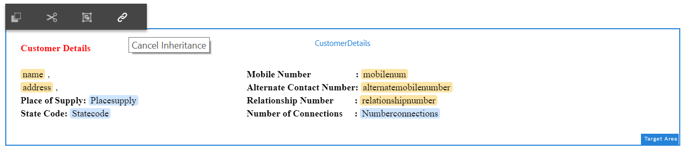

# 教學課程： 建立互動式通訊 {#tutorial-create-interactive-communication}

使用所有建置區塊建立互動式通訊

本教學課程是「建立您的第 [一個互動式通訊」系列的一個步驟](/help/forms/using/create-your-first-interactive-communication.md) 。 建議依序依序依序排列，以瞭解、執行和展示完整的教學課程使用案例。

一旦您建立了Web版本的所有建置區塊，例如表單資料模型、檔案片段、範本和主題，就可以開始建立互動式通訊。

互動式通訊可透過兩個通道提供： 平面與網頁。 您也可以以主版的方式建立互動式的列印通訊管道。 列印為網頁頻道的主選項，可確保網頁頻道的內容、繼承和資料系結是從列印頻道衍生而來。 此外，還可確保在列印頻道中所做的變更在網頁頻道中同步。 不過，「互動式通訊」作者可以中斷Web頻道中特定元件的繼承。

本教學課程將逐步帶您建立適用於印刷和網路頻道的互動式通訊。 在本教學課程結束時，您將能夠：

* 建立適用於列印頻道的互動式通訊
* 建立適用於網路頻道的互動式通訊
* 以印刷為主的方式建立印刷與網路互動式通訊

## 建立互動式平面與網路通訊，毋需同步 {#create-interactive-communications-for-print-and-web-with-no-synchronization}

### Create Interactive Communication for Print channel {#create-interactive-communication-for-print-channel}

以下是本教學課程中已建立且建立列印頻道互動式通訊時所需的資源清單：

**列印範本：** [create_first_ic_print_template](/help/forms/using/create-templates-print-web.md)

**Form Data Model:** [FDM_Create_First_IC](create-form-data-model-tutorial.md)

**檔案片段：** [bill_details_first_ic、customer_details_first_ic、bill_summary_first_ic、summary_charges_first_ic](/help/forms/using/create-document-fragments.md)

**Layout Fragments:** [table_lf](/help/forms/using/create-templates-print-web.md)

**Images:** PayNow and ValueAddedServices

1. 登入AEM作者例項並導覽至 **[!UICONTROL Adobe Experience Manager]** > **[!UICONTROL Forms]** > **[!UICONTROL Forms &amp; Documents]**。
1. 點選「 **建立** 」並選 **取「互動式通訊」**。 此時將顯示 **「建立互動式通信** 」嚮導。
1. 在「 **標題」和「名稱** 」欄位中指定create_first_ic ******** 。 選 **擇FDM_Create_First_IC** 作為表單資料模型並點選 **下一步**。
1. 在「頻 **道** 」精靈中：

   1. 指 **定create_first_ic_print_template** 為「列印」範本，然後點選「 **選取」**。 請確定未 **選取「使用列印為網頁頻道的主版** 」核取方塊。
   1. 指 **定Create_First_IC_templates資料夾>** Create_First_IC_Web_Template **為Web範本，然後點選「選** 取」 ****。
   1. 點選「 **建立**」。

   將顯示一條確認消息，表明已成功建立互動式通信。

1. 點選「 **編輯** 」以開啟右窗格中的「互動式通訊」。
1. 前往「資 **產** 」索引標籤，並套用篩選器，只顯示左側窗格中的檔案片段。
1. 在「互動式通訊」中將下列檔案片段拖放至其目標區域：

   | 文件片段 | 目標區域 |
   |---|---|
   | bill_details_first_ic | BillDetails |
   | customer_details_first_ic | 客戶詳細資訊 |
   | bill_summary_first_ic | BillSummary |
   | summary_charges_first_interactive_communication | 費用 |

   

1. 點選 **圖表** 目標區域，點選 **+** 以新增圖 **** 表元件。
1. 點選圖表元件並選  (Configure)。 圖表屬性會顯示在左窗格中：

   1. 指定圖表的名稱。
   1. 從「 **圖表類** 型」下拉式清 **單中選取** 「圓形圖」。
   1. 在 **X** 軸節中，從調 **用資料模型對象類型中選** 擇調用類型 **** 。 點選 。
   1. 從「 **功能** 」下拉式清 **單中選取「頻率** 」。
   1. 從「 **Y軸** 」部分的「調 **用****」資料模型對象類型中選** 擇「調用類型」屬性。 點選 。
   1. 點選  以儲存圖表屬性。

1. 前往「資 **產** 」標籤，並套用篩選，只顯示左側窗格中的版面片段。 將table_lf **layout片段拖放至** Itemized Calls **** target區域。
1. 在「日期」欄中選取「文 **字欄位** 」，然後點  （設定）」。
1. 從「 **綁定類型** 」下拉清單中選擇「資料模型對象」，然後選 **擇調用** > ******** calldateZombe。 點選  ，以儲存屬性。

   同樣地，在Callding中 **分別建立調**&#x200B;用時間 **、調用數**、調用數、 **調用時間、Calldtime**、 ******************** Number、CalldingChargesChargesCargesChargesChargesChargesColumns的調用持續時間長度列。

1. 點選 **PayNow** 目標區域，並點選 **+** 以新增 **Image** 元件。
1. 點選影像元件並選  (Configure)。 影像屬性會顯示在左窗格中：

   1. 在「 **名稱** 」欄位中，將PayNow指定為影像 **名稱** 。
   1. 點選 **「上傳**」，選取儲存在本機檔案系統上的影像，然後點選「 **開啟」**。
   1. 點選  以儲存影像屬性。

1. 重複步驟13和14，將 **ValueAddedServices** 映像添加到 **** ValueAddedServices目標區域。

### Create Interactive Communication for Web channel {#create-interactive-communication-for-web-channel}

以下是本教學課程中已建立的、在建立網路頻道互動式通訊時需要的資源清單：

**Web範本：** [Create_First_IC_Web_Template](/help/forms/using/create-templates-print-web.md)

**表單資料模型：** [FDM_Create_First_IC](create-form-data-model-tutorial.md)

**檔案片段：** [bill_details_first_ic、customer_details_first_ic、bill_summary_first_ic、summary_charges_first_ic](/help/forms/using/create-document-fragments.md)

**影像：** PayNowWeb和ValueAddedServicesWeb

1. 登入AEM作者例項並導覽至 **[!UICONTROL Adobe Experience Manager]** > **[!UICONTROL Forms]** > **[!UICONTROL Forms &amp; Documents]**。
1. 點選「 **建立** 」並選 **取「互動式通訊」**。 此時將顯示 **「建立互動式通信** 」嚮導。
1. 在「 **標題」和「名稱** 」欄位中指定create_first_ic ******** 。 選 **擇FDM_Create_First_IC** 作為表單資料模型並點選 **下一步**。
1. 在「頻 **道** 」精靈中：

   1. 指 **定create_first_ic_print_template** 為「列印」範本，然後點選「 **選取」**。 請確定未 **選取「使用列印為網頁頻道的主版** 」核取方塊。
   1. 指 **定Create_First_IC_templates資料夾>** Create_First_IC_Web_Template **為Web範本，然後點選「選** 取」 ****。
   1. 點選「 **建立**」。

   將顯示一條確認消息，表明已成功建立互動式通信。

1. 點選「 **編輯** 」以開啟右窗格中的「互動式通訊」。
1. Tap the **Channels** tab from the left pane and tap **Web**.
1. Go to the **Assets** tab and apply the filter to display only the document fragments in the left pane.
1. Drag-and drop the following document fragments to their target areas in the Interactive Communication:

   | 文件片段 | 目標區域 |
   |---|---|
   | bill_details_first_ic | BillDetails |
   | customer_details_first_ic | CustomerDetails |
   | bill_summary_first_ic | BillSummary |
   | summary_charges_first_interactive_communication | 費用 |

1. 點選 **Summary of Charges** target區域，並點選 **+** 以新增 **Chart** 元件。
1. 點選圖表元件並選  (Configure)。 The chart properties display in the left pane:

   1. 指定圖表的名稱。
   1. Select **Pie** from the **Chart Type** drop-down list.
   1. Select the **calltype** property from the **calls** data model object type in the **X-axis** section. 點選 。
   1. 從「 **功能** 」下拉式清 **單中選取「頻率** 」。
   1. 從「 **Y軸** 」部分的「調 **用****」資料模型對象類型中選** 擇「調用類型」屬性。 點選 。
   1. 點選  以儲存圖表屬性。

1. Select the **Data Sources** tab from the left pane and drag-and-drop the **calls** data model object to the **Itemised Calls** target area. All properties in the **calls** data model object are displayed as table columns in the **Itemised Calls** target area in the right pane.

   Based on the use case, you require Call Date, Call Time, Call Number, Call Duration, and Call Charges columns in the table.

   

1. Select **Mobilenum** table column heading and select **More options** > **Delete column**. Similarly, delete the **Calltype** column.
1. Select the **Calldate** table column heading and tap  (Edit) to rename the text to **Call Date**. Similarly, rename other column headings in the table.
1. Based on the use case, insert a **Pay Now** button in the Interactive Communication that provides the user an option to make the payment by clicking the button. Execute the following steps to insert the button:

   1. Tap **Pay Now** target area, and tap **+** to add a **Text** component.
   1. Tap the text component and tap  (Edit).
   1. Rename the text to **Pay Now**.
   1. Select the text and tap the Hyperlink icon.
   1. Specify the payment URL in the **Path** field.
   1. Select **New Tab** from **Target** drop-down list.
   1. Tap  to save the hyperlink properties.

1. Select **Style** from the drop-down list next to the **Preview** option.

   

1. 使用下列步驟，將超連結文字設為樣式，以便在互動式通訊中顯示為按鈕：

   1. Tap the text component and select  (Edit).
   1. In the **Border** section, specify **1.5px** as **Border Width**, select **Solid** as **Border Style**, and specify **46px** as **Border Radius**.
   1. 從「背景」區段中選擇「紅色」作為按鈕的背 **景顏** 色。
   1. 在「尺寸與位置 **」區段的「邊界** 」欄位中，同時點選「 **編輯」圖示，並將************** RightMargin設為ChrightPxLightCord。 The Top, Bottom, and Left fields are set as blank.

   

1. 點選「 **立即付費** 」目標區域，並點選 **+** 以新增 **** 影像元件。
1. Tap the Image component and select  (Configure). The image properties display in the left pane:

   1. Specify **PayNow** as the name of the image in the **Name** field.
   1. Tap **Upload**, select the **PayNowWeb** image saved on the local file system, and tap **Open**.
   1. Tap  to save the image properties.

1. Based on the use case, insert a **Subscribe** button in the Interactive Communication that provides the user an option to subscribe to the value added services by clicking the button.

   Repeat steps 13 - 17 to add a **Subscribe** button to the **Value Added Services** target area and add the **ValueAddedServicesWeb** image.

## Create Interactive Communications for Print and Web with auto synchronization {#create-interactive-communications-for-print-and-web-with-auto-synchronization}

You can also create an Interactive Communication by enabling auto synchronization between Print and Web channels. To enable auto synchronization, select the Print as master option while creating the Interactive Communication. Selecting the Print as master option ensures the content, inheritance, and data binding of the Web channel is derived from the Print channel. It also ensures that the changes made in the Print channel are reflected in the Web channel.

執行下列步驟，使用列印頻道衍生網頁頻道內容：

1. 登入AEM作者例項並導覽至 **[!UICONTROL Adobe Experience Manager]** > **[!UICONTROL Forms]** > **[!UICONTROL Forms &amp; Documents]**。
1. 點選「 **建立** 」並選 **取「互動式通訊」**。 此時將顯示 **「建立互動式通信** 」嚮導。
1. 在「 **標題」和「名稱** 」欄位中指定create_first_ic ******** 。 選 **擇FDM_Create_First_IC** 作為表單資料模型並點選 **下一步**。
1. 在「頻 **道** 」精靈中：

   1. 指 **定create_first_ic_print_template** 為「列印」範本，然後點選「 **選取」**。
   1. 選取「使 **用列印為Web頻道的主版」核取方塊** 。
   1. 指 **定Create_First_IC_templates資料夾>** Create_First_IC_Web_Template **為Web範本，然後點選「選** 取」 ****。
   1. 點選「 **建立**」。

   將顯示一條確認消息，表明已成功建立互動式通信。

1. 點選「 **編輯** 」以開啟右窗格中的「互動式通訊」。
1. 執行「建立用於打印渠道的互 [動式通信」部分的步驟](#create-interactive-communication-for-print-channel) 6 - 15。
1. 從左窗格 **點選** 「頻道」標籤，然後點選「 **Web** 」，從「列印」頻道自動產生網頁頻道的內容。
1. 當在步 **驟4中選取「使用列印為網頁頻道的主版」核取方塊時** ，會從列印頻道自動產生網頁頻道的內容和系結。

   列印頻道內容插入網頁頻道範本內容下方。 若要修改已自動從列印頻道產生的網頁頻道內容，您可以取消任何目標區域的繼承。

   將滑鼠指標暫留在Web頻道的相關目標區域上，並選取「取消繼承  」對話方塊中，點選「 **是」******。

   

   If you have canceled inheritance of a component, you can re-enable it. 若要重新啟用繼承，請將滑鼠指標暫留在包含元件的相關目標區域的邊界上，然後點選重新啟 。

1. 在左窗格 **中選擇** 「內容」標籤。
1. 使用內容樹狀結構，將自動產生的Web頻道內容拖放至Web範本中的現有面板。 以下是需要重新排列的元件清單：

   * 「清單詳細資訊」元件至「清單詳細資訊」面板
   * Customer Details component to Customer Details panel
   * 「清單匯總」元件至「清單匯總」面板
   * Summary of Charges component to Summary of Charges panel
   * Layout fragment (table) to the Itemised Calls panel

   

1. 重複「建立適用於網頁 [頻道的互動式通訊](#create-interactive-communication-for-web-channel) 」的步驟13 - 18，將「立即付費」和「 **訂閱****** 」超連結插入互動式通訊的網頁頻道。

