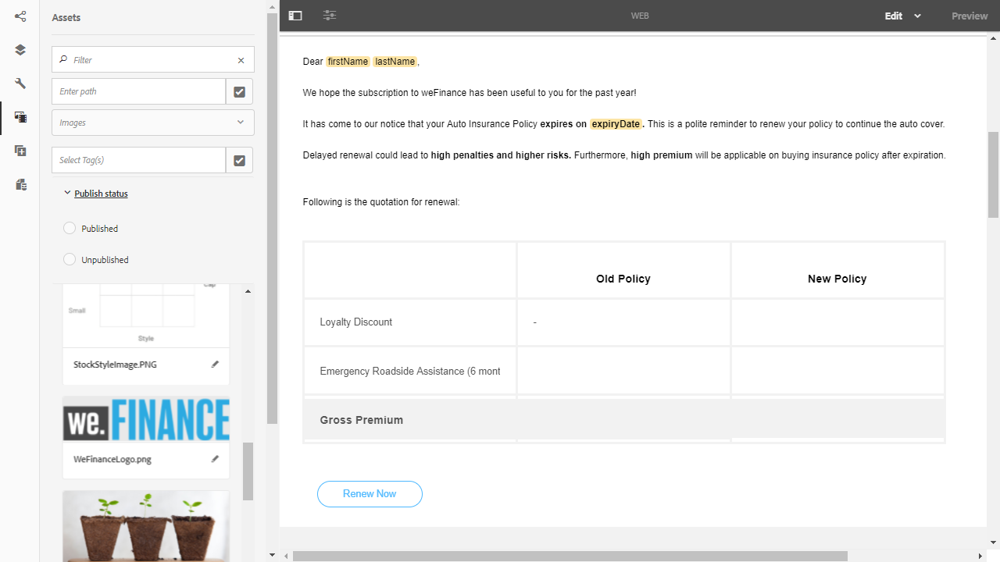
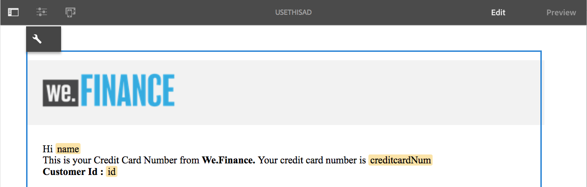

# 建立互動式通信{#create-an-interactive-communication}

使用「互動式通訊」編輯器建立互動式通訊。 使用拖放功能來建立互動式通訊，並在不同裝置類型上預覽列印和Web輸出。

## 概覽 {#overview}

互動式通訊可集中管理個人化與互動式通訊的建立、組裝與傳遞。 利用打印作為Web的主通道，可以最大限度地減少建立互動式通信的Web輸出時的工作重複。

### 必備條件 {#prerequisites}

以下是建立互動式通訊的先決條件：

* 設定[表單資料模型](/help/forms/using/data-integration.md)，其中包含測試資料或實際資料源，如Microsoft® Dynamics的實例。
* 請確定您有[檔案片段](/help/forms/using/document-fragments.md)。
* 確保您有[用於打印和Web通道的模板](/help/forms/using/web-channel-print-channel.md)。
* 請確定您有必要的Web通道[主題](/help/forms/using/themes.md)。

## 建立互動式通訊 {#createic}

1. 登入AEM製作例項，並導覽至&#x200B;**[!UICONTROL Adobe Experience Manager]** > **[!UICONTROL Forms]** > **[!UICONTROL Forms與檔案]**。
1. 點選&#x200B;**[!UICONTROL Create]**&#x200B;並選取&#x200B;**[!UICONTROL Interactive Communication]**。 「建立互動式通信」頁面。

   

1. 輸入以下資訊。 :

   * **[!UICONTROL 標題]**:輸入互動式通信的標題。
   * **[!UICONTROL 名稱*]**:互動式通訊的名稱衍生自您輸入的標題。視需要編輯。
   * **[!UICONTROL 說明]**:輸入有關互動式通信的說明。
   * **[!UICONTROL 表單資料模型*]**:瀏覽並選取表單資料模型。如需表單資料模型的詳細資訊，請參閱[AEM Forms資料整合](/help/forms/using/data-integration.md)。
   * **[!UICONTROL 預填服務]**:選擇預填服務以檢索資料並預填互動式通信。
   * **[!UICONTROL 後續程式類型]**:您可以選取在提交互動式通訊時觸發的AEM或Forms工作流程。選取要觸發的工作流程類型。
   * **[!UICONTROL 後續程式]**:選取要觸發的工作流程名稱。選取AEM工作流程時，請提供附件路徑、版面路徑、PDF路徑、列印資料路徑及Web資料路徑。
   * **[!UICONTROL 標籤]**:選取要套用至互動式通訊的標籤。您也可以輸入新/自訂標籤名稱，然後按Enter鍵加以建立。
   * **[!UICONTROL 作者]**：作者名稱會自動取自登入使用者的使用者名稱。
   * **[!UICONTROL 發佈日期：]** 輸入發佈互動式通訊的日期。
   * **[!UICONTROL 取消發佈日期]**:輸入取消發佈互動式通訊的日期。

1. 點選&#x200B;**[!UICONTROL Next]**。 螢幕上將顯示用於指定打印和Web通道詳細資訊的螢幕。
1. 輸入下列內容：

   * **[!UICONTROL 列印]**:選擇此選項可生成交互通信的打印通道。
   * **[!UICONTROL 打印模板*:]** 瀏覽並選擇XDP作為打印模板。
   * **[!UICONTROL 使用Web通道的打印為主版：]** 選擇此選項可建立與打印通道同步的Web通道。使用打印通道作為Web通道的主通道，確保從打印通道導出Web通道的內容和資料綁定，並且當您點選「同步」時，打印通道中所做的更改將反映在Web通道中。 不過，作者可視需要中斷Web管道中特定元件的繼承。 有關詳細資訊，請參閱[將Web通道與打印通道同步](/help/forms/using/create-interactive-communication.md#synchronize)。
   * **[!UICONTROL Web:]** 選取此選項可產生Web通道或互動式通訊的回應式輸出。
   * **[!UICONTROL 互動式通信Web模板*:]** 瀏覽並選擇Web模板。
   * **** 主題 **[!UICONTROL 選取主題*]**:瀏覽並選擇主題，以設定互動式通信的Web通道的樣式。如需詳細資訊，請參閱[AEM Forms中的主題](/help/forms/using/themes.md)。
   有關打印通道和Web通道的詳細資訊，請參閱[打印通道和Web通道](/help/forms/using/web-channel-print-channel.md)。

1. 點選&#x200B;**[!UICONTROL 建立]**。 「Interactive Communication（互動通信）」隨即建立，並出現一個警報框。 點選&#x200B;**[!UICONTROL 編輯]**&#x200B;以開始建立互動式通訊的內容，如[使用互動式通訊製作使用者介面](#step2)新增內容中所述。 或者，您也可以點選&#x200B;**[!UICONTROL Done]**，然後選擇稍後編輯互動式通訊。

## 將內容添加到互動式通信 {#step2}

建立互動式通訊後，您可以使用互動式通訊製作介面來建構其內容。

有關互動式通信創作介面的詳細資訊，請參閱[互動式通信創作簡介](/help/forms/using/introduction-interactive-communication-authoring.md)。

1. 按[建立互動式通訊](#createic)中所述的點選編輯時，會啟動互動式通訊製作介面。 或者，您也可以導覽至AEM上現有的互動式通訊資產，選取該資產，然後點選&#x200B;**[!UICONTROL Edit]**&#x200B;以啟動互動式通訊製作介面。

   預設情況下，將顯示「互動式通信」的打印通道，除非「互動式通信」僅為Web通道。 交互通信的打印通道顯示目標區域，如所選XDP/打印通道模板中所示。 在這些目標區域和欄位中，您可以新增元件或資產。

1. 在選擇「打印」通道後，選擇「**[!UICONTROL 元件]**」頁簽。 下列元件可在列印通道中使用：

   | **元件** | **功能** |
   |---|---|
   | 圖表 | 新增圖表，您可在互動式通訊中使用，以視覺化方式呈現從表單資料模型集合擷取的二維資料。 有關詳細資訊，請參閱[在互動式通信中使用圖表](/help/forms/using/chart-component-interactive-communications.md)。 |
   | 文件片段 | 可讓您將可重複使用的元件（如文字、清單或條件）新增至互動式通訊。 新增的元件可以是表單資料模型型，或是沒有表單資料模型。 |
   | 影像 | 讓您插入影像。 |

   將元件拖放至您的互動式通訊中，並視需要進行設定。

1. 在選取列印管道後，前往&#x200B;**[!UICONTROL Assets]**&#x200B;標籤並套用篩選器，以僅顯示您想要查看的資產。

   使用「資產」瀏覽器，您也可以直接將資產拖放至互動式通訊目標區域。

   

1. 將檔案片段拖放至互動式通訊中。 以下是可在互動式通信的打印通道中使用的文檔片段類型。

<table> 
 <tbody> 
  <tr> 
   <td><strong>文件片段類型</strong></td> 
   <td><strong>範例用途</strong></td> 
  </tr> 
  <tr> 
   <td><a href="/help/forms/using/texts-interactive-communications.md" target="_blank">文字</a></td> 
   <td>用於添加地址、收件人的電子郵件和信函正文的文本 </td> 
  </tr> 
  <tr> 
   <td><a href="/help/forms/using/conditions-interactive-communications.md" target="_blank">條件</a></td> 
   <td>根據策略類型將適當的標頭映像添加到通信的條件：Standard或Premium版。  </td> 
  </tr> 
  <tr> 
   <td>清單</td> 
   <td>檔案片段的群組，包括文字、條件、其他清單和影像。  </td> 
  </tr> 
 </tbody> 
</table>

有關文檔片段的詳細資訊，請參閱[文檔片段](/help/forms/using/document-fragments.md)。

1. 若要設定變數的捆綁，請點選變數，然後選取(Configure)，然後在側欄的「屬性」面板中設定捆綁屬性。

   * **[!UICONTROL 無]**:代理將填入變數的值。
   * **[!UICONTROL 文字片段]**:如果選定，則可以瀏覽並選擇在欄位中呈現其內容的文本文檔片段。只有這些文字檔案片段才能系結至內沒有變數的變數。
   * **[!UICONTROL 資料模型物件]**:選擇在欄位中填入值的表單資料模型屬性。
   您也可以選擇配置相關文本文檔片段。 「屬性」面板顯示文本文檔片段中的變數清單。 您可以點選變數名稱旁的（編輯），以顯示該變數的編輯設定。

1. 若要新增表格，並選取列印通道，**[!UICONTROL Assets]**&#x200B;索引標籤中會套用篩選條件，以僅顯示「版面片段」。 將所需的版面片段拖放至互動式通訊。 版面片段是以XDP為基礎，可用來在互動式通訊中建立圖形版面或靜態和動態表格，以填入動態資料。

   範例：佈局表，可顯示舊政策和新政策的毛額溢價、忠誠度折扣%，以及緊急路邊援助可用性。

   如需版面片段的詳細資訊，請參閱[檔案片段](/help/forms/using/document-fragments.md)。

1. 在選取列印通道後，在&#x200B;**[!UICONTROL Assets]**&#x200B;索引標籤中會套用篩選以顯示影像。 將所需的影像拖放至互動式通訊，例如公司標誌。

   此外，在互動式通訊中管理下列項目：

   * [添加和配置圖表](/help/forms/using/chart-component-interactive-communications.md)
   * [將Web通道與打印通道同步](/help/forms/using/create-interactive-communication.md#synchronize)

      * 自動同步
      * 取消繼承
      * 重新啟用繼承
      * 同步
   * [附件和程式庫存取](/help/forms/using/create-interactive-communication.md#attachmentslibrary)
   * [XDP/佈局欄位屬性](/help/forms/using/create-interactive-communication.md#xdplayoutfieldproperties)
   * [新增規則至元件](/help/forms/using/create-interactive-communication.md#rules)

1. 切換到&#x200B;**[!UICONTROL Web通道]**。 Web通道會出現在「互動式通訊」編輯器中。 第一次從「列印」通道切換至Web通道時，會進行自動同步。 有關詳細資訊，請參閱從打印通道同步Web通道](/help/forms/using/create-interactive-communication.md#synchronize)。[

   由於在此範例中，我們使用Print作為Web的主版，因此Print管道預留位置、內容和資料捆綁會同步至Web管道。 不過，您可以視需要變更及自訂網路頻道中的特定內容。

   

1. 若要在Web通道中添加其他元件，在選擇Web通道時，請點選&#x200B;**[!UICONTROL 元件]**。 視需要拖放元件至互動式通訊的Web通道，並繼續進行設定。

   | 元件 | 功能 |
   |---|---|
   | 圖表 | 新增圖表，您可在互動式通訊中使用，以視覺化方式呈現從表單資料模型集合擷取的二維資料。 如需詳細資訊，請參閱[使用圖表元件](/help/forms/using/chart-component-interactive-communications.md)。 |
   | 文件片段 | 可讓您將可重複使用的元件、文字、清單或條件新增至互動式通訊。 添加到互動式通信的可重複使用的元件可以是基於表單資料模型的元件，也可以是沒有表單資料模型的元件。 |
   | 影像 | 讓您插入影像。 |
   | 面板 | 「面板」元件是將其他元件分組在一起的佔位符，它控制如何在「互動式通信」中佈置一組元件（如折疊式面板和頁簽）。 面板元件也可讓您讓一組元件可為一般使用者重複，例如填入教育認證所需的多個項目。 |
   | 表格 | 新增表格以整理行和欄中的資料。 |
   | 目標區域 | 在Web通道中插入目標區域，以組織Web通道特定的元件。 目標區域是一個純容器，可讓您將Web通道特定元件分組。 |
   | 文字 | 將RTF新增至互動式通訊的Web頻道。 文本也可以利用表單資料模型對象，使內容動態。 |

1. 視需要，在您的Web管道中插入資產。

   您可以[預覽您的互動式通信](#previewic)以查看互動式通信的打印和Web輸出的外觀，並根據需要繼續進行更改。

## 預覽互動式通訊 {#previewic}

您可以使用&#x200B;**[!UICONTROL 預覽]**&#x200B;選項來評估互動式通訊的外觀。 互動式通訊的網頁通道也提供可針對各種裝置模擬互動式通訊體驗的選項。 例如iPhone、iPad和Desktop。 您可以彼此結合使用&#x200B;**[!UICONTROL 預覽]**&#x200B;和&#x200B;**[!UICONTROL 模擬器]** 選項，以針對不同螢幕大小的裝置預覽Web輸出。 預覽中的範例資料會從指定的表單資料模型填入。

1. 選取（列印或網頁）頻道以預覽和點選預覽。 出現「Interactive Communication（交互通信）」。

   >[!NOTE]
   >
   >預覽會填入指定表單資料模型的範例資料。 有關使用某些其他資料預覽互動式通信或使用預填服務的詳細資訊，請參閱[使用表單資料模型](/help/forms/using/using-form-data-model.md)和[使用表單資料模型](/help/forms/using/work-with-form-data-model.md)。

1. 對於Web通道，使用查看互動式通信在不同設備上的外觀。

   

此外，您可以使用代理UI](/help/forms/using/prepare-send-interactive-communication.md)準備併發送互動式通信。[

## 在交互通信中配置屬性{#configuring-properties-in-interactive-communication}

### 附件和程式庫存取 {#attachmentslibrary}

在「打印」通道中，您可以配置附件和庫訪問，以允許代理在互動式通信的代理UI中管理附件：

1. 在「打印」通道中，突出顯示「文檔容器」，然後點選&#x200B;**[!UICONTROL 「屬性」]**。

   

   屬性面板出現在側欄中。

   

1. 展開&#x200B;**[!UICONTROL 附件]**&#x200B;並指定以下屬性：

   * **[!UICONTROL 允許程式庫存取]**:在代理UI中，選擇以啟用代理的庫訪問。如果已啟用，則代理可以在準備互動式通信時從庫中添加檔案。
   * **[!UICONTROL 允許重新排序附件]**:選擇該選項，使代理能夠使用交互通信重新排序附件。
   * **[!UICONTROL 允許的附件數量上限]**:指定互動式通訊允許的附件數上限。
   * **[!UICONTROL 要附加的檔案]**:點選 **** 「新增」並瀏覽以選取要附加的檔案，並指定下列項目：

      * **[!UICONTROL 依預設將此檔案附加至檔案]**:如果僅附件不是「強制」，則可以更改此選項。
      * **[!UICONTROL 強制：]** 代理程式將無法在代理程式UI中移除附件。
   

1. 點選&#x200B;**[!UICONTROL Done]**。

### XDP/佈局欄位屬性 {#xdplayoutfieldproperties}

1. 編輯互動式通信的「打印」通道時，將滑鼠移到「打印」通道模板中構建的欄位上，然後選擇（配置）。

   邊欄中將顯示「屬性」對話框。

   

1. 指定下列項目：

   * **[!UICONTROL 名稱]**:JCR節點名稱。
   * **[!UICONTROL 標題]**:在代理UI和文檔容器樹中輸入代理可見的標題。
   * **[!UICONTROL 綁定類型]**:為欄位選擇以下綁定類型之一。

      * 無：代理將填入屬性的值。
      * 文字片段：如果選定，則可以瀏覽並選擇在欄位中呈現內容的文本文檔片段。
      * 資料模型對象：選擇在欄位中填入值的表單資料模型屬性。
   * **[!UICONTROL 預設值]**:當指定的資料模型物件或文字片段未提供值時，預設值可確保欄位不為空。如果資料綁定類型為無，則預設值將預填入欄位中。
   * **[!UICONTROL 由代理編輯]**:選取以允許代理編輯代理UI欄位中的值。如果「綁定類型」為「文本片段」，則此設定不適用。
   * **[!UICONTROL 標籤]**:指定與欄位一起顯示的文字字串，顯示給代理UI中的代理。如果「綁定類型」為「文本片段」，則此設定不適用。
   * **[!UICONTROL 工具提示]**:輸入將在滑鼠移到代理UI中的代理時可見的文字字串。如果「綁定類型」為「文本片段」，則此設定不適用。
   * **[!UICONTROL 必要]**:選取，將該欄位設為代理的必填欄位。如果「綁定類型」為「文本片段」，則此設定不適用。
   * **[!UICONTROL 允許多行]**:選取此欄位可允許在欄位中輸入多行文字。如果「綁定類型」為「文本片段」，則此設定不適用。

1. 點選。

## 將規則應用於Interactive Communication元件 {#rules}

若要條件化互動式通訊中的元件或內容，請點選元件/內容片段，然後選取（建立規則）以啟動規則編輯器。

如需詳細資訊，請參閱：

* [規則編輯器](/help/forms/using/rule-editor.md)
* [互動式通訊製作簡介](/help/forms/using/introduction-interactive-communication-authoring.md)

## 使用表格 {#tables}

### 互動式通信中的動態表{#dynamic-tables-in-interactive-communication}

您可以在互動式通訊中使用版面片段新增動態表格。 下列步驟使用信用卡對帳單的示例來說明如何使用佈局片段在Interactive Communication中建立動態表。

1. 確保建立表格所需的版面片段可在AEM中使用。
1. 在互動式通訊的列印通道中，從資產瀏覽器將版面片段（含多欄表格）拖放至目標區域。

   

   「互動式通信」佈局區域中將顯示一個表。

   

1. 為表的每個單元格指定資料綁定。 若要建立可重複的列，請在屬於公用收集屬性的列中插入表單資料模型屬性。

   1. 點選表格中的儲存格，然後選取（設定）。

      邊欄中將顯示「屬性」對話框。

      

   1. 設定屬性：

      * **[!UICONTROL 名稱]**:JCR節點名稱。
      * **[!UICONTROL 標題]**:輸入將在互動式通訊編輯器中顯示的標題。
      * **[!UICONTROL 綁定類型]**(&amp;A);:為欄位選擇以下綁定類型之一。

         * **[!UICONTROL 無]**
         * **[!UICONTROL 資料模型物件]**:表單資料模型屬性的值會填入欄位中。
      * **[!UICONTROL 資料模型物件]**:在欄位中填入值的表單資料模型屬性。
      * **[!UICONTROL 預設值]**:當指定的資料模型對象未提供值時，預設值可確保欄位不為空。預設值會預先填入欄位中。
      * **[!UICONTROL 由代理編輯]**:選取以允許代理編輯代理UI欄位中的值。
   1. 點選。

1. 預覽互動式通訊，查看以資料呈現的表格。

   

### 僅Web通道表{#web-channel-only-tables}

您可以使用類型集合的資料模型屬性，在互動式通訊中建立僅限Web通道的動態表格。 此表表示集合屬性的子屬性。 您只能編輯表格中各個儲存格的格式屬性。

1. 切換至Web通道，然後選擇顯示「資料來源」瀏覽器。
1. 將集合屬性拖放至子表單中。

   表格會在子表單中建立。

1. 在互動式通訊的網頁預覽中預覽表格。

## 與打印通道同步Web通道 {#synchronize}

當您在建立互動式通信時選擇「打印為Web頻道的主版」時，將建立與打印頻道同步的Web頻道，並且從打印頻道導出Web頻道的內容和資料綁定，並且當您點選「同步」時，打印頻道中所做的更改將反映在Web頻道中。

不過，作者可視需要中斷網頁管道中元件的繼承。

[按一下放大](assets/printweb_2-3.png)

### 自動同步{#auto-sync}

如果使用打印通道作為Web通道的主通道，並且從打印通道切換到Web通道，則會進行自動同步。 自動同步將預留位置、內容和資料綁定從打印通道導入Web通道。 根據互動式通訊的複雜性和內容，自動同步可能需要一些時間。

>[!NOTE]
>
>同步通道僅同步從打印通道到Web通道的文檔片段、影像、條件、清單和佈局片段。 包含此類元素的子表單或父節點不會同步。

### 取消繼承 {#cancel-inheritance}

在Web通道中，元件內嵌在目標區域中。

將滑鼠移到Web通道中的相關目標區域上，然後選擇（取消繼承），然後在「取消繼承」對話框中，點選&#x200B;**[!UICONTROL 是]**。

目標區域內元件的繼承將被取消，您現在可以視需要加以編輯。

### 重啟先前設定 {#re-enable-inheritance}

在Web通道中，如果已取消元件的繼承，則可重新啟用它。 若要重新啟用繼承，請將滑鼠移至包括元件的相關目標區域的邊界上，然後點選。

將顯示「還原繼承」對話框。

如果需要，請選擇&#x200B;**[!UICONTROL 還原繼承後同步頁面]**。 選擇此選項可同步整個交互通信。 如果未選擇此選項，則恢復繼承時只會同步相關目標區域。

點選&#x200B;**[!UICONTROL 是]**。

### 同步 {#synchronize-1}

如果您使用「作為Web通道的主版打印」並對打印通道進行更改，則可以點選「同步」，將新進行的更改帶到Web通道。

1. 要將Web通道與打印通道同步，請點選&#x200B;**[!UICONTROL Synchronize]**。

   將顯示「從主頻道同步內容」對話框。

   

1. 點選下列其中一項：

   * **[!UICONTROL 放棄更改]**:捨棄對Web通道所做的所有更改，而不考慮對Web通道所做的更改。
   * **[!UICONTROL 保留變更]**:僅同步繼承未取消之目標區域的內容。
