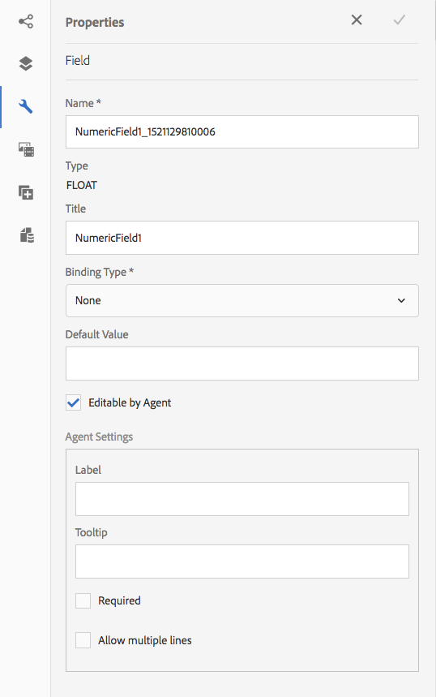

# 建立互動式通信{#create-an-interactive-communication}

使用「互動式通訊」編輯器建立互動式通訊。 使用拖放功能建立互動式通訊，並在不同裝置類型上預覽列印和網頁輸出。

## 概覽 {#overview}

互動式通訊可集中管理建立、組裝和傳遞個人化和互動式通訊。 運用列印為網頁的主要通道，在建立互動式通訊的網頁輸出時，您可將工作重複的工作降至最低。

### 必備條件 {#prerequisites}

以下是建立互動式通訊的先決條件：

* 設定包含測試資料或實際資料來源（例如Microsoft® Dynamics的例項）的[表單資料模型](/help/forms/using/data-integration.md)。
* 請確定您有[Document片段](/help/forms/using/document-fragments.md)。
* 請確定您有[用於列印和Web頻道的範本](/help/forms/using/web-channel-print-channel.md)。
* 請確定您有必要的Web頻道[theme](/help/forms/using/themes.md)。

## 建立互動式通訊 {#createic}

1. 登入AEM作者例項，並導覽至「**[!UICONTROL Adobe Experience Manager]** > **[!UICONTROL Forms]** > **[!UICONTROL Forms &amp; Documents]**」。
1. 點選「**[!UICONTROL 建立]**」並選取「互動式通訊&#x200B;]**」。**[!UICONTROL 「建立互動式通信」頁面。

   

1. 輸入以下資訊。 :

   * **[!UICONTROL 標題]**:輸入「互動式通訊」的標題。
   * **[!UICONTROL 名稱*]**:「互動式通訊」的名稱是從您輸入的標題衍生而來。視需要編輯。
   * **[!UICONTROL 說明]**:輸入有關互動式通信的說明。
   * **[!UICONTROL 表單資料模型*]**:瀏覽並選取表單資料模型。如需表單資料模型的詳細資訊，請參閱[AEM Forms Data Integration](/help/forms/using/data-integration.md)。
   * **[!UICONTROL 預填服務]**:選擇預填充服務以檢索資料並預填充互動式通信。
   * **[!UICONTROL 後處理類型]**:您可以選取在提交「互動式通訊」時觸發的AEM或Forms工作流程。選擇要觸發的工作流類型。
   * **[!UICONTROL 後處理]**:選擇要觸發的工作流的名稱。當您選取AEM工作流程時，請提供「附件路徑」、「版面路徑」、「PDF路徑」、「列印資料路徑」和「Web資料路徑」。
   * **[!UICONTROL 標籤]**:選擇要套用至互動式通訊的標籤。您也可以輸入新的／自訂標籤名稱，然後按Enter鍵建立它。
   * **[!UICONTROL 作者]**：作者名稱會自動取自已登入使用者的使用者名稱。
   * **[!UICONTROL 發佈日期：]** 輸入發佈互動式通訊的日期。
   * **[!UICONTROL 取消發佈日期]**:輸入取消發佈互動式通訊的日期。

1. 點選&#x200B;**[!UICONTROL Next]**。 此時會出現指定列印和網頁頻道詳細資訊的畫面。
1. 輸入以下內容：

   * **[!UICONTROL 列印]**:選擇此選項可生成互動式通信的打印通道。
   * **[!UICONTROL 列印範本*：瀏]** 覽並選擇XDP作為列印範本。
   * **[!UICONTROL 使用列印為網頁頻道的主版：]** 選取此選項可建立與列印頻道同步的網頁頻道。使用列印頻道作為網頁頻道的主節點，可確保網頁頻道的內容與資料系結是從列印頻道衍生而來，當您點選「同步化」時，列印頻道中所做的變更會反映在網頁頻道中。 但是，作者可以視需要中斷Web頻道中特定元件的繼承。 如需詳細資訊，請參閱[同步Web頻道與列印頻道](/help/forms/using/create-interactive-communication.md#synchronize)。
   * **[!UICONTROL Web：選]** 取此選項可產生Web頻道或互動式通訊的回應式輸出。
   * **[!UICONTROL 互動式通訊網頁範本*:]** 瀏覽並選取網頁範本。
   * **** 主題 **[!UICONTROL 選擇主題*]**:瀏覽並選取主題，以設定互動式通訊網路頻道的樣式。如需詳細資訊，請參閱「AEM Forms中的[主題」。](/help/forms/using/themes.md)

   有關打印通道和Web通道的詳細資訊，請參閱[打印通道和Web通道](/help/forms/using/web-channel-print-channel.md)。

1. 點選&#x200B;**[!UICONTROL Create]**。 將建立「交互通信」並顯示一個警報框。 點選&#x200B;**[!UICONTROL 編輯]**&#x200B;開始建立互動式通訊的內容，如[使用互動式通訊製作使用者介面](#step2)新增內容中所述。 或者，您可以點選&#x200B;**[!UICONTROL Done]**&#x200B;並選擇稍後編輯互動式通訊。

## 將內容新增至互動式通訊{#step2}

建立互動式通訊後，您可以使用互動式通訊製作介面來建立其內容。

有關互動式通信編寫介面的詳細資訊，請參閱[互動式通信編寫簡介](/help/forms/using/introduction-interactive-communication-authoring.md)。

1. 當您按[建立互動式通訊](#createic)中所述點選編輯時，就會啟動互動式通訊製作介面。 或者，您也可以導覽至AEM上現有的互動式通訊資產，選取它，然後點選&#x200B;**[!UICONTROL Edit]**&#x200B;以啟動互動式通訊製作介面。

   依預設，互動式通訊的列印頻道會出現，除非互動式通訊僅限網頁頻道。 「互動式通訊」的「列印」頻道會顯示目標區域，如所選XDP/列印頻道範本中所示。 在這些目標區域和欄位中，您可以新增元件或資產。

1. 在選擇「打印通道」後，選擇&#x200B;**[!UICONTROL 「元件]**」頁籤。 列印頻道提供下列元件：

   | **元件** | **功能** |
   |---|---|
   | 圖表 | 新增可在互動式通訊中使用的圖表，以視覺化方式呈現從表單資料模型收集擷取的二維資料。 如需詳細資訊，請參閱[在互動式通訊中使用圖表](/help/forms/using/chart-component-interactive-communications.md)。 |
   | 文件片段 | 可讓您將可重複使用的元件（例如文字、清單或條件）新增至互動式通訊。 添加的元件可以是基於表單資料模型的元件，也可以是沒有表單資料模型的元件。 |
   | 影像 | 讓您插入影像。 |

   將元件拖放至您的互動式通訊中，並視需要加以設定。

1. 在選取列印渠道後，請前往&#x200B;**[!UICONTROL Assets]**&#x200B;標籤，並套用篩選以僅顯示您想要查看的資產。

   使用「資產」瀏覽器，您也可以直接將資產拖放至「互動式通訊」目標區域。

   

1. 將檔案片段拖放至互動式通訊。 以下是您可在互動式通訊的列印管道中使用的檔案片段類型。

<table> 
 <tbody> 
  <tr> 
   <td><strong>文件片段類型</strong></td> 
   <td><strong>範例用途</strong></td> 
  </tr> 
  <tr> 
   <td><a href="/help/forms/using/texts-interactive-communications.md" target="_blank">文字</a></td> 
   <td>新增地址、收件者電子郵件和信件正文的文字 </td> 
  </tr> 
  <tr> 
   <td><a href="/help/forms/using/conditions-interactive-communications.md" target="_blank">條件</a></td> 
   <td>根據策略類型，將適當的標頭映像添加到通信的條件：Standard或Premium。  </td> 
  </tr> 
  <tr> 
   <td>清單</td> 
   <td>檔案片段群組，包括文字、條件、其他清單和影像。  </td> 
  </tr> 
 </tbody> 
</table>

有關文檔片段的詳細資訊，請參閱[文檔片段](/help/forms/using/document-fragments.md)。

1. 若要設定變數的系結，請點選變數並選取（設定），然後在側欄的「屬性」面板中設定系結屬性。

   * **[!UICONTROL 無]**:代理將填寫變數的值。
   * **[!UICONTROL 文字片段]**:如果選中此選項，您可以瀏覽並選擇文本文檔片段，其內容將呈現在欄位中。只有這些文字檔案片段可以系結至其中沒有變數的變數。
   * **[!UICONTROL 資料模型物件]**:選擇在欄位中填入其值的表單資料模型屬性。

   您也可以選擇設定相關的文字檔案片段。 「屬性」面板會顯示文字檔案片段中的變數清單。 您可以點選變數名稱旁的（編輯），以顯示該變數的編輯設定。

1. 若要新增表格，並選取列印頻道，請在&#x200B;**[!UICONTROL Assets]**&#x200B;標籤中套用篩選以僅顯示版面片段。 將所需的版面片段拖放至互動式通訊。 版面片段是以XDP為基礎，可用於在互動式通訊中建立圖形版面或靜態和動態表格，以填入動態資料。

   範例：可顯示毛額溢價、忠誠度折扣%，以及舊政策與新政策的緊急路邊協助。

   如需版面片段的詳細資訊，請參閱[檔案片段](/help/forms/using/document-fragments.md)。

1. 在選取列印頻道後，在&#x200B;**[!UICONTROL Assets]**&#x200B;標籤中，會將篩選套用至顯示影像。 將所需影像拖放至互動式通訊，例如公司標誌。

   此外，在互動式通訊中管理下列項目：

   * [添加和配置圖表](/help/forms/using/chart-component-interactive-communications.md)
   * [將網頁頻道與列印頻道同步](/help/forms/using/create-interactive-communication.md#synchronize)

      * 自動同步
      * 取消繼承
      * 重新啟用繼承
      * 同步
   * [附件與資料庫存取](/help/forms/using/create-interactive-communication.md#attachmentslibrary)
   * [XDP/佈局欄位屬性](/help/forms/using/create-interactive-communication.md#xdplayoutfieldproperties)
   * [新增規則至元件](/help/forms/using/create-interactive-communication.md#rules)

1. 切換到&#x200B;**[!UICONTROL Web通道]**。 網頁頻道會出現在互動式通訊編輯器中。 當您第一次從列印頻道切換至Web頻道時，會進行自動同步。 如需詳細資訊，請參閱「從列印頻道同步化Web頻道」](/help/forms/using/create-interactive-communication.md#synchronize)。[

   由於我們在此範例中使用「列印」做為網頁的主版，因此列印頻道預留位置、內容和資料系結會同步至網頁頻道。 不過，您可以視需要變更及自訂網路頻道中的特定內容。

   

1. 若要在Web頻道中新增其他元件，在選取Web頻道時，點選&#x200B;**[!UICONTROL Components]**。 視需要將元件拖放至互動式通訊的網路頻道，然後繼續進行設定。

   | 元件 | 功能 |
   |---|---|
   | 圖表 | 新增可在互動式通訊中使用的圖表，以視覺化方式呈現從表單資料模型收集擷取的二維資料。 如需詳細資訊，請參閱[使用圖表元件](/help/forms/using/chart-component-interactive-communications.md)。 |
   | 文件片段 | 可讓您將可重複使用的元件、文字、清單或條件新增至互動式通訊。 您新增至互動式通訊的可重複使用元件可以是以表單資料模型為基礎，或是沒有表單資料模型。 |
   | 影像 | 讓您插入影像。 |
   | 面板 | 「面板」元件是將其他元件分組在一起的預留位置，可控制在「互動式通訊」中如何排列一組元件，例如accordion和標籤。 面板元件還允許您讓一組元件為最終用戶重複使用，例如在填寫教育證書所需的多個條目中。 |
   | 表格 | 新增表格以整理行和欄中的資料。 |
   | 目標區域 | 在Web頻道中插入目標區域，以組織Web頻道特定的元件。 目標區域是一個簡單容器，可讓您將Web頻道特定元件分組。 |
   | 文字 | 將豐富式文字新增至互動式通訊的網路頻道。 文本還可以利用表單資料模型對象使內容動態化。 |

1. 視需要，將資產插入您的網頁頻道。

   您可以[預覽您的互動式通訊](#previewic)，以檢視互動式通訊的列印和網頁輸出外觀，並視需要繼續進行變更。

## 預覽互動式通訊{#previewic}

您可以使用&#x200B;**[!UICONTROL 預覽]**&#x200B;選項來評估互動式通訊的外觀。 互動式通訊的網路頻道也提供多種裝置模擬互動式通訊體驗的選項。 例如，iPhone、iPad和Desktop。 您可搭配使用&#x200B;**[!UICONTROL 預覽]**&#x200B;和&#x200B;**[!UICONTROL 模擬器]**選項，以預覽不同螢幕大小裝置的網頁輸出。 預覽中的範例資料會從指定的表單資料模型填入。

1. 選取（列印或網頁）頻道以預覽並點選預覽。 出現「Interactive Communication（互動式通信）」。

   >[!NOTE]
   >
   >預覽會填入指定表單資料模型的範例資料。 有關使用某些其他資料或使用預填充服務來預覽互動式通信的詳細資訊，請參閱[使用表單資料模型](/help/forms/using/using-form-data-model.md)和[使用表單資料模型](/help/forms/using/work-with-form-data-model.md)。

1. 對於Web頻道，請使用來檢視互動式通訊在各種裝置上的外觀。

   

此外，您還可以使用代理UI](/help/forms/using/prepare-send-interactive-communication.md)準備和發送互動式通信。[

## 在互動式通信中配置屬性{#configuring-properties-in-interactive-communication}

### 附件和庫訪問{#attachmentslibrary}

在打印渠道中，您可以配置附件和庫訪問權限，以允許代理在互動式通信的代理UI中管理附件：

1. 在「列印」頻道中，反白標示「檔案容器」並點選「屬性」。]****[!UICONTROL 

   

   「屬性」面板出現在側欄中。

   

1. 展開&#x200B;**[!UICONTROL 附件]**&#x200B;並指定以下屬性：

   * **[!UICONTROL 允許程式庫存取]**:在「代理UI」中選擇以啟用代理的庫訪問。如果啟用，代理可在準備互動式通訊時從程式庫新增檔案。
   * **[!UICONTROL 允許重新排序附件]**:選擇此選項可讓代理使用互動式通信重新排序附件。
   * **[!UICONTROL 允許的附件數上限]**:指定「互動式通訊」允許的附件數上限。
   * **[!UICONTROL 要附加的檔案]**:點選「 **** 新增」並瀏覽以選取要附加的檔案，並指定下列項目：

      * **[!UICONTROL 依預設將此檔案附加至檔案]**:如果附件不是「強制」，則可以更改此選項。
      * **[!UICONTROL 強制：]** 代理將無法刪除代理UI中的附件。

   

1. 點選&#x200B;**[!UICONTROL Done]**。

### XDP/佈局欄位屬性{#xdplayoutfieldproperties}

1. 編輯互動式通信的打印通道時，將滑鼠指標暫留在打印通道模板中構建的欄位上，然後選擇（配置）。

   「屬性」對話框出現在側欄中。

   

1. 指定下列項目：

   * **[!UICONTROL 名稱]**:JCR節點名稱。
   * **[!UICONTROL 標題]**:在「代理UI」和「文檔容器」樹中輸入座席可見的標題。
   * **[!UICONTROL 綁定類型]**:為欄位選擇以下綁定類型之一。

      * 無：工程師將填寫屬性的值。
      * 文字片段：如果選中此選項，您可以瀏覽並選擇文本文檔片段，其內容將呈現在欄位中。
      * 資料模型對象：選擇在欄位中填入其值的表單資料模型屬性。
   * **[!UICONTROL 預設值]**:當指定的資料模型對象或文本片段沒有提供值時，預設值可確保欄位不為空。如果資料系結類型為無，則會在欄位中預先填入預設值。
   * **[!UICONTROL Editable By Agent]**:選擇此選項可允許代理編輯代理UI中欄位中的值。如果「綁定類型」是「文本片段」，則此設定不適用。
   * **[!UICONTROL 標籤]**:在Agent UI中為Agent指定與欄位一起顯示的文本字串。如果「綁定類型」是「文本片段」，則此設定不適用。
   * **[!UICONTROL 工具提示]**:在Agent UI中，將滑鼠移到Agent上，輸入文本字串。如果「綁定類型」是「文本片段」，則此設定不適用。
   * **[!UICONTROL 必要]**:選擇該選項可使座席的欄位成為必填欄位。如果「綁定類型」是「文本片段」，則此設定不適用。
   * **[!UICONTROL 允許多行]**:選取此欄位可允許在欄位中輸入多行文字。如果「綁定類型」是「文本片段」，則此設定不適用。

1. 點選。

## 將規則套用至互動式通訊元件{#rules}

若要條件化互動式通訊中的元件或內容，請點選元件／內容片段，然後選取（建立規則）以啟動規則編輯器。

如需詳細資訊，請參閱：

* [規則編輯器](/help/forms/using/rule-editor.md)
* [互動式通訊製作簡介](/help/forms/using/introduction-interactive-communication-authoring.md)

## 使用表{#tables}

### Interactive Communication中的動態表{#dynamic-tables-in-interactive-communication}

您可以使用版面片段在互動通訊中新增動態表格。 下列步驟使用信用卡對帳單的範例來說明在互動式通訊中建立動態表格時使用版面片段的情形。

1. 請確定建立表格所需的版面片段可在AEM中使用。
1. 在互動式通訊的列印頻道中，從資產瀏覽器將版面片段（含多欄表格）拖放至目標區域。

   

   「互動式通訊」版面配置區域中會出現一個表格。

   

1. 指定表格各儲存格的資料系結。 要建立可重複行，請在屬於公共收集屬性的行中插入表單資料模型屬性。

   1. 點選表格中的儲存格，並選取（設定）。

      「屬性」對話框出現在側欄中。

      

   1. 設定屬性：

      * **[!UICONTROL 名稱]**:JCR節點名稱。
      * **[!UICONTROL 標題]**:輸入將在交互通信編輯器中顯示的標題。
      * **[!UICONTROL 綁定類型]**&amp;ast;:為欄位選擇以下綁定類型之一。

         * **[!UICONTROL 無]**
         * **[!UICONTROL 資料模型物件]**:表單資料模型屬性的值會填入欄位中。
      * **[!UICONTROL 資料模型物件]**:在欄位中填入其值的表單資料模型屬性。
      * **[!UICONTROL 預設值]**:當指定的資料模型對象沒有提供值時，預設值可確保欄位不為空。預設值會預先填入欄位中。
      * **[!UICONTROL Editable By Agent]**:選擇此選項可允許代理編輯代理UI中欄位中的值。
   1. 點選。

1. 預覽互動式通訊，以檢視以資料呈現的表格。

   

### 僅限Web通道的表{#web-channel-only-tables}

您可以使用類型集合的資料模型屬性，在「互動式通訊」中建立僅限Web頻道的動態表格。 此表是集合屬性的子屬性的表示。 您只能編輯表格中各個儲存格的格式屬性。

1. 切換至Web頻道，然後選擇顯示Data Sources瀏覽器。
1. 將系列屬性拖放至子表單。

   在子表單中建立表。

1. 在互動式通訊的網頁預覽中預覽表格。

## 使Web通道與打印通道{#synchronize}同步

當您在建立互動式通訊時選取「列印為網頁頻道的主版」時，會建立與列印頻道同步的網頁頻道，而網頁頻道的內容與資料系結會從列印頻道衍生出來，當您點選「同步化」時，列印頻道中所做的變更會反映在網頁頻道中。

但是，作者可以視需要中斷Web頻道中元件的繼承。

[擊放大](assets/printweb_2-3.png)

### 自動同步{#auto-sync}

如果您使用列印頻道作為Web頻道的主控器，並從列印頻道切換至Web頻道，則會進行自動同步。 自動同步會將預留位置、內容和資料系結從列印頻道帶入網頁頻道。 根據互動式通訊的複雜性和內容，自動同步可能需要一些時間。

>[!NOTE]
>
>同步化頻道時，僅會同步從列印頻道到網頁頻道的檔案片段、影像、條件、清單和版面片段。 包含這些元素的子表單或父節點不會同步。

### 取消繼承 {#cancel-inheritance}

在Web頻道中，元件會內嵌在目標區域中。

將滑鼠指標暫留在Web頻道的相關目標區域上，並選取（取消繼承），然後在取消繼承對話方塊中，點選&#x200B;**[!UICONTROL 是]**。

目標區域內元件的繼承將被取消，現在您可以視需要編輯它們。

### 重啟先前設定 {#re-enable-inheritance}

在Web渠道中，如果已取消元件的繼承，則可重新啟用它。 若要重新啟用繼承，請將滑鼠指標暫留在包含元件的相關目標區域的邊界上，然後點選。

將出現「恢復繼承」對話框。

如果需要，請選擇&#x200B;**[!UICONTROL 回復繼承後同步頁面]**。 選擇此選項可同步整個互動式通信。 如果未選擇此選項，則恢復繼承時，只會同步相關目標區域。

點選&#x200B;**[!UICONTROL 是]**。

### 同步 {#synchronize-1}

如果您使用「列印為網頁頻道的主版」並變更列印頻道，則可點選「同步化」，將新進行的變更帶入網頁頻道。

1. 要將Web通道與打印通道同步，請按一下「同步」。]****[!UICONTROL 

   「從主頻道同步內容」對話方塊出現。

   

1. 點選下列其中一項：

   * **[!UICONTROL 放棄更改]**:放棄對Web頻道所做的所有更改，而不管Web頻道中所做的更改。
   * **[!UICONTROL 保留變更]**:僅同步未取消繼承的目標區域的內容。

