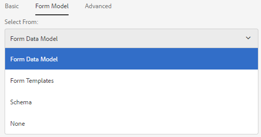

# 建立最適化表單 {#creating-an-adaptive-form}

>[!CAUTION]
>
>AEM 6.4已結束延伸支援，本檔案不再更新。 如需詳細資訊，請參閱 [技術支援期](https://helpx.adobe.com//tw/support/programs/eol-matrix.html). 尋找支援的版本 [此處](https://experienceleague.adobe.com/docs/).

## <strong>建立最適化表單</strong> {#strong-create-an-adaptive-form-strong}

請依照下列步驟建立最適化表單。

1. 在存取AEM Forms Author例項 `https://[server]:[port]/<custom-context-if-any>.`

   ```
   
   ```

1. 在AEM登入頁面上輸入您的憑證。

   登入後，在左上角，點選 **[!UICONTROL Adobe Experience Manage > Forms > Forms與檔案]**.

   >[!NOTE]
   >
   >對於預設安裝，登入為 `admin` 密碼是 `admin`.

1. 點選 **[!UICONTROL 建立]** 選取 **[!UICONTROL 適用性表單]**.
1. 畫面上會顯示選取範本的選項。 如需範本的詳細資訊，請參閱 [最適化表單範本](/help/forms/using/creating-adaptive-form.md#p-adaptive-form-templates-p). 點選範本以選取它，然後點選「下一步」。
1. 「新增屬性」選項隨即出現。 指定下列屬性欄位的值。 標題和名稱欄位是必填欄位：

   * **[!UICONTROL 標題：]** 指定表單的顯示名稱。 標題可協助您識別AEM Forms使用者介面中的表單。
   * **[!UICONTROL 名稱：]** 指定表單的名稱。 在儲存庫中建立具有指定名稱的節點。 當您開始輸入標題時，會自動產生名稱欄位的值。 您可以變更建議的值。 名稱欄位只能包含英數字元、連字型大小和底線。 所有無效輸入都會以連字型大小取代。
   * **[!UICONTROL 說明：]** 指定有關表單的詳細資訊。
   * **[!UICONTROL 標籤：]** 指定用以唯一識別最適化表單的標籤。 標籤有助於搜尋表單。 若要建立標籤，請在 **標籤** 框。

1. 您可以根據下列其中一個表單模型建立最適化表單：

   * [表單資料模型](#fdm)
   * [XFA表單範本](/help/forms/using/creating-adaptive-form.md#p-create-an-adaptive-form-based-on-an-xfa-form-template-p)
   * [XML或JSON結構](/help/forms/using/creating-adaptive-form.md#p-create-an-adaptive-form-based-on-xml-or-json-schema-p)
   * 無或沒有任何表單模型

   您可以透過 **[!UICONTROL 表單模型]** 標籤 **[!UICONTROL 新增屬性]** 頁面。 依預設，選取的表單模型為 **[!UICONTROL 無]**.

1. 點選 **建立**. 隨即建立最適化表單，並出現一個對話方塊以開啟表單以進行編輯。

   指定完所有屬性後，按一下 **[!UICONTROL 建立]**. 隨即建立最適化表單，並出現一個對話方塊以開啟表單以進行編輯。

   指定完所有屬性後，按一下 **[!UICONTROL 建立]**. 隨即建立最適化表單，並出現一個對話方塊以開啟表單以進行編輯。

1. 點選 **[!UICONTROL 開啟]** 在新頁簽中開啟新建立的窗體。 表單隨即開啟供編輯，並顯示範本中可用的內容。 它也會顯示邊欄，以根據需求自訂新建立的表單。

   根據最適化表單的類型，關聯XFA表單範本、XML結構或JSON結構中顯示的表單元素會顯示在 **[!UICONTROL 資料模型物件]** 的 **[!UICONTROL 內容瀏覽器]** 欄。 您也可以拖放這些元素來建立最適化表單。

   如需適用性表單製作介面和可用元件的相關資訊，請參閱 [製作最適化表單簡介](/help/forms/using/introduction-forms-authoring.md).

   >[!NOTE]
   >
   >允許瀏覽器中的彈出窗口在新頁簽中開啟新建立的表單。

## 根據表單資料模型建立最適化表單 {#fdm}

[AEM Forms資料整合](/help/forms/using/data-integration.md) 可讓您整合多個資料來源，並將其實體和服務整合在一起，以建立表單資料模型。 此為JSON結構描述的擴充功能。 您可以使用表單資料模型來建立最適化表單。 在表單資料模型中配置的實體或資料模型對象可作為資料模型對象用於表單創作。 它們會系結至個別的資料來源，並用來預填表單，並將提交的資料寫回個別資料來源。 您也可以使用最適化表單規則，叫用表單資料模型中設定的服務。

若要使用表單資料模型建立最適化表單：

1. 在「添加屬性」螢幕上的「表單模型」頁簽中，選擇 **[!UICONTROL 表單資料模型]** 在 **[!UICONTROL 從]** 下拉式清單。

   

1. 點選以展開 **[!UICONTROL 選擇表單資料模型]**. 會列出所有可用的表單資料模型。

   從資料模型中選取。

   

>[!NOTE]
>
>您也可以變更最適化表單的表單資料模型。 如需詳細步驟，請參閱 [編輯最適化表單的表單模型屬性](#edit-form-model).

## 根據XFA表單範本建立最適化表單 {#create-an-adaptive-form-based-on-an-xfa-form-template}

您可以重新調整XFA表單範本的用途，以建立最適化表單。 若要重新調整用途，請上傳XFA表單範本並與最適化表單建立關聯。 表單範本（XFA表單）的元素可在最適化表單製作時用於內容尋找器。 從「內容尋找器」，您可以拖放表單上的表單範本元素。

>[!NOTE]
>
>[上傳XFA表單範本](/help/forms/using/get-xdp-pdf-documents-aem.md) 前往AEM Forms，再開始根據表單範本建立最適化表單。

請執行下列操作，將XFA表單範本用作最適化表單的表單模型：

1. 在 **[!UICONTROL 新增屬性]** 頁面，開啟 **[!UICONTROL 表單模型]** 標籤。
1. 在「表單模型」頁簽中，從下拉清單中，選擇 **[!UICONTROL 表單範本]**. 所有透過AEM Forms UI上傳至存放庫的表單範本都會列出以供選取。 從清單中選取範本。

   
   **圖：** *選擇表單模板*

   >[!NOTE]
   >
   >您也可以變更最適化表單的表單範本。 如需詳細步驟，請參閱 [編輯最適化表單的表單模型屬性](#edit-form-model).

## 根據XML或JSON結構建立最適化表單 {#create-an-adaptive-form-based-on-xml-or-json-schema}

XML和JSON結構代表組織內的後端系統產生或使用資料的結構。 您可以將結構與適用性表單建立關聯，並使用其元素將動態內容新增至適用性表單。 結構的元素可在內容瀏覽器的「資料模型物件」標籤中取得，以製作最適化表單。 您可以拖放結構元素以建立表單。

請參閱下列檔案，了解如何設計XML或JSON結構，以製作最適化表單。

* [使用XML結構建立最適化表單](/help/forms/using/adaptive-form-xml-schema-form-model.md)
* [使用JSON結構建立最適化表單](/help/forms/using/adaptive-form-json-schema-form-model.md)

請執行下列動作，將XML或JSON結構描述用作最適化表單的表單模型：

1. 在 **[!UICONTROL 新增屬性]** 建立最適化表單頁面的步驟，點選 **[!UICONTROL 表單模型]** 標籤。
1. 在「表單模型」頁簽中，選擇 **[!UICONTROL 結構]** 從 **[!UICONTROL 從]** 下拉式欄位。

1. 點選 **[!UICONTROL 選擇架構]** 並執行下列其中一項操作：

   * **[!UICONTROL 從磁碟上傳]**  — 選取此選項，然後點選「上傳結構定義」，從您的檔案系統瀏覽及上傳XML結構或JSON結構。 上傳的結構檔案與表單一併存，且無法供其他最適化表單存取。
   * **[!UICONTROL 在儲存庫中搜尋]**  — 選擇此選項，從儲存庫中可用的架構定義檔案清單中進行選擇。 選取XML或JSON結構檔案作為表單模型。 選取的結構將依參考與表單建立關聯，且可供其他最適化表單使用。

   >[!CAUTION]
   >
   >請確定JSON結構檔案名稱的結尾為 **.schema.json**. 例如：mySchema.schema.json

   
   **圖：** *選取XML或JSON結構*

1. （僅適用於XML架構）選取或上傳XML架構後，請指定所選XSD檔案的根元素，以與最適化表單對應。

   
   **圖：** *選擇XSD根元素*

>[!NOTE]
>
>您也可以變更最適化表單的結構。 如需詳細步驟，請參閱 [編輯最適化表單的表單模型屬性](#edit-form-model).

## 最適化表單範本 {#adaptive-form-templates}

範本提供基本結構並定義最適化表單的外觀（配置和樣式）。 它具有包含特定屬性和內容結構的預格式化元件。 AEM Forms可立即提供一些最適化表單範本。 若要取得包含進階範本的完整範本套件，您需要安裝AEM Forms附加元件套件。 如需詳細資訊，請參閱 [安裝AEM Forms附加元件套件](/help/forms/using/installing-configuring-aem-forms-osgi.md).

此外，您可以使用範本編輯器建立自己的範本。 如需使用範本的詳細資訊，請參閱 [最適化表單範本](/help/forms/using/template-editor.md).

>[!NOTE]
>
>當您開啟使用進階範本建立的最適化表單以進行編輯時，會出現錯誤訊息。 進階範本有簽名步驟元件，預設會啟用Acrobat Sign。 建立並選取 [Acrobat Sign雲端組態](/help/forms/using/adobe-sign-integration-adaptive-forms.md) 和 [配置簽名者](/help/forms/using/working-with-adobe-sign.md#addsignerstoanadaptiveform) 以解決錯誤。

## 編輯最適化表單的表單模型屬性 {#edit-form-model}

最適化表單是在沒有表單模型的情況下建立（對表單模型使用「無」選項），或使用表單模型，如表單範本、XML結構描述或JSON結構描述，或表單資料模型。 您可以將適用性表單的表單模型從「無」變更為其他表單模型。 針對以表單模型為基礎的最適化表單，您可以為相同的表單模型選擇其他表單範本、XML結構描述、JSON結構描述或表單資料模型。 但是，您不能將一個表單模型更改為另一個表單模型。

1. 選取最適化表單並點選 **屬性** 表徵圖。
1. 開啟 **[!UICONTROL 表單模型]** 標籤，然後執行下列任一操作。

   * 如果適用性表單沒有表單模型，您可以選擇其他表單模型，並據以選取表單範本、XML或JSON結構或表單資料模型。
   * 如果最適化表單是以表單模型為基礎，您可以為相同的表單模型選擇其他表單範本、XML或JSON結構，或表單資料模型。

1. 點選 **[!UICONTROL 儲存]** 以儲存屬性。

## 自動儲存最適化表單 {#auto-save-an-adaptive-form}

依預設，適用性表單的內容會儲存在使用者動作上，例如按下儲存按鈕時。 您也可以設定最適化表單，以根據事件或時間間隔自動開始儲存內容。 自動儲存選項在下列項目中很實用：

* 自動為匿名和登入的使用者儲存內容
* 不用或最少的用戶干預保存表單的內容
* 開始根據使用者事件儲存表單的內容
* 在指定的時間間隔後重複保存表單的內容

### 啟用最適化表單的自動儲存 {#enable-auto-save-for-an-adaptive-form}

預設不會啟用自動儲存選項。 您可以從適用性表單的「自動儲存」標籤中啟用自動儲存選項。 「自動儲存」標籤也提供其他數個設定選項。 執行下列步驟來啟用和設定最適化表單的自動儲存選項：

1. 若要存取屬性中的自動儲存區段，請選取元件，然後點選  > **[!UICONTROL 適用性表單容器]**，然後點選 .
1. 在 **[!UICONTROL 自動儲存]** 部分， **[!UICONTROL 啟用]** 自動儲存選項。
1. 在 **[!UICONTROL 適用性表單事件]** 框中，指定1或TRUE以在瀏覽器中載入表單時自動開始保存表單。 您也可以為事件指定條件式運算式，當觸發並傳回true時，就會開始儲存表單的內容。
1. 指定觸發器。 會根據您的設定觸發自動儲存。 您的選項為：

   * **[!UICONTROL 時間型：]** 選取根據特定時間間隔開始儲存內容的選項。
   * **[!UICONTROL 事件型：]** 選取要在觸發事件時開始儲存內容的選項。

   選取觸發器時，會啟用「策略配置」框。 「策略配置」框允許您：

   * 如果您選取 **[!UICONTROL 時間型]** 觸發。
   * 如果您選取「 」，請指定事件名稱 **[!UICONTROL 事件型]** 觸發。

   您也可以建立自訂策略，並新增至清單。 如需詳細資訊，請參閱 [實作自訂策略以自動儲存表單](/help/forms/using/auto-save-an-adaptive-form.md#p-implement-a-custom-strategy-to-enable-autosave-for-adaptive-forms-p).

1. （僅限基於時間的自動保存）執行以下步驟來配置基於時間的自動保存的選項。

   1. 在 **[!UICONTROL 在此間隔自動儲存]** 框中，以秒為單位指定時間間隔。 在間隔框中指定的秒數過後，將重複保存該表單。

1. （僅限事件型自動儲存）執行下列步驟來設定事件型自動儲存的選項。

   1. 在 **在此事件後自動儲存** 框，指定 [GuideBridge](https://helpx.adobe.com/aem-forms/6/javascript-api/GuideBridge.html) 事件。 每次運算式評估為TRUE時，都會儲存表單。

1. （可選）若要自動儲存匿名使用者的內容，請選取 **為匿名用戶啟用自動保存** ，然後按一下 **[!UICONTROL 確定]**.

   >[!NOTE]
   >
   >若要讓自動儲存選項可供匿名使用者使用，請確定您已設定Forms通用設定服務，讓所有使用者都能預覽、驗證和簽署表單。
   >
   >若要設定服務，請前往AEM Web Console設定： `https://[server]:[host]/system/console/configMgr` 和編輯 **[!UICONTROL Forms Common Configuration Service]** 來選擇 **[!UICONTROL 所有使用者]** 選項 **[!UICONTROL 允許]** 欄位，並儲存設定。
