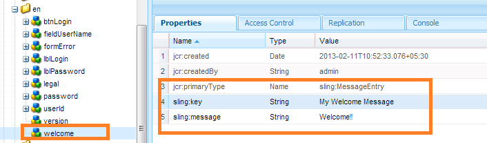

# 建立新登入畫面 {#creating-a-new-login-screen}

>[!CAUTION]
>
>AEM 6.4已結束延伸支援，本檔案不再更新。 如需詳細資訊，請參閱 [技術支援期](https://helpx.adobe.com//tw/support/programs/eol-matrix.html). 尋找支援的版本 [此處](https://experienceleague.adobe.com/docs/).

您可以修改使用AEM Forms登入畫面之所有AEM Forms模組的登入畫面。 例如，修改會同時影響Forms Manager和AEM Forms工作區的登入畫面。

## 必備條件 {#prerequisite}

1. 登入 `/lc/crx/de` 具有管理員權限。
1. 執行下列動作：

   1. 複製分層結構：of `/libs/livecycle/core/content` at `/apps/livecycle/core/content`. 維護相同的（節點/資料夾）屬性和訪問控制。
   1. 複製內容資料夾：從 `/libs/livecycle/core` to `/apps/livecycle/core`.
   1. 刪除 `/apps/livecycle/core` 檔案夾。

1. 執行下列動作：

   1. 複製分層結構：of `/libs/livecycle/core/components/login` at `/apps/livecycle/core/components/login`. 維護相同的（節點/資料夾）屬性和訪問控制。
   1. 複製元件資料夾：從 `/libs/livecycle/core` to `/apps/livecycle/core`.
   1. 刪除資料夾的內容： `/apps/livecycle/core/components/login`.

## 新增地區設定 {#adding-a-new-locale}

1. 複製 `i18n` 資料夾：

   * 從 `/libs/livecycle/core/components/login`
   * 至 `/apps/livecycle/core/components/login`

1. 刪除內部的所有資料夾 `i18n` 除了一個，比如 `en`.
1. 在資料夾上 `en`，執行下列動作：

   1. 將資料夾更名為要支援的區域設定名稱。 例如， `ar`.
   1. 變更屬性 `jcr:language` 值 `ar`(針對 `ar` 資料夾)。

   >[!NOTE]
   >
   >如果區域設定是語言 — 國家/地區代碼組合，例如， `ar-DZ`，然後將資料夾名稱和屬性值變更為 `ar-DZ`.

1. 複製 `login.jsp`:

   * 從 `/libs/livecycle/core/components/login`
   * 至 `/apps/livecycle/core/components/login`

1. 修改下列程式碼片段 `/apps/livecycle/core/components/login/login.jsp`:

   ***地區是語言代碼***

   ```
   String browserLocale = "en";
       for(int i=0; i<locales.length; i++)
       {
           String prioperty = locales[i];
           if(prioperty.trim().startsWith("en")) {
               browserLocale = "en";
               break;
           }
           if(prioperty.trim().startsWith("de")){
               browserLocale = "de";
               break;
           }
           if(prioperty.trim().startsWith("ja")){
               browserLocale = "ja";
               break;
           }
           if(prioperty.trim().startsWith("fr")){
               browserLocale = "fr";
               break;
           }
       }
   
   To
   
   String browserLocale = "en";
       for(int i=0; i<locales.length; i++)
       {
           String prioperty = locales[i];
           if(prioperty.trim().startsWith("ar")) {
               browserLocale = "ar";
               break;
           }
           if(prioperty.trim().startsWith("en")) {
               browserLocale = "en";
               break;
           }
           if(prioperty.trim().startsWith("de")){
               browserLocale = "de";
               break;
           }
           if(prioperty.trim().startsWith("ja")){
               browserLocale = "ja";
               break;
           }
           if(prioperty.trim().startsWith("fr")){
               browserLocale = "fr";
               break;
           }
       }
   ```

   ***地區是語言 — 國家/地區代碼***

   ```
   String browserLocale = "en";
       for(int i=0; i<locales.length; i++)
       {
           String prioperty = locales[i];
           if(prioperty.trim().startsWith("en")) {
               browserLocale = "en";
               break;
           }
           if(prioperty.trim().startsWith("de")){
               browserLocale = "de";
               break;
           }
           if(prioperty.trim().startsWith("ja")){
               browserLocale = "ja";
               break;
           }
           if(prioperty.trim().startsWith("fr")){
               browserLocale = "fr";
               break;
           }
       }
   
   To
   
   String browserLocale = "en";
       for(int i=0; i<locales.length; i++)
       {
           String prioperty = locales[i];
           if(prioperty.trim().equalsIgnoreCase("ar-DZ")) {
               browserLocale = "ar-DZ";
               break;
           }
           if(prioperty.trim().startsWith("en")) {
               browserLocale = "en";
               break;
           }
           if(prioperty.trim().startsWith("de")){
               browserLocale = "de";
               break;
           }
           if(prioperty.trim().startsWith("ja")){
               browserLocale = "ja";
               break;
           }
           if(prioperty.trim().startsWith("fr")){
               browserLocale = "fr";
               break;
           }
       }
   ```

   ***更改預設區域設定***

   ```
   String browserLocale = "en";
   for(int i=0; i<locales.length; i++)
   
   To
   
   String browserLocale = "ar";
   for(int i=0; i<locales.length; i++)
   ```

## 新增文字或修改現有文字 {#adding-new-text-or-modifying-existing-text}

1. 複製 `i18n` 資料夾：

   * 從 `/libs/livecycle/core/components/login`
   * 至 `/apps/livecycle/core/components/login`

1. 現在修改屬性的值 `sling:message` （在需要的區域設定代碼資料夾下），以更改其文本。 翻譯是透過 `sling:key` 屬性。
1. 要添加新的鍵值對，請執行以下操作。 查看螢幕擷圖中的範例。

   1. 建立類型的節點 `sling:MessageEntry`，或複製現有節點，然後在所有區域設定資料夾下對其進行更名。
   1. 複製 `login.jsp` :

      * 從 `/libs/livecycle/core/components/login`
      * 至 `/apps/livecycle/core/components/login`
   1. 修改 `/apps/livecycle/core/components/login/login.jsp` 來合併新新增的文字。

   

   ```
   div class="loginContent">
                       <span class="loginFlow"></span>
                       <span class="loginVersion"><%= i18n.get("Version: 11.0.0") %></span>
                       <span class="loginTitle"><%= i18n.get("Login") %></span>
                       <% if (loginFailed) {%>
   
   To
   
   div class="loginContent">
                       <span class="loginFlow"></span>
                       <span class="loginVersion"><%= i18n.get("My Welcome Message") %></span>
                       <span class="loginVersion"><%= i18n.get("Version: 11.0.0") %></span>
                       <span class="loginTitle"><%= i18n.get("Login") %></span>
                       <% if (loginFailed) {%>
   ```

## 添加新樣式或修改現有樣式 {#adding-new-style-or-modifying-existing-style}

1. 複製 `login` 節點：

   * 從 `/libs/livecycle/core/content`
   * 至 `/apps/livecycle/core/content`

1. 刪除檔案 `login.js` 和 `jquery-1.8.0.min.js`，從節點 `/apps/livecycle/core/content/login.`
1. 修改CSS檔案中的樣式。
1. 若要新增樣式：

   1. 新增樣式至 `/apps/livecycle/core/content/login/login.css`
   1. 複製 `login.jsp`

      * 從 `/libs/livecycle/core/components/login`
      * 至 `/apps/livecycle/core/components/login`
   1. 修改 `/apps/livecycle/core/components/login/login.jsp` 來合併新增的樣式。


1. 例如：

   * 將下列項目新增至 `/apps/livecycle/core/content/login/login.css`.

   ```css
   .newLoginContentArea {
    width: 700px;
    padding: 100px 0px 0px 100px;
   }
   ```

   * 在/apps/livecycle/core/components/login.jsp中修改以下內容。

   ```
   <div class="loginContentArea">
   
   To
   
   <div class="newLoginContentArea">
   ```

>[!NOTE]
>
>若 `/apps/livecycle/core/content/login` (複製自 `/libs/livecycle/core/content/login`)，然後移除CSS中對應的參考。

## 新增影像 {#add-new-images}

1. 按照添加新樣式或修改現有樣式的步驟操作（如上所述）。
1. 在中新增影像 `/apps/livecycle/core/content/login`. 添加影像：

   1. 安裝WebDAV客戶端。
   1. 導覽至 `/apps/livecycle/core/content/login` 資料夾，使用webDAV客戶端。 如需詳細資訊，請參閱： [https://dev.day.com/docs/en/crx/current/how_to/webdav_access.html](https://docs.adobe.com/docs/en/crx/current/how_to/webdav_access.html).
   1. 新增影像。

1. 在中新增樣式 `/apps/livecycle/core/content/login/login.css,` 對應於 `/apps/livecycle/core/content/login`.
1. 在 `login.jsp` at `/apps/livecycle/core/components`.
1. 例如：

   * 將下列項目新增至 `/apps/livecycle/core/content/login/login.css`

   ```css
   .newLoginContainerBkg {
    background-image: url(my_Bg.gif);
    background-repeat: no-repeat;
    background-position: left top;
    width: 727px;
   }
   ```

   * 在/apps/livecycle/core/components/login.jsp中修改以下內容。

   ```
   <div class="loginContainerBkg">
   
   To
   
   <div class="newLginContainerBkg">
   ```
