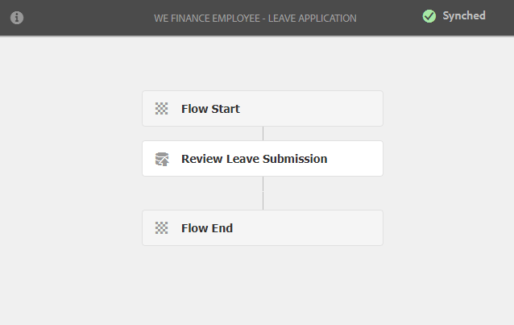

# 員工自助參考網站逐步說明 {#employee-self-service-reference-site-walkthrough}

>[!CAUTION]
>
>AEM 6.4已結束延伸支援，本檔案不再更新。 如需詳細資訊，請參閱 [技術支援期](https://helpx.adobe.com//tw/support/programs/eol-matrix.html). 尋找支援的版本 [此處](https://experienceleague.adobe.com/docs/).

## 必備條件 {#prerequisite}

按如下所述設定引用站點 [設定AEM Forms參考網站](/help/forms/using/setup-reference-sites.md).

## 概觀 {#overview}

員工自助服務系統通常由公司內聯網托管，使員工能夠訪問他們可以從辦公桌上獲得的大量資訊和服務。 它賦予員工權力並賦予員工完全控制權，以執行諸如查看其雇傭詳情、申請休假以及提交費用報告等操作。 另一方面，它有助於組織提高流程效率並降低成本，同時讓員工了解情況並參與其中。

員工自助服務參考網站會展示如何運用AEM Forms，在貴組織中實作員工自助服務系統。

>[!NOTE]
>
>We.Finance和We.Gov參考網站均提供員工自助服務使用案例。 逐步教學中使用的範例、影像和說明使用We.Finance參考網站。 不過，您也可以使用We.Gov執行這些使用案例並檢閱成品。 若要這麼做，您必須取代 **we-finance** with **we-gov** 填入。

## 利益衝突問卷逐 {#conflict-of-interest-questionnaire-walkthrough}

組織不時要求其員工提交利益衝突調查表，以確定可能與其組織發生衝突的員工的外部活動或個人關係。

Sarah組織的合規部已要求員工提交利益衝突調查表。

### Sarah提交了利益衝突問卷 {#sarah-submits-the-conflict-of-interest-questionnaire}

Sarah會前往組織的入口網站、登入並按一下「員工」以存取員工控制面板。 她在員工儀表板和點擊中查找利益衝突調查表 **[!UICONTROL 套用]**.

**圖：** *組織入口網站*

**圖：** *員工儀表板*

Sarah使用「下一步」按鈕導覽表單，並閱讀「簡介」和「定義」區段。 她回答了「問題」部分的問題。 最後，她簽名並提交了調查表。

組織入口網站和問卷具有回應性且適合行動裝置。 以下工作流程顯示Sarah如何在行動裝置上導覽及提交問卷。

**運作方式**

組織入口網站和員工控制面板是AEM Sites頁面。 儀表板列出了若干自助服務選項，如利益衝突調查表。 「套用」按鈕會連結至最適化表單。

適用性表單會根據「問題」索引標籤中提供的答案，使用規則來顯示 — 隱藏資訊。 此外，表單使用手寫元件來登入「聲明」標籤。 查看最適化表單，網址為 `https://[authorHost]:[authorPort]/editor.html/content/forms/af/we-finance/employee/self-service/conflict-of-interest.html`.

**你自己看**

前往 `https://[publishHost]:[publishPort]/content/we-finance/global/en/self-service-forms.html` 使用 `srose/srose` 作為Sarah的用戶名/密碼。 按一下 **[!UICONTROL 員工]** 若要存取控制面板，然後按一下 **[!UICONTROL 套用]** 關於利益衝突問卷。 審查並提交調查表。

### Gloria審查和核准利益衝突問卷提交 {#gloria-reviews-and-approves-the-conflict-of-interest-questionnaire-submission}

Sarah提交的利益衝突調查表被指派給Gloria Rios進行審查。 Gloria在組織中擔任合規官。 Gloria登入其AEM收件匣並檢閱指派給她的工作。 她核准了Sarah提交的問卷，並完成了任務。

**圖：** *格洛麗亞的收件箱*

**圖：** *開啟任務*

**運作方式**

Conflict of Interest調查表中的提交操作會觸發工作流，該工作流在Gloria的收件箱中建立任務以進行批准。 查看Forms Workflow: `https://[authorHost]:[authorPort]/editor.html/conf/global/settings/workflow/models/we-finance/employee/self-service/we-finance-employee-conflict-of-interest.html`

**你自己看**

前往 `https://[publishHost]:[publishPort]/content/we-finance/global/en/login.html?resource=/aem/inbox.html` 使用 `grios/password` 作為Gloria Rios的用戶名/密碼。 開啟為利益衝突調查表建立的任務並批准它。

## 企業卡應用程式逐步說明 {#corporate-card-application-walkthrough}

莎拉經常出差，她需要一張企業信用卡來支付搬家時的賬單。 她通過組織的員工門戶申請公司卡。

### Sarah提交了公司卡申請 {#sarah-submits-the-corporate-card-application}

Sarah會前往組織的入口網站、登入和點按 **[!UICONTROL 員工]** 訪問員工儀表板。 她在員工儀表板上查找公司卡應用程式並點擊 **[!UICONTROL 套用]**.

**圖：** *組織入口網站*

**圖：** *員工儀表板*

她按了 **[!UICONTROL 套用]** 在公司卡應用程式上。 隨即開啟單頁應用程式。 她填寫了所有細節和點擊 **[!UICONTROL 套用]** 提交申請。

**運作方式**

組織入口網站和員工控制面板是AEM Sites頁面。 控制面板列出數個自助服務選項，例如公司資訊卡應用程式。 應用程式上的「套用」按鈕會連結至最適化表單。

適用於公司資訊卡應用程式的最適化表單是簡單、單頁、回應式的最適化表單。 它使用基本的自適應表單元件，如文本、電話、數字盒和數字步進器。 查看最適化表單：\
`https://[authorHost]:[authorPort]/editor.html/content/forms/af/we-finance/employee/self-service/corporate-card.html`。

**你自己看**

前往 `https://[publishHost]:[publishPort]/content/we-finance/global/en/self-service-forms.html` 使用 `srose/srose` 作為Sarah的用戶名/密碼。 按一下 **[!UICONTROL 員工]** 若要存取控制面板，然後按一下 **[!UICONTROL 套用]** 在公司卡應用程式上。 填寫詳細資訊並提交申請。

### Gloria審核並批准公司卡申請 {#gloria-reviews-and-approves-the-corporate-card-application}

Sarah提交的公司卡申請被分配給Gloria Rios進行審核。 Gloria登入其AEM收件匣並檢閱指派給她的工作。 她批准了Sarah提交的申請並完成了任務。

**圖：** *格洛麗亞的收件箱*

**圖：** *開啟任務*

**運作方式**

企業卡應用程式中的提交工作流程會觸發Forms工作流程，在Gloria的收件匣中建立任務以供核准。 查看Forms Workflow: `https://[authorHost]:[authorPort]/editor.html/conf/global/settings/workflow/models/we-finance/employee/self-service/we-finance-employee-corporate-card.html`

**你自己看**

前往 `https://[publishHost]:[publishPort]/content/we-finance/global/en/login.html?resource=/aem/inbox.html` 使用 `grios/password` 作為Gloria Rios的用戶名/密碼。 開啟為公司卡應用程式建立的任務並批准它。

## 費用報表提交逐步說明 {#expense-report-submission-walkthrough}

當莎拉在出差期間花費時間時，她需要提交費用報告以獲得批准。 組織中的自助選項可讓她線上提交費用報表。

### Sarah提交了費用報表申請 {#sarah-submits-the-expense-report-application}

Sarah會前往組織的入口網站、登入和點按 **[!UICONTROL 員工]** 訪問員工儀表板。 她在員工控制面板上查找費用報表應用程式並點擊 **[!UICONTROL 套用]**.

**圖：** *組織入口網站*

**圖：** *員工儀表板*

她按了 **[!UICONTROL 套用]** （在費用報表應用程式中）。 此時將開啟一個應用程式表單，其中有兩個頁簽： 「報表名稱」和「報表詳細資訊」。 此 **+** 表徵圖允許她在一個報表中添加超過支出。

組織入口網站和應用程式回應式且適合行動裝置。 以下工作流程顯示Sarah如何導覽和提交其行動裝置上的費用報表。

**運作方式**

組織入口網站和員工控制面板是AEM Sites頁面。 控制面板列出多個自助選項，如「費用報表」應用程式。 「套用」按鈕會連結至最適化表單。

適用性表單中的「報表名稱」和「報表詳細資料」標籤為「面板」元件。 「報表詳細資訊」面板包含「費用」面板。 這是可重複的面板，可讓您在報表中新增多項支出。 請前往 `https://[authorHost]:[authorPort]/editor.html/content/forms/af/we-finance/employee/expense-report.html`.

**你自己看**

前往 `https://[publishHost]:[publishPort]/content/we-finance/global/en/self-service-forms.html` 使用 `srose/srose` 作為Sarah的用戶名/密碼。 按一下 **[!UICONTROL 員工]** 若要存取控制面板，然後按一下 **[!UICONTROL 套用]** 在費用報表應用程式中。 填寫詳細資訊並提交申請。

### Gloria審核並批准費用報表 {#gloria-reviews-and-approves-the-expense-report}

Sarah提交的費用報表被分配給Gloria Rios進行審核。 Gloria登入其AEM收件匣並檢閱指派給她的工作。 她批准了Sarah提交的申請並完成了任務。

**圖：** *格洛麗亞的收件箱*

**圖：** *開啟任務*

**運作方式**

費用報表應用程式中的提交工作流將觸發Forms工作流，該工作流在Gloria的收件箱中建立任務以進行批准。 查看Forms Workflow: `https://[authorHost]:[authorPort]/editor.html/conf/global/settings/workflow/models/we-finance/employee/self-service/we-finance-employee-expense-report-workflow.html`

**你自己看**

前往 `https://[publishHost]:[publishPort]/content/we-finance/global/en/login.html?resource=/aem/inbox.html` 使用 `grios/password` 作為Gloria Rios的用戶名/密碼。 開啟為費用報表應用程式建立的任務並審批它。

## 離開應用程式逐步說明 {#leave-application-walkthrough}

莎拉正計畫下月放假，並想申請一週的休假。

### Sarah提交了休假申請 {#sarah-submits-the-leave-application}

Sarah會前往組織的入口網站、登入和點按 **[!UICONTROL 員工]** 訪問員工儀表板。 她在員工儀表板上找到離開申請，然後按一下 **[!UICONTROL 套用]**.

**圖：** *組織入口網站*

**圖：** *員工儀表板*

離開申請會開啟，填入Sarah的姓名和表單中預填的員工ID。 它還顯示了她的休假餘額和歷史記錄。 她填寫了請假的細節，並提交了申請以供批准。

組織入口網站和應用程式回應式且適合行動裝置。 以下工作流程顯示Sarah如何在其行動裝置上導覽及提交應用程式。

**運作方式**

組織入口網站和員工控制面板是AEM Sites頁面。 控制面板列出數個自助選項，例如離開應用程式。 「套用」按鈕會連結至最適化表單。

休假申請的最適化表單基於員工休假表單資料模型。 在「剩餘餘額」部分，使用 `getLeavesOf` 表單資料模型服務。 「開始日期」和「結束日期」欄位使用規則來驗證日期值是否等於目前日期或之後。 系統會使用 `calcBusinessDays` 函式。

您可以在下列位置查看最適化表單和表單資料模型：

`https://[authorHost]:[authorPort]/editor.html/content/forms/af/we-finance/employee/self-service/leave-application.html`

`https://[authorHost]:[authorPort]/aem/fdm/editor.html/content/dam/formsanddocuments-fdm/db`

**你自己看**

前往 `https://[publishHost]:[publishPort]/content/we-finance/global/en/self-service-forms.html` 使用 `srose/srose` 作為Sarah的用戶名/密碼。 按一下 **[!UICONTROL 員工]** 若要存取控制面板，然後按一下 **[!UICONTROL 套用]** 在離開申請時。 填寫詳細資訊並提交申請。

### 格洛麗亞審查並批准休假申請 {#gloria-reviews-and-approves-the-leave-application}

Sarah提交的休假申請被分配給Gloria Rios，以供審查。 Gloria登入其AEM收件匣並檢閱指派給她的工作。 她批准了Sarah提交的申請並完成了任務。

**圖：** *格洛麗亞的收件箱*

**圖：** *開啟任務*

**運作方式**

離開應用程式中的提交工作流程會觸發Forms工作流程，在Gloria的收件匣中建立工作以供核准。 查看Forms Workflow: `https://[authorHost]:[authorPort]/editor.html/conf/global/settings/workflow/models/we-finance/employee/self-service/we-finance-employee-leave-application.html`

**你自己看**

前往 `https://[publishHost]:[publishPort]/content/we-finance/global/en/login.html?resource=/aem/inbox.html` 使用 `grios/password` 作為Gloria Rios的用戶名/密碼。 開啟為離開應用程式建立的任務並批准它。
