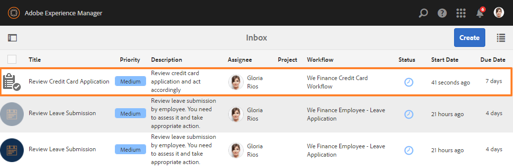
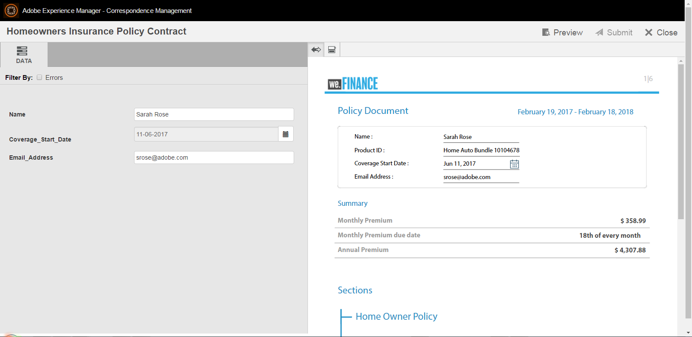
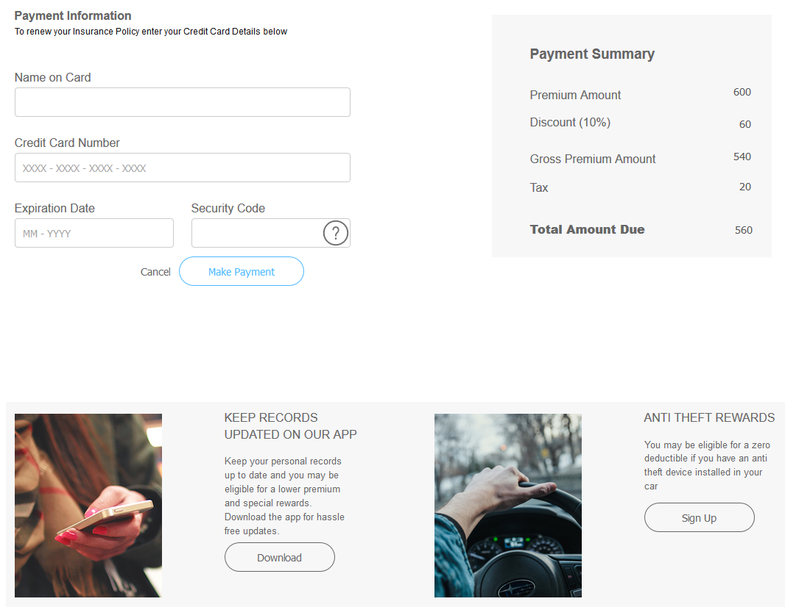

# We.金融參考網站逐步說明 {#we-finance-reference-site-walkthrough}

## 先決條件 {#pre-requisites}

按如下所述設定引用站點 [設定AEM Forms參考網站](/help/forms/using/setup-reference-sites.md).

## We.財務參考站點方案 {#we-finance-reference-site-scenarios}

We.Finance是金融服務領域的領先組織，提供全面且個人化的金融解決方案，以符合不同客戶設定檔的要求。 他們提供信用卡、住房抵押和住房保險服務。

他們的目標是在其偏好的裝置上與現有和潛在客戶聯絡，說明其服務的優點，並協助他們註冊其服務。 此外，他們還希望推銷更多金融產品，比如客戶可能覺得有趣的附加卡。

閱讀We.Finance使用案例的詳細解說，並了解AEM Forms如何協助金融組織達成其目標。 涵蓋下列逐步說明：

* [信用卡申請逐步說明](#credit-card-application-walkthrough)
* [住房抵押申請逐步說明](#home-mortgage-application-walkthrough)
* [Microsoft Dynamics的住房抵押申請逐步說明](#home-mortgage-application-walkthrough-with-microsoft-dynamics)
* [家庭保險申請逐步說明](#home-insurance-application-walkthrough)
* [財富管理逐步說明](#wealthmanagementwalkthrough)
* [汽車保險申請逐步說明](#autoinsuranceapplicationwalkthrough)

## 信用卡申請逐步說明 {#credit-card-application-walkthrough}

We.Finance信用卡應用方案涉及以下角色：

* We.Finance客戶莎拉·羅斯
* Gloria Rios,We.Finance信用卡與抵押業務主管

以下資訊圖描述了信用卡應用程式的逐步工作流。

讓我們詳細了解參考網站案例，了解AEM Forms如何協助We.Finance達成其目標。

### Sarah從We.Finance收到一份電子報，申請信用卡 {#sarah-receives-a-newsletter-from-we-finance-and-applies-for-a-credit-card}

莎拉·羅絲是We.Finance的現有客戶。 她從We.Finance收到一份關於新信用卡優惠的通訊。 她覺得這些優惠令人興奮，並決定申請信用卡。 她按一下電子報中的「立即應用」按鈕，該按鈕將她轉到We.Finance門戶上的信用卡應用。

#### 運作方式 {#how-it-works}

傳送給Sarah的電子報是自訂實作，會觸發電子郵件至指定的電子郵件ID。 電子郵件中的「立即套用」按鈕會連結至信用卡應用程式，此應用程式是發佈執行個體上的最適化表單。

#### 你自己看 {#see-it-yourself}

在發佈執行個體上開啟下列URL以觸發電子報電子郵件。 請確定您取代 `[emailID]` 具有有效的電子郵件帳戶，可接收電子報。 開啟電子報，然後按一下 **[!UICONTROL 立即應用]** ，轉到信用卡申請。

`https://[publishServer]:[publsihPort]/content/campaigns/we-finance/start.html?app=cc&email=[emailID]&givenName=Sarah&familyName=Rose`

### 莎拉覺得這個提議很有趣，於是選擇申請 {#sarah-finds-the-offer-interesting-and-chooses-to-apply}

莎拉決定申請信用卡 **[!UICONTROL 立即應用]** 按鈕。 它將Sarah帶到We.Finance門戶上的信用卡申請。 應用程式表單使用卡片佈局按部分組織。

Sarah會從可用選項和點按次數中選取信用卡 **[!UICONTROL 繼續]**.

在「個人資訊」頁面上，當Sarah提供她的社會安全號碼時，她會收到提示，提示使用她的憑據登錄。

Sarah是We.Finance的現有客戶。 她使用We.Finance帳戶憑證登入，表單中會自動填入她的個人詳細資訊。 莎拉繼續填寫申請表，那時她必須參加一個會議，收到提醒。 她按了 **[!UICONTROL 保存進度]** 填寫。 它保存了Sarah迄今填入的所有資訊，並彈出一個對話框，確認她是否希望收到一封電子郵件，其中包含她草稿申請的連結，以便稍後完成。

Sarah點擊 **[!UICONTROL 發送郵件]**. 她會收到一封電子郵件，內含繼續申請信用卡的連結。

<!--Theses sections used to be an accordion until converted to straight Markdown. When accordions are enabled, revert-->

### Sarah通過移動設備訪問了信用卡申請 {#a-sarah-access}

如果Sarah正從行動裝置存取信用卡應用程式，回應式應用程式會以針對行動裝置最佳化的檢視開啟。 在此檢視中，應用程式表單會一次呈現為一個區段。 它可讓Sarah在瀏覽應用程式時逐步檢視和提供資訊。

### 運作方式 {#a-how-it-works}

此 **[!UICONTROL 立即應用]** 按鈕將Sarah引導到信用卡申請。 應用程式是最適化表單，您可以在製作例項中檢閱 `https://[host]:[Port]/editor.html/content/forms/af/we-finance/cc-app.html`.

您可以在最適化表單中檢閱的一些主要功能包括：

* 它以XSD架構為基礎。
* 它是使用We Finance主題A建立的，用於樣式，而We.Finance模板用於佈局。 此外，它還會在行動導覽的表單標題配置中使用「版面」（不含面板標題）。 從行動裝置開啟時，會顯示漸進式行動版面。 您可以在 `https://[host]:[Port]/libs/wcm/core/content/sites/templates.html/conf/we-finance` 主題 `https://[host]:[Port]/editor.html/content/dam/formsanddocuments-themes/we-finance/we-finance-theme-a/jcr:content`.
* 其中包含調用表單資料模型服務的適用性表單規則，可預先填入登入使用者的使用者詳細資訊。 它還調用服務，按表單中提供的社會保障號碼或電子郵件地址預填資訊。 您可以在 `https://[host]:[Port]/aem/forms.html/content/dam/formsanddocuments-fdm`.
* 它使用各種最適化表單元件來擷取輸入，並適應使用者的回應。 它也使用支援HTML5輸入類型的元件，例如電子郵件。
* 它使用簽名步驟元件來顯示完成的表單，並允許在表單上進行電子簽名。
* 「保存我的進度」按鈕為用戶生成一個唯一ID，並將部分填充的應用程式另存為AEM儲存庫中節點的草稿。 此外，也會顯示一個對話方塊，要求您有權傳送包含草稿應用程式節點之連結的電子郵件。 確認對話方塊上的「傳送郵件」按鈕會觸發包含草稿之節點的連結電子郵件。
* 它使用「調用AEM工作流」提交操作來觸發信用卡審批工作流。 您可以在 `https://[host]:[Port]/editor.html/conf/global/settings/workflow/models/we-finance-credit-card-workflow.html`

建議您檢閱表單，以了解結構、元件、規則、表單資料模型、表單工作流程，以及提交用於建立表單的動作。

另請參閱下列檔案，以取得信用卡應用程式適用性表單中所用功能的詳細資訊：

* [製作最適化表單簡介](/help/forms/using/introduction-forms-authoring.md)
* [使用XML結構建立最適化表單](/help/forms/using/adaptive-form-xml-schema-form-model.md)
* [規則編輯器](/help/forms/using/rule-editor.md)
* [主題](/help/forms/using/themes.md)
* [資料整合](/help/forms/using/data-integration.md)
* [在適用性表單中使用Acrobat Sign](/help/forms/using/working-with-adobe-sign.md)
* [Forms以OSGi為中心的工作流程](/help/forms/using/aem-forms-workflow.md)

### 你自己看 {#a-see-it-yourself}

以Sarah Rose登入時，按一下 **[!UICONTROL 立即申請]** 按鈕。 填寫部分詳細資訊，探索各種最適化表單元件，然後按一下 **[!UICONTROL 保存進度]** 以 **[!UICONTROL 繼續]** 連結至草稿應用程式的按鈕。 請務必在應用程式表單中指定您的電子郵件ID，以接收電子郵件。

查看以下網址提供的We.Finance主題：

`https://<host>:<AuthorPort>/editor.html/content/dam/formsanddocuments-themes/we-Finance/we-Finance-Theme-A/jcr:content`

您可以在以下網址查看We.Finance模板：

`https://<host>:<AuthorPort>/editor.html/conf/we-finance/settings/wcm/templates/we-finance-template/structure.html`

### Sarah恢復並提交申請 {#sarah-resumes-and-submits-the-application}

莎拉稍後回來，從We.Finance找到一封電子郵件。 她按了 **[!UICONTROL 繼續]** 按鈕，該按鈕將帶她至信用卡申請草稿。 她之前填寫的資訊預先填入。 她填寫剩餘的申請表，簽名申請並提交。

或者，她也可以在 **[!UICONTROL 我的Forms]** 在We.Finance首頁上。

#### 運作方式 {#how-it-works-1}

電子郵件中的「繼續」按鈕可將Sarah重新導向至包含其草稿應用程式的節點。

#### 你自己看 {#see-it-yourself-1}

您必須已收到電子郵件，內含您在填寫申請表時指定之電子郵件ID上草稿應用程式的連結。 請繼續，填寫申請中的其餘部分並提交。

### We.Finance接收並批准該申請 {#approving-the-application}

We.Finance收到Sarah提交的信用卡申請。 任務已分配給Gloria Rios。 她會在AEM收件匣中檢閱工作，並核准該工作。

#### 運作方式 {#how-it-works-2}

當Sarah填寫並提交信用卡應用程式時，Forms Workflow會觸發，並在Gloria的AEM收件匣中建立任務。

AEM Forms on OSGi提供以表單為中心的工作流程，可讓您建立最適化表單式工作流程。 這些工作流程可用於審核和批准、業務流程流程、啟動文檔服務、與Acrobat Sign簽名工作流整合等。 如需詳細資訊，請參閱 [Forms以OSGi為中心的工作流程](/help/forms/using/aem-forms-workflow.md).

下圖描述了處理信用卡應用程式並生成應用程式PDF輸出的AEM工作流。

#### 你自己看 {#see-it-yourself-2}

您可以訪問we.finance網站的AEM收件箱，網址為https://&lt;*主機名*>:&lt;*PublishPort*>/content/we-finance/global/en.html。 在頁面上，點選 **[!UICONTROL 登入]**，請選取 **[!UICONTROL 以代表身分登入]** 核取方塊，使用登入AEM收件匣 `grios/password` 作為Gloria Rios的用戶名/密碼，並批准信用卡申請。 如需有關將AEM收件匣用於表單導向工作流程工作的資訊，請參閱 [在AEM收件匣中管理Forms應用程式和任務](/help/forms/using/manage-applications-inbox.md).

當您核准應用程式時，Sarah會收到包含歡迎套件的電子郵件。

### Sarah收到歡迎套件並申請附加卡 {#sarah-receives-the-welcome-kit-and-applies-for-an-add-on-card}

當Sarah的信用卡申請獲得批准時，她會收到一封包含Welcome Kit連結的電子郵件。 她開啟了Welcome Kit，其中包括她的信用卡賬戶詳情。 Welcome Kit還顯示針對Sarah的個性化促銷優惠。 當她向下捲動時，歡迎套件包含要申請附加卡的嵌入式表單。 Sarah從Welcome Kit中快速填寫了所需的詳細資訊，並申請了附加卡。 將顯示附加卡應用程式的確認對話框。

歡迎套件為Sarah個人化，並顯示與她相關的資訊。 它為她提供了下載歡迎套件PDF版本的選項。

歡迎套件包括另一份申請表，Sarah可填寫並提交該申請表，以從歡迎套件中申請附加卡，無需訪問We.Finance門戶。

#### 運作方式 {#how-it-works-3}

歡迎套件是包含在 `cq-we-finance-content-pkg.zip` 包。 案頭版中用來展示歡迎套件中信用卡優勢的互動式卡片是使用檔案片段的預設卡片版面建立的自訂版面。

附加卡應用程式是歡迎套件互動式通訊中的內嵌最適化表單。

#### 你自己看 {#see-it-yourself-3}

按一下 **[!UICONTROL 繼續]** 按鈕。 它會開啟草稿應用程式。 填寫所有詳細資訊並提交申請。 然後您將收到歡迎套件。 查看歡迎套件。

您也可以在以下URL查看歡迎套件：

https://&lt;*主機*>:&lt;*埠*>/content/aemforms-refsite/doclink.html?document=/content/forms/af/we-finance/credit-card/creditcardwelcomekit&amp;customerId=197&amp;channel=web

您可以在製作和發佈執行個體上存取它。

### Sarah收到信用卡報表 {#sarah-receives-a-credit-card-statement}

當莎拉開始使用信用卡時，她收到了We.Finance的另一封電子郵件，其中包括她的信用卡報表。 下列影像顯示行動裝置上具有信用卡對帳單連結的電子郵件。

Sarah按一下電子郵件中的「查看對帳單」以查看信用卡對帳單。 聲明是互動式通訊。 它具有Web和打印(PDF)版本。 此陳述式與Forms資料模型整合，以從資料庫擷取客戶專屬的資料。 互動式發言包括各種要素：

* 語句摘要
* 詳細費用報表
* 圖形化費用分析
* 從報表內支付到期款項的選擇
* 下載付款收據

Sarah不需要前往入口網站，或在電子郵件中搜索信用卡對帳單的PDF版本，以便離線存檔。 她只是按一下「下載聲明」來下載PDF版本的聲明。

詳細陳述式會列在回應式表格中。 報表還提供了從報表中支付部分或全部到期款項的選項。

Sarah從報表中安排付款。 Sarah還可以使用Flexi Pay選項將付款分成等份。

#### 運作方式 {#how-it-works-4}

信用卡對帳單是互動式通信。 語句中的詳細費用表是響應表。 用於費用分析的圖形是圖表元件，讀取費用表並生成餅圖。

#### 你自己看 {#see-it-yourself-4}

您可以在以下URL查看互動式信用卡對帳單：

https://&lt;*主機名*>:&lt;*埠*>/content/aemforms-refsite/doclink.html?document=/content/forms/af/we-finance/credit-card/credit-card-statement&amp;customerId=197&amp;channel=web

您可以在製作和發佈執行個體上存取它。

信用卡對帳單顯示在對帳單末尾的促銷優惠。 您可以將Adobe Target與AEM Forms互動式通訊整合，以根據特定客戶區段提供具針對性的促銷優惠方案。 若要設定您的互動式通訊，以使用Adobe Target提供自訂和鎖定的選件，請參閱 [建立鎖定的體驗](/help/forms/using/experience-targeting-forms.md).

### We.Finance分析信用卡申請的績效 {#we-finance-analyzes-the-performance-of-the-credit-card-application}

We.Finance會不時檢查其信用卡申請的績效，以檢查客戶可能面臨的任何問題。 他們利用此分析對信用卡應用程式中需要的更改做出明智的決策，以增強用戶體驗，降低表單放棄率，從而改善轉換。 他們善用AEM Forms與Adobe Analytics的整合來進行分析。 下列影像可描繪其分析控制面板。

如需如何解讀分析控制面板的詳細資訊，請參閱 [檢視及了解AEM Forms分析報表](/help/forms/using/view-understand-aem-forms-analytics-reports.md).

#### 運作方式 {#how-it-works-5}

信用卡申請表單的績效量度是使用Adobe Analytics來追蹤。 如需設定Adobe Analytics和檢視報表的詳細資訊，請參閱 [為表單和檔案設定分析](/help/forms/using/configure-analytics-forms-documents.md).

#### 你自己看 {#see-it-yourself-br}

為方便您檢視及探索分析報表，我們提供了參考網站中信用卡應用程式的種子資料。 使用種子資料之前，請參閱 [設定Analytics](/help/forms/using/setup-reference-sites.md#configureanalytics). 在製作例項中執行下列步驟，檢視含有種子資料的報表：

1. 前往 **[!UICONTROL Forms與檔案]** UI網址： https://&lt;*主機名*>:&lt;*AuthorPort*>/aem/forms.html/content/dam/formsanddocuments.

1. 按一下以開啟 **[!UICONTROL We.Finance]** 資料夾。
1. 選擇 **[!UICONTROL 信用卡申請]** 適用性表單，然後在工具列中按一下 **[!UICONTROL 啟用Analytics]**.

1. 再次選取最適化表單，然後按一下 **[!UICONTROL Analytics報表]** ，以產生報表。 您一開始會看到空白報表。

若要產生含種子資料的分析報表：

1. 在CRXDE lite的地址瀏覽器中，鍵入： `/apps/we-finance/demo-artifacts/analyticsTestData/Credit card Analytics Test Data`
1. 在左側目錄結構中選擇測試資料。
1. 按兩下所選檔案以在右側面板中開啟其內容。
1. 複製種子資料檔案中的所有內容。
1. 在CRXDE中，導覽至： `/content/dam/formsanddocuments/we-finance/cc-app/jcr:content/analyticsdatanode/lastsevendays`
1. 在 **[!UICONTROL analyticdata]** 欄位 **[!UICONTROL 屬性]**，貼上種子資料檔案的複製內容。

1. 選擇 **信用卡申請** 最適化表單及點按 **[!UICONTROL Analytics報表]** ，使用種子資料產生報表。

**信用卡申請的A/B測試**

除了分析信用卡應用程式的效能並不斷改進之外，We.Finance還利用AEM Forms與Target的整合來建立A/B測試。 它可讓他們提供信用卡申請表的不同體驗，並識別在表單填寫和提交方面導致更高轉換率的體驗。

若要在AEM Forms伺服器中設定Target，請參閱 [在AEM Forms中設定和整合Target](/help/forms/using/ab-testing-adaptive-forms.md#set%20up%20and%20integrate%20target%20in%20aem%20forms).

執行以下步驟以體驗為We.Finance信用卡申請表建立A/B測試的過程：

1. 前往 **[!UICONTROL Forms與檔案]** https://&lt;*主機名*>:&lt;*AuthorPort*>/aem/forms.html/content/dam/formsanddocuments.

1. 按一下以開啟 **[!UICONTROL We.Finance]** 檔案夾。
1. 選擇 **[!UICONTROL 信用卡申請]** 最適化表單。
1. 按一下 **[!UICONTROL 更多]** 在工具欄中，選擇 **[!UICONTROL 設定A/B測試]**. 「設定A/B」測試頁面隨即開啟。

1. 指定 **[!UICONTROL 活動名稱]**.
1. 從「對象」下拉式清單中，選取您要為其提供不同表單體驗的對象。 例如， **使用Chrome的訪客**.
1. 在 **[!UICONTROL Experience Distribution]** 體驗A和B的欄位，以百分比形式指定分佈，以決定體驗在總受眾中的分佈。 例如，如果您分別為體驗A和B指定40、60，體驗A將提供給40%的對象，其餘60%將看到體驗B。
1. 按一下 **設定**. 出現對話方塊，確認A/B測試的建立。
1. 按一下 **完成**.
1. 選取 **信用卡申請** 表單並按一下 **編輯**. 它提供開啟其中一個體驗的選項。 按一下 **體驗B**. 表單會在編輯模式中開啟。

1. 視需要修改表單，以建立與預設體驗A不同的體驗。
1. 前往Forms和檔案UI，選取表單，按一下 **更多**，然後選取 **開始A/B測試**.

1. 現在，請使用下列url在Chrome瀏覽器中多次開啟表單：

   `https://[hostname]:[port]/content/dam/formsanddocuments/we-finance/cc-app/jcr:content?wcmmode=disabled`

   >[!NOTE]
   >
   >移除名稱為的Cookie **mbox** 從瀏覽器的cookie持續性開始，再次開啟表單。 您會隨機看到表單的體驗A和B。

1. 選取表單，按一下 **更多**，然後按一下 **A/B測試報表**. 由於您剛開始測試，因此在報表中找不到太多資料。 現在來提供一些種子資料，以了解A/B測試報表的外觀。

1. 開啟CRXDE Lite並取回下列檔案：/libs/fd/fmaddon/gui/components/admin/targetreport/clientlibs/targetreport/js/targetreport.js
1. 替換函式的定義 `onReportLoadSuccess` 在上述檔案中，且函式定義位於下列檔案中：/apps/we-finance/demo-artifacts/targetreport.js

   **注意：** 這些變更僅用於示範用途。 請務必在完成此程式後還原檔案內容。

1. 重新整理您產生的報表，您會看到下列內容。 檢閱報表控制面板。

若要結束A/B測試，請按一下 **結束A/B測試** 按鈕。 此時，對話方塊會提示您宣告體驗。 選擇獲勝者並確認以結束A/B測試。

如果您選擇體驗A作為獲勝者，A/B測試將會結束，並且隨後，只會向所有對象提供體驗A，包括Chrome上的對象。

## 住房抵押申請逐步說明 {#home-mortgage-application-walkthrough}

We.Finance住房抵押方案涉及以下角色：

* We.Finance客戶莎拉·羅斯
* Gloria Rios,We.Finance信用卡與抵押業務主管
* John Doe,We.Finance客戶服務代表

以下資訊圖描述了住房抵押申請的逐步工作流。

現在，讓我們詳細了解參考網站案例中的步驟，以了解AEM Forms如何協助We.Finance達成其目標。

### Sarah訪問We.Finance網站申請住房抵押 {#sarah-visits-we-finance-website-and-applies-for-home-mortgage}

莎拉·羅絲正計畫購買一套住房，並尋找住房抵押貸款計畫。 她是We.Finance客戶，因此，她訪問We.Finance門戶來探索住房抵押優惠。 她前往「貸款」區段，在入口網站上找到抵押貸款計算器。 她填寫了詳細資訊，點擊了「計算我的抵押貸款」，該計畫返回了抵押貸款計畫。

 
**圖：** *抵押電腦*

**圖：** *抵押貸款計算器結果*

#### 運作方式 {#how-it-works-6}

「貸款」頁面上的住房抵押電腦是AEM Sites頁面中內嵌的最適化表單。 您可以在編輯模式下查看「貸款」頁，其位置為 `https://[authorHost]:[authorPort]/editor.html/content/we-finance/global/en/loan-landing-page.html`.

嵌入式抵押電腦（一種最適化表單）使用規則根據電腦欄位中提供的貸款詳細資訊來計算EMI金額。 您可以在 `https://[authorHost]:[authorPort]/editor.html/content/forms/af/we-finance/hm-calc.html`.

#### 你自己看 {#see-it-yourself-5}

前往We.Finance門戶，網址為 `https://<publishHost>:<publishPort>/content/we-finance/global/en.html` 按一下 **[!UICONTROL 貸款]**. 在抵押貸款計算器中提供詳細資訊，並查看結果。

### 莎拉覺得這個提議很有趣，於是選擇申請 {#sarah-finds-the-offer-interesting-and-chooses-to-apply-1}

莎拉選擇申請住房抵押貸款和點按 **[!UICONTROL 立即應用]** 房貸計算結果。 它開啟了住房抵押申請。

如果Sarah正在從移動設備訪問住房抵押申請，則會開啟申請表，以在移動設備上查看的視圖進行優化。 在此檢視中，「應用程式」表單一次轉譯一個區段。 它可讓Sarah在導覽應用程式表單時，逐步檢視和提供資訊。

下列影像顯示Sarah在行動裝置上瀏覽住房抵押應用程式時的工作流程。

如果莎拉點了 **立即申請** 在她的案頭上，按揭申請表開啟如下。 Sarah在抵押貸款計算器中提供的資訊在申請表中預填。 Sarah會填入剩餘的細節和點按 **繼續**.

根據Sarah在抵押貸款計算器中填寫的資訊，她收到了一些抵押貸款計畫。 她選擇了符合自己要求的計畫，並繼續填寫申請。 她終於簽了名，提交了申請。

提交的申請將提交We.Finance審批。

#### 運作方式 {#how-it-works-7}

此 **立即申請** 按鈕把莎拉帶到房屋抵押申請。 應用程式是最適化表單，您可以在製作例項中檢閱 `https://[host]:[Port]/editor.html/content/forms/af/we-finance/hm-app.html`.

您可以在最適化表單中檢閱的一些主要功能包括：

* 它以XSD架構為基礎， `homeMortgageApplication.xsd`.
* 它是使用We Finance主題B構建的，用於樣式，而We.Finance模板用於佈局。 此外，它還會在行動導覽的表單標題配置中使用「版面」（不含面板標題）。 從行動裝置開啟時，會顯示漸進式行動版面。 您可以在AEM製作例項的下列位置檢閱適用性表單中使用的範本和主題：

   * `https://[host]:[Port]/libs/wcm/core/content/sites/templates.html/conf/we-finance`
   * `https://[host]:[Port]/editor.html/content/dam/formsanddocuments-themes/we-finance/we-finance-theme-b/jcr:content`

* 應用程式中的第一個標籤「快速入門」是動態抵押計算器，可根據使用者選擇顯示選項。 例如，「購買」和「再融資」選項的欄位和值不同。 此功能是使用顯示隱藏規則來達成。 此外，按一下「繼續」並初始化「計畫」頁簽時，它將調用在「表單資料模型」中配置的Web服務，以獲取和顯示抵押計畫。 您可以在以下位置查看表單資料模型和配置的服務： `https://[host]:[Port]/aem/forms.html/content/dam/formsanddocuments-fdm`.
* 它使用各種最適化表單元件來擷取輸入，並適應使用者的回應。 它也使用支援HTML5輸入類型的元件，例如電子郵件。
* 它使用簽名步驟元件來顯示完成的表單，並允許在表單上進行電子簽名。
* 它使用「叫用AEM工作流程」提交動作來觸發「我們融資住房抵押」AEM工作流程。 您可以在 `https://[host]:[Port]/editor.html/conf/global/settings/workflow/models/we-finance-home-mortgage-workflow.html`

建議您檢閱表單，以了解結構、元件、規則、表單資料模型、表單工作流程，以及提交用於建立表單的動作。

此外，請參閱下列檔案，以取得有關住房抵押申請適用性表單中所使用功能的詳細資訊：

* [製作最適化表單簡介](/help/forms/using/introduction-forms-authoring.md)
* [使用XML結構建立最適化表單](/help/forms/using/adaptive-form-xml-schema-form-model.md)
* [規則編輯器](/help/forms/using/rule-editor.md)
* [主題](/help/forms/using/themes.md)
* [資料整合](/help/forms/using/data-integration.md)
* [在適用性表單中使用Acrobat Sign](/help/forms/using/working-with-adobe-sign.md)
* [Forms以OSGi為中心的工作流程](/help/forms/using/aem-forms-workflow.md)

#### 你自己看 {#see-it-yourself-6}

前往 `https://[server]:[port]/content/we-finance/global/en/all-forms.html` 並按一下 **立即申請** 按鈕。 在「快速入門」頁簽中填寫詳細資訊，嘗試其他選項，然後提交應用程式。

請確定您在應用程式中指定有效的電子郵件ID，以在收件匣中接收確認郵件。

### We.Finance收到申請 {#approving_the_application-1}

We.Finance收到Sarah提交的抵押申請。 要批准或拒絕應用程式的任務被分配給Gloria Rios。 她審查了申請，發現Sarah的政府身份證丟失了。

Gloria會開啟任務，然後按一下「需要更多資訊」，並對缺少的政府ID發表評論。

該任務現在已分配給We.Finance的客戶服務代表John Doe。 他開啟工作，評論格洛麗亞的評論。 他聯繫了莎拉，請她寄一份身份證。 收到Sarah身份證副本後，他將其附加到任務中，並提交重新評估的申請。

任務被重新分配給格洛麗亞。 她審核附加的ID並批准該申請。

#### 運作方式 {#how-it-works-8}

當Sarah填寫並提交住房抵押申請時，Forms Workflow會觸發，而任務會建立在Gloria的AEM收件匣中。 當Gloria查看應用程式並請求提供詳細資訊時，任務將分配給John Doe。 當John Doe附加ID並重新提交應用程式時，會將其指派給Gloria。 這在與抵押申請關聯的AEM工作流程中定義。

AEM Forms on OSGi提供以表單為中心的工作流程，可讓您建立最適化表單式工作流程。 這些工作流程可用於審核和批准、業務流程流程、啟動文檔服務、與Acrobat Sign簽名工作流整合等。 如需詳細資訊，請參閱 [Forms以OSGi為中心的工作流程](/help/forms/using/aem-forms-workflow.md).

下圖描述與抵押申請關聯的AEM工作流。

#### 你自己看 {#see-it-yourself-7}

您可以在https://&lt;訪問AEM收件箱&#x200B;***主機名***>:&lt;***AuthorPort***>/content/we-finance/global/en/login.html?resource=/aem/inbox.html。 使用登入AEM收件匣 `grios/password` 作為Gloria Rios和 `jdoe/jdoe` ，並探索住宅抵押申請工作流程。

如需有關將AEM收件匣用於表單導向工作流程工作的資訊，請參閱 [在AEM收件匣中管理Forms應用程式和任務](/help/forms/using/manage-applications-inbox.md).

### 莎拉收到了歡迎信 {#sarah-receives-the-welcome-kit}

Sarah的抵押貸款申請獲得批准後，她會收到一封電子郵件，其中包含Welcome Kit的連結。 她開啟了Welcome Kit，其中包括一個輪播，顯示為Sarah個性化的促銷優惠。

歡迎套件為Sarah個人化，並顯示與她相關的資訊。 它為她提供了下載歡迎套件PDF版本的選項。 底部的箭頭按鈕可讓Sarah向下捲動並瀏覽歡迎套件中的其他部分。

#### 運作方式 {#how-it-works-9}

歡迎套件是包含在 `cq-we-finance-content-pkg.zip` 包。 歡迎套件中的促銷優惠方案由Adobe Target伺服器提供。 這些優惠方案是針對特定客戶區段而自訂和鎖定的。 歡迎套件會從預先設定的Adobe Target伺服器擷取選件，供女性客戶的受眾區段使用。

案頭版歡迎套件中的互動式卡片使用使用檔案片段的預設卡片版面所建立的自訂版面。

#### 你自己看 {#see-it-yourself-8}

如果您在填寫抵押申請時提供了電子郵件ID，則您應已收到一封包含歡迎套件連結的電子郵件。 檢查收件箱並查看歡迎套件。

您可以在AEM發佈例項中，透過下列URL檢視：

`https://[host]:[port]/content/forms/af/we-finance/mortgage-loan-welcome-kit.html`

### Sarah收到帳單 {#sarah-receives-an-account-statement}

隨著莎拉獲得貸款並開始支付分期付款，她收到了We.Finance的另一封電子郵件，其中包括她的月度賬戶報表。

Sarah按一下電子郵件中的「查看對帳單」以查看抵押帳戶對帳單。 互動式發言包括各種要素：

* 語句摘要
* 語句詳細資訊

下圖顯示了案頭上帳戶語句的不同部分。

詳細的報表在響應表中列出，並提供了從報表中支付部分或整個到期金額的選項。

#### 運作方式 {#how-it-works-10}

抵押聲明是互動式溝通。 會使用JSON批次處理程式產生。 語句中的詳細費用表是響應表。

#### 你自己看 {#see-it-yourself-9}

您可以在下列URL查看互動式抵押貸款帳戶報表：

https://&lt;*主機名*>:&lt;*埠*>/content/forms/af/we-finance/mortgage-account-statement.html?wcmmode=disabled

您可以在製作和發佈執行個體上存取它。

### We.Finance分析抵押申請的績效 {#we-finance-analyzes-the-performance-of-the-mortgage-application}

We.Finance會不時檢查其抵押申請的績效，以檢查客戶可能面臨的任何問題。 他們利用此分析對抵押貸款申請中需要的變更做出明智的決策，以增強使用者體驗、降低表單放棄率，並借此改善轉換。 他們善用AEM Forms與Adobe Analytics的整合來進行分析。 下列影像可描繪其分析控制面板。

如需如何解讀分析控制面板的詳細資訊，請參閱 [檢視及了解AEM Forms分析報表](/help/forms/using/view-understand-aem-forms-analytics-reports.md).

#### 運作方式 {#how-it-works-11}

抵押申請表單的績效量度是使用Adobe Analytics來追蹤。 如需設定Adobe Analytics和檢視報表的詳細資訊，請參閱 [為表單和檔案設定分析](/help/forms/using/configure-analytics-forms-documents.md).

#### 你自己看 {#see-it-yourself-br-1}

為了讓您檢視和探索分析報表，我們提供參考網站中按揭申請的種子資料。 使用種子資料之前，請參閱 [設定Analytics](/help/forms/using/setup-reference-sites.md#configureanalytics). 在製作例項中執行下列步驟，檢視含有種子資料的報表：

1. 前往 **Forms與檔案** UI網址： https://&lt;*主機名*>:&lt;*AuthorPort*>/aem/forms.html/content/dam/formsanddocuments.

1. 按一下以開啟 **we-finance** 資料夾。
1. 選擇 **[!UICONTROL 住房抵押申請]** 適用性表單，然後在工具列中按一下 **[!UICONTROL 啟用Analytics]**.

1. 再次選取表單，然後按一下 **[!UICONTROL Analytics報表]** ，以產生報表。 您一開始會看到空白報表。

若要產生含種子資料的分析報表：

1. 在CRXDE lite的地址瀏覽器中，鍵入以下內容： `/apps/we-finance/demo-artifacts/analyticsTestData/HomeMortgageAnalyticsTestData`
1. 在左側目錄結構中選擇測試資料。
1. 按兩下所選檔案以在右側面板中開啟其內容。
1. 複製種子資料檔案中的所有內容。
1. 在CRXDE中，導覽至： `/content/dam/formsanddocuments/we-finance/hm-app/jcr:content/analyticsdatanode/lastsevendays`
1. 在「屬性」下的「分析資料」欄位中，貼上種子資料檔案的複製內容。
1. 現在重新產生「住房抵押申請表」的分析報表。 您會看到包含種子資料的報表。

**抵押申請的A/B測試**

除了分析抵押申請的績效並不斷改進之外，We.Finance還利用AEM Forms與Target的整合來建立A/B測試。 它可讓他們提供不同的申請表單體驗，並找出在表單完成和提交方面導致更佳轉換率的體驗。

若要在AEM Forms伺服器中設定Target，請參閱 [在AEM Forms中設定和整合Target](/help/forms/using/ab-testing-adaptive-forms.md#set%20up%20and%20integrate%20target%20in%20aem%20forms).

在製作例項中執行下列步驟，體驗為We.Finance抵押申請表建立A/B測試的過程：

1. 前往 **Forms與檔案** https://&lt;*主機名*>:&lt;*AuthorPort*>/aem/forms.html/content/dam/formsanddocuments.

1. 按一下以開啟 **We.Finance** 檔案夾。
1. 選擇 **住房抵押申請** 最適化表單。
1. 按一下 **更多** 在工具欄中，選擇 **設定A/B測試**. 「設定A/B」測試頁面隨即開啟。

1. 指定 **活動名稱**.
1. 從「對象」下拉式清單中，選取您要為其提供不同表單體驗的對象。 例如， **使用Chrome的訪客**.
1. 在 **Experience Distribution** 體驗A和B的欄位，以百分比形式指定分佈，以決定體驗在總受眾中的分佈。 例如，如果您分別為體驗A和B指定40、60，體驗A將提供給40%的對象，其餘60%將看到體驗B。
1. 按一下 **設定**. 出現對話方塊，確認A/B測試的建立。
1. 按一下 **完成**.
1. 選取 **住房抵押申請** 最適化表單及點按 **編輯**. 它提供開啟其中一個體驗的選項。 按一下 **體驗B**. 表單會在編輯模式中開啟。

1. 視需要修改表單，以建立與預設體驗A不同的體驗。
1. 前往Forms和檔案UI，選取表單，按一下 **更多**，然後選取 **開始A/B測試**.

1. 現在，請使用下列url在Chrome瀏覽器中多次開啟表單：

   `https://[hostname]:[port]/content/dam/formsanddocuments/we-finance/hm-app/jcr:content?wcmmode=disabled`

   >[!NOTE]
   >
   >移除名稱為的Cookie **mbox** 從瀏覽器的cookie持續性開始，再次開啟表單。 您會隨機看到表單的體驗A和B。

1. 選取表單，按一下 **更多**，然後按一下 **A/B測試報表**. 由於您剛開始測試，因此在報表中找不到太多資料。 現在來提供一些種子資料，以了解A/B測試報表的外觀。

1. 開啟CRXDE Lite並取回下列檔案：/libs/fd/fmaddon/gui/components/admin/targetreport/clientlibs/targetreport/js/targetreport.js
1. 取代 `onReportLoadSuccess` 函式中填入下列檔案中的函式定義：/apps/we-finance/demo-artifacts/targetreport.js

   >[!NOTE]
   >
   >這些變更僅用於示範用途。 請務必在完成此程式後還原檔案內容。

1. 重新整理您產生的報表，您會看到下列內容。 檢閱報表控制面板。

若要結束A/B測試，請按一下 **結束A/B測試** 按鈕。 此時，對話方塊會提示您宣告體驗。 選擇獲勝者並確認以結束A/B測試。

如果您選擇體驗A作為獲勝者，A/B測試將會結束，並且隨後，只會向所有對象提供體驗A，包括Chrome上的對象。

## Microsoft Dynamics的住房抵押申請逐步說明 {#home-mortgage-application-walkthrough-with-microsoft-dynamics}

We.Finance home mortaging with Microsoft Dynamics情境包含下列角色：

* We.Finance客戶莎拉·羅斯
* We.Finance Microsoft Dynamics實例的管理員

Microsoft Dynamics的住房抵押貸款應用程式逐步說明當參考網站使用Microsoft Dynamics進行資料整合時，We.Finance客戶如何使用網站申請住房抵押。 逐步說明的結尾是Microsoft Dynamics所接收的使用者所填入的資料。 在繼續執行此案例之前，您需要先完成 [Microsoft Dynamics 365設定，用於We.Finance參考網站的住房抵押工作流程](/help/forms/using/ms-dynamics-configuration-home-mortgage.md).

### Sarah訪問We.Finance網站申請住房抵押 {#sarah-visits-we-finance-website-and-applies-for-home-mortgage-1}

莎拉·羅絲正計畫購買一套住房，並尋找住房抵押貸款計畫。 她是We.Finance客戶，因此，她訪問We.Finance門戶來探索住房抵押優惠。 她前往「貸款」區段，在入口網站上找到抵押貸款計算器。 她填寫了詳細資訊，點擊了「計算我的抵押貸款」，該計畫返回了抵押貸款計畫。

 
**圖：** *抵押電腦*

**圖：** *抵押貸款計算器結果*

#### 運作方式 {#how-it-works-12}

「貸款」頁面上的住房抵押電腦是AEM Sites頁面中內嵌的最適化表單。 您可以在編輯模式下查看「貸款」頁，其位置為 `https://[authorHost]:[authorPort]/editor.html/content/we-finance/global/en/loan-landing-page.html`.

嵌入式抵押電腦（一種最適化表單）使用規則根據電腦欄位中提供的貸款詳細資訊來計算EMI金額。 您可以在 `https://[authorHost]:[authorPort]/editor.html/content/forms/af/we-finance/ms-dynamics/home-mortgage-calculator.html`.

#### 你自己看 {#see-it-yourself-10}

前往We.Finance門戶，網址為 `https://<publishHost>:<publishPort>/content/we-finance/global/en.html` 按一下 **[!UICONTROL 貸款]**. 在抵押貸款計算器中提供詳細資訊，並查看結果。

### 莎拉覺得這個提議很有趣，於是選擇申請 {#sarah-finds-the-offer-interesting-and-chooses-to-apply-2}

莎拉選擇申請住房抵押貸款和點按 **[!UICONTROL 立即應用]** 房貸計算結果。 它開啟了住房抵押申請。

如果Sarah正在從移動設備訪問住房抵押申請，則會開啟申請表，以在移動設備上查看的視圖進行優化。 在此檢視中，「應用程式」表單一次轉譯一個區段。 它可讓Sarah在導覽應用程式表單時，逐步檢視和提供資訊。

下列影像顯示Sarah在行動裝置上瀏覽住房抵押應用程式時的工作流程。

如果莎拉點了 **立即申請** 在她的案頭上，按揭申請表開啟如下。 Sarah在抵押貸款計算器中提供的資訊在申請表中預填。 Sarah會填入剩餘的細節和點按 **繼續**.

根據Sarah在抵押貸款計算器中填寫的資訊，她收到了一些抵押貸款計畫。 她選擇了符合自己要求的計畫，並繼續填寫申請。 她終於簽了名，提交了申請。

提交的申請將提交We.Finance審批。

#### 運作方式 {#how-it-works-13}

此 **立即申請** 按鈕把莎拉帶到房屋抵押申請。 應用程式是最適化表單，您可以在製作例項中檢閱 `https://[host]:[Port]/editor.html/content/forms/af/we-finance/ms-dynamics/application-for-home-mortgage.html`.

您可以在最適化表單中檢閱的一些主要功能包括：

* 它以XSD架構為基礎， `homeMortgageApplication.xsd`.
* 它是使用We Finance主題B構建的，用於樣式，而We.Finance模板用於佈局。 此外，它還會在行動導覽的表單標題配置中使用「版面」（不含面板標題）。 從行動裝置開啟時，會顯示漸進式行動版面。 您可以在AEM製作例項的下列位置檢閱適用性表單中使用的範本和主題：

   * `https://[host]:[Port]/libs/wcm/core/content/sites/templates.html/conf/we-finance`
   * `https://[host]:[Port]/editor.html/content/dam/formsanddocuments-themes/we-finance/we-finance-theme-b/jcr:content`

* 應用程式中的第一個標籤「快速入門」是動態抵押計算器，可根據使用者選擇顯示選項。 例如，「購買」和「再融資」選項的欄位和值不同。 此功能是使用顯示隱藏規則來達成。 此外，按一下「繼續」並初始化「計畫」頁簽時，它將調用在「表單資料模型」中配置的Web服務，以獲取和顯示抵押計畫。 您可以在以下位置查看表單資料模型和配置的服務： `https://[host]:[Port]/aem/forms.html/content/dam/formsanddocuments-fdm`.
* 它使用各種最適化表單元件來擷取輸入，並適應使用者的回應。 它也使用支援HTML5輸入類型的元件，例如電子郵件。
* 它使用簽名步驟元件來顯示完成的表單，並允許在表單上進行電子簽名。

建議您檢閱表單，以了解結構、元件、規則、表單資料模型、表單工作流程，以及提交用於建立表單的動作。

### 管理員會在Microsoft Dynamics例項中檢視已提交的資料 {#the-administrator-views-the-submitted-data-in-the-microsoft-dynamics-instance}

We.Finance收到Sarah在Microsoft Dynamics實例上提交的抵押申請。 管理員點選銷售機會欄中的項目，以前往為Sarah Rose建立的銷售機會記錄。

## 家庭保險申請逐步說明 {#home-insurance-application-walkthrough}

We.Finance家庭保險方案涉及以下角色：

* We.Finance客戶莎拉·羅斯
* Gloria Rios,We.Finance信用卡與抵押業務主管
* Frank De Costa,We.Finance保險代理

以下資訊圖描述了家庭保險應用程式方案的逐步工作流。

現在，讓我們詳細了解參考網站案例中的步驟，以了解AEM Forms如何協助We.Finance達成其目標。

### Sarah從We.Finance處收到一份電子報，申請家庭保險 {#sarah-receives-a-newsletter-from-we-finance-and-applies-for-home-insurance}

莎拉·羅絲是We.Finance的住房抵押貸款客戶，在住房保險方面尋找一筆不錯的交易。 她訪問了We.Finance門戶網站，探索家庭保險計畫。 We.Finance將她識別為現有客戶，並在她的電子郵件上向她發送定向電子報。 該電子報包含家庭保險優惠。

#### 運作方式 {#how-it-works-14}

傳送給Sarah的電子報是自訂實作，會觸發電子郵件至指定的電子郵件ID。 電子報中的「立即套用」按鈕連結至家庭保險應用程式，這是發佈執行個體上的最適化表單。

#### 你自己看 {#see-it-yourself-11}

開啟下列URL以觸發電子報電子郵件。 請確定您取代 `[emailID]` 具有有效的電子郵件帳戶，可接收電子報。 開啟電子報，然後按一下 **[!UICONTROL 立即應用]** 去家庭保險申請。

`https://[authorServer]:[authorPort]/content/campaigns/we-finance/start.html?app=ins&email=[emailID]&givenName=Sarah&familyName=Rose`

### 莎拉覺得家庭保險的報價很有趣，並選擇申請 {#sarah-finds-the-home-insurance-offer-interesting-and-chooses-to-apply}

莎拉喜歡電子報中的家庭保險計畫，並決定申請。 她點擊了電子報上的「立即應用」，在We.Finance門戶上開啟了家庭保險應用。 應用程式表單使用卡片佈局按部分組織。

在「個人資訊」頁面上，當Sarah提供她的社會安全號碼時，她會收到提示，提示使用她的憑據登錄。

Sarah是We.Finance的現有客戶。 她使用We.Finance帳戶憑證登入，表單中會自動填入她的個人詳細資訊。 她繼續填寫並提交申請。

如果Sarah在行動裝置上提交應用程式，她會瀏覽下列畫面。

#### 運作方式 {#how-it-works-15}

此 **立即應用** 快訊上的按鈕將Sarah引導到We.Finance門戶上的家庭保險應用程式。 應用程式是最適化表單，您可以在製作例項中檢閱 `https://[host]:[Port]/editor.html/content/forms/af/we-finance/insurance/application-for-insurance.html`.

您可以在最適化表單中檢閱的一些主要功能包括：

* 它以XSD架構為基礎， `insurance.xsd`.
* 它是使用保險主題來建置樣式，並在行動導覽的表單標題配置中使用沒有面板標題的配置。 從行動裝置開啟時，會顯示漸進式行動版面。 您可以在 `https://[host]:[Port]/libs/wcm/core/content/sites/templates.html/conf/we-finance` 主題 `https://[host]:[Port]/editor.html/content/dam/formsanddocuments-themes/we-finance/insurance/jcr:content`.

* 其中包含調用表單資料模型服務的適用性表單規則，可預先填入登入使用者的使用者詳細資訊。 它還調用服務，按表單中提供的社會保障號碼或電子郵件地址預填資訊。 您可以在 `https://[host]:[Port]/aem/forms.html/content/dam/formsanddocuments-fdm`.
* 它使用各種最適化表單元件來擷取輸入，並適應使用者的回應。 它也使用支援HTML5輸入類型的元件，例如電子郵件。
* 「保存我的進度」按鈕為用戶生成一個唯一ID，並將部分填充的應用程式另存為AEM儲存庫中節點的草稿。 此外，也會顯示一個對話方塊，要求您有權傳送包含草稿應用程式節點之連結的電子郵件。 確認對話方塊上的「傳送郵件」按鈕會觸發包含草稿之節點的連結電子郵件。
* 它使用「調用AEM工作流」提交操作來觸發主保險審批工作流。 您可以在 `https://[host]:[Port]/editor.html/conf/global/settings/workflow/models/we-finance-insurance-workflow.html`

建議您檢閱表單，以了解結構、元件、規則、表單資料模型、表單工作流程，以及提交用於建立表單的動作。

此外，請參閱下列檔案，以取得家庭保險應用程式適用性表單中所使用功能的詳細資訊：

* [製作最適化表單簡介](/help/forms/using/introduction-forms-authoring.md)
* [使用XML結構建立最適化表單](/help/forms/using/adaptive-form-xml-schema-form-model.md)
* [規則編輯器](/help/forms/using/rule-editor.md)
* [主題](/help/forms/using/themes.md)
* [資料整合](/help/forms/using/data-integration.md)
* [在適用性表單中使用Acrobat Sign](/help/forms/using/working-with-adobe-sign.md)
* [Forms以OSGi為中心的工作流程](/help/forms/using/aem-forms-workflow.md)

#### 你自己看 {#see-it-yourself-12}

按一下 **立即申請** 按鈕，您可以在電子郵件中收到。 或者，前往 `https://[publishHost]:[publishPort]/content/we-finance/global/en/all-forms.html` 按一下 **[!UICONTROL 套用]** 在保險申請上。 指定 `123456789` 在「社會保障號碼」欄位中。 出現提示時，請使用 `srose/srose` 作為用戶名/密碼。

填寫詳細資訊、探索各種最適化表單元件，並提交應用程式。 您可以在 `https://[authorHost]:[authorPort]/editor.html/content/forms/af/we-finance/insurance/application-for-insurance.html`.

### 財務批准申請，簽訂合同 {#we-finance-approves-the-application-and-a-contract-is-signed}

We.Finance收到Sarah提交的家庭保險申請。 任務已分配給Gloria Rios。 她會在AEM收件匣中檢閱應用程式，並核准它。

當Gloria批准Sarah的家庭保險申請時，Frank De Costa的AEM收件匣中就會建立一個任務。 弗蘭克審查了這項任務。 他為莎拉準備了一份家庭保險單合同，把合同附在她的申請上，然後把合同寄給莎拉簽了合同。 下面顯示在代理UI中的合同是互動式通信的打印版本。

Sarah收到一封電子郵件，其中包含要簽署的家庭保險單合同的連結。 莎拉審查並簽了合同。

#### 運作方式 {#how-it-works-16}

當Sarah提交家庭保險應用程式時，Forms Workflow會觸發，並在Gloria的AEM收件匣中建立任務。 當Gloria審核並批准該申請時，該任務被分配給Frank De Costa。 在與保險應用程式關聯的AEM工作流程中，會定義從一個角色到另一個角色的任務流。 如需工作流程的詳細資訊，請參閱 [Forms以OSGi為中心的工作流程](/help/forms/using/aem-forms-workflow.md).

下圖描述了與保險應用程式關聯的AEM工作流。

Frank用通信管理來準備一份家庭保險單合同。 他下載合同PDF並將其附加到Sarah的應用程式中，然後按一下「發送合同」。 工作流程會觸發一封郵件給Sarah，內含主保單合約以供簽署。

#### 你自己看 {#see-it-yourself-13}

請執行下列動作：

1. 前往AEM收件匣， `https://[publishHost]:[publishPort]/content/we-finance/global/en/login.html?resource=/aem/inbox.html`，並使用 `grios/grios` 作為格洛麗亞角色的用戶名密碼。 批准莎拉的家庭保險申請。

1. 接下來，使用登入AEM收件匣 `fdcosta/password` 作為弗蘭克角色的密碼。 查看任務。
1. 現在，請前往 `https://[authorHost]:[authorPort]/aem/forms.html/content/dam/formsanddocuments/we-finance/insurance` 並預覽HomeInsuranceWelcomeKit的信函模板。
1. 在「資料」面板中指定資訊。 按一下 **[!UICONTROL 預覽]** 然後將PDF下載到本地檔案系統。 確認PDF檔案已儲存為contract.pdf檔案名稱。
1. 前往Frank的AEM收件匣，開啟工作，附加下載的合約PDF，然後按一下 **[!UICONTROL 傳送合約]**.
1. 開啟包含合約的電子郵件並簽署檔案。

### 莎拉收到了一個歡迎套件 {#sarah-receives-a-welcome-kit}

當莎拉簽下家庭保險合同時，她收到一封包含保單細節的電子郵件。

不久，她收到了We.Finance的另一封電子郵件，郵件中還附上了她的保險單的歡迎套件。 從歡迎套件中，Sarah可以訪問其政策文檔並查看聲明。

#### 你自己看 {#see-it-yourself-14}

如果您在應用程式中指定了電子郵件ID，您會收到一封包含歡迎套件連結的電子郵件。 按一下 **[!UICONTROL 我的歡迎套件]** 開啟歡迎套件。

## 理財說明書逐步說明 {#wealth-management-prospectus-walkthrough}

We.Finance Wealth Management的情景包含以下角色：

* We.Finance客戶莎拉·羅斯

財富管理逐步演示了We.Finance客戶如何利用該網站了解共同基金 — 藍籌增長基金。 參考網站使用互動式通訊來顯示有關基金的資訊。 此資訊可以使用網頁和PDF格式。 逐步解說結束時，客戶會將PDF版的資訊以電子郵件傳送給她的弟弟。

下圖顯示財富管理逐步說明的工作流程：

### 莎拉訪問We.Finance網站並開啟藍籌增長基金招股書 {#sarah-visits-we-finance-website-and-opens-the-blue-chip-growth-fund-prospectus}

莎拉·羅斯正計畫投資一隻共同基金。 她是We.Finance的現有客戶，因此，她訪問We.Finance門戶以探索可用的共同基金。 她前往財富管理部，開啟了We.Finance藍籌股增長基金頁面。 該頁包含招股說明書的連結，其中包含有關當前和歷史價格、月度業績、行業多元化、支出、費用、稅金的詳細資訊，以及關於這些基金的更多資訊。

#### 運作方式 {#how-it-works-17}

藍籌增長基金的招股說明書是一種互動式溝通。 它使用文本、影像、圖表和表元件（文檔片段）來顯示產品摘要、股票風格、基金業績、基金詳細資訊和其他相關資訊。 您可以在編輯模式下查看互動式通信，網址為https://[authorHost]:[ authorPort]/editor.html/content/forms/af/we-finance/wealth-management/wealth-management/channels/web.html

圖表和表格會從表單資料模型中擷取資料。 表單資料模型會連線至設定的資料來源，即此逐步說明中的資料庫，以擷取基金專屬的資訊。 您可以在https://查看表單資料模型[authorHost]:[authorPort]/aem/fdm/editor.html/content/dam/formsanddocuments-fdm/we-finance/wealth management

#### 你自己看  {#see-it-yourself-15}

前往We.Finance門戶，網址為https://[publishHost]:[publishPort]/wefinance，點擊Wealth Management，按資產類別擴展Funds，然後點擊We.Finance Blue Chip Growth Fund。 We.Finance藍籌增長基金招股書開幕。

### 莎拉探索藍籌增長基金的招股說明書，以了解該基金 {#sarah-explores-the-blue-chip-growth-fund-prospectus-to-learn-about-the-fund}

Sarah瀏覽了招股說明書的「概覽」、「價格與業績」、「Portfolio管理」、「費用與最低」、「稅金與付款」頁簽，以了解當前和歷史價格、歷史增長、與標普500指數的比較、從行業角度進行多樣化、管理基金的人員以及與基金相關的支出。 相關資訊被分成不同的標籤。 招股說明書是一種互動式溝通。 互動式通訊具有回應式設計。 她可以在任何螢幕大小的設備上開啟互動式通信，互動式通信將設計重新流動，以適合底層設備。

#### 運作方式 {#how-it-works-18}

藍晶片成長基金互動式通訊使用父面板和子面板，將相關資訊分成不同區段。 上層面板會將所有子面板組織成索引標籤。

父頁簽的版面設為「頂端標籤」 ，可將所有子面板轉換為標籤。 您可以在https://以編輯模式檢閱互動式通訊的面板[authorHost]:[ authorPort]/editor.html/content/forms/af/we-finance/wealth-management/wealth-management/channels/web.html。

#### 你自己看  {#see-it-yourself-16}

請訪問Blue Chip Growth Fund互動式通信網站：https://[publishHost]:[ publishPort]/content/forms/af/we-finance/wealth-management/wealth-management/channels/web.html?wcmmode=disabled。 探索所有標籤。

### Sarah查看併發送電子郵件給Blue Chip Growth Fund頁面的PDF版本 {#sarah-views-and-emails-the-pdf-version-of-the-blue-chip-growth-fund-page}

莎拉週末要去鄉下。 她計畫與哥哥討論藍籌基金。 她的哥哥在一家銀行工作，幫助她做與金融相關的決策。 Sarah在筆記型電腦上下載了PDF版藍籌增長基金頁面，以便離線閱讀。 她還給弟弟發了一封PDF版本的郵件。

#### 運作方式 {#how-it-works-19}

藍籌增長基金的招股說明書是一種互動式溝通。 它有網頁和PDF頻道。 互動式通訊與AEM工作流程整合，以透過電子郵件傳送PDF版本。 您可以在https://查看工作流模型[authorHost]:[ authorPort]/editor.html/conf/global/settings/workflow/models/wealthmanagement.html。

#### 你自己看  {#see-it-yourself-17}

若要下載PDF版本，請前往Blue Chip Growth Fund互動式通訊https://[publishHost]:[ publishPort]/content/forms/af/we-finance/wealth-management/wealth-management/channels/web.html ，點選「下載」PDF。

若要透過電子郵件傳送PDF，請前往Blue Chip Growth Fund互動式通訊https://[publishHost]:[ publishPort]/content/forms/af/we-finance/wealth-management/wealth-management/channels/web.html，點選「電子郵件PDF」。 指定 **完整名稱** 和 **電子郵件地址**. 按一下 **傳送電子郵件**.

## 汽車保險申請逐步說明 {#auto-insurance-application-walkthrough}

We.Finance汽車保險應用方案包含以下角色：

* We.Finance客戶莎拉·羅斯
* 康拉德·西姆斯，We.Finance保險代理

莎拉·羅絲是We.Finance的現有客戶，已購買了汽車保險單。 現在是她的保險單續期的時候。 We.Finance保險代理的康拉德·西姆斯向莎拉發送了關於她保單續期的提醒。 提醒電子郵件包含一個PDF，其中包含策略續訂詳細資訊以及指向互動式通信的Web版本的連結。 互動式通訊具有行動友好且回應式的設計。 她可以在任何設備上開啟互動式通信，而互動式通信會重新流動，以適應底層設備的螢幕大小。 附加至電子郵件的互動式通訊的PDF版本有助於離線閱讀。

Sarah遵循電子郵件中提供的指示，並成功重新推出程式。 下圖顯示汽車保險應用程式逐步說明的工作流程：  

### 康拉德向We.Finance發送了保險單續訂資訊 {#conrad-sends-an-insurance-policy-renewal-communication-from-we-finance}

Conrad登入AEM例項，開啟「自動保險」控制面板，指定Sarah的 **客戶ID**&#x200B;和點按 **更新策略**. 此 **代理UI** 開場白中，莎拉·羅絲的政策細節已經填了。 康拉德指定了莎拉的電子郵件地址，並點按 **提交**. Sarah收到一封郵件 **您的汽車保險續訂**.

#### 運作方式 {#how-it-works-20}

保險單續訂通信是一種互動式通信。 Conrad Simms使用代理UI將保險單續訂通訊傳送給Sarah。 該通信包括打印(PDF)和到互動通信的Web通道的連結。 互動式通訊使用AEM Workflow來傳送電子郵件。 您可以在https://查看工作流程[authorHost]:[ authorPort]/editor.html/conf/global/settings/workflow/models/we-finance-auto-insurance-renewal.html

#### 你自己看  {#see-it-yourself-18}

登入 **We.Finance汽車保險儀表板** 作為Conrad Simms(csimms/password)。 URL為https://[publishhost]:[publishport]/content/we-finance/global/en/login.html?resource=/content/we-finance/ccdashboard.html。 指定 **客戶ID**. Sarah Rose的客戶識別碼為900001。 按一下 **更新策略**. 互動式通訊會在代理程式UI中開啟。 在代理UI中，輸入有效的電子郵件地址以發送附有策略文檔的電子郵件，然後按一下 **提交**. 螢幕上會顯示一條消息「已啟動提交」，然後在幾秒內顯示另一條消息「已成功提交」。 包含主旨的電子郵件 **您的汽車保險續訂** 和會以指定的電子郵件地址傳送。 薩拉·羅斯的政策是一項優惠政策。

汽車保險的逐步介紹還包含另一個客戶，艾莉森·瓊斯。 Alison Jones的客戶ID是900002。 當您將互動式通訊傳送給Alison Jones時，會傳送標準政策。 標準與進階政策之間的差異為：

* 高級策略具有橫幅影像，標準策略在地址塊下只有文本。
* 標準政策的成本低於保費政策。
* 高級政策有防盜獎勵，標準政策有智慧的騎行獎勵

這兩種策略都使用相同的互動式通信。 根據策略類型條件更改或隱藏策略中的各節。 您可以直接從訪問和查看汽車保險續訂互動式通信 `https://[authorHost]: [authorPort]/aem/formdetails.html/content/dam/formsanddocuments/we-finance/autoinsurance/auto-insurance-renewal`

**使用Microsoft Dynamics作為資料來源**

參考網站也提供互動式通訊，此通訊使用Microsoft Dynamics作為表單資料模型的資料來源。 執行以下步驟來配置汽車保險逐步說明的互動式通信：

1. 登入https://[作者]:[埠]/crx/de作為管理員。
1. 開啟 `/apps/we-finance/components/ccrui/ccrui.jsp`檔案。
1. 設定 `FormFieldRequestParameter`to `/content/dam/formsanddocuments/we-finance/autoinsurance/auto-insurance-renewal-dynamics`
1. 點選 **全部儲存**. 該參考站點被配置為使用使用MS Dynamics作為資料源的交互通信。

現在，登入 **We.Finance汽車保險儀表板** 作為Conrad Simms(csimms/password)。 URL為https://[publishhost]:[publishport]/content/we-finance/global/en/login.html?resource=/content/we-finance/ccdashboard.html。 指定 **客戶ID**. Sarah Rose的客戶識別碼為900001。 按一下 **更新策略**. 互動式通訊會在代理程式UI中開啟。 在代理UI中，輸入有效的電子郵件地址以發送附有策略文檔的電子郵件，然後按一下 **提交**. 螢幕上會顯示一條消息「已啟動提交」，然後在幾秒內顯示另一條消息「已成功提交」。 包含主旨的電子郵件 **您的汽車保險續訂** 會以指定的電子郵件地址傳送。

>[!NOTE]
>
>當您使用以Microsoft Dynamics為資料來源的互動式通訊時，傳送至Sarah的電子郵件中的連結會指向未使用Microsoft Dynamics的互動式通訊。 若要修正問題，請手動變更電子郵件範本中的連結。

### Sarah收到We.Finance發來的保險單續訂通訊，並決定續訂 {#sarah-receives-an-insurance-policy-renewal-communication-from-we-finance-and-decides-to-renew}

Sarah收到一封附有We.Finance附件的電子郵件，提醒她汽車保險政策即將到期。 附件是其汽車保險單續訂詳細資訊的打印版本。

Sarah點擊 **立即續訂** 並且指向她的汽車保險信的網頁版本。 在此信的上方，Sarah會找到剩餘的天數，讓她的政策過期。 該頁向Sarah提供了保單詳細資訊（如保單編號、到期金額）的概覽，以及折扣優惠和忠誠獎勵等其他資訊。 莎拉又點了 **立即續訂** 在政策的底層。

#### 運作方式  {#how-it-works-21}

您的汽車保險信的Web和打印輸出是使用Interactive Communications的多通道功能建立的。 此 **立即續訂** 按鈕會連結至汽車保險續訂應用程式，此為發佈執行個體上的互動式通訊。

#### 你自己看  {#see-it-yourself-19}

您必須已收到附加PDF的電子郵件。 PDF是您的汽車保險信的印刷版。 按一下 **立即續訂** 以訪問策略的Web版本。 查看您的個人資訊和策略詳細資訊，然後按一下 **立即續訂**. 它會帶您進入最適化表單以進行付款。

此 **立即續訂** 電子郵件中的按鈕會將Sarah引導到策略的Web版本。 您可以造訪下列URL:

https://[publishServer]:[publishPort]/content/document.html?schema=fdm&amp;documentId=/content/forms/af/we-finance/autoinsurance/auto-insurance-renewal/channels/web.html&amp;customerId=900001

您可以檢查汽車保險續訂的詳細摘要，然後按一下 **立即續訂** 頁面底部。

### Sarah開啟付款頁面並進行付款並完成流程 {#sarah-opens-the-payment-page-and-makes-the-payment-and-completes-the-process}

莎拉點了 **立即續訂** 在互動式通訊的網頁版本上，支付頁面隨即開啟。 Sarah會重新檢查其「政策編號」和「到期日」，並附上記錄。 在頁面的右側，她檢查續訂的「付款摘要」，其總金額有10%的溢價折扣。 Sarah會填寫信用卡詳情和點按次數 **付款**.

#### 運作方式  {#how-it-works-22}

「立即續訂」按鈕將Sarah引導到付款頁。 付款頁面是最適化表單。 Sarah填了信用卡詳情和點按 **提交**. 系統會處理她的信用卡付款，且螢幕上會顯示以最適化表單設定的感謝訊息。

#### 你自己看  {#see-it-yourself-20}

按一下 **立即續訂** 以到達「付款」頁。 填寫您的信用卡資訊，然後按一下 **付款。** 您可以到以下網址查看創作實例中的付款頁：

https://[authorServer]:[authorPort]/content/document.html?documentId=/content/forms/af/we-finance/credit-card/ccbillpayment.html&amp;schema=fdm&amp;customerId=900001

按一下「支付」按鈕後，會顯示感謝訊息。
