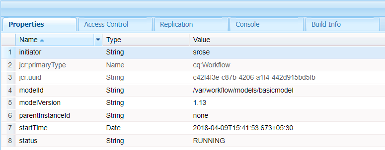

# Forms式OSGi工作流程 |處理用戶資料{#forms-centric-workflows-on-osgi-handling-user-data}

以Forms為AEM中心的工作流程可讓您自動化以Forms為中心的實際商業流程。 工作流由一系列步驟組成，這些步驟按關聯工作流模型中指定的順序執行。 每個步驟都會執行特定動作，例如指派工作給使用者或傳送電子郵件訊息。 工作流程可與儲存庫、使用者帳戶和服務中的資產互動。 因此，工作流程可協調涉及任何Experience Manager方面的複雜活動。

您可透過下列任何方法來觸發或啟動以表單為中心的工作流程：

* 從收件箱提交應AEM用程式
* 從AEM Forms應用程式提交申請
* 提交最適化表單
* 使用監視的資料夾
* 提交互動式通訊或信函

有關以Forms為中心的工作AEM流程和功能的詳細資訊，請參見OSGi](/help/forms/using/aem-forms-workflow.md)上的[以Forms為中心的工作流程。

## 用戶資料和資料儲存{#user-data-and-data-stores}

觸發工作流程時，會自動產生工作流程例項的裝載。 每個工作流程例項都會指派一個唯一例項ID和一個關聯的裝載ID。 裝載包含與工作流實例相關聯的用戶和表單資料的儲存庫位置。 此外，工作流實例的草稿和歷史資料也儲存在儲存庫AEM中。

工作流實例的裝載、草稿和歷史記錄所在的預設儲存庫位置如下：

>[!NOTE]
>
>您可以設定不同的位置，以在建立工作流程或應用程式時儲存裝載、草稿和歷史資料。 要標識工作流或應用程式儲存資料的位置，請查看工作流。

<table> 
 <tbody> 
  <tr> 
   <td> </td> 
   <td>AEM 6.4Forms</td> 
   <td>AEM 6.3Forms</td> 
  </tr> 
  <tr> 
   <td><strong>Workflow  實例</strong></td> 
   <td>/var/workflow/instances/[server_id]/&lt;date&gt;/[workflow-instance]/</td> 
   <td>/etc/workflow/instances/[server_id]/[date]/[workflow-instance]/</td> 
  </tr> 
  <tr> 
   <td><strong>裝載</strong></td> 
   <td>/var/fd/dashboard/payload/[server-id]/[date]/  [payload-id]/</td> 
   <td>/etc/fd/dashboard/payload/[server-id]/[date]/  [payload-id]/</td> 
  </tr> 
  <tr> 
   <td><strong>草稿</strong></td> 
   <td>/var/fd/dashboard/instances/[server_id]/  [date]/[workflow-instance]/draft/[workitem]/</td> 
   <td>/etc/fd/dashboard/instances/[server_id]/  [date]/[workflow-instance]/draft/[workitem]/</td> 
  </tr> 
  <tr> 
   <td><strong>歷史</strong></td> 
   <td>/var/fd/dashboard/instances/[server_id]/  [date]/[workflow_instance]/history/</td> 
   <td>/etc/fd/dashboard/instances/[server_id]/  [date]/[workflow_instance]/history/</td> 
  </tr> 
 </tbody> 
</table>

## 存取和刪除使用者資料{#access-and-delete-user-data}

您可以從儲存庫中的工作流實例訪問和刪除用戶資料。 若要達成此目的，您必須知道與使用者相關聯之工作流程例項的例項ID。 您可以使用啟動工作流實例的用戶或工作流實例的當前受託人的用戶名查找工作流實例的實例ID。

但是，在以下情況下，在標識與啟動器關聯的工作流時，您不能標識或結果可能不明確：

* **透過受監視資料夾觸發的工作流程**:如果工作流是由受監視的資料夾觸發，則無法使用其啟動器來標識工作流實例。在這種情況下，用戶資訊被編碼在儲存的資料中。
* **從發佈例項開始的工AEM作流程**:從發佈實例提交最適化表單、互動式通訊或信件時，所有工作流程例項都是使用服務使用者AEM來建立。在這些情況下，已登入使用者的使用者名稱不會擷取到工作流程例項資料中。

### 訪問用戶資料{#access}

要標識和訪問為工作流實例儲存的用戶資料，請執行以下步驟：

1. 在作AEM者例項中，前往`https://[server]:[port]/crx/de`並導覽至&#x200B;**[!UICONTROL 工具>查詢]**。

   從&#x200B;**[!UICONTROL Type]**&#x200B;下拉式清單中選擇&#x200B;**[!UICONTROL SQL2]**。

1. 根據可用資訊，執行以下查詢之一：

   * 如果已知工作流啟動器，請執行以下操作：

   `SELECT &ast; FROM [cq:Workflow] AS s WHERE ISDESCENDANTNODE([path-to-workflow-instances]) and s.[initiator]='*initiator-ID*'`

   * 如果您尋找其資料的使用者是目前的工作流程受託人，請執行下列動作：

   `SELECT &ast; FROM [cq:WorkItem] AS s WHERE ISDESCENDANTNODE([path-to-workflow-instances]) and s.[assignee]='*assignee-id*'`

   查詢返回指定工作流啟動器或當前工作流受託人的所有工作流實例的位置。

   例如，以下查詢從工作流啟動器為`srose`的`/var/workflow/instances`節點返回兩個工作流實例路徑。

   

1. 轉至查詢返回的工作流實例路徑。 status屬性顯示工作流實例的當前狀態。

   

1. 在工作流實例節點中，導航至`data/payload/`。 `path`屬性儲存工作流實例的裝載路徑。 您可以導覽至路徑，以存取儲存在裝載中的資料。

   

1. 導覽至工作流程例項的草稿和步驟記錄位置。

   例如：

   `/var/fd/dashboard/instances/server0/2018-04-09/_var_workflow_instances_server0_2018-04-09_basicmodel_54/draft/`

   `/var/fd/dashboard/instances/server0/2018-04-09/_var_workflow_instances_server0_2018-04-09_basicmodel_54/history/`

1. 對步驟2中查詢返回的所有工作流實例重複步驟3 - 5。

>[!NOTE]
>
>AEM Forms應用程式也會以離線模式儲存資料。 工作流程例項的資料可能會儲存在個別裝置上，當應用程式與伺服器同步時，就會提交至Forms伺服器。

### 刪除用戶資料{#delete-user-data}

您必須是管理員AEM，才能執行下列步驟，從工作流程例項刪除使用者資料：

1. 按照[訪問用戶資料](/help/forms/using/forms-workflow-osgi-handling-user-data.md#access)中的說明，並注意以下事項：

   * 與用戶關聯的工作流實例的路徑
   * 工作流實例的狀態
   * 工作流實例的負載路徑
   * 工作流程例項的草稿和步驟記錄路徑

1. 對於&#x200B;**RUNNING**、**SUSPENDED**&#x200B;或&#x200B;**STALE**&#x200B;狀態中的工作流實例執行此步驟：

   1. 前往`https://[server]:[port]/aem/start.html`並使用管理員憑證登入。
   1. 導覽至「**[!UICONTROL 工具>工作流程>例項]**」。
   1. 為用戶選擇相關的工作流實例，然後按一下&#x200B;**[!UICONTROL Terminate]**&#x200B;以終止運行實例。

   有關使用工作流實例的詳細資訊，請參閱[管理工作流實例](/help/sites-administering/workflows-administering.md)。

1. 轉至CRXDE Lite控制台，導航至工作流實例的裝載路徑，並刪除`payload`節點。
1. 導覽至工作流程例項的草稿路徑，並刪除`draft`節點。
1. 導覽至工作流程例項的歷史記錄路徑，並刪除`history`節點。
1. 導航到工作流實例的工作流實例路徑，並刪除工作流的`[workflow-instance-ID]`節點。

   >[!NOTE]
   >
   >刪除工作流實例節點將刪除所有工作流參與者的工作流實例。

1. 對為用戶標識的所有工作流實例重複步驟2 - 6。
1. 從工作流程參與者的AEM Forms應用程式外框識別並刪除離線草稿和提交資料，以避免提交至伺服器。

您也可以使用API來存取和移除節點和屬性。 如需詳細資訊，請參閱下列檔案。

* [如何以程式設計方式存取AEMJCR](/help/sites-developing/access-jcr.md)
* [刪除節點和屬性](https://docs.adobe.com/docs/en/spec/jcr/2.0/10_Writing.html#10.9%20Removing%20Nodes%20and%20Properties)
* [API參考](https://helpx.adobe.com/experience-manager/6-3/sites-developing/reference-materials/javadoc/overview-summary.html)

