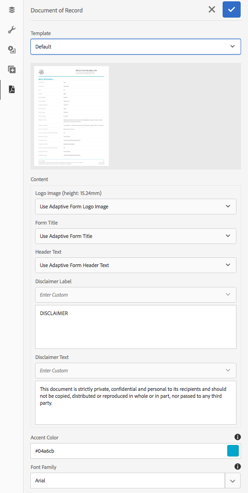

# 產生最適化表單的記錄檔案 {#generate-document-of-record-for-adaptive-forms}

>[!CAUTION]
>
>AEM 6.4已結束延伸支援，本檔案不再更新。 如需詳細資訊，請參閱 [技術支援期](https://helpx.adobe.com//tw/support/programs/eol-matrix.html). 尋找支援的版本 [此處](https://experienceleague.adobe.com/docs/).

## 概觀 {#overview}

在提交表單後，您的客戶通常希望以打印或文檔格式記錄他們在表單中填寫的資訊，以供將來參考。 這稱為記錄檔案。

本文說明如何為最適化表單產生記錄檔案。

>[!NOTE]
>
>基於XFA的最適化表單不支援自動產生記錄檔案。 不過，您可以使用用來建立最適化表單的XDP做為記錄檔案。

## 最適化表單類型及其記錄檔案 {#adaptive-form-types-and-their-documents-of-record}

建立最適化表單時，可以選取表單模型。 您的選項為：

* [表單範本](/help/forms/using/creating-adaptive-form.md#p-create-an-adaptive-form-based-on-an-xfa-form-template-p)

   可讓您為最適化表單選取XFA範本。 當您選取XFA範本時，可以如上所述，將相關聯的XDP檔案用於記錄檔案。

* [XML架構](/help/forms/using/creating-adaptive-form.md#p-create-an-adaptive-form-based-on-xml-or-json-schema-p)

   可讓您為最適化表單選取XML架構定義。 為最適化表單選取XML架構時，您可以：

   * 為記錄文檔關聯XFA模板。 請確定相關聯的XFA範本使用與最適化表單相同的XML架構
   * 自動生成記錄文檔

* 無

   可讓您建立不含表單模型的最適化表單。 系統會自動為您的最適化表單產生記錄檔案。

選擇表單模型時，使用「記錄模板配置文檔」下的可用選項配置記錄文檔。 請參閱 [記錄模板配置文檔](#document-of-record-template-configuration).

## 自動生成的記錄文檔 {#automatically-generated-document-of-record}

記錄檔案可讓客戶保留已提交表單的副本，以供列印之用。 當您自動生成記錄文檔時，每次更改表單時，其記錄文檔都會立即更新。 例如，您會移除選擇「美利堅合眾國」作為其國家之客戶的年齡欄位。 當這些客戶生成記錄文檔時，記錄文檔中不會顯示年齡欄位。

自動生成的記錄檔案具有以下優點：

* 它會處理資料系結。
* 它會自動隱藏在提交時標籤為從記錄檔案中排除的欄位。 不需額外努力。
* 它節省了設計記錄模板文檔的時間。
* 它可讓您使用不同的基礎模板嘗試不同的樣式和外觀，並為記錄文檔選擇最佳樣式和外觀。 樣式外觀是可選的，如果未指定樣式，系統樣式將設定為預設樣式。
* 它可確保在記錄檔案中立即反映任何形式的更改。

## 要自動生成記錄文檔的元件 {#components-to-automatically-generate-a-document-of-record}

若要產生最適化表單的記錄檔案，您需要下列元件：

**最適化表單** 要為其生成記錄文檔的最適化表單。

**基礎範本（建議）** 在AEM Designer中建立的XFA範本（XDP檔案）。 基礎模板用於為記錄模板的文檔指定樣式和品牌資訊。

請參閱 [記錄文檔的基礎模板](#base-template-of-a-dor)

>[!NOTE]
>
>記錄文檔的基模板也稱為記錄文檔的元模板。

**記錄模板文檔** 從最適化表單產生的XFA範本（XDP檔案）。

請參閱 [記錄模板配置文檔](#document-of-record-template-configuration).

**表單資料** 使用者在最適化表單中填入的資訊。 它與記錄模板文檔合併，生成記錄文檔。

## 最適化表單元素的對應 {#mapping-of-adaptive-form-elements}

以下各節說明最適化表單元素在記錄檔案中的顯示方式。

### 欄位 {#fields}

<table> 
 <tbody> 
  <tr> 
   <th>最適化表單元件</th> 
   <th>對應的XFA元件</th> 
   <th>是否預設包括在記錄模板的文檔中？</th> 
   <th>附註</th> 
  </tr> 
  <tr> 
   <td>按鈕</td> 
   <td>按鈕</td> 
   <td>false</td> 
   <td> </td> 
  </tr> 
  <tr> 
   <td>核取方塊</td> 
   <td>核取方塊</td> 
   <td>true</td> 
   <td> </td> 
  </tr> 
  <tr> 
   <td>日期選擇器</td> 
   <td>日期/時間欄位</td> 
   <td>true</td> 
   <td> </td> 
  </tr> 
  <tr> 
   <td>下拉式清單</td> 
   <td>下拉式清單</td> 
   <td>true</td> 
   <td> </td> 
  </tr> 
  <tr> 
   <td>草寫簽名</td> 
   <td>簽名手寫</td> 
   <td>true</td> 
   <td> </td> 
  </tr> 
  <tr> 
   <td>數值方塊</td> 
   <td>數值欄位</td> 
   <td>true</td> 
   <td> </td> 
  </tr> 
  <tr> 
   <td>密碼框</td> 
   <td>密碼欄位</td> 
   <td>false</td> 
   <td> </td> 
  </tr> 
  <tr> 
   <td>選項按鈕</td> 
   <td>選項按鈕</td> 
   <td>true</td> 
   <td> </td> 
  </tr> 
  <tr> 
   <td>文字方塊</td> 
   <td>文字欄位</td> 
   <td>true</td> 
   <td> </td> 
  </tr> 
  <tr> 
   <td>重設按鈕</td> 
   <td>重設按鈕</td> 
   <td>false</td> 
   <td> </td> 
  </tr> 
  <tr> 
   <td>提交按鈕</td> 
   <td><p>電子郵件提交按鈕</p> <p>HTTP提交按鈕</p> </td> 
   <td>false</td> 
   <td> </td> 
  </tr> 
  <tr> 
   <td>條款與條件</td> 
   <td> </td> 
   <td>true</td> 
   <td> </td> 
  </tr> 
  <tr> 
   <td>檔案附件</td> 
   <td> </td> 
   <td>false</td> 
   <td>在記錄模板的文檔中不可用。 僅可通過附件在記錄文檔中使用。</td> 
  </tr> 
 </tbody> 
</table>

### 容器 {#containers}

<table> 
 <tbody> 
  <tr> 
   <th>最適化表單元件</th> 
   <th>對應的XFA元件</th> 
   <th>附註</th> 
  </tr> 
  <tr> 
   <td>面板<br /> </td> 
   <td>子表單<br /> </td> 
   <td>可重複面板對應至可重複的子表單。</td> 
  </tr> 
 </tbody> 
</table>

### 靜態元件 {#static-components}

| 最適化表單元件 | 對應的XFA元件 | 附註 |
|---|---|---|
| 影像 | 影像 | TextDraw和Image元件（無論是綁定還是未綁定）始終出現在基於XSD的適用性表單的記錄文檔中，除非使用記錄設定文檔排除。 |
| 文字 | 文字 |

>[!NOTE]
>
>在傳統UI中，您會收到用於編輯欄位屬性的不同標籤。

### 表格 {#tables}

適用性表單表格元件（例如頁首、頁尾和列對應至對應的XFA元件）。 您可以將可重複的面板對應至記錄檔案中的表格。

## 記錄文檔的基礎模板 {#base-template-of-a-document-of-record}

基礎模板為記錄文檔提供樣式和外觀資訊。 它允許您自定義自動生成的記錄文檔的預設外觀。 例如，您想在標題中新增公司標誌，並在記錄檔案的頁尾中新增版權資訊。 基礎模板中的母版頁用作記錄模板文檔的母版頁。 主版頁可以有頁首、頁尾和頁碼等資訊，您可以將這些資訊應用於記錄文檔。 您可以使用基本模板將此類資訊應用於記錄文檔，以自動生成記錄文檔。 使用基本模板可更改欄位的預設屬性。

請關注 [基本範本慣例](#base-template-conventions) 設計基礎模板時。

## 基本範本慣例 {#base-template-conventions}

基本模板用於定義記錄文檔的頁眉、頁腳、樣式和外觀。 頁首和頁尾可包含公司標誌和版權文字等資訊。 基本模板中的第一個母版頁被複製，並用作記錄文檔的母版頁，該母版頁包含標題、頁尾、頁碼或應出現在記錄文檔中所有頁上的任何其他資訊。 如果使用的基礎模板不符合基礎模板約定，則基礎模板的第一個主版頁仍用於記錄模板的文檔。 強烈建議您根據基本模板的慣例設計基礎模板，並將其用於自動生成記錄文檔。

**主版頁面慣例**

* 在基礎範本中，您應將根子表單命名為 `AF_METATEMPLATE` 而主版頁面為 `AF_MASTERPAGE`.

* 具有名稱的主版頁面 `AF_MASTERPAGE` 位於 `AF_METATEMPLATE` 根子表單被指定為用於提取頁首、頁尾和樣式資訊的首選項。

* 若 `AF_MASTERPAGE` 不存在，則會使用基本範本中出現的第一個母版頁面。

**欄位的樣式慣例**

* 要對記錄文檔中的欄位應用樣式，基礎模板提供位於 `AF_FIELDSSUBFORM` 從下方 `AF_METATEMPLATE` 根子表單。

* 這些欄位的屬性將應用於記錄文檔中的欄位。 這些欄位應遵循 `AF_<name of field in all caps>_XFO` 命名慣例。 例如，核取方塊的欄位名稱應為 `AF_CHECKBOX_XFO`.

要建立基本模板，請在AEM Designer中執行以下操作。

1. 按一下 **檔案>新增**.
1. 選取 **根據範本** 選項。

1. 選取 **Forms — 記錄檔案** 類別。
1. 選擇 **DoR基模板**.
1. 按一下 **下一個** 並提供所需資訊。

1. （可選）修改要應用於記錄文檔中欄位的欄位的樣式和外觀。
1. 儲存表單。

您現在可以將保存的表單用作記錄文檔的基礎模板。\
請勿修改或移除基本範本中存在的任何指令碼。

**修改基礎模板**

* 如果您未對基本模板中的欄位應用任何樣式，建議從基本模板中刪除這些欄位，以便自動提取對基本模板的任何升級。
* 修改基本模板時，請勿刪除、添加或修改指令碼。

>[!NOTE]
>
>使用慣例設計基礎模板，並嚴格遵循上述步驟。

## 記錄範本文件配置 {#document-of-record-template-configuration}

設定表單的記錄範本檔案，讓客戶下載已提交表單的易記副本。 XDP檔案可作為記錄範本的檔案。 記錄客戶下載的文檔根據XDP檔案中指定的佈局進行格式化。

執行下列步驟來設定最適化表單的記錄檔案：

1. 在AEM製作例項中，按一下 **Forms > Forms和檔案。**
1. 選取表單，然後按一下 **檢視屬性**.
1. 在「屬性」視窗中，點選 **表單模型**.

   建立表單時，也可以選取表單模型。

   >[!NOTE]
   >
   >在「表單模型」頁簽中，確定您選取 **結構** 或 **無** 從 **從** 下拉式清單。 **[!UICONTROL 以「表單範本」為表單模型的XFA型或最適化表單不支援記錄檔案。]**

1. 在「表單模型」頁簽的「記錄模板配置文檔」部分，選擇以下選項之一。

   **無** 如果您不想為表單配置記錄文檔，請選擇此選項。

   **將表單模板與記錄模板文檔關聯** 如果您有要用作記錄文檔模板的XDP檔案，請選擇此選項。 選取此選項時，會顯示AEM Forms存放庫中可用的所有XDP檔案。 選取適當的檔案。

   選取的XDP檔案會與最適化表單相關聯。

   **生成記錄文檔** 選擇此選項可將XDP檔案用作記錄文檔的樣式和外觀的基本模板。 選取此選項時，會顯示AEM Forms存放庫中可用的所有XDP檔案。 選取適當的檔案。

   **[!UICONTROL 選擇此選項可將XDP檔案用作記錄文檔的樣式和外觀的基本模板。 選取此選項時，會顯示AEM Forms存放庫中可用的所有XDP檔案。 選取適當的檔案。]**

   **選擇「Forms模板」作為生成記錄文檔的基礎模板** 選擇此選項可將XDP檔案用作記錄文檔的樣式和外觀的基本模板。 選取此選項時，會顯示AEM Forms存放庫中可用的所有XDP檔案。 選取適當的檔案。

   >[!NOTE]
   >
   >若發生下列情況，請確定用來建立XFA表單的適用性表單和架構（資料架構）的架構相同：
   >
   >* 最適化表單以結構為基礎
   >* 您正在使用 **將表單模板與記錄模板文檔關聯** 記錄檔案的選項


1. 按一下 **完成。**

## 自定義記錄文檔中的品牌資訊 {#customize-the-branding-information-in-document-of-record}

在生成記錄文檔時，您可以在「記錄文檔」頁簽上更改記錄文檔的品牌資訊。 「記錄文檔」頁簽包含標誌、外觀、佈局、頁眉和頁腳、免責聲明，以及是否要包括未選定的複選框和單選按鈕選項等選項。

要本地化您在「記錄文檔」頁簽中輸入的品牌資訊，必須確保瀏覽器的區域設定正確。 要自定義記錄文檔的品牌資訊，請完成以下步驟：

1. 在記錄檔案中選取面板（根面板），然後點選 .
1. 點選 . 此時將顯示「記錄文檔」頁簽。
1. 選擇預設模板或自定義模板以呈現記錄文檔。 如果選擇預設模板，記錄文檔的縮圖預覽將顯示在「模板」(Template)下拉清單下方。

   

   如果您選擇選取自訂範本，請在AEM Forms伺服器上瀏覽選取XDP。 如果您想使用AEM Forms伺服器上尚未存在的範本，必須先將XDP上傳至AEM Forms伺服器。

1. 根據您是選擇預設模板還是自定義模板，以下部分或全部屬性將出現在「記錄文檔」頁簽中。 適當地指定下列項目：

   * **標誌影像**:您可以選擇從最適化表單使用標誌影像、從DAM中選擇一個，或從電腦上傳一個。
   * **表單標題**
   * **頁首文字**
   * **免責聲明標籤**
   * **免責聲明**
   * **免責聲明文字**
   * **重音顏色**:在文檔或記錄PDF中呈現標題文本和分隔符行的顏色
   * **字型系列**:記錄檔案中文本的字型系列PDF
   * **對於核取方塊和選項按鈕元件，僅顯示選取的值**
   * **所選多個值的分隔符號**
   * **包括未綁定到資料模型的表單對象**
   * **從記錄文檔中排除隱藏的欄位**
   * **隱藏面板描述**

   >[!NOTE]
   >
   >如果您使用的適用性表單範本是以6.3之前的設計器版本建立，則要使用「重音顏色」和「字型系列」屬性，請確定根子表單下的適用性表單範本中存在下列項目：

   ```xml
   <proto>
   <font typeface="Arial"/>
   <fill>
   <color value="4,166,203"/>
   </fill>
   <edge>
   <color value="4,166,203"/>
   </edge>
   </proto>
   ```

1. 若要儲存品牌變更，請點選「完成」。

## 記錄文檔中面板的表和列佈局 {#table-and-column-layouts-for-panels-in-document-of-record}

您的最適化表單可能會是一個包含數個表單欄位的冗長表單。 您可能不想將記錄檔案儲存為最適化表單的確切副本。 現在，您可以選擇表格或欄版面，以在記錄PDF的檔案中儲存一或多個最適化表單面板。

在生成記錄文檔之前，在面板的設定中，選擇該面板的「記錄文檔佈局」作為「表」或「列」。 在記錄檔案中會據以組織面板中的欄位。


在記錄文檔的表佈局中呈現的面板中的欄位


在記錄文檔的列佈局中呈現的面板中的欄位

## 記錄設定文檔 {#document-of-record-settings}

記錄文檔設定允許您選擇要包含在記錄文檔中的選項。 例如，銀行接受表單中的姓名、年齡、社會保障號碼和電話號碼。 此表單會生成銀行帳號和分行詳細資訊。 您可以選擇在記錄檔中只顯示姓名、社保號碼、銀行帳戶和分行詳細資訊。

元件的記錄設定文檔在其屬性下可用。 若要存取元件的屬性，請選取元件，然後按一下  在覆蓋圖中。 屬性會列在側欄中，您可以在其中找到下列設定。

**欄位層級設定**

* **從記錄檔案中排除**:將屬性設定為true會從記錄檔案中排除欄位。 這是可指令碼的屬性，名為 `excludeFromDoR`. 其行為取決於 **如果隱藏，則從DoR排除欄位** 表單層級屬性。

* **將面板顯示為表格：** 如果面板中的欄位少於6個，則設定屬性會將面板顯示為記錄檔案中的表格。 僅適用於面板。
* **從記錄檔案中排除標題：** 設定屬性會從記錄檔案中排除面板/表格的標題。 僅適用於面板和表格。
* **從記錄文檔中排除說明：** 設定屬性會從記錄檔案中排除面板/表格的說明。 僅適用於面板和表格。

**表單層級設定**

* **在DoR中包含未綁定欄位：** 設定屬性時，記錄檔案中包含來自架構式最適化表單的未綁定欄位。 預設為true。
* **如果隱藏，則從DoR排除欄位：** 設定屬性會覆寫「從記錄檔案中排除」欄位層級屬性的行為（若非true）。 如果欄位在表單提交時隱藏，則如果屬性設定為true，則這些欄位將從記錄檔案中排除，前提是未設定「從記錄檔案中排除」屬性。

## 使用記錄檔案時的主要考量 {#key-considerations-when-working-with-document-of-record}

處理最適化表單的記錄檔案時，請記住下列考量事項和限制。

* 記錄模板的文檔不支援RTF。 因此，靜態適用性表單或最終用戶填入的資訊中的任何RTF都將在記錄文檔中顯示為純文字檔案。
* 最適化表單中的檔案片段不會出現在記錄檔案中。 不過，支援最適化表單片段。
* 記錄檔案僅用於打印。
* 不支援為基於XML架構的最適化表單生成的記錄文檔中的內容綁定。
* 不支援為基於XML架構的最適化表單生成的記錄文檔中的內容綁定。
* 當用戶請求呈現記錄文檔時，根據區域設定的要求建立記錄文檔的本地化版本。 記錄文檔的本地化伴隨著最適化表單的本地化。 有關記錄檔案和最適化表單本地化的詳細資訊，請參閱 [使用AEM翻譯工作流程將最適化表單和記錄檔案當地化](/help/forms/using/using-aem-translation-workflow-to-localize-adaptive-forms.md).
