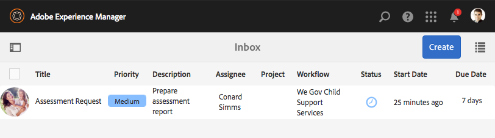
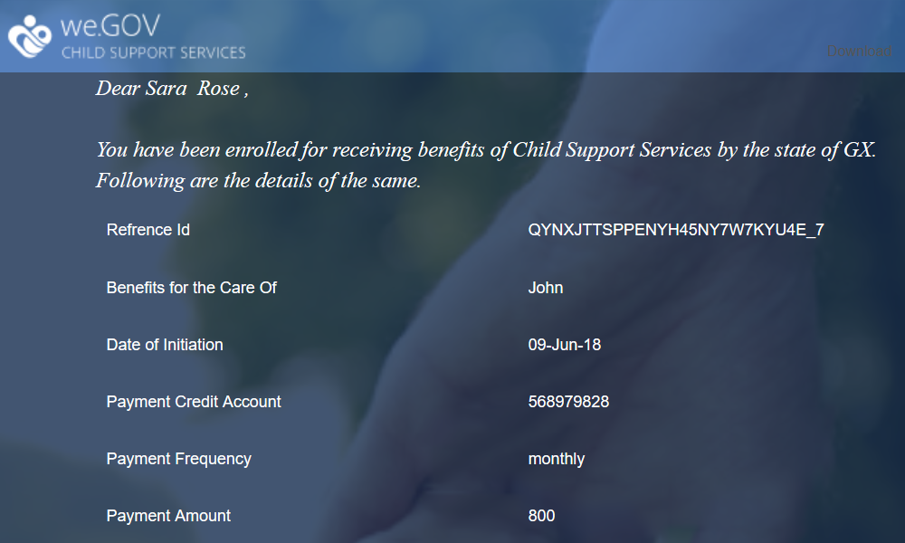

# We.Gov參考網站逐步說明 {#we-gov-reference-site-walkthrough}

## 先決條件 {#pre-requisite}

依照「設定和設定AEM Forms參考網站」中所述，設 [定您的We.Gov參考網站](/help/forms/using/setup-reference-sites.md)。

## 參考網站藍本 {#reference-site-scenario}

We.Gov是一個州管理組織，允許養父母在收養孩子時註冊子女撫養費。 該網站管理下列項目：

* 申請人、養父母的資格
* 申請人的個人和專業詳細資訊（如果申請人符合子女支援的資格）
* 收養兒童的個人細節

   申請人可以提供多個子項的詳細資料
* 申請人可領取子女撫卹金的銀行帳戶詳細資訊
* 收回應用程式費用
* 應用程式的評估
* 核准申請
* 自動與申請人溝通

申請提交並支付費用後，申請人會收到組織寄來的電子郵件，並確認已提交的申請。

We.Gov組織會收到申請。 組織會取得申請表的評量，並核准正版的申請表。

在申請獲得批准後，申請人會從We.Gov網站收到一封電子郵件。 電子 **郵件中的「查看文檔** 」選項將連結到具有申請人登記詳細資訊的文檔。

以下資訊圖表顯示We.Gov參考網站藍本的逐步工作流程。

此情形包含下列角色：

* 薩拉·羅斯，要求撫養孩子的養父母
* 喬，被收養的孩子
* We.Gov核准部門主管Gloria Rios
* 負責應用評估的現場代理Conard Simms

## Sarah開始進行資格檢查 {#sarah-initiates-her-eligibility-check}

申請人可以檢查申請子女支援福利的資格。 網站可讓使用者回答問題，以判斷其應用程式是否符合權益。 養父母莎拉是申請收養的人。 資格表是We.Gov網站的「兒童支援申請」服務的一部分。 為了檢查她的資格，Sarah點擊了 **[!UICONTROL We.Gov網站上的Child Support]** （兒童支援）。 在「子代支援」頁面中，Sarah按一下「 **[!UICONTROL 檢查您的資格」]**。

除了上述方法，Sarah還可以按一下首 **[!UICONTROL 頁上的「開始]** 」。 Sarah會導覽至「所有應用程式」頁面，在此頁面，她可以按一下「Application for Child Support Services」(子代支援服 **[!UICONTROL 務的應用程式)下的「Apply]**」（套用）。 然後，莎拉被帶到資格檢查。

在「檢查子女支援的資格」頁面中，Sarah會收到一組問題，以判斷其是否符合子女支援福利的資格。 通過這組問題，她被問到：

* 如果她是孩子的監護人
* 如果她和孩子住在GX州
* 兒童年齡組和兒童教育。

Sarah回答了這些問題，而且她的資格得到了驗證。 她的回答決定她是否有資格獲得撫養費。

莎拉被告知她有資格獲得兒童撫養費，申請費是25美元。

### 運作方式 {#how-it-works}

Sarah的資格是透過使用規則編輯器建立的資格障礙來驗證的。 規則編輯器可讓您指定申請人填寫申請表之前符合的條件。 當申請人莎拉符合所有資格條件時，她就會登入申請表。

資格檢查是子級支援申請調適性表單的一部分。 規則會在下列情況下驗證資格：

* 申請人是監護人的父母
* 申請人和兒童留在國家／地區
* 申請人對兒童有主要的日常照料
* 獲得支助服務的兒童年齡在16歲以下。

### 親眼看看 {#see-it-yourself}

在您的瀏覽器中，開啟 `https://<hostname>:<PublishPort>/content/we-gov/en.html`。 在We.Gov網站中，按一下「子系支援」。 在「子支援」頁面中，按一下「檢查您的資格」。

若要查看規則：

1. 在作者實例的編輯模式下開啟表單。 URL: `https://<hostname>:<AuthorPort>/editor.html/content/forms/af/we-gov/child-support/css.html`.
1. 選取元件，然後按一 。

   規則編輯器隨即開啟，列出表單中套用的所有規則。

1. 在左側面板中，按一下規則 `passMsg` 並了 `failMsg` 解資格檢查的運作方式。

## Sarah開始申請兒童撫養 {#sarah-starts-her-application-for-child-support}

Sarah在獲悉 **[!UICONTROL 其符合兒童支援資格後，按一下「開始申請]** 」。\
在「Application For Child Support Services」（子代支援服務的應用程式）頁面中，Sarah提供了以下各節的詳細資訊：

* **[!UICONTROL 關於申請人]**: 讓Sarah在本節中提供詳細資訊。

* **[!UICONTROL 子資訊]**: 讓Sarah提供孩子的資訊，而Sarah則得到支援服務。

* **[!UICONTROL 付款]**: 讓莎拉提供她的銀行細節，We.Gov可以在這些細節中存入月度支助補償。

* **[!UICONTROL 費用支付]**: 讓Sarah提供信用卡詳細資訊，以支付申請費。

依預設，Sarah會進入「關於申請 **[!UICONTROL 人]** 」區段。

Sarah隨時都可以按一下「 **[!UICONTROL 稍後回來]** 」，繼續使用其應用程式。 當她按一 **[!UICONTROL 下「稍後再回來]**」時，她的進度會儲存為草稿，而且她可以以電子郵件傳送草稿。

當她按一下「 **[!UICONTROL 傳送電子郵件]**」時，會收到一封電子郵件，內含表單草稿的連結。

We.Gov網站上的子支援表格使用適應性表格。 她可以使用電子郵件中的連結，並在行動裝置上填寫表格。

>[!NOTE]
>
>從電子郵件繼續工作流程僅適用於已登入的使用者。 在參考網站藍本中，請確定已新增使用者Sarah Rose。 莎拉的登入憑證是 `srose/password`。

Sarah可以在任何章節中提供詳細資訊，但申請費只有在她在所有章節中提供必要資訊後才可接受。 申請不完整，不需付費，而標有星號的欄位則為必填欄位。

### <strong>莎拉提供了她的資訊</strong> {#strong-sarah-provides-her-information-strong}

在Sarah按一下「 **[!UICONTROL 開始申請]**」後，她會進入「子代支援服務申請」頁面的「申請人資訊」區段。 在「申請人資訊」下，Sarah會導覽各個標籤，並為申請提供個人資訊。 她按「下 **[!UICONTROL 一步]** 」以瀏覽各個標籤。

在「申請人資訊」下方，系統會要求她在下列標籤下提供詳細資訊：

* **[!UICONTROL 基本資訊]**

在「基本資訊」下，Sarah會提供其身分證明及個人資訊。 Sarah的個人資訊包括她的姓名、電子郵件ID和社交安全號碼。

* **[!UICONTROL 關係]**

   在《戀愛》中，莎拉輸入了她婚姻狀況的資訊。

* **[!UICONTROL 其他資訊]**

   在「其他資訊」下，Sarah會輸入ID號碼、出生日期、目前的地址和電話號碼。

### Sarah提供兒童資訊 {#sarah-provides-child-information}

在Sarah提供個人資訊並按下「下 **[!UICONTROL 一步]**」後，會將她帶到「子項資訊」區段。

在「子項資訊」部分中，她提供了以下詳細資訊：

* 申請兒童支助服務的兒童人數
* 子女姓名、社會保障號碼、出生日期和出生地

如果Sarah選擇了多個孩子，她會獲得額外的表格，並附上相同的詳細資訊。\
莎拉選擇了她的獨生子喬，並輸入了他的名字。

### Sarah提供付款資訊 {#sarah-provides-payment-information}

在Sarah提供收養子女（或子女）的資訊並按下「下 **[!UICONTROL 一步]**」後，她會進入「付 **[!UICONTROL 款資訊]** 」區段。

在「付款資訊」區段中，她提供銀行帳戶詳細資訊，以取得子女支援福利。\
她輸入了10位數的銀行帳號。

## Sarah支付申請費並簽署表格 {#sarah-pays-the-application-fee-and-signs-the-form}

在莎拉同意申請的條款和條件後，她支付了25美元的申請費。 處理申請時需要支付申請費。\
Sarah輸入信用卡詳細資訊，然後按一下「立即 **[!UICONTROL 付款」]**。 付費後，應用程式的PDF版本會顯示簽名欄位。

Sarah可以選擇輸入、使用繪圖來手寫、插入簽名影像，或使用手機的觸摸屏來繪製簽名。 Sarah輸入姓名，然後按一下「點選以簽署」。

她的申請已提交到We.Gov網站。

### <strong>Sarah收到確認電子郵件</strong> {#strong-sarah-receives-an-acknowledgement-email-strong}

Sarah支付申請費後，會收到We.Gov網站發來的確認電子郵件。\
We.Gov處理申請，Sarah被告知，在申請獲得批准後，她將每月獲得賠償。

### 運作方式 {#how-it-works-1}

子支援應用程式會結合使用面板版面，例如頂端標籤、精靈和accordion來建立體驗。 它使用名為We.Gov Child Template的表單範本。

申請人可以跨區段移動，以填寫表單的不同元件。 當申請人填寫表格、提交表格、同意條款並支付費用時，就會啟動自訂工作流程。 自訂工作流程會傳送自動化電子郵件給確認申請提交的申請人。 將申請轉送有關部門核准。

表格的版面配置在政府子代支援服務主題中指定。 樣式包括元件樣式、頁面背景、元件的錯誤狀態格式和字型樣式。

資格檢查使用表單中指定的規則。 它使用以下指定的有效性檢查：

`SHOW passMsgWHEN (Does the child live in the state of GX? is equal to Yes) AND (Do you live in the state of GX? is equal to Yes) AND ( (Who has the main day-to-day care of the child? is equal to You) AND (Are you: is equal to The custodial parent) ) AND (Is the child you are applying for: is equal to Under 16 years) ELSE Hide`

`HIDE failMsg WHEN (Does the child lives in the state of GX? is equal to Yes) AND ( (Do you live in the state of GX? is equal to Yes) AND (Who has the main day-to-day care of the child? is equal to You) ) AND (Is the child you are applying for: is equal to Under 16 years) AND (Are you: is equal to The custodial parent) ELSE Show`

### 親眼看看 {#see-it-yourself-1}

在您的瀏覽器中，開 `https://<hostname>:<PublishPort>/content/forms/af/we-gov/child-support/css.html` 啟並填寫所需資訊。 當您填妥所需資訊、支付費用並簽署檔案後提交申請時，您會收到確認電子郵件。

請參閱We.Gov子項範本： `https://<hostname>:<AuthorPort>/editor.html/conf/we-gov/settings/wcm/templates/we-gov-child-template/structure.html`

請參閱此處的主題： `https://<hostname>:<AuthorPort>/editor.html/content/dam/formsanddocuments-themes/we-gov/we-gov-theme-A/jcr:content`

要查看所有規則，請執行以下步驟：

1. 在製作模式中開啟表格。

   URL: `https://<hostname>:<AuthorPort>/editor.html/content/forms/af/we-gov/child-support/css.html`

1. 選取元件，然後點選 。 所有規則都列在規則編輯器中，包括上述規則。

## Gloria收到應用程式 {#gloria-receives-the-application}

We.Gov的核准主管Gloria可以檢視、核准或拒絕提交的申請。 AEM Inbox可讓她在單一位置檢視所有提交的應用程式。

### 運作方式 {#how-it-works-2}

當Sarah填寫並提交子支援應用程式時，將建立應用程式的PDF或記錄文檔併發送到Gloria Rios的收件箱。 Gloria可以檢視提交的申請，並接受或拒絕。

### 親眼看看 {#see-it-yourself-2}

開啟頁面 `https://<hostname***>:<PublishPort>/content/we-gov/en.html`. 在頁面上，點選「登入 **[!UICONTROL 」、選取「以代表]****** 身分登入」核取方塊、使用grios/password作為Gloria Rios的使用者名稱／密碼登入AEM收件匣。 出現子支援應用程式。 如需有關將AEM Inbox用於表單導向工作流程工作的詳細資訊，請參閱「 [在AEM收件匣中管理表單應用程式和工作](/help/forms/using/manage-applications-inbox.md)」。

Gloria可以從應用程式儀表板查看、批准或拒絕應用程式。

### 運作方式 {#how-it-works-3}

We.Gov審批主管Gloria開啟了她的AEM收件箱。 她在工作清單中看到審核任務。 她開啟並檢視審核工作。

她看到表格的PDF，裡面填滿了Sarah輸入的詳細資訊以及Sarah上傳的檔案。\
Gloria可以批准或拒絕該應用程式。 不過，Gloria點按「 **[!UICONTROL 必要評估]** 」以取得申請評估。

Sarah的應用程式是AEM工作流程的起點。 當提交子支援應用程式表單時，它會啟動AEM工作流程。 AEM工作流程會為Gloria建立工作，此工作會顯示在她的AEM收件匣中。 當Gloria請求現場評估時，將為現場座席建立新任務。

### 親眼看看 {#see-it-yourself-3}

如果設定完成，AEM工作流程會在表單送出後立即啟動。 使用Gloria的認證登入收件匣。

存取https://&lt;***hostname***>:&lt;***PublishPort***>/content/we-gov/en.html的收件匣。 在頁面上，點選「登 **[!UICONTROL 入」]**，選取「登入為代表人 **[!UICONTROL 員]** 」核取方塊，使用Gloria的預設憑證：

* 使用者名稱： 格里奧
* 密碼： 密碼

在她的AEM收件匣中，Sarah的應用程式會新增為審核工作。 選擇任務，然後按一下「 **需要評估** 」以繼續下一步。

### Conard獲取評估任務 {#conard-assessment-task}

當Gloria按一下「 **[!UICONTROL 需要評量]**」時，Conard會在其AEM收件匣中取得評量工作。 此工作是AEM工作流程中在工作流程模型中定義的下一個步驟。 他看到審核任務並開啟它。

Conard將獲取申請人評估任務，如下所示。

子支援評估是與任務相關的表單。 他得到了莎拉的詳細資料，以及支援檔案（附在任務詳細資料中）。 Conard會在裝置上填寫現場評估表，並提交重新評估。

Conard會覈實Sarah提供的所有細節，Sarah會簽署評估書。 AEM Forms可擷取位置和時間戳記，並將它們新增至簽名。

Conard按一 **[!UICONTROL 下「提交以進行重新評估]**」,AEM工作流程就會將評估提交給We.Gov組織。

### 運作方式 {#how-it-works-4}

當Gloria要求評估時，會開始AEM工作流程的下一個步驟，並將評估工作新增至Conard的收件匣。 康納德是現場工作人員的角色。

Conard拜訪了Sarah的住所，確認了Sarah提供的資訊是真實的，並填寫了評估表。 Conard可存取Sarah填寫的完整表單的PDF。

### 親眼看看 {#see-it-yourself-4}

在平板電腦上開啟AEM收件匣，然後使用Conard的認證來登入。

Conard的預設憑據為：

* 使用者名稱： csimms
* 密碼： 密碼

您可以在收件箱中看到新的「評估請求」任務。 提交完成的評估，然後繼續下一步。

### Gloria審查評估並核准申請 {#gloria-reviews-the-assessment-and-approves-the-application}

在Conard提交評估後，Gloria會在收件箱中看到「審閱」任務。 她選擇並開啟 **[!UICONTROL 評論]**。

在「任務詳細資訊」下，Gloria將「上次採取的操作」視為「提交以進行重新評估」（由Conard提供）。 Gloria看到Conard Simms評估了申請。

### 運作方式 {#how-it-works-5}

在Conard提交評估後，Gloria會在收件箱中看到「審閱」任務。 她選擇並開啟「評論」。 在「任務詳細資訊」下，Gloria看到Conard的評估評論，即「按順序找到的所有內容」。

格洛麗亞批准了申請。

### 親眼看看 {#see-it-yourself-5}

開啟收件匣並使用Gloria的認證登入。 名為「查看」的新任務將出現在收件箱中。

開啟任務以查看「上次執行的操作」的狀態。 根據評估，批准應用程式。

## Sarah收到核准電子郵件 {#sarah-receives-an-approval-email}

Gloria核准申請後，Sarah收到We.Gov寄來的電子郵件，告知她的申請獲得批准。

電子郵件 **[!UICONTROL 中的「檢視檔案]** 」按鈕會連結至她的註冊詳細資訊。 Sarah按一下「 **[!UICONTROL 檢視檔案」。]**

登記單據列出了詳細資訊，如參考ID、覆蓋子項、啟動日期、銀行帳戶號、付款頻率和付款金額。

Sarah可以檢視她在同一頁上傳的檔案。

### 運作方式 {#how-it-works-6}

當Gloria核准申請時，Sarah會收到自動化電子郵件，內含註冊檔案的連結。

註冊檔案是互動式通訊，可在任何裝置上檢視。 它包含了兒童支援服務的詳細資訊，以及薩拉提供的資訊。

### 親眼看看 {#see-it-yourself-6}

檢查您為自動電子郵件設定的電子郵件用戶端，其中包含註冊檔案的連結。

或者，要在瀏覽器中查看文檔，請開啟： `https://<hostname>:<PublishPort>/content/aemforms-refsite/doclink.html?document=/content/forms/af/we-gov/child-support/enrollment-document&referenceId=[reference-id]&channel=web`

## We.Gov分析應用程式的效能 {#we-gov-analyzes-the-performance-of-the-application}

We.Gov會不時檢查其子項支援服務應用程式的效能，以檢查客戶可能面臨的任何問題。 他們使用此分析，對子代支援服務應用程式中所需的變更做出知情決定，以增強使用者體驗、降低表單放棄率，進而改善轉換。 他們運用AEM Forms與Adobe Analytics的整合進行分析。 下圖顯示其分析控制面板。

### 運作方式 {#how-it-works-7}

子支援服務應用程式表單的效能量度會使用Adobe Analytics加以追蹤。 如需設定Adobe Analytics和檢視報表的詳細資訊，請參閱 [設定表單和檔案的分析](/help/forms/using/configure-analytics-forms-documents.md)。

### 親眼看看 {#see-it-yourself-7}

若要檢視並探索分析報表，我們會為參考網站的子支援服務應用程式提供種子資料。 使用種子資料之前，請參 [閱設定分析](/help/forms/using/setup-reference-sites.md#configureanalytics)。 在作者實例中執行以下步驟以查看包含種子資料的報告：

1. 前往https:// **[!UICONTROL &lt;]** AuthorPort *>的「表單與檔案*」UI，網址為：&lt;主機名稱&#x200B;*>:&lt;* AuthorPort>/aem/forms.html/content/dam/formsanddocuments。

1. 按一下以開啟 **We.Gov資料夾** 。
1. 選取 **[!UICONTROL 子支援服務適用的應用程式]** ，然後按一下工具列 **[!UICONTROL 中的啟用Analytics]** 。

1. 再次選取表單，然後按一下工 **[!UICONTROL 具列中的「Analytics報表]** 」以產生報表。 您一開始會看到空白報表。

若要產生含種子資料的分析報表：

1. 在CRXDE lite的地址瀏覽器中，鍵入： **/apps/we-gov/demo-antracts/analyticsTestData/Child支援服務Analytics Test Data**
1. 在左側目錄結構中選擇種子資料。
1. 連按兩下選取的檔案，以在右側面板中開啟其內容。
1. 複製測試資料檔案中的所有內容。
1. 在CRXDE中，導覽至： **/content/dam/formsanddocuments/we-gov/child-support/css/jcr:content/analyticsdatanode/lastsevendays**
1. 在「屬性」下的「分析資料」欄位中，貼上測試資料檔案的複製內容。
1. 現在，請針對子支援服務的應 **[!UICONTROL 用程式重新產生分析報表]**。 您可以在產生的報表中看到種子資料。

