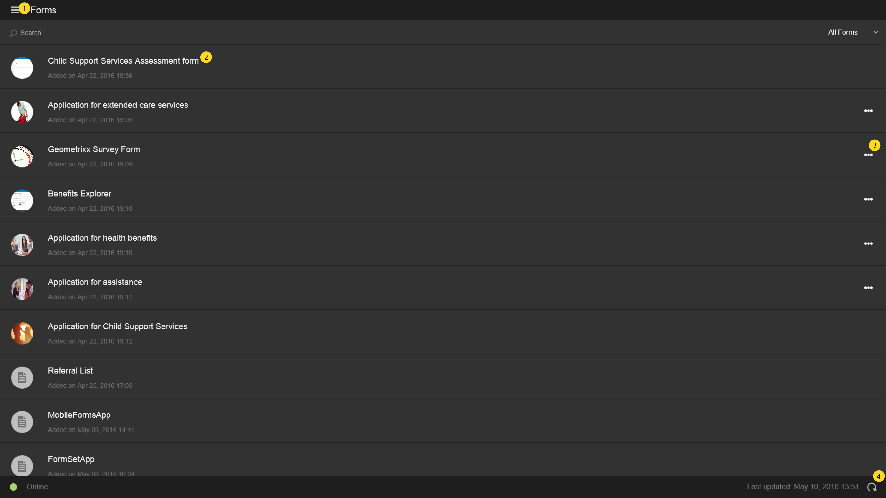

# 主畫面 {#home-screen}

>[!CAUTION]
>
>AEM 6.4已結束延伸支援，本檔案不再更新。 如需詳細資訊，請參閱 [技術支援期](https://helpx.adobe.com//tw/support/programs/eol-matrix.html). 尋找支援的版本 [此處](https://experienceleague.adobe.com/docs/).

登入AEM Forms應用程式時，系統會將您重新導向至主畫面。

## 預設主螢幕 {#default-home-screen}

預設情況下，主螢幕會顯示所有表單，包括起始點和任務(如果連接的伺服器啟用了AEM Forms Workflow)，以及相關的縮圖。 您可以在AEM Forms伺服器中指定縮圖。

下圖用預設主螢幕上的基本元件的呼叫來注釋。

[按一下放大](assets/home-screen-1-1.png)

1. **菜單按鈕**:點選 **功能表** 按鈕，導覽至工作、Forms、Outbox和設定。 如果您的AEM Forms應用程式已連線至AEM Forms JEE伺服器，您就會看到「工作」選項。 「任務」選項還儲存從進程中的任務建立的草稿。 若為AEM Forms OSGi伺服器，會隱藏「工作」選項。 Outbox會先儲儲存存的表單和草稿，再與伺服器同步。 應用程式執行時，Outbox中所有儲存的表單和草稿都會上傳至AEM Forms伺服器 [與伺服器同步](/help/forms/using/sync-app.md). 如需「設定」的相關資訊，請參閱 [更新一般設定](/help/forms/using/update-general-settings.md).
1. **任務或表單**:點選您要使用的清單任務或表單。
1. **水準刪節號**:表示可對表單執行操作。 點選省略號會顯示作者提供的動作和說明。 此 **刪除草稿** 和 **完成** 點選省略號時，會顯示選項。
1. **重新整理圖示**:點選重新整理圖示，將您的應用程式與AEM Forms伺服器同步。

## 自訂主畫面 {#customizing-the-home-screen}

您可以透過 **[一般設定](/help/forms/using/update-general-settings.md)** 或 **偏好設定** 標籤。

應用程式上對主畫面設定所做的變更，會影響目前已記錄的使用者或目前行動裝置上的使用者主畫面。

不過，在HTML工作區中所做的變更會影響登入AEM Forms伺服器的所有AEM Forms應用程式使用者。
