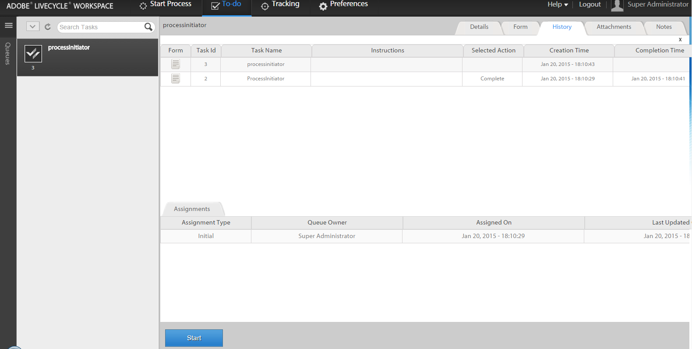

# 使用AEM Forms工作區{#initiating-a-new-process-with-existing-process-data-in-aem-forms-workspace}中的現有流程資料啟動新流程

您可以使用現有流程資料的資料啟動新流程。 我們需要從現有流程資料啟動新流程，因為我們必須經常使用相同的表單，而且內容很少更改，如付費時間表單。 此功能可節省使用者的時間和精力，尤其是當程式需要填寫的時間很長時。

從現有流程資料啟動新流程的步驟如下：-

1. 執行下列其中一項動作：

   * 在追蹤中，按一下您要使用其資料的處理例項。 從右窗格的「進程歷史記錄」視圖中，按一下與起始點對應的任務行。
   * 在追蹤中，選取搜尋範本以顯示處理例項清單。 選取您要使用其資料的例項。
   * 在&#x200B;**[!UICONTROL To-Do]**&#x200B;頁簽中，選擇任務。 按一下&#x200B;**[!UICONTROL History]**&#x200B;頁簽，然後選擇啟動進程實例的任務。

    

1. 在「任務」操作工具欄中，按一下「**[!UICONTROL 開始]**」。 新流程實例的適用性表單將顯示預填資料。

1. 視需要更新資料，然後按一下&#x200B;**[!UICONTROL Complete]**&#x200B;或表單上的適當按鈕。
