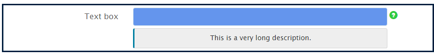

# 最適化表單元件的內嵌樣式 {#inline-styling-of-adaptive-form-components}

>[!CAUTION]
>
>AEM 6.4已結束延伸支援，本檔案不再更新。 如需詳細資訊，請參閱 [技術支援期](https://helpx.adobe.com//tw/support/programs/eol-matrix.html). 尋找支援的版本 [此處](https://experienceleague.adobe.com/docs/).

您可以使用 [主題編輯器](/help/forms/using/themes.md). 此外，您也可以將內嵌CSS樣式套用至個別的最適化表單元件，並即時預覽變更。 內嵌樣式會覆寫主題中提供的樣式。

## 套用內嵌CSS屬性 {#apply-inline-css-properties}

若要將內嵌樣式新增至元件：

1. 在表單編輯器中開啟表單，並將模式變更為樣式模式。 若要將模式變更為樣式模式，請在頁面工具列中，點選  > **樣式**.
1. 在頁面中選取元件，然後點選「編輯」按鈕 . 樣式屬性在側欄中開啟。

   您也可以從側欄的表單階層樹狀結構中選取元件。 表單層次結構樹在側欄中作為表單對象可用。

   您也可以從側欄選取元件。 在「樣式」(Style)模式中，可以看到「表單對象」(Form Objects)下列出的元件。 不過，側欄中的「表單物件」清單會列出欄位和面板等元件。 欄位和面板是可包含元件（例如文字方塊和選項按鈕）的通用元件。

   從側欄中選取元件時，您會看到列出的所有子元件以及所選元件的屬性。 您可以選取特定的子元件並設定其樣式。

1. 按一下側邊欄中的索引標籤以指定CSS屬性。 您可以指定屬性，例如：

   * Dimension與位置（顯示設定、邊框間距、高度、寬度、邊距、位置、z索引、浮點、清除、溢出）
   * 文字（字型系列、粗細、顏色、大小、行高和對齊方式）
   * 背景（影像和漸層、背景顏色）
   * 邊框（寬度、樣式、顏色、半徑）
   * 效果（陰影、容量）
   * 進階（可讓您編寫元件的自訂CSS）

1. 同樣地，您也可以為元件的其他部分（如Widget、Caption和Help）應用樣式。
1. 點選 **完成** 確認變更或 **取消** 放棄更改。

## 範例：欄位元件的內嵌樣式 {#example-inline-styles-for-a-field-component}

下列影像說明套用內嵌樣式之前和之後的文字欄位。

應用內嵌樣式屬性之前的文本框元件

請注意，在套用下列CSS屬性後，文字方塊樣式的變更如下列影像所示。

<table> 
 <tbody> 
  <tr> 
   <td>
選擇器
 </td> 
   <td>
CSS屬性
 </td> 
   <td>
值
 </td> 
   <td>
效果
 </td> 
  </tr> 
  <tr> 
   <td>
欄位
 </td> 
   <td>
邊框
 </td> 
   <td>
邊框寬度= 2px
 
邊框樣式=實線
 
邊框顏色=#1111
 </td> 
   <td>
在欄位周圍建立黑色2px寬邊框
 </td> 
  </tr> 
  <tr> 
   <td>
文字方塊
 </td> 
   <td>
background-color
 </td> 
   <td>
#6495ED
 </td> 
   <td>
將背景顏色更改為CornflowerBlue(#6495ED)
 
注意：您可以在值欄位中指定顏色名稱或其十六進位代碼。
 </td> 
  </tr> 
  <tr> 
   <td>
標籤
 </td> 
   <td>
維度與位置&gt;寬度
 </td> 
   <td>
100px
 </td> 
   <td>
將標籤的寬度修正為100px
 </td> 
  </tr> 
  <tr> 
   <td>欄位說明圖示</td> 
   <td>文字&gt;字型顏色</td> 
   <td>#2ECC40</td> 
   <td>更改幫助表徵圖表面的顏色。</td> 
  </tr> 
  <tr> 
   <td>
詳細說明
 </td> 
   <td>
text-align
 </td> 
   <td>
中心點
 </td> 
   <td>
將說明的詳細說明與中心對齊
 </td> 
  </tr> 
 </tbody> 
</table>

**圖：** *套用內嵌樣式屬性後的文字方塊元件*

依照上述步驟，您可以選取其他元件（例如面板、提交按鈕和選項按鈕）並設定其樣式。

>[!NOTE]
>
>樣式屬性會根據您選取的元件而有所不同。
