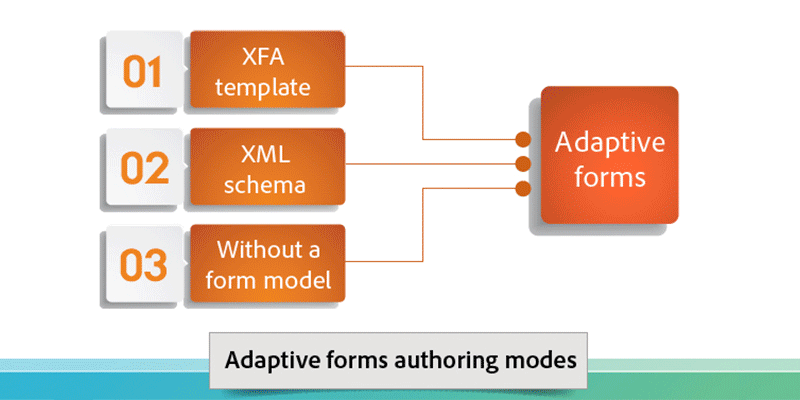

# AEM Forms {#introduction-to-aem-forms}簡介

如需AEM Forms最新功能與增強功能的詳細資訊，請參閱[「AEM Forms的新增功能」](/help/forms/using/whats-new.md)。

## 關於AEM Forms {#about-aem-forms}

Adobe Experience Manager(AEM)提供簡單易用的解決方案，以建立、管理、發佈和更新複雜的數位表單，同時整合後端流程、業務規則和資料。

AEM Forms將表單製作、管理和發佈功能，以及通訊管理功能、檔案安全性和整合式分析結合在一起，以建立引人入勝的端對端體驗。 AEM Forms可有效率地整合至您的商業流程中，減少紙本流程和錯誤，同時提高效率。

AEM Forms運用並擴充您現有在XFA表單和Adobe LiveCycle解決方案上的投資。

在大型企業中，表單通常只要建立一次，就可複製至內容管理系統以重複使用。 保持大型表格資料庫的最新狀態並讓這些表格可供探索是相當大的挑戰。 AEM提供可自訂的表單入口網站，可確保客戶在網路和行動通道上都能找到並存取所需的表單。

AEM Forms提供表單管理工具，不僅可讓您管理最適化表單，還可讓您管理XFA表單、PDF表單和相關資產。 如需詳細資訊，請參閱[管理表單的簡介](/help/forms/using/introduction-managing-forms.md)。

### 關鍵功能{#key-capabilities}

總而言之，AEM Forms提供強大的表單管理功能，例如下列功能，可減少手動程式並提高客戶滿意度。

* 集中式表單入口網站，用於設計和部署動態表單，包括PDF、HTML5和調適性表單
* 簡單易用的圖形使用者介面，讓商業使用者輕鬆匯入、管理、預覽和發佈表單
* 使用關鍵字、標籤和中繼資料的強大搜尋功能，提供互動式表單目錄
* 動態偵測使用者的裝置和位置，以在網路和行動通道上正確呈現表單
* 與Adobe Analytics整合，以有效測量表單使用量度
* 與Adobe Document Cloud eSign Services或Scribble整合，以電子方式簽署包含機密資訊的檔案
* 自動化表單發佈功能，以及透過多個通道提供即時、個人化且一致的通訊

## AEM表單類型{#aem-form-types}

AEM Forms可讓您擴充新表單和現有表單，以建立：

* 像素精確、編頁的HTML和PDF表單，看起來幾乎像紙張，或
* 可自動為使用者裝置和瀏覽器轉譯的最適化表單。

**PDF表格**

PDF表格可離線填寫、本機儲存，並在下次連線時傳送表格資料。 您可以使用2D條碼來擷取表單資料，並使用數位簽章來驗證使用者的真實性。

**HTML表格**

HTML5瀏覽器表單可在行動裝置和案頭瀏覽器中檢視。 您可以使用Scribble或eSign Services電子簽署HTML表格。

**最適化表單**

最適化表單可視需要新增或移除欄位或區段，以動態地配合使用者回應。 AEM可讓您重複使用Adobe XML表格範本，以建立最適化表格。

### 支援的功能{#supported-features}

所有表單類型都支援下列功能：

* 動態版面
* 表單欄位驗證
* 相關內容說明
* 指令碼和XML資料處理
* 協助工具設計與檢查
* 可在伺服器端儲存表單
* 支援檔案附件
* 與HTML Workspace整合以進行資料擷取

## 離線資料收集{#offline-data-collection-br}

提交表單資料後，Adobe Experience Manager會將表單資料與現有系統、業務規則及所需人員連接。

AEM Forms提供Forms Workspace，這是將您的數位商業程式延伸至行動裝置的行動應用程式。 使用表單工作區，您即使離線也能收集和記錄資料。 表單工作區可運用行動裝置的功能，讓您擷取像片、視訊並收集資料，例如時間戳記和其他資訊。 下次連接到網路時，可以同步收集的資料。

離線擷取資料並在下次您返回線上時進行同步化，對現場人員特別有幫助。 它可提高生產力並減少錯誤。

**使用Forms Workspace進行離線資料收集的優點**

* 簡單好用的HTML工作區應用程式，以進行工作指派和追蹤
* 拖放式工作流程設計環境
* 企業內容管理連接器(ECM)
* 開放標準支援，包括XML和SOAP，以連接表單資料與企業系統
* 現成可用的HTML報告可監控積壓、工作隊列和關鍵績效指標(KPI)
* 可自訂的儀表板，可即時洞察業務運作
* 用於連接第三方報告工具的API

## 個人化通訊{#personalized-communication}

有效率的自助服務數位體驗的重要組成部分，就是即時傳達個人化資訊，讓使用者隨處都可從任何裝置存取。 個人化且即時的通訊可改善轉換率和使用者滿意度。

使用AEM Forms，商業使用者可以自訂檔案範本、整合後端程式的資訊，以及包含互動式元件，以建立引人入勝的個人化使用者體驗。 直覺式使用者介面可協助非技術使用者開發商業規則，以決定何時根據查詢產生通訊，或啟動使用者產生的回應。

個人化檔案，例如收據、歡迎套件和陳述式，可輕鬆跨多個通道傳遞。 組織可以推動個人化Web入口網站的流量，進而註冊或購買其他服務。

**主要功能**

* 對範本、內容區塊、商業規則等的支援，提供對應的製作環境
* 檔案轉換與組合
* 支援透過多種管道（包括網頁、電子郵件和紙本）隨選或批次檔案傳送
* 具有更改歷史記錄的審計跟蹤
* 支援數位簽章，以驗證內容完整性和簽署者的身分
* AEM Forms的檔案安全性附加元件，包括加密、使用原則、追蹤和稽核

**圖：簡化個** *人化通訊工作流程*

