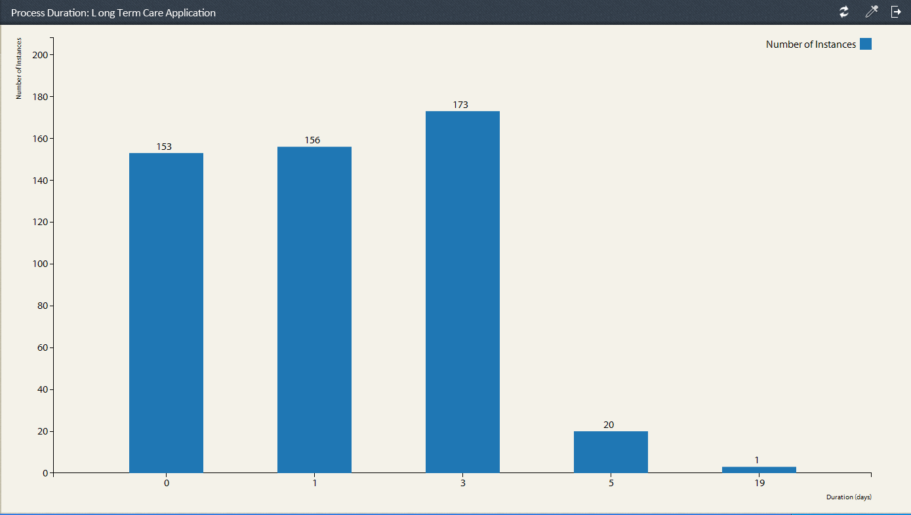

# 流程報告中的預定義報告 {#pre-defined-reports-in-process-reporting}

AEM Forms Process Reporting隨附下列現 *成可用的報表* :

* **[長時間運行的進程](/help/forms/using/process-reporting/pre-defined-reports-in-process-reporting.md#p-long-running-processes-p)**: 所有AEM Forms進程的報表，這些流程需要超過指定的時間才能完成

* **[流程持續時間圖](/help/forms/using/process-reporting/pre-defined-reports-in-process-reporting.md#p-process-duration-report-br-p)**: 依持續時間的指定AEM Forms流程報表

* **[工作流量](/help/forms/using/process-reporting/pre-defined-reports-in-process-reporting.md#p-workflow-volume-report-p)**: 按日期列出指定流程的運行實例和已完成實例的報告

## 長時間運行的進程 {#long-running-processes}

「長時間執行的流程」報表會顯示已花費超過指定時間完成的AEM Forms流程。

### 要執行長時間運行的進程報告 {#to-execute-a-long-running-process-report-br}

1. 要在「流程報告」中查看預定義報告的清單，請在「流程報告」樹 **視圖上** ，按一下「報 **告」節點** 。
1. 按一下「長 **運行進程** 」報告節點。

   

   選擇報表時，樹狀 **視圖右側會顯示** 「報表參數」面板。

   

   參數:

   * **持續時間**(*必填*): 指定持續時間和時間單位。 顯示已執行超過指定期間的所有AEM Forms進程。
   * **Started After** (*可選*): 選擇日期。 篩選報表以顯示指定日期之後開始的流程例項。
   * **開始前** (*可選*): 選擇日期。 篩選報表以顯示指定日期之前開始的流程例項。

1. 按一 **下開始** ，執行報表。

   報表會顯示在「 **流程報表** 」視窗右側的「報表 **」面板中** 。

   

   使用「報告」面板右上角的選 **項** ，對報告執行下列操作。

   * **刷新**: 在儲存區中重新整理含有最新資料的報表
   * **變更圖例顏色**: 選擇並變更報表圖例的顏色
   * **匯出至CSV**: 將報表中的資料匯出並下載至逗號分隔的檔案

## 流程持續時間報告 {#process-duration-report-br}

「流程持續時間」報表按每個實例已運行的天數顯示表單流程的實例數。

### 要執行「進程持續時間」報告，請執行以下操作： {#to-execute-a-process-duration-report-br}

1. 要在「流程報告」中查看預定義的報告，請在「流程報告」樹 **視圖上** ，按一下「報 **告」節點** 。
1. 按一下「進 **程持續時間** 」報告節點。

   

   選擇報表時，樹狀 **視圖右側會顯示** 「報表參數」面板。

   

   參數:

   * **選擇流程** (必&#x200B;*備*): 選取AEM Forms程式。

1. 按一 **下開始** ，執行報表。

   報表會顯示在「 **流程報表** 」視窗右側的「報表」面板中。

   

   使用「報告」面板右上角的選 **項** ，對報告執行下列操作。

   * **刷新**: 在儲存區中重新整理含有最新資料的報表
   * **變更圖例顏色**: 選擇並變更報表圖例的顏色
   * **匯出至CSV**: 將報表中的資料匯出並下載至逗號分隔的檔案

## 「Workflow Volume」報告 {#workflow-volume-report}

「工作流量」報表會依日曆日顯示目前執行和完成的AEM Forms流程例項數。

### 要執行「工作流卷」報告 {#to-execute-a-workflow-volume-report-br}

1. 要在「流程報告」中查看預定義的報告，請在「流程報告」樹 **視圖上** ，按一下「報 **告」節點** 。
1. 按一下「工 **作流卷** 」報告節點。

   

   選擇報表時，樹狀 **視圖右側會顯示** 「報表參數」面板。

   

   參數:

   * **選擇流程**(必&#x200B;*備*): 選取AEM Forms程式。
   * **Started After** (*可選*): 選擇日期。 篩選報表以顯示指定日期之後開始的流程例項。
   * **開始前** (*可選*): 選擇日期。 篩選報表以顯示指定日期之前開始的流程例項。

1. 按一 **下開始** ，執行報表。

   報表會顯示在「 **流程報表** 」視窗右側的「報表 **」面板中** 。

   

   使用「報告」面板右上角的選 **項** ，對報告執行下列操作。

   * **刷新**: 在儲存區中重新整理含有最新資料的報表
   * **變更圖例顏色**: 選擇並變更報表圖例的顏色
   * **匯出至CSV**: 將報表中的資料匯出並下載至逗號分隔的檔案

